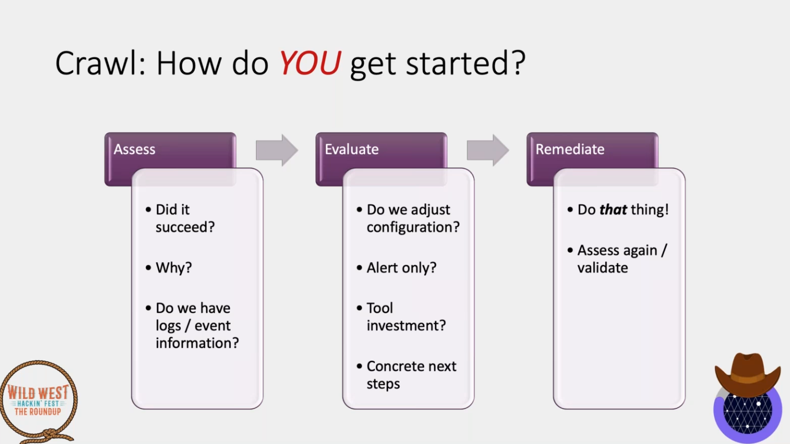

# APT

- Sponsored Cyber attacks targeting specific organizations to achieve a clear objective without being detected for a long period of time - CSTT
- Trainings:
  - <https://www.activecountermeasures.com/cyber-threat-hunting-training-course/>

## Workflow 

- Initial compromise
- Establish beachhead: Ensure future access to compromised assets without needing a repeat initial intrusion
- Escalate privileges
- Internal reconnaissance
- Network colonization
- Persist
- Complete mission: Exfiltrate stolen data

## Analysis Reports 

- Advanced Persistent Threat Golden_hands - Digital Bank Robbery of the Year 2020: <https://www.vulnerability-db.com/?q=articles%2F2020%2F04%2F30%2Fadvanced-persistent-threat-goldenhands-digital-bank-robbery-year-2020>
- FireEye APT analysis reports: <https://www.fireeye.com/current-threats/apt-groups.html>
- Mandiant Report: APT1 - Exposing One of China’s Cyber Espionage Units: <https://www.fireeye.com/content/dam/fireeye-www/services/pdfs/mandiant-apt1-report.pdf>
- Stuxnet - Duqu Flame (Equation Group)
  - Spread by LNK exploit via USB
  - Escalation using MS09-025
  - <https://github.com/micrictor/stuxnet>
  - <https://github.com/SilverPoision/stuxnet-source-code>
- Equation Group: 
  - Double Fantasy
  - Equation Drug
  - Fanny - Worm 
  - Grayfish 
  - <https://wikileaks.org/ciav7p1/cms/files/Equation_group_questions_and_answers.pdf>
  - <https://securelist.com/inside-the-equationdrug-espionage-platform/69203/>
  - <https://securelist.com/equation-the-death-star-of-malware-galaxy/68750/>
  - Fanny Malware: <https://securelist.com/a-fanny-equation-i-am-your-father-stuxnet/68787/>
  - <https://arstechnica.com/information-technology/2015/02/how-omnipotent-hackers-tied-to-the-nsa-hid-for-14-years-and-were-found-at-last/3/>
  - <https://malpedia.caad.fkie.fraunhofer.de/details/win.equationdrug>
  - <https://www.antiy.net/p/the-analysis-of-equation-drug-the-fourth-analysis-report-of-equation-group/>
  - <https://www.cs.bu.edu/~goldbe/teaching/HW55815/presos/eqngroup.pdf>
  - <https://www.kaspersky.com/about/press-releases/2015_equation-group-the-crown-creator-of-cyber-espionage>
  - GrayFish has a bootkit 
- The `Kane` incident 
  - <http://www.securityfocus.com/news/122>
  - `BO2K Remote Access Trojans` by `Cult of the Dead Cow` was left to be discovered. `Washington University's Medical Center` believed that the attack was prevented. 
    ```
    One of the files catalogs the name, address, birth date, social security number, height and weight of over four thousand cardiology patients, along with each medical procedure they underwent. Another file provides similar information on seven hundred physical rehabilitation patients. A third file chronicles every admission, discharge and transfer within the hospital during a five-month period.
    ```


## C2 Techniques

- Using Trusted Forums to exchange messages 

## Intercepting SYSCalls

INS_Delete: Delete a specific instruction
INS_RewriteMemmoryOperand: Change memory address by the program
PIN_AddSyscallEntryFunction: Intercept syscalls at the entry point 
PIN_AddSyscallExitFunction: Execute after syscall (usable to alter the result)

## Adversary Emulation

- Don't wait for maturity to start doing AE
- Find the gap and then find the tool for that
- <https://github.com/center-for-threat-informed-defense/adversary_emulation_library>
  - Start: <https://github.com/center-for-threat-informed-defense/adversary_emulation_library/blob/master/fin6/Emulation_Plan/Phase1.md#step-2---fin6-discovery>
  - No need to have full plan in place
- Detect / Block / Alert
- Platforms:
  - <https://plextrac.com/>
  - FOSS: <https://vectr.io/>
- Thoughts
  - Know the enemy - Frameworks 
  - Will drive investment
  - Take as much time as needed
  - Iterate!
- Fin6
  - 



