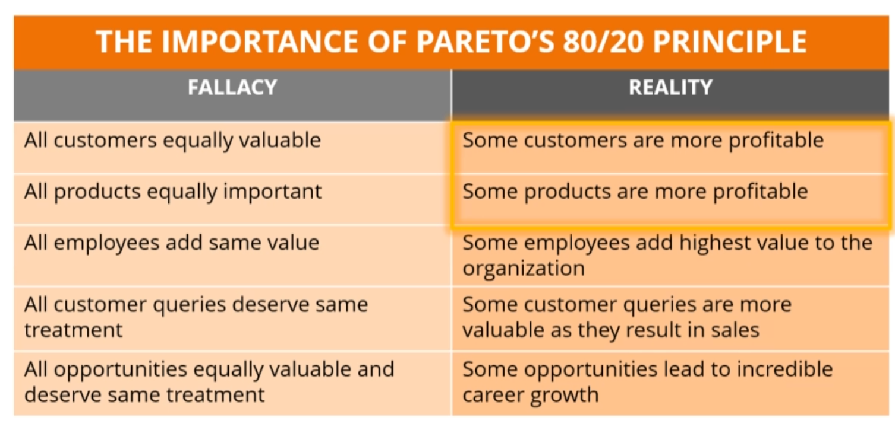
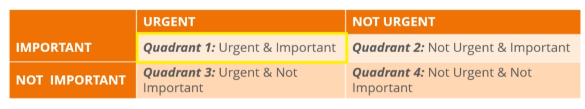

## References

- We Need to Kill the ‘Security Analyst’: [https://medium.com/@LargeCardinal/we-need-to-kill-the-security-analyst-79ec205651f5](https://medium.com/@LargeCardinal/we-need-to-kill-the-security-analyst-79ec205651f5)
- Preparing for a Tech Talk, Part 1: Motivation: [https://overreacted.io/preparing-for-tech-talk-part-1-motivation/](https://overreacted.io/preparing-for-tech-talk-part-1-motivation/)
- Preparing for a Tech Talk, Part 2: What, Why, and How: [https://overreacted.io/preparing-for-tech-talk-part-2-what-why-and-how/](https://overreacted.io/preparing-for-tech-talk-part-2-what-why-and-how/)
- My first experience as speaker at Voxxed Days 2018: a talk about React, React Native and Typescript: [https://www.fabrizioduroni.it/2018/11/01/react-native-typescript-conference-voxxed-2018.html](https://www.fabrizioduroni.it/2018/11/01/react-native-typescript-conference-voxxed-2018.html)
- 10 Personal Finance Lessons for Technology Professionals: [https://www.troyhunt.com/10-personal-finance-lessons-for-technology-professionals/](https://www.troyhunt.com/10-personal-finance-lessons-for-technology-professionals/)

## Quotes

```
The real pros ask the real questions:
1)If
2)When
3)Why
4)What
5)How much have you got
6)Have you got it
7)Do you get it
8)If so, how often
9)Which do you choose, a hard or soft option
10)How much do you need?
```

## C-Level

- Position security as `sales enablement`
- Security needed to reduce sales cycle (align with business requirements)
- Evaluate security risks in context of business risk (holistic)
- Process vs problem

## Jobs Hunting

- <https://www.linkedin.com/posts/jasonsblanchard_job-hunting-slides-from-webcast-521-activity-6669260088525508608-zvRe>
- Identify the code that you do and build an elevated statement about you. Example: <https://www.linkedin.com/in/jasonsblanchard/>
- Think about what people pay you to do. (I break things to improve them... I protect companies from cyber attacks...)
- Have dream job requirements. Your list of things required from an employer. and rank those. 
  - Management style / Leave policy
- Budget and determine what is the enough salary
- Top 10 companies that you need to work in
- Hunt types:
  - Top 10
  - Discovery
  - Internal: Within current company
- Document as you go 
- Creating resume while hunting
  - Extract things from job listings, etc. into resume
- Resume
  - Catch-all
  - Tailored 
- Take 10 minutes of time from an manager and get more info about company structure / values, etc. 
  - Look at who is working in company
  - Pivot and escalate to different ppl. Look for internal advocates.
- Network with community
- Find mentors 
  - Lean how they got to where they got to. 
  - Ask questions about them without trying to shine at first.
    - Hook -
    - ... [complete this from slides]
    - ...
- The Dip (book)

## Technical Recall

- Within 24 hours review material again for 30 mins (to increase retention to 100% again)
- 48 hours later, review again for 25 minutes (back to 100%)
- Each subsequent review takes less time and increase the retention

- A longer review interval leads to stronger recall skills
- Review intervals need to be short enough to recall concepts with minimal review time 

- **Anki** - Free flash card app (spaced repetition training)
  - Can judge and rate yourself.
  - Questions that are hard will be displayed more. 
  - When creating card, change `Basic` type to `Closed` type.
  - `Tools` `Managed Node Types` `Fields`. `Add` new field called `Visual`. 
  - ???? (webinar disconnected)

- Motivation:
  - Enjoyment: finding enjoyment in your topic to motivate.
  - Methods: a method (spaced repetition/anki) gives you a task and a clear completion target. 
  - System: Habit development is necessary. 
  - Patience: Frustration is a normal and valuable part of learning. 
- Problem of Time:
  - Revisit goals and see if it's worth investing time. 
  - Changes that can be made to life.
- <https://sansurl.com/504-lab-ankicards>
- pptxindex.py

## Time Management 

- Time Traps
  - Multitasking
    - Attention is also divided
    - Doubles time taken / mistakes
    - Example: Round1: Write A-Z and 1-20. Round2: Do the same, but write one letter and then write one number (zigzag).
    - Forces brain to context switch (human brain is not wired for this)
    - Choose single key task for the day (organize time around it). Ksy task is the priority.
  - Techno Time Traps (Ex: Social Media)
  - Procrastination 
    - Delay in taking action until last minute
    - Due to:
      - Distractions 
      - Unpleasant Tasks
      - Low self-esteem and lack of confidence 
      - Setting goals/deadlines in distant future 
      - Perfectionism
    - Overcome:
      - Set goals and deadlines
      - Break into smaller tasks
      - Check off smaller tasks (confidence boost)
      - If not-confident: Visualize future you want
        - Write costs of continued inaction and its impact to life   
  - Workspace Interruptions 
    - Politely say 'no'
    - Use 'Do not disturb' message
    - Take control of conversation and end smoothly
  - Disorganization
    - Setup schedules 
    - Setup reminders 
    - Stick to schedules
  - Lack of Planing and Prioritization 
    - Plan and set daily goals 
    - Prioritize important tasks
    - Group similar tasks together and handle together
- Achieving Work Life Balance
  - Identify your peak time by analyzing energy through day
  - Schedule important, complex tasks at peek time
  - Warren Buffett's Productivity Secret
    - Say 'no' to not important things
    - Two list system
      - Write 25 tasks you want to get done in the day
      - Circle 5 most important 
      - Rule out other 20 items 
  - Parkinson's Law of Productivity
    - 'Work expands to fill the time available for its completion'
    - If 5 days is given to a 2 day task, task will grown into 5 days. Example: fine-tuning. 
    - Steps:
      - Identify tasks do be done. Assign right amount of time for tasks.
      - Set realistic deadlines
      - Focus on getting task done within deadline
      - Understand when you are done
  - Time Theming
    - Give each day a theme. Have focus on it and return to it when distracted.
    - Easy to prioritize and focus. 
    - Similar tasks get grouped. 
  - Pareto's 80/20 Rule
    - 80% of your output comes from 20% of your effort
    - Remaining 20% of your output comes from 80% of your effort
    - Identify 20% of high payoff tasks - This will generate 80% of results
    - 
  - Eat a Live Frog for Breakfast (eat the largest frog first)
    - That is probably the worst thing that is going to happen for the day. Hence rest of the day feels better.
    - Live frog:
      - Biggest most important task of the list
      - Task you'd most likely to procrastinate
      - Task most likely to add more value to career
  - Stephen Covey's Time Management Matrix
    - Urgent task: Requires immediate attention
    - Important task: Has to be done, but not immediately. 
    - 
    - Q1: Quadrant of necessities 
      - Crisis situations
      - Urgent problems
      - Emergencies
      - Deadline driven problems
    - Q2: Activities related to long term strategizing - Very important since this is about long term growth
      - Relationship building
      - Personal Development
      - Capitalizing on new opportunities 
      - Health
      - Education
      - Exercise 
      - Career Growth
    - Q3: (Eliminate)
      - Interruptions
      - Unnecessary meetings 
    - Q4: 
      - Traditional time wasting tasks (calls / emails)
      - Habitual tasks
  - Delegation
    - Help others grow
    - Decrease your workload
    - When to delegate?
      - Can someone else do the task? Task on which long term success depends, need your attention.
      - Does task provide opportunity to grown and develop another person.
      - Is this a recurring task? Can I train someone?
      - Do you have enough time to delegate the task effectively?
        - Training
        - Q&A
        - Opportunity to check on progress
        - Rework if necessary
    - Effective Delegation
      - Set expectations
      - Communicate expectations
        - Schedules/timelines
        - Frequency and format of updates
        - Ask the person to confirm understanding
      - Ensure accountability
    - Avoid reverse delegation
      - Why?
        - Task not through through
        - Unclear communication
        - Inadequate coaching 
      - What to do?
        - Never accept back tasks
        - Coach the employee instead
        - Employee should be able to handle similar tasks in future
  - Creating a Schedule
    - Daily / Weekly Schedules
    - Create a todo list
    - Allocate a time needed to complete
    - Work out the order and assign start-time
    - Add cushion time to task or daily schedule
- Habits for Time Management
  - Power of positive affirmations
    - Programming your subconscious mind using positive self-talk
    - Repeating send positive affirmations from conscious mind to subconscious mind
    - Affirmations become the new operation instructions of subconscious mind
    - Ex: "I manage my time effectively to achieve work life balance and improve quality of my life"
    - Positive Psychology
      - Thoughts + Beliefs = Reality
  - Power of positive visualization 
    - Creating mental images in mind
    - Mental images influence subconscious mind
    - You will become the person you visualize in mind
  - How?
    - Choose a quite and secluded spot
    - Choose the present moment  (do not say "I will become")
  - 10 Habits
    - Habit 1 – Work Smarter Not Harder
      - Give careful thought
      - Can it be done efficiently
      - Can other tasks be grouped
      - Can it/part be delegated
      - Can the task be eliminated 
    - Habit 2 – Cultivate Discipline and Focus
      - Chalk out clear priorities
      - Focus on the priorities (stick to)
      - Select most valuable and important task
      - Shut out all distractions
    - Habit 3 – Develop the Habit of Punctuality 
      - Aim to finish before time
      - Before time all the time
    - Habit 4 – Take Frequent Breaks 
      - Take time for self-renewal
        - Physical
        - Social/emotional
        - Mental 
        - Spiritual
    - Habit 5 – Use Spare Minutes for Filler Tasks
      - Have list of filler tasks ready
    - Habit 6 – Learn to Say ‘No’
    - Habit 7 – Start Your Day Early
    - Habit 8 – Sleep 7 to 8 Hours a Day
    - Habit 9 – Have a Cut-off Time for Tasks 
      - Intercept meetings
      - Cut off a task your are working on 
      - Reschedule and unfinished meeting or task to another time 
    - Habit 10 – Keep Track of Your Time
      - Have a clock on a visible place
