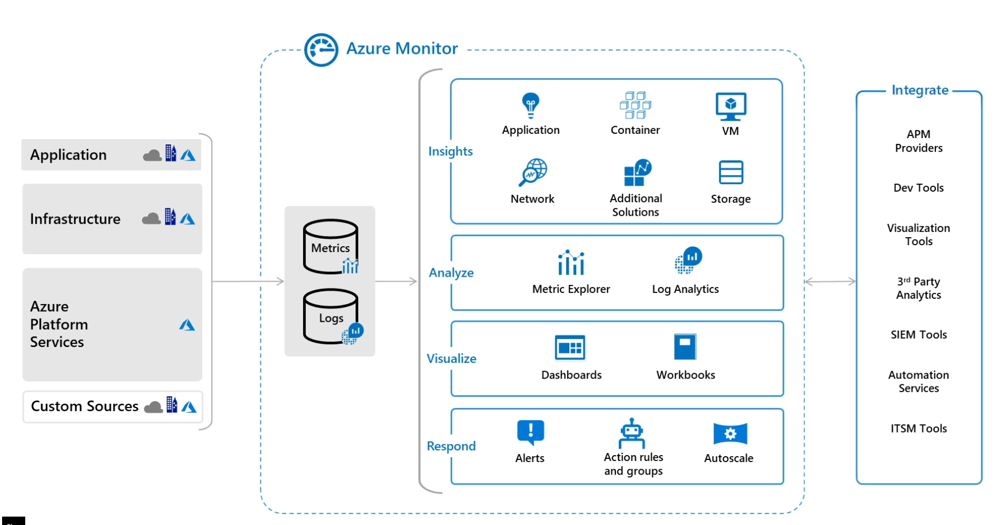
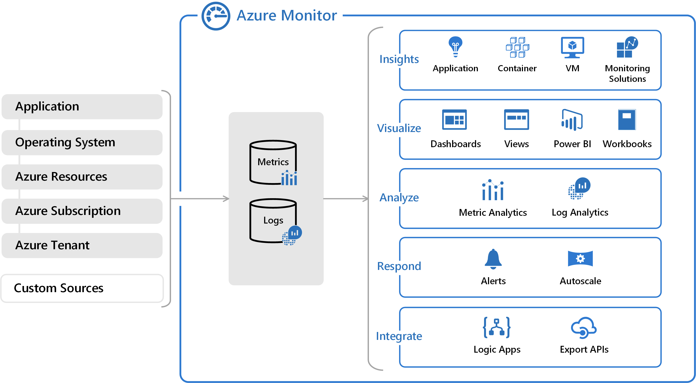
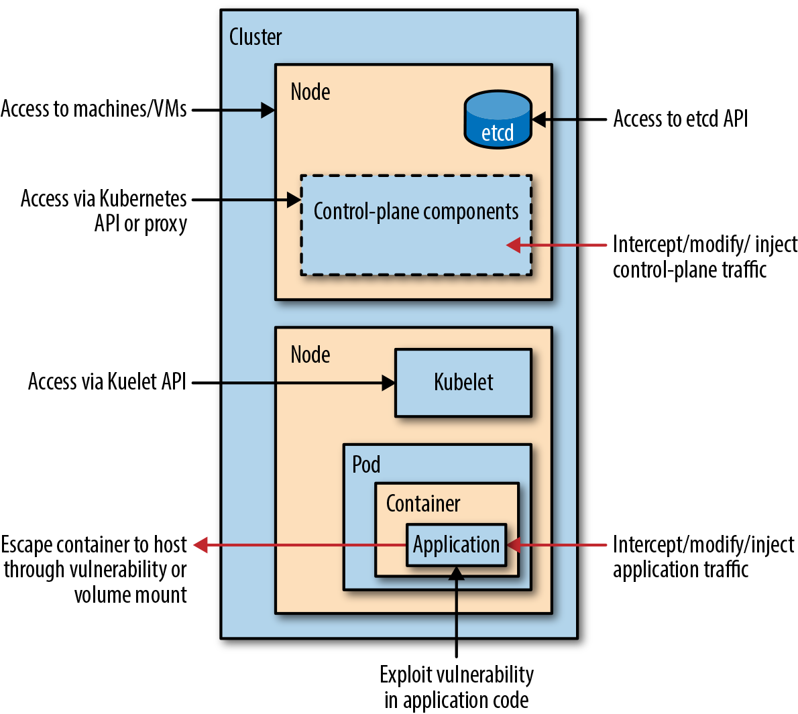
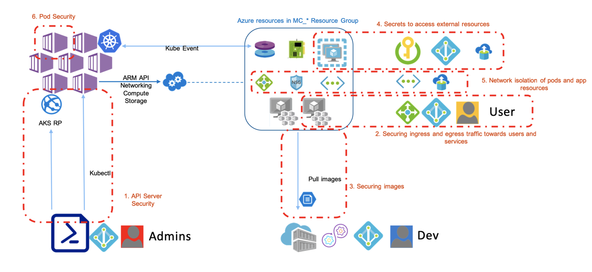
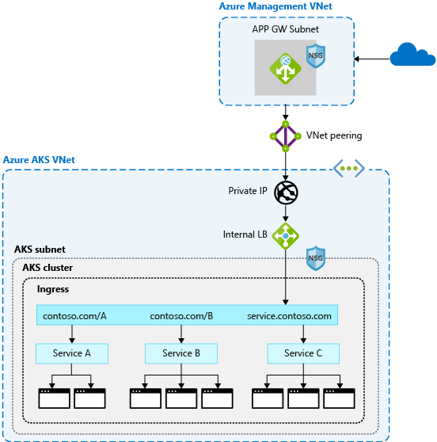
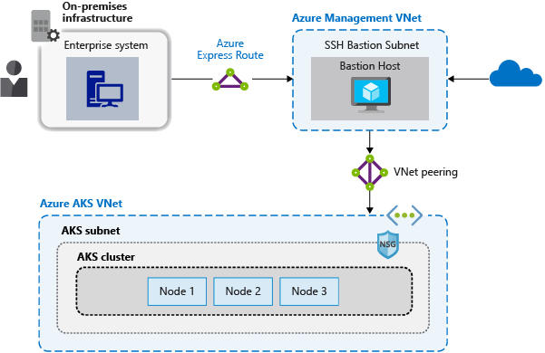

## Tools 

- A collection of scripts for assessing Microsoft Azure security: <https://github.com/NetSPI/MicroBurst>
- Azure Red Team tool for graphing Azure and Azure Active Directory objects: <https://github.com/Azure/Stormspotter>
- The Azure AD exploration framework: <https://github.com/dirkjanm/ROADtools>
- A password spraying tool for Microsoft Online accounts (Azure/O365): <https://github.com/dafthack/MSOLSpray>
- office365userenum: <https://bitbucket.org/grimhacker/office365userenum>
  - <https://grimhacker.com/2017/07/24/office365-activesync-username-enumeration/>
- retrieve information via O365 with a valid cred: <https://github.com/nyxgeek/o365recon>

## Defense 

- Azure AD and ADFS best practices: Defending against password spray attacks: <https://www.microsoft.com/en-us/microsoft-365/blog/2018/03/05/azure-ad-and-adfs-best-practices-defending-against-password-spray-attacks/>

## References

- You Moved to Office 365 Now What Sean Metcalf: <https://www.youtube.com/watch?v=1loGEPn_n7U>
- OWNING O365 THROUGH BETTER BRUTE-FORCING: <https://www.trustedsec.com/blog/owning-o365-through-better-brute-forcing/>
- Azure AD Authentication and authorization error codes: <https://docs.microsoft.com/en-us/azure/active-directory/develop/reference-aadsts-error-codes>
- <https://www.guardicore.com/2018/03/recovering-plaintext-passwords-azure/>
- <https://blog.xpnsec.com/azuread-connect-for-redteam/>
- <https://gist.github.com/xpn/0dc393e944d8733e3c63023968583545#file-azuread_decrypt_msol-ps1>

## AZ500

- Cloud service model
- Built-in capabilities
  - Operations
    - Security Center
      - Security and Audit solution: <https://docs.microsoft.com/en-us/azure/security-center/security-center-introduction>
      - Search queries: <https://docs.microsoft.com/en-us/archive/blogs/msoms/easy-microsoft-operations-management-suite-search-queries>
    - Azure Monitor: Security and Audit dashboard: <https://docs.microsoft.com/en-us/azure/azure-monitor/overview>
      - Collecting, analyzing, and acting on telemetry
      
      
      - Collects
        - Application monitoring data
        - Guest OS monitoring data (could be running in Azure, another cloud, or on-premises)
        - Azure resource monitoring data
        - Azure subscription monitoring data
        - Azure tenant monitoring data: (such as Azure Active Directory)
      - Extend
        - Enable diagnostics: <https://docs.microsoft.com/en-us/azure/azure-monitor/platform/platform-logs-overview>
        - Add agents: <https://docs.microsoft.com/en-us/azure/azure-monitor/platform/agent-windows>
        - Define datasources: <https://docs.microsoft.com/en-us/azure/azure-monitor/platform/agent-data-sources>
      - Application Insights monitors the availability, performance, and usage of your web applications: <https://docs.microsoft.com/en-us/azure/azure-monitor/app/app-insights-overview>
      - Container performance: <https://docs.microsoft.com/en-us/azure/azure-monitor/insights/container-insights-overview>
      - Export
        - Event Hub: streaming platform 
        - Logic Apps: automate tasks and business processes using workflows
        - API 
      - Connect your existing System Center Operations Manager management group to Azure Monitor to collect data from agents into Azure Monitor Logs
      - `Azure Data Explorer` is a fast and highly scalable data exploration service for log and telemetry data. `Azure Monitor` Logs is built on top of `Azure Data Explorer` and uses the same `Kusto Query Language` (KQL) with some minor differences. S
  - Applications
  - Storage
  - Networking
  - Compute
  - Identity

- <https://atouati.com/posts/2020/02/securing-aks-clusters-and-applications/>
  - 
  - 
  - Enable Kubernetes RBAC: <https://docs.microsoft.com/en-us/azure/aks/azure-ad-rbac>
  - API server authorized IP address ranges to limit which IP addresses and CIDRs can access the control plane: <https://docs.microsoft.com/en-us/azure/aks/api-server-authorized-ip-ranges>
  - Add a network policy in all user namespaces to block pod egress to the metadata endpoint
    ```yaml
    apiVersion: networking.k8s.io/v1
    kind: NetworkPolicy
    metadata:
    name: block-node-metadata
    spec:
    podSelector:
        matchLabels: {}
    policyTypes:
    - Egress
    egress:
    - to:
        - ipBlock:
            cidr: 0.0.0.0/0 # Preferably something smaller here
            except:
            - 169.254.169.254/32
    ```
  - Kured, an open-source reboot daemon for Kubernetes. Kured runs as a DaemonSet and monitors each node for the presence of a file indicating that a reboot is required: <https://github.com/weaveworks/kured>
    - cordon and drain process followed: <https://docs.microsoft.com/en-us/azure/aks/concepts-security#cordon-and-drain>
  - AKS control plane audit logging: <https://docs.microsoft.com/en-us/azure/aks/view-master-logs>
  - Upgrade AKS Clusters. 
    - Cordon and drain
    - Disposable Infrastructure
  - Using Auzre Key Vault for secrets: <https://github.com/Azure/secrets-store-csi-driver-provider-azure>
  - Images
    - Google’s “Distroless” images 
    - Don't install build tools. Use Multi-stage Docker build: <https://docs.docker.com/develop/develop-images/multistage-build/>
    - if you only need network tools at pod start-time, consider using separate init containers or delivering the data using a more Kubernetes-native method, such as ConfigMaps
    - remove the package manager from the image in a later build step
    - Keep your images up-to-date
  - Secure the container runtime
    - least number of privileges required
    - do not build database connection strings, keys, or secrets and certificates into images (require rebuild to change and cloud leak to external registries)
      - Pod security best practices: <https://docs.microsoft.com/en-us/azure/aks/developer-best-practices-pod-security>
        - allowPrivilegeEscalation: false
        - least Linux capabilities: <http://man7.org/linux/man-pages/man7/capabilities.7.html>
        - least SELinux labels: <https://kubernetes.io/docs/reference/generated/kubernetes-api/v1.18/#selinuxoptions-v1-core>
        ```yaml
        apiVersion: v1
        kind: Pod
        metadata:
        name: security-context-demo
        spec:
        securityContext:
            fsGroup: 2000
        containers:
            - name: security-context-demo
            image: mcr.microsoft.com/oss/nginx/nginx:1.15.5-alpine
            securityContext:
                runAsUser: 1000
                allowPrivilegeEscalation: false
                capabilities:
                add: ["NET_ADMIN", "SYS_TIME"]

        ```
        - The following associated AKS open source projects let you automatically authenticate pods or request credentials and keys 
          - Azure Active Directory Pod Identity: <https://github.com/Azure/aad-pod-identity#demo>
          - Azure Key Vault Provider for Secrets Store CSI Driver: <https://github.com/Azure/secrets-store-csi-driver-provider-azure#usage>

  - Secure Network 
    - Limit Node SSH Access: By default, the SSH port on the nodes is open to all pods running in the cluster.
      - You can block pod access to the nodes’ SSH ports using a Kubernetes Network Policy, if enabled in your cluster. However, the Kubernetes Network Policy API does not support cluster-wide egress policies; network policies are namespace-scoped, which requires making sure a policy is added for each namespace, which requires ongoing vigilance.
      - Calico CNI for network policy
        - GlobalNetworkPolicy, which can apply to the entire cluster <https://docs.projectcalico.org/v3.11/reference/resources/globalnetworkpolicy>
    - Restrict Cluster Egress Traffic
      - limiting egress network traffic only to known
        - Kubernetes network policies to limit pod egress endpoints
        - Calico Network Policy option in AKS
        - Azure firewall to control cluster egress from the VNet
    - Firewall ingress to apps
      - Azure Gateway Ingress Controller, which is GA, allows the use of a single Application Gateway Ingress Controller to control multiple AKS clusters: <https://docs.microsoft.com/en-us/azure/application-gateway/ingress-controller-overview>
      - Application Gateway talks to pods directly using their private IP and does not require NodePort or KubeProxy services
      - Azure Application Gateway in addition to AGIC also helps protect your AKS cluster by providing TLS policy and Web Application Firewall (WAF)
    - Network Policies
      - Azure’s own implementation, called Azure Network Policies.
      - Calico Network Policies, an open-source network and network security solution founded by Tigera.
    - Service Mesh
      - Encrypt all traffic in cluster
      - Observability
    - pod security policy: <https://kubernetes.io/docs/concepts/policy/pod-security-policy/>
    - Azure Policy for AKS: <https://docs.microsoft.com/en-us/azure/governance/policy/concepts/policy-for-kubernetes>
  - Front Door: <https://ssbkang.com/2020/08/17/end-to-end-tls-for-azure-front-door-and-azure-kubernetes-service/>
    - Front Door can load balance between your different scale units/clusters/stamp units across regions
    - AFD in fact support TLS terminations, however, as the ingress controller cannot be located in a private VNet i.e. a public instance, it is highly recommended to implement end to end TLS encryption.
    - Update the NSG attached to the AKS subnet to be only accepting HTTP/HTTPS traffics from the AFD instance only (can use the service tag called AzureFrontDoor.Backend). This way, no one will be able to bypass AFD hitting the ingress controller directly.
  - <https://docs.microsoft.com/en-us/azure/aks/operator-best-practices-network>
    - There are two different ways to deploy AKS clusters into virtual networks:
      - Kubenet networking - Azure manages the virtual network resources as the cluster is deployed and uses the kubenet Kubernetes plugin.
        - Nodes and pods are placed on different IP subnets. User Defined Routing (UDR) and IP forwarding is used to route traffic between pods and nodes. This additional routing may reduce network performance.
        - Connections to existing on-premises networks or peering to other Azure virtual networks can be complex.
      - Azure CNI networking - Deploys into a virtual network, and uses the Azure Container Networking Interface (CNI) Kubernetes plugin. Pods receive individual IPs that can route to other network services or on-premises resources.
        - vendor-neutral protocol that lets the container runtime make requests to a network provider.
        - Azure CNI assigns IP addresses to pods and nodes, and provides IP address management (IPAM) 
        - Each node and pod resource receives an IP address in the Azure virtual network
        - virtual network resource is in a separate resource group to the AKS cluster
          - Delegate permissions for the AKS service principal to access and manage these resources (least Network Contributor permissions on the subnet within your virtual network.)
          - Microsoft.Network/virtualNetworks/subnets/join/action
          - Microsoft.Network/virtualNetworks/subnets/read
        -  Each AKS cluster must be placed in its own subnet.
     - Most web applications that use HTTP or HTTPS should use Kubernetes ingress resources and controllers, which work at layer 7.
     - 
     - 
     - <https://medium.com/fraktal/cloud-waf-comparison-using-real-world-attacks-acb21d37805e>
  - <https://docs.microsoft.com/en-us/azure/aks/operator-best-practices-multi-region>
    - Store your container images in Azure Container Registry and geo-replicate the registry to each AKS region. 
    - don't store service state inside the container. Instead, use an Azure platform as a service (PaaS) that supports multiregion replication.
    - Azure Storage: prepare and test how to migrate your storage from the primary region to the backup region.
  - <https://cloud-right.com/2019/07/multi-regional-azure-front-door>
  - <https://docs.microsoft.com/en-us/azure/architecture/reference-architectures/containers/aks/secure-baseline-aks>


## AZ900

- Regions
  - Every region has a pair region for DR purposes
  - Region have multiple data centers 
- Availability Zones
  - deploy your VM’s into different data centers within the same region
  - VM’s are spread across different buildings but within same Azure Region
- Availability Sets
  - increase the availability of your Applications
  - VM would be spread across update and fault domains but it could happen that your Azure VM is running within the same building
  - in outage your VM may go down
- <https://www.testpreptraining.com/microsoft-azure-fundamentals-az-900-free-practice-test>
- <https://www.certlibrary.com/exam/AZ-900>
- <https://www.exam-answer.com/microsoft/az-900>
- <https://pegacert.com/vendor/microsoft/az-900>
- <https://www.itexams.com/exam/AZ-900>