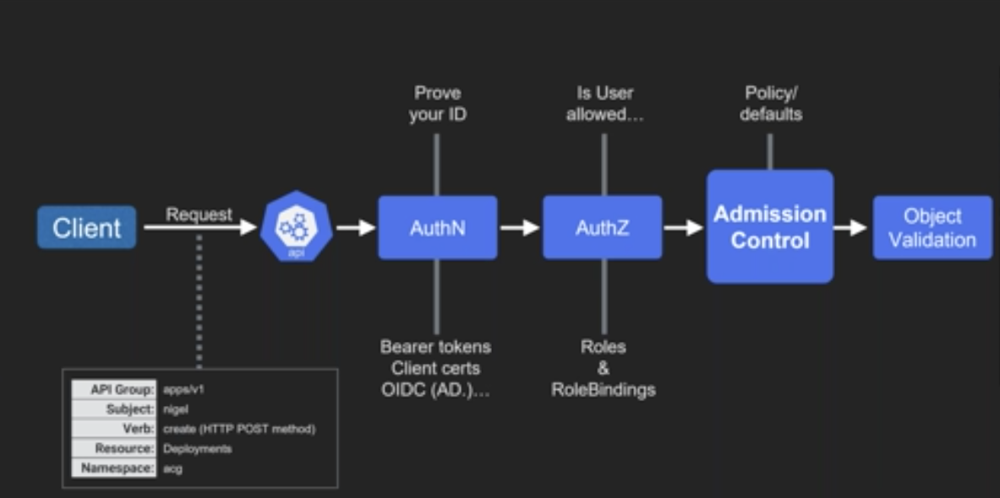

## Docker

- bretfisher Courses - Docker Mastery: <https://www.bretfisher.com/courses/>
  - petclinic example: https://github.com/BretFisher/petclinic
  - https://github.com/BretFisher/dockercon19
- Docker security: <https://docs.docker.com/engine/security/security/>
- BretFisher: What security concerns should I have with Docker? How should I go about locking it down? <https://github.com/BretFisher/ama/issues/17>
- Shifting Docker security left: <https://snyk.io/blog/shifting-docker-security-left/>
- At DockerCon: "Building a Docker Image Packaging Pipeline Using GitHub Actions": https://docker.events.cube365.net/docker/dockercon/content/Videos/SPWM3BdnCZWPN4fN9
- At DockerCon: "Your Container Has Vulnerabilities. Now What?" https://docker.events.cube365.net/docker/dockercon/content/Videos/GZpzJAapdrSXohzNz
- At DockerCon: "Captains on Deck” hosted by Bret Fisher: https://docker.events.cube365.net/docker/dockercon/content/Videos/jFNDwpTbHotrtbt5x

- Reduced linux capabilities 
- Security Options (`docker info` -> `security options`)
  - AppArmor profile enabled by default (Ubuntu) (`/etc/apparmor.d/docker`) if you have AppArmor running
  - SELinux easily enabled (CentOS) by `--selinux-enabled`
  - Seccomp profile enabled by default.
- Docker -> ContainterD / (cri-o only in k8s) 
- DO not expose Docker TCP socket, without securing using certificates. It's possible to use SSH (ssh://user@host)
  - `DOCKER_HOST=ssh://user@host docker version`
- Build with one base image, copy it to next base image after the initial work is done (within single Dockerfile): <https://github.com/BretFisher/petclinic/blob/master/pet-clinic-app/Dockerfile>

**Tools**

- script that checks for dozens of common best-practices around deploying Docker containers in production: <https://github.com/docker/docker-bench-security>

### General Commands 

- Mount host file system into a container and run: `docker run --rm -ti -v /:/hostOs <image> sh`
- Auto remove container when exit: `docker run --rm`
- List all images: `docker images --all`
- Version info: `docker version`
- Connect with remote: `docker context`

### Enumeration 

Check presence of docker:
```
/.dockerenv
```

## K8S

- bretfisher Courses - Kubernetes Mastery: Hands-On Lessons From A Docker Captain: <https://www.bretfisher.com/courses/>
- Threat matrix for Kubernetes - <https://www.microsoft.com/security/blog/2020/04/02/attack-matrix-kubernetes/>
- Pod Security Policies: <https://kubernetes.io/docs/concepts/policy/pod-security-policy/>



## Tools 

### binctr

- Create fully static, including rootfs embedded, binaries that pop you directly into a container.
- Can be run by an unprivileged user.
- <https://github.com/genuinetools/binctr>
- <https://blog.ropnop.com/docker-for-pentesters/>

## CVE-2019-5736

- <https://kubernetes.io/blog/2019/02/11/runc-and-cve-2019-5736/>
- <https://gist.github.com/singe/0ad4078848d85dc0d03f9f9013796e45>

## New References

- [Security analysis of Docker containers in a production environment](https://brage.bibsys.no/xmlui/bitstream/handle/11250/2451326/17303_FULLTEXT.pdf)
- [Cryptojacking invades cloud. How modern containerization trend is exploited by attackers](https://kromtech.com/blog/security-center/cryptojacking-invades-cloud-how-modern-containerization-trend-is-exploited-by-attackers)

