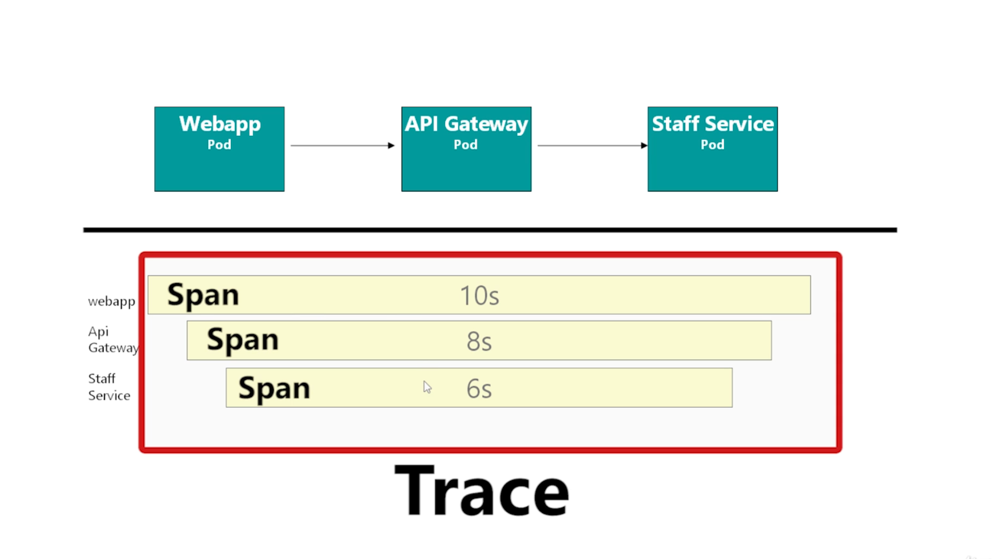

# Istio 

- <https://istio.io/latest/docs/concepts/what-is-istio/>
- Enable sidecar injection
  - Add label using kubectl
    - `kubectl describe ns default`
    - `kubectl label ns default istio-injection=enabled`
  - Add same label using Yamls(`metadata` -> `label`)
- Kiali - visualization
- Architecture
  - Proxies (sidecar)
    - Example: `isUserLoggedIn` micro service security check
    - Envoy is the proxy 
      - L7 proxy and communication bus designed for large modern service oriented architectures
      - Self contained process that is designed to run alongside every application server
      - Primarily designed as a service to service communication system
      - A single Envoy deployment can form a mesh between Java, C++, Go, PHP, Python, etc. 
      - Envoy can be **deployed and upgraded quickly** across an entire infrastructure transparently. (where as library update is painful)
      - Envoy is an L3/L4 network proxy. A pluggable **filter chain mechanism** allows filters to be written to perform different TCP proxy tasks and inserted into the main server. Filters have already been written to support various tasks such as raw TCP proxy, HTTP proxy, TLS client certificate authentication, etc.
      - Envoy supports an **additional HTTP L7 filter layer**. HTTP filters can be plugged into the HTTP connection management subsystem that perform different tasks such as buffering, rate limiting, routing/forwarding, sniffing Amazon’s DynamoDB, etc.
      - First class **HTTP/2 support**: supports both HTTP/1.1 and HTTP/2
      -** HTTP L7 routing**: When operating in HTTP mode, Envoy supports a routing subsystem that is capable of routing and redirecting requests based on path, authority, content type, runtime values, etc. 
      - **gRPC support**: gRPC is an RPC framework from Google that uses HTTP/2 as the underlying multiplexed transport
      - MongoDB L7 support / DynamoDB L7 support
      - Service discovery and dynamic configuration: Envoy optionally consumes a layered set of dynamic configuration APIs for centralized management. 
      - Envoy includes a **health checking** subsystem which can optionally perform active health checking of upstream service clusters.
      - Envoy includes support for automatic retries, circuit breaking, global rate limiting via an external rate limiting service, request shadowing, and outlier detection. 
      - Envoy includes enough features to make it usable as an **edge proxy** for most modern web application use cases. This includes TLS termination, HTTP/1.1 and HTTP/2 support, as well as HTTP L7 routing.
      - Envoy includes robust **statistics** support for all subsystems
  - Control Plane 
    - Galley: Read k8s yaml and transform it to internal structure that istio understands
    - Pilot: Take istio's internal representation and broadcast that to envoy 
    - Citadel: Managing TLS certificates
    - Mixer: Got replaced. Responsible for impl. policy checks and telemetry (Mixer get telemetry from Envoy)
      - Galley provide input to Mixer. Mixer communicate with Envoy. 
  - Data Plane
- Telemetry
  - Sidecar running in each pod to monitor
  - Control must be running (Mixer/Telemetry)
  - Kiali `Port 31000`
    - High-level
    - Doesn't give view of individual requests
  - OpenTracing - Jaeger / Zipkin
    - Applications must propagate x-request-id and x-b3-*  headers
      - Or will end up creating several traces
    - 
  - Grafana - for specific problems 
- Traffic Management
  - Canary Releases - Release to live for small % of incoming requests
  - K8s Native way is to use `Deployments` where version is incremented 
  - In istio use `Version Grouping`
    - In Kiali: `Versioned app Graph`
    - Label: `app:` to show Application in Kiali
    - Label: `version:` to show Version information in Kiali
    - Kiali: Service -> `Create Weighted Routing`
  - `Virtual Service`: Enable configuring custom routing rules (custom routing)
    - When applying `Virtual Service`, `Galley` read the YAML and then send to `Pilot` which  make config changes to `Proxies`
    - Envoy is doing the traffic management 
    - Istio is facilitating the update of all proxies in one go easily
    - `subset` defined in `Destination Rule`
  - `Destination Rule`: Define which pods (versions) should be part of `subset`
- Load Balancing a Virtual Service
  - Hash - Odd Even splitting - `consistentHash`
    - Hash based on, header, cookie or source IP
    - Doesn't work with weighted subsets. Weighting apply first. LB will have only one instance. 
- Istio Ingress Gateway
  - Edge proxy
    - Create Gateway (kind)
    - Configure `gateway` of `VirtualService` to point to new Gateway
    - NodePort ingress gateways, access from browsers only supported with host is * in VirtualService (LoadBalancer is expected)
  - Prefix based routing / Header based routing
    - Match in VirtualService 
    - Dark Releases based on headers
- Fault Injection
  - VirtualService -> fault -> delay
  - Chaoses Engineering
- Circuit Breaker - Mentioned in "Release It! Second Edition"
  - Cascading failure. One failure leading to another, and ultimately result in a bigger issue. 
  - If too many requests are failing, stop relaying requests and fail fast without delaying (check back later). 
  - Hystrix to build such logic into the application
  - Correct way would be to build it out side of the micro service (istio proxy) 
  - Outlier Detection
    - `Destination Rule` -> `trafficPolicy` -> `outlierDetection`
    - <https://istio.io/latest/docs/reference/config/networking/destination-rule/#OutlierDetection>
    - <https://www.envoyproxy.io/docs/envoy/latest/intro/arch_overview/upstream/outlier>
- Mutual TLS 
  - Fallacies of distributed computing
    - The network is homogeneous
    - K8s cluster is actually a multi node (mult zone also) deployment <https://en.wikipedia.org/wiki/Fallacies_of_distributed_computing>
    - Difficult to manually do this: Reveal, synchronization
      - CAs
      - App should be using HTTPS
      - No enforcement 
    - Citadel is responsible of configuring proxies with required certificates
    - What to do:
      - Block all non TLS traffic using policy
      - Auto update all proxy to proxy communication to mTLS
    - Kiali -> Display -> Security
    - Types:
      - Promiscuous mTLS - Default behavior
        - if istio cannot upgrade connection to mTLS (sending side doesn't have proxy), leave it as HTTP and serve (insecure)
        - Can be blocked by AUthentication Proxy
        - <https://istio.io/latest/docs/concepts/security/#authentication-policies>
      - Strict - 
- IstioCTL
  - `istioctl manifest apply`: Installing `default` profile of istio to cluster
  - Profiles: <https://istio.io/latest/docs/setup/additional-setup/config-profiles/>
  - <https://istio.io/latest/docs/setup/install/istioctl/#customizing-the-configuration>
  - `istioctl manifest apply --set profile=default --set addonComponents.kiali.enabled=true`
    - <https://istio.io/latest/docs/setup/install/istioctl/#display-the-configuration-of-a-profile>
  - IstioOperator Options has options related to configurations: <https://istio.io/latest/docs/reference/config/istio.operator.v1alpha1/>
  - `istio profile dump` - Dump default profile YAML 
  - `istio profile dump demo` - Dump demo profile YAML (UTF-16)
  - Modify the profile to:
    - Change the resource requirements based on periodical analysis of usage
    - `Demo` profile have certain  debugging enabled (GODEBUG)
    - `Demo` profile only capture ~1% of tracing inputs (PILOT_TRACING_SAMPLING)
    - .:. Start with `Default` profile and alter the file based on requirement
  - Apply modified file by: `istioctl manifest apply -f settings.yaml`
    - Will fail back to `First party JWT tokens` from `Third party JWT` (which is less secure). Minikube doesn't support Third Party JWT. Hence use `--set values.global.jwtPolicy=third-party-jwt` or `--set values.global.jwtPolicy=first-party-jwt` to select the desired. In minikube select 1st.
      - <https://istio.io/latest/docs/ops/best-practices/security/>
      - Third Party JWT use: <https://kubernetes.io/docs/tasks/configure-pod-container/configure-service-account/#service-account-token-volume-projection>
  - Verify with: `kubectl get po -n istio-system`
  - In a KOPS cluster, enable 1st party JWT by: Use `--set values.global.jwtPolicy=first-party-jwt`  or `kops edit cluster` and then: 
    - Add defined items into spec section: <https://kops.sigs.k8s.io/operations/service_account_token_volumes/>
  - Creating standard K8S Yamls
    -  `istioctl manifest generate -f raw_yaml_file.yaml`
    -  Had to change the order of `istio-system` namespace and move it to top
  - If you want to access the add on components - Kiali, Grafana and Jaeger - through a browser, you should be able to configure NodePorts using the IstioOperator API.
    ```yaml
            kiali:
            enabled: true
            k8s:
                replicaCount: 1
                service:
                type: NodePort
                ports:
                - port: 20001
                    nodePort: 31000
    ```

- Non root
- se-linux