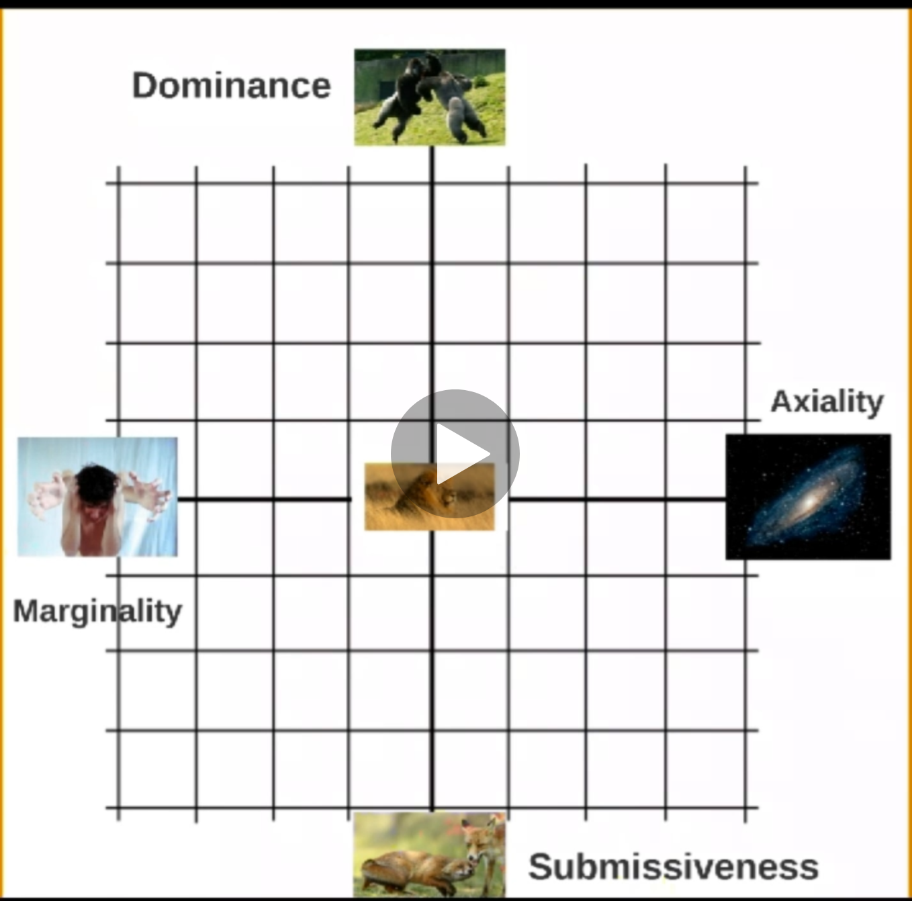

# Z Non Security

Non-security related content here! 

## Parenting 

### Neuroscience for Parenting

- `Oxytocin` - Love hormone responsible of reorganizing neurons while parenting
  - Also responsible of `Us vs Them` behavior 
  - In-group and out-group dynamics 
  - Feeling part of a group (protect a group)

#### The Reptilian Brain

- Survival of individual
- When active: People act in treat stress mode
- Active when there is danger / perceived danger 
- Responsible of dealing with life threatening situations
- Works closely with `limbic amygdala`
- Three ways of responding to a threat:
  - Flee
    - Lead to love, movement and change 
  - Fight
    - Lead to challenges and winning
  - Freeze
    - Lead to sharing and caring
  - Standby - *Active even where there is no active danger*
    - Lead to contemplation and thinking
- Reptilian Brain also gets activated when life is not in danger
  - Stress - Defense mechanism to a persevered danger
  - When feeling stresses
    - Flee -> Anxiety
    - Fight ->  Aggressively
    - Freeze -> Helplessness
- Reptilian Baby
  - During first 3 months, 90% of neural connections are disappeared based on surrounding
  - For a newborns slightest discomfort will trigger `Reptilian Brain` (life threatening)
  - For a baby cry is the only action but could be due to, Flee, Fight or Freeze:
  - Before 2-years, given them what they want
  - `Prefrontal brain` is responsible of Handling emotional pain
    - 17 years + development to avoid humiliation
    - 24 years + to fully develop 
  - To handle stress of children - Show that you are on their side
    - Flee
      - Movement and avoid confrontation
        - Solution: Give options 
        - Solution: Humor 
    - Fight
      - Overpowering and winning
        - Solution: Share outrage 
        - Solution: If kid is upset due to something you did, acknowledge feeling
          - "I understand you are angry right now"
          - "You have right to be upset"
    - Freeze
      - Looking for protection (ex: tears / not-doing-anything)
        - Solution: Offer support
        - Solution: Be there
    - Common Solution: Offer a hug (tell if they want a hug they can have it later)
      - Releases `oxytocin`. Bonding hormone.
      - Fight stress is defensive aggression, which happens when `Reptilian Brain` is active. 
- Movement
  - Main purpose of brain is to facilitate movement
  - 50% of neurons are from `Cerebellum`  is responsible of coordination of movement
  - This is the part of brain mostly grown at first 3 months of a newborns
  - Hence, movement is key to development of a child
  - Climbing, balancing, obstacle avoidance increase the brain growth (any activity that require constant attention on what uld happen next)
- Food
  - Sense of hunger is gen by `hypothalamus` 
  - Brain is 73% water
  - 60% of remaining 28% is fat 
  - Highest quality fat is: `Omega 3`, can be found in:
    - `fatty fish` (salmon, sadin)
    - Nuts
    - Milk and eggs (natural ones)
- Sleep
  - Own bed rule
  - Co-sleeping is important 

#### Paleolimbic Brain

- Survival of group
- When active: People act in very territorial way
  - Tries to impress and intimidate 
- Unconscious scripts inherited from education which regulates life
- Responsible of:
  - Self-confidence
    - Too-much: Dominance - Think of himself as superior to others
    - Too-less: Submissiveness - Causes melancholic depression
  - Trust
    - Too-much: Axiality - Results in gullibility 
    - Too-less: Marginality

- `limbic amygdala` is responsible of parental instincts and territorial power games related to protecting kids 
  - Ex: Fight with much larger predators when offspring is in danger 
- When someone is in this mode, better to let him calm down. No point of talking.
- Paleolimbic Toddler
  - Paleolimbic brain activated at 2 / 2.5 + years 
  - (Start playing together as a group)
  - Power-struggle and test others to see how long they can go
    - Don't start explaining things
    - No hugs / No nice guy
    - Show you are in charge at these situations 
    - Let your kid win time to time, but with non-important things  
    - Let kid learn consequences of their actions  
    - Discipline the child and let them know they cannot do whatever they want
    - However, too much discipline is wrong and will become submissive 
    - Don't threaten with a punishment and then not do it (don't reward for not complying)
    - Once 4 years + - make sure rules of the house is clearly defined (however, they will still test the limits)
    - Fluctuations of self-confidence stops only after 12 + years
  - Bullying 
    - Is a dominant Paleolimbic behavior  
    - Do role playing and teach child how to say "No no no" in bullying situations
    - Get bully to become a friend 

#### Neolimbic Brain

- Home to deepest motivations and raw emotions
- Where memory resides 
- Identify situation and come-up with procedures to handle it 
- Highly efficient and free-up minimum required attention span to carry out a task. Hence, free-up mind to do multiple things at the same time (Drive and talk).
- 3 layers of motivation
  - Intrinsic motivations 
    - After 3 months will remain same throughout life 
    - Could lead to 8 different personality types
    - Motivates you regardless of whether you like what you do
  - Extrinsic Motivations 
    - Not fixed
    - Likes and dislikes 
    - Blueprint of cultural influences (socially expectable) 
    - Motivates you only if you like what you do (won't last forever)
      - Example: Motivation from a raise last 3 - 6 months
  - Obsessions
    - Passion that has gone over its tipping point 
    - When obsessed we are not just free (never satisfied of what you do towards the subject of the obsession)
- Expectations 
  - `The Pygmalion Effect` - How we think about others will influence how they perform 
    - Give list of high potential students (chosen just randomly) to a lecturer and measure success of students. 
  - `The Gollem Effect` - Negative expectations lead to negative outcomes 
  - Even when we try to hide our inner expectations, kids will pick those up from other signs 
  - Expecting too much  -> lead to raising insecure adults (with attachment issues)
    - Kids will feel that: if kids do not perform as expected, they do not deserve our love
  - No expectations ->  lead to brats who do not know how to stand up for themselves
  - `Focus on efforts not results`
  - Actions 
    - Discuss with your kids 
    - Setup rules together
    - Challenge them 
  - Look at the kids with love, compassion and pride. Look at their potential
  - You way of looking at them shapes who they will become
- Punishments and reward
  - Never make a threat you will not act upon. This will damage your authority.
  - Types of punishments 
    - Removing a toy
    - Timeout
    - Being grounded
  - Rules
    - Consequences have to be clear and accepted/agreed
      - If X happens what should be the consequences? Let them decide.
    - Transgressions should always have consequences 
      - No punishment = reward 
    - No drama
      - Explain what is the problem of doing X  (Ex: wall paintings / fighting while driving)
      - Ask from kid why he is doing X  
      - Give alternatives
      - Talk in isolation (individually)
- Parenting Styles 
  - Learned helplessness - By trying to make things easier in short term, we make things harder in long term
  - We should help but not right away. Let them try, get frustrated. 
  - When child come to you, offer help. Next time, child will be able to solve the problem on their own. 
  - *The Attachment Theory*
    - Kids require: Safety and Exploration
    - Securely Attached 
      - Parents that are attuned to their desires. 
      - Kids will fel secure when parents are around. 
    - Avoidantly Attached
      - Parents emotionally withdrawn. Child will learn to independently grow. 
      - Independent and mature. Fail to develop relationships with others. Not social.
    - Ambivalent/disorganized attached
      - Parents are inconsistent
      - Kids are confused. Grow to be more fearful. 
   - Let kid explore. When a paint point arrives share a story where you also had a similar pain. Tell them it's normal to feel that way and it's part of the life. Tell them that you are there if they need you to.
- Personality 
  - Factors of `Reptilian Brain`, experiences during newborn period affect personality. 
  - Forcing kids to become what we want to become if counterproductive.  
  - Let children experience the life. Let them learn what they like. Fulfillment, Joy and Happiness is ultimate goal.
  - Don't always reward or cheer too much. Doing so, yo might turn `intrinsic motivation` into `extrinsic`.
- Mindsets 
  - Fixed mindset - Focused on the result. 
    - Good grades is the focus. 
    - You avoid taking risks due to this focus.
  - Growth mindset - Focused on the process 
    - Putting effort in there and experimenting. 
    - Enjoying the process (journey) and taking a challenge. 
    - Less stress. Doesn't affect relationship.
- Complements
  - Complements reenforce identity
  - Praise the effort (not the end result)
    - Don't say: You are the best / That's beautiful / You are smart
    - Say: You worked hard / You applied yourself / You like to learn new things don't you?
  - Don't overdo it.
    - Brain get used to Dopamine rush
    - Will need stronger incentives 
    - Kid will like the praising more than the activity itself
- Do not ridicule or joke about a child. `Prefrontal brain` is not grown to handle this.
   
#### Prefrontal Brain

- Make humans unique: No other living creature has this structure the way we have it
- Using Reptilian and Paleolimbic brain -> No connection with local thinking ability
- Creating invocative solutions to the problem at hand 
- Adaptation / Creativity
- Should be the one dealing with new and complex situations
  - Not always the case. `Limbic brain` might be used in a situations where `Prefrontal` should be used. Example: 
    - `Harry potter book was turned down by several publishers`
    - `Idea of a personal computer`
  - Leads to resistance to change.
- Use all our knowledge  and creativity to see a possible future and then say "yes" or "no".
  - Might not be right decision
- Home to: 
  - creativity
  - intuition 
  - spirituality
  - adaptability
- WHen in use: we feel calmness and in full control. 
- Remaining calm:
  - Fast forward 10 years and think about it.
  - Look at the situation and imagine how it could be worst. Will enable Prefrontal and disable amygdala.
- Learning
  - Force kids to make mistakes. And let them learn from mistakes. 
  - Act of retrieving knowledge:
    - The more knowledge is retrieved, stronger the pathway in brain becomes
    - Let the kid do assignment on their own
    - Revisit with him later
    - Have them fail in the safe-environment and repeat until it's right.
  - Sleep improves memory by at least 15%
- Adolescence
  - 90% of full size by age of 6
  - From age 12, go through re-wiring
    - Adolescence is the adaptive period 
    - You should be there to support child's emotional needs (not the other way around)
    - Be the safe-haven
  - Age 24+ to fully mature brain
  - In human nature to product a creature optimally primed to leave a safe home and move into unfamiliar territory
    - Overcome fear of leaving safe world and take risks (and new allies)
  - `Dopamine` helps `fast learning`, `takin risks`
  - `Oxytocin` bounding hormone 
    - Creates feeling of `us` vs `them`. 
    - Creates hostility between you and teenager
  - In combination, creates a person:
    - Very active socially and sharing new stuff with them
    - Sensitive to peer pressure 
  - Teenagers weight reward and risk differently. `Dopamine` make reward look better.
  - Look at the attitude that drives the actions (not the results). 
    - Experimenting is not wrong.
  - Actions
    - Need framework and rules but flexible and evolving 
    - They will need independence to answer social needs 
      - If not give, Poleolimbic brain create a territorial battle
    - Stay connected
    - Put down rules (negotiate rules). You are not the enemy. 
      - Get their point of view and adjust the rules as required. 
      - Write consequences clearly. 
    - Sleep is important. Create rules around that. 
    - Language center mature at 13 years. After that we cannot pickup anything as a 2nd nature.  
- Screentime
  - Limit to less than 1-2 hours per day
  - Less than 3 years non at all
  - Due to: 
    - Gray matter atrophy
    - Loss of white matter integrity 
    - Reduced cortical thickness 
    - Impaired cognitive function
  - `Dopamine` instant gratification
    - A rush with each game win, or video you watch
    - Kids never get this type of `dopamine` rush in non-screen environment
    - Therefore everything else becomes dull, and make you unable to focus
  - Humans are social animal by nature. Screen reduce social skills.
  - Sleep deprivation. Blue light LED, which disrupt `melatonin`.
  - Keep it controlled from the start.
- Grit
  - Delayed gratifications (instant gratification was our nature because everyday could be the last)
  - Growth mindset
    - Love the process
  - Be demanding.But not too much, which could lead to `Learned helplessness`.
  - Be `Demanding yet Supportive`.
  - Our brain evolved for
    - instant gratification 
    - energy efficiency 
  - `Try Harder`. Put them in control. It's in your hand. `Perception of Control`. 

#### Common 

- Submissiveness, Introversion and Shyness
  - Submissiveness 
    - About obedience
    - Part of Paleolimbic Brain
    - Should be avoided
    - Talk: Is your kid bullied kicked upon
  - Introversion
    - Character traits
    - People who are introverted tend to be inward turning, or focused more on internal thoughts, feelings and moods rather than seeking out external stimulation.
    - Part of Neolimbic Brain  
    - Talk: Is your kid like to be alone (introverted)
  - Shyness
    - About social fear
    - Part of Reptilian Brain (freeze)
    - Talk: Is your kid scared of others who he doesn't know 
      - Invite same age kids to home (one at a time)
      - Introduce the kid to other one
      - Ask other kid some questions and then involve your kid on answers 
- Help delaying gratification 
  - When you promise something do it
  - When they want something make them earn it
    - Action means reaction
    - There are consequences to actions
- Birth Order
  - First Child - Parents have strong urge to do everything perfectly. More attention given by parents.
    - Reliable
    - Conscientious
    - Structured Cautious
    - Controlling
    - Achievers
    - Competitive mindset
  - Second Child - Parents are bit relaxed. Have sense of having control. If different gender than the first, second child may have first child  characteristics. 
    - People pleaser
    - Somewhat rebellious
    - Thrive on friendship
    - Large social circle
    - Peacemakers
  - Last Child - Grab whole family attention. Hence 2nd child is left out. 
    - Fun loving
    - Uncomplicated
    - Manipulative
    - Outgoing
    - Attention seeker
    - Self centered 
  - Only child becomes extreme `First Child`. And also, mature to his age, perfectionists, conscientious, diligent, leaders.
- Main pillars for healthy brain
  - Sleep
  - Movement
  - Diet
  - Grit
- Three golden rules
  - Setup a framework (set of rules)
  - Let them experiment without too much adult interventions 
  - Avoid public humiliations 
- You are on their side. Take away the perceived danger. 
- Communication on the level of emotions. Offer guidance. 

### Family Meetings

- <https://centerforparentingeducation.org/library-of-articles/healthy-communication/holding-family-meetings/>
- <https://www.rootsofaction.com/family-meetings/>
- plan weekly schedules/calendars so everyone knows what each person will need to do and what commitments have been made.
- share information that will effect family members.
- have fun together.
- make family decisions about vacations, recreation or other activities.
- It is truly an opportunity for your children to feel SEEN, HEARD, and UNDERSTOOD by you (since everyone is equal)
- Introducing Family Meetings to Children
  - take time to introduce the concept to your children before you dive in
    - you’ve recently learned how weekly meetings can benefit families by helping them communicate and solve problems together as a team
    - Because family meetings work toward building consensus, everyone has a voice and a role in solving problems.
    - Meeting time is also an opportunity to have fun, plan trips, organize family outings and service projects, and appreciate each other
- specific problem
  - Decide who is involved.
  - Each person states his perspective and viewpoint about the problem.
  - Ask each person for suggestions
  - Write down the suggestions.
  - Develop a plan of action.
  - At the end of the session, set a time for a follow up meeting to evaluate
  - Have a follow up meeting.
- make sure:
  - Value everyone’s input.
  - Treat all members as equals.
  - Avoid letting one person dominates.
  - Keep the family meeting short (no longer than 15 minutes).
  - Using “I” Statements (over “You” statement)
    - “I would like” (tell what you want to happen instead)
- to make it interesting
  - include refreshments.
  - include an opening activity that highlights positive family events or achievements or affirms individual family members. 
    - Example – best thing I did today, trait I like about myself, (or about someone else in family)
  - set an agenda so that everyone knows what will be discussed.
  - establish ground rules, such as:
    - no interruptions
    - no put downs
    - everyone is listened to
    - respect each other’s opinions
    - everyone has a chance to contribute
  - Sharing leadership
  - Being flexible
  - Keeping Minutes 
- Family Meeting Agenda
  - Open Meeting - with a poem, prayer, song, candle-lighting, etc.
  - Appreciations - each family member to appreciate, say “thanks,” compliment, or acknowledge other members on positive things they noticed this week
  - Discovery Time  - learning together as a family
  - Week in Review 
    - What worked well in our family this week?
    - What went wrong in our family this week?
    - What will we work on this coming week?
  - Problem-Solving
    - resolving problems or issues that individual family members have placed on the agenda
    - try to solve only one problem a week
  - Weekly Planning
    - Trips, concerts, sports events
    - chores
  - Fun Activity - playing a game, watching a movie, or making pizza together

### Power Struggle 

- Misbehave to:
  - Belong
  - Feel loved
  - feel powerful
  - Feel valuable
  - Feel like they have a place
  - Experiment and explore
- Adlerian Psychology
- Misbehaving = Discouraged (from getting one of these needs met). 
- Identify child's mistaken goals and provide a better way of getting to those. 

- Mistaken Goals
  - Attention 
    - Feel special and feel loved by keeping parent busy
    - Parent Feel: Irritated, annoyed, frustrated, distracted, manipulated
  - Power
    - Parent Feel: Provoked, anger, challenged
  - Revenge
    - I feel hurt, hence I'm going to make you hurt 
    - Parent Feel: Hurt, mad, want to get even
  - Avoidance
    - Parent Feel: Feel sorry for child, despair, helpless coaxes or shows pity

- Side Stepping the Power Struggle
  - `Joy of Opposing` when `Power Struggle` with someone
  - Drop parent's end of tug of war by `stopping talking`
    - Without disrespecting or doing something mean.
- Preventing Joy of Opposing
  - Do not escalate your emotional response. (Example: Loud "no"s with each attempt)
  - Respond like a broken record (repetition)
  - `To play in garden, you are going to learn not to do X. And drop child in a different place, until child stop doing X`
  - `Repetition` and `Redirection`. Cannot learn when in a power struggle - in stress (reptilian brain). Repetition help keeping prefrontal brain active and learn. 
- Kind and Firm
  - Find middle ground between kindness and firmness 
  - Better to be more firm than kind
  - Given-in from time to time, but don't let them completely win power struggle. 
  - `Dance of Corporation`
- How to Get Out of A Power Struggle
  - Use loving guidance
    - Words fuel power struggle. Use less words (no is better).
    - Approach calmly. Use eye contact / non-verbal signals to give the message.
  - Find useful ways for the child to feel valuable and powerful
    - Example: Give his own drawer in kitchen for his stuff
  - Teach them to say "no" respectfully
    - If saying "no" was not an option, kids will find alternatives like arguing
  - Offer choices
    - Choices should be aged appropriately to let the kid feel empowered
    - 1. Concrete choices
      - "Do you want to wear the red pants or the blue pants?"
    - 2. Choices with incentives
      - "Do you want to go to bed now and I'll read you 3 stories or go to bed in 5 minutes and I'll read you one story?"
    - 3. Playful choices
      - "Do you want to walk to bed or run to bed?"
    - 4. Immediate choices
      - "Do you want to go to bed now or now?"
    - 5. Choices with consequences
      - "You may play with the truck on the floor or choose a soft toy to play with on the table. If you run the truck on the table again, I will take the truck away."
  - Do the unexpected
    - Do something unexpected / fun to break the attention to power struggle 
    - Then get back to the original task. Don't let the kids get away
    - Example: Dance before bed (when power struggling about bed time)
  - Win/Win negotiate
    - Flexible
    - Usable with a child who does what he say he will
    - Negotiate what happens if task is not done
      - If child is not accountable with the negotiation, don't use this technique
    - "I see that's a win for you and I want you to win. But I want to win too......"
  - Let go of your position
    - Listening to child
  - Use a signal
    - Let child make a signal (word of a sign) to start a task
    - Example: "Broccoli" is the sign to "stop fighting"
- Preventing Power Struggles
  - Talk Less (use actions)
  - Use One Word (in sing sung voice)
  - Be firm and kind - and follow through
    - Do what you say. Show that you mean the consequences. 
  - Say no in a friendly way
    - That’s not an option
    - I am unwilling...
    - Say it in a funny way, i.e. "Never in a million trillion years!"
    - Sing, no, no, no!
    - That’s not appropriate.
    - I am not ready for you to do that yet. (Great for teens)
    - For a younger child, use distraction
    - Ask, "What do you think you would need to do before I would be willing to say yes to that?"
    - Ask, "What do you think? Is this a good choice for you?" (If you choose this, make sure you are willing to abide by her answer)
    - For a youngster that has something you don’t want him to have say, "That’s not a toy."
    - Ask, "What are your other options?"
    - No, but I would be willing to...
    - I appreciate your asking, however...
    - Walls are not for coloring. Here is a piece of paper.
    - Tell them what to do instead i.e., "Water needs to stay in the tub."
    - This is not negotiable 
  - Let them have the last word
    - Don't give in (and show that if forced enough you are ready to do something)
    - Be patience and just wait until kid give up
  - Catch them doing well and acknowledge them
    - Little reward (ex: join and play with them) when doing well
  - Let them know how valuable they are to you
    - Ex: Appreciate a hug
  - Make it fun
  - Seek first to understand
  - Don’t major in the minors
    - Pick on the battles you can win
    - If most things are flexible, kids tend to be more likely to comply with your major requests
  - Use GEMS (Genuine Encounter Moments)
    - See world through the child's eyes and be with him 
    - Take 3 minutes to 30 seconds to handle a GEM
    - Let them feel: "What is important to me, is important to my parent"
    - Cannot handle all GEMS. Hence, depending on importance of your work handle some. 
    - Options:
      - Do a GEM
      - Set temporary limit: It's OK to tell him to give 10 minutes. But make sure you'll be there by 10 minutes (Trust).
      - Redirect the attention. 
    - 