- NIST 800-53r4 
  - CA-7 (1-3)
  - CA-8 (2)
- Silent Trinity / gcap 

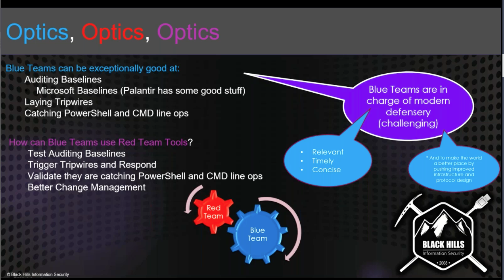
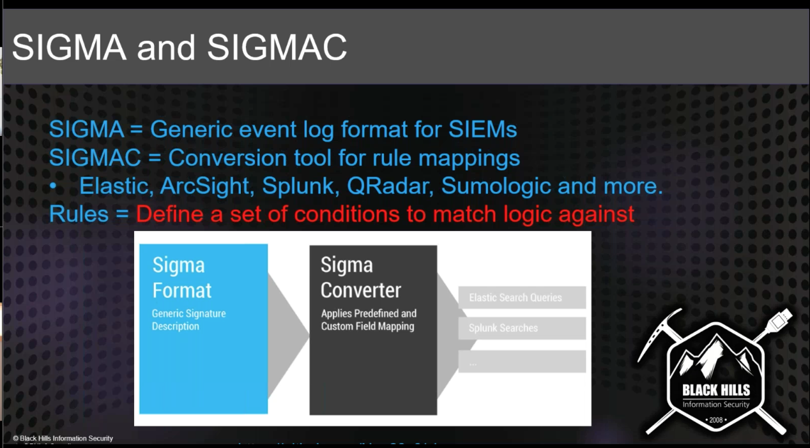

## Red Team

- Do not use standard signatures (file names)
- Change name of the tools (mimidogz) caused endpoint protection tools to fail
- BadBlood

### Responder

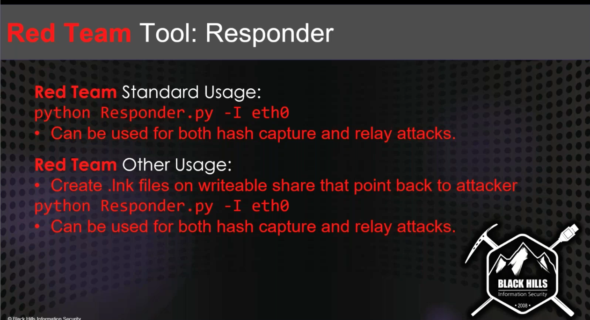
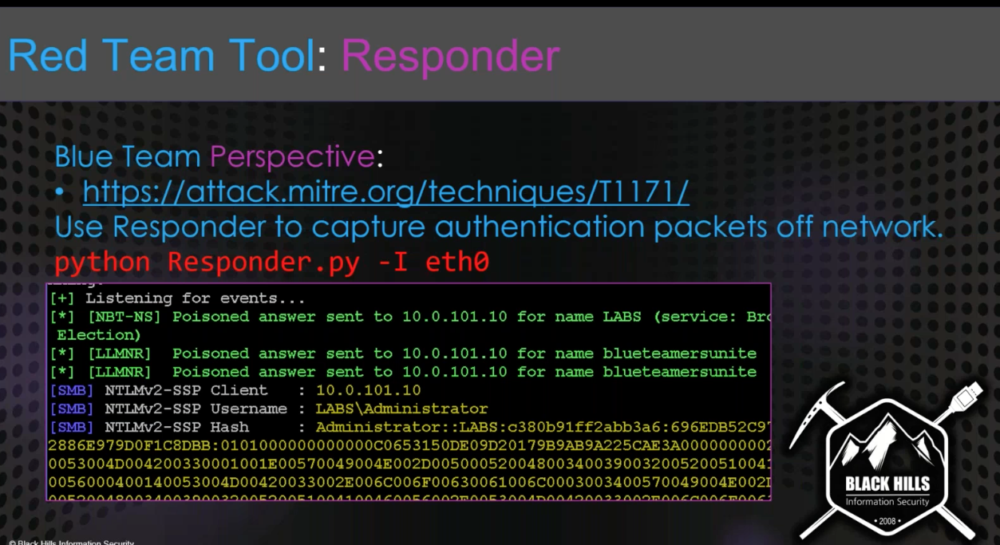

- Poisoning tool for Windows Default Protocols 
- Detectable using Respounder / Responder Guard 
- 
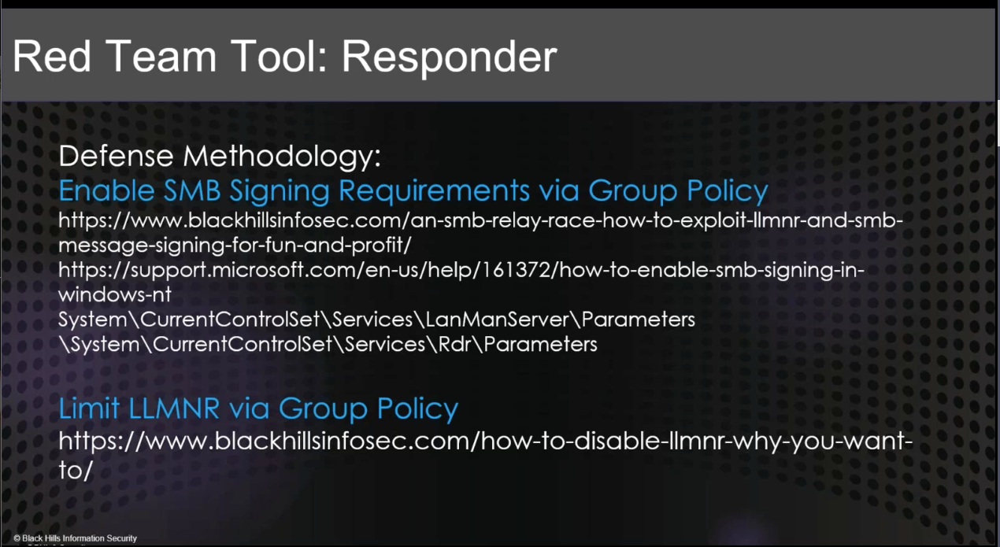
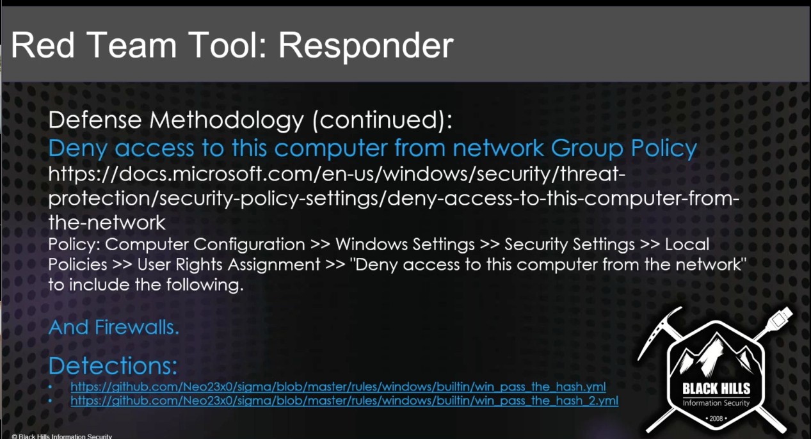
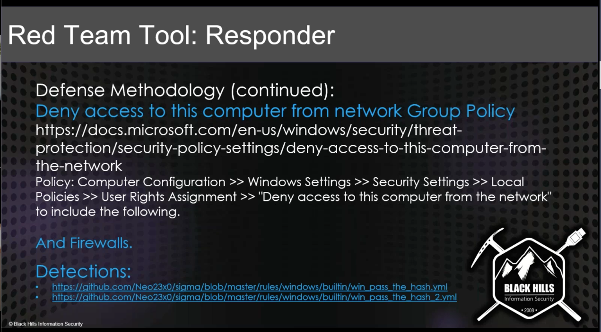

### CrackMapExec

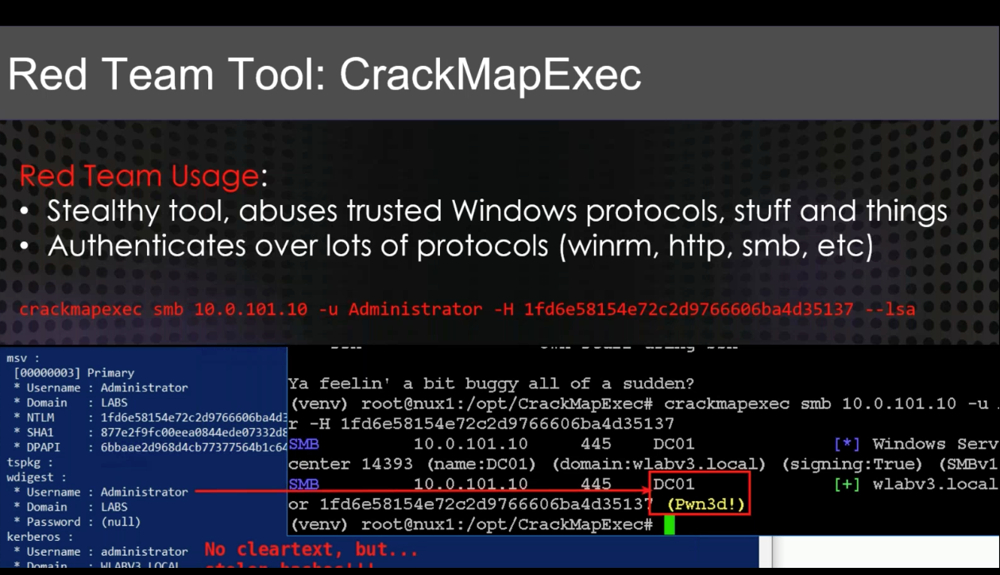
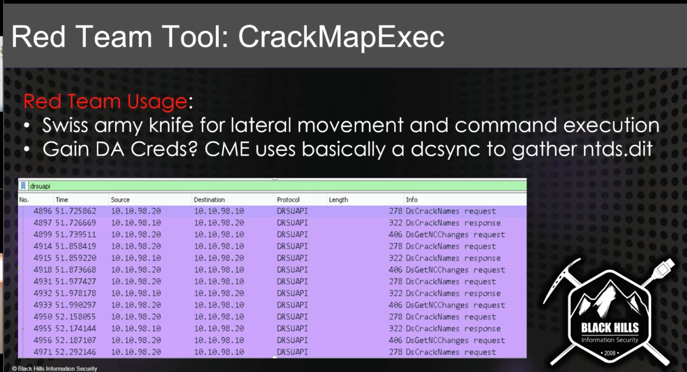

- CrackMap uses DCSync 

Detecting PTH attacks:
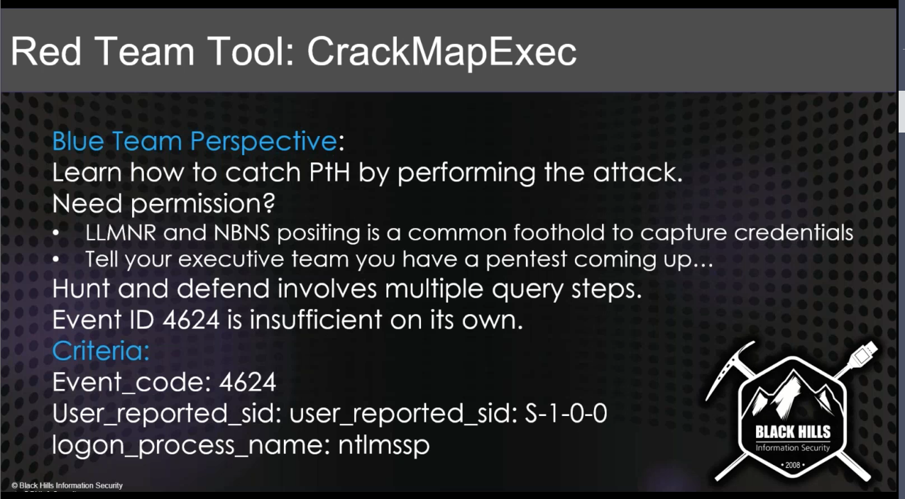
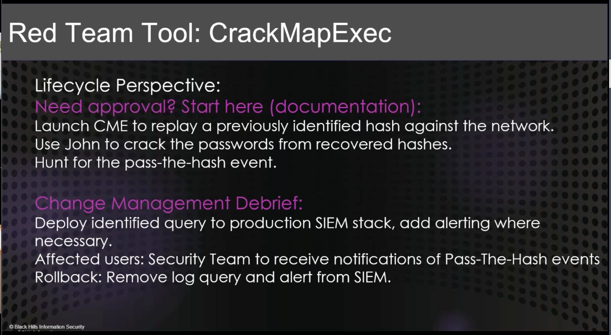

### DomainPasswordSpray

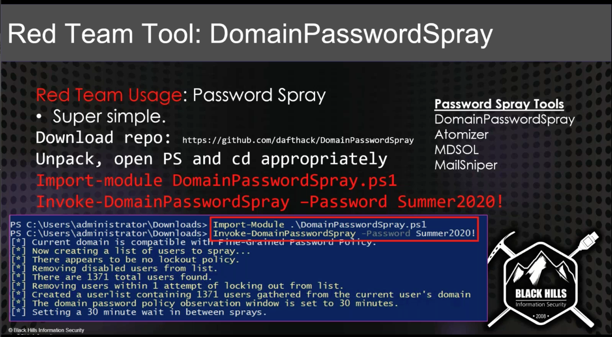
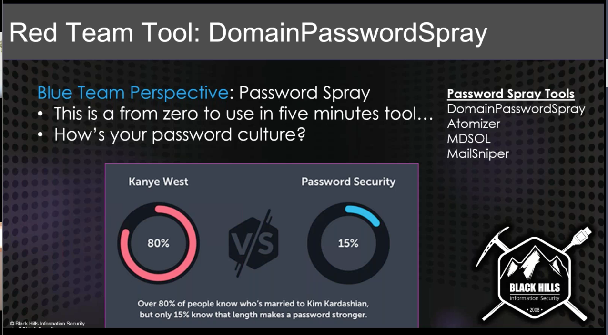
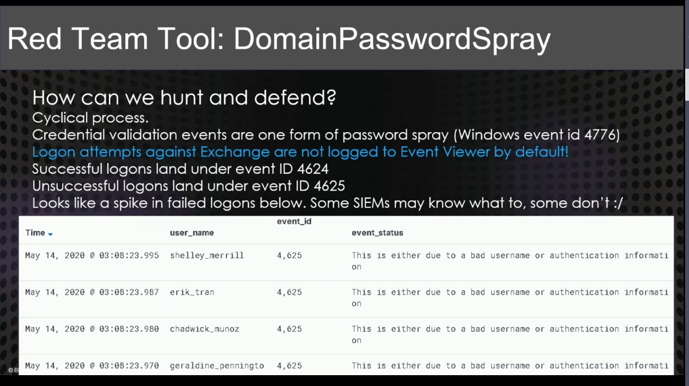

### Mimikatz 

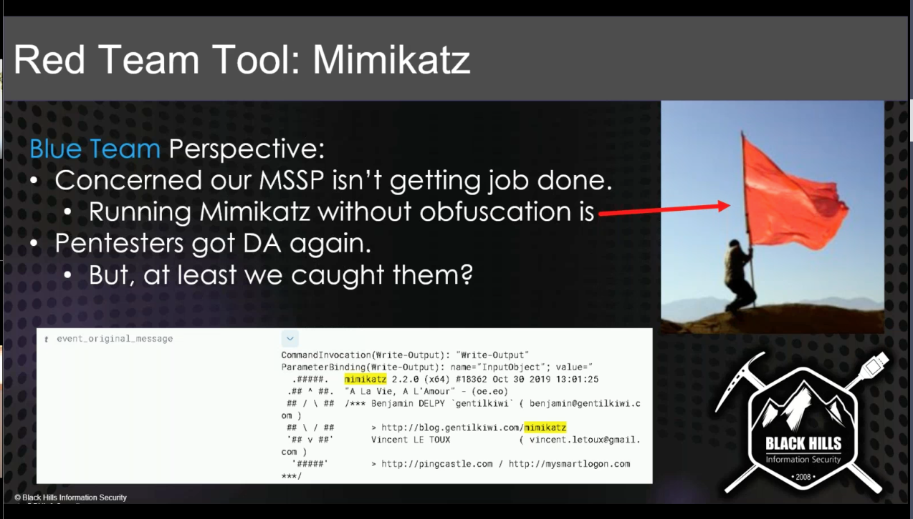
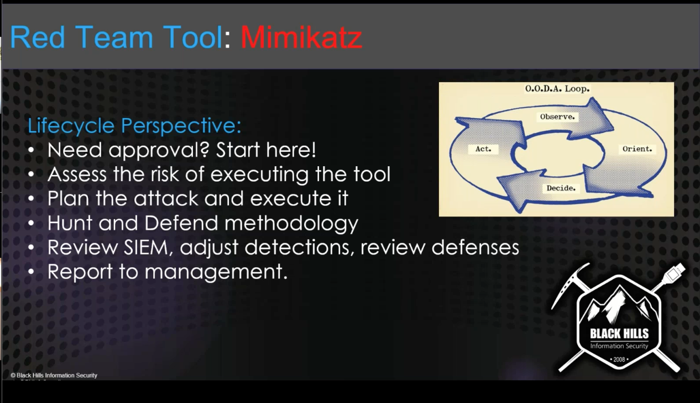

### BloodHound / PlumHound

## Blue team 

- Exchange and outlook do not log.
- IIS log only to disk, not to event log.
- Managed Service Providers (MSP) should see AV kills.
- MSSP should catch Mimikatz.
- BloodHound -> PlumHound

## Setup 

- Run <https://github.com/davidprowe/BadBlood>
- Run <https://github.com/DefensiveOrigins/APT06202001/tree/master/Lab-DomainBuildScripts>
- <https://github.com/DefensiveOrigins/APT06202001/tree/master/Lab-Sysmon/sysmon-modular-master>
  - `Import-Module Merge-SysmonXML.ps1`
  - `Merge-AllSysmonXml -Path ( Get-ChildItem '[0-9]*\*.xml') -AsString | Out-File sysmonconfig.xml`
- Endpoint-protection vs aEDR

## Tooling 

- Collaboration
  - <https://vectr.io/>
  - <https://plextrac.com/>