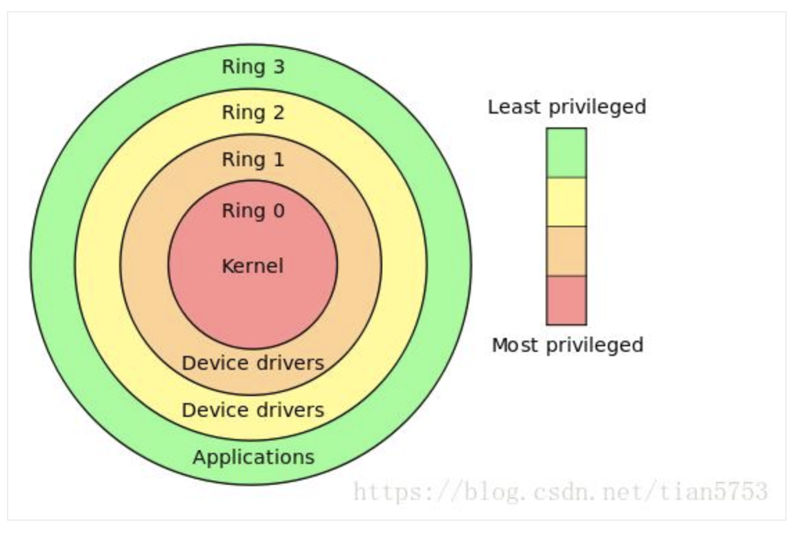

## Quick References

- > Introduction to RE
- > Why RE is necessary (no-support/source/malware)
- IA-32 CPU architecture 
  - General Purpose Registers (V1 C3.4.1): 
    - EAX - accumulator
    - EBX - pointer to data in DS segment
    - ECX - counter for string and loop operations 
    - EDX - I/O pointer
    - ESI 
      - Pointer to data in the segment pointed to by the DS register
      - Source pointer for string operations
    - EDI
      - Pointer to data or destination in the segment pointed to by the ES register
      - Destination pointer for string operations
    - ESP - Stack pointer, in the SS segment
    - EBP - Pointer to data on the stack, in the SS segment 
  - Accessing parts of registers (EAX AH AL)
  - EFLAGS (V1 C3.4.3)
    - Arithmetic: OF SF ZF AF PF CF
    - ZF
      - SCAS
      - CMPS (CMSB/CMPSW/CMPSD)
      - LOOP (LOOPE/LOOPE/LOOPZ/LOOPNE/LOOPNZ)
    - DF (direction flag)
      - 1: String instructions auto-decrement (processed from higher to lower address)
      - 0: String instructions auto-increment (processed from from lower to higher address)
      - `cld` to **cl**ear **d**irection flag
      - `std` to **s**e**t** **d**irection flag
      - String operation
        - ESI/EDI: must point to either to start/end of the string
        - ECX must contain number of bytes to compare 
    - IOPL (**IO** **p**rivilege **l**evel) - OS operations 
    - Trap Flag - Enable single step mode (debugging)
  - Segment Registers (V1 C3.4.2)
    - CS - code
    - DS - data
    - SS - stack
    - ES - data
    - FS - data
    - GS - data
  - EIP - Instruction Pointer Register = PC (V1 C3.5)
    -  Cannot access directly
  - DR0 - DR7: Debug Registers (V3 C317.2)
    - DR0 - DR3 are important: Used to store hardware breakpoints (addresses)
    - Cannot be accessed directly from userland (Ring-3)
    - In Windows use Ring 3 API and transfer execution to kernel level to update the register 
  - Machine/Model Specific Registers  (V1 C3.2)
    - Not accessible to applications, except from Time-Stamp Counter 
    - 64-bit 
    - Read using RDTSC (Read time-stamp counter) 
      - Low read to EAX
      - High read to EDX
    - Incremented with every clock cycle (reset when processor reset)
- CPU has a thread-wise context
- Software breakpoints work by 0xCC (int 3h) instruction. Core modification, is independent from thread context.
- Functions
  - Why functions are required in a program
  - Execution flow changes and it's required to remember where the execution was left off (and registers)
  - Introduce stack (SS)
- Stack: <https://en.wikibooks.org/wiki/X86_Disassembly/The_Stack>
  - Process: 
    - Contain threads
    - Created by OS and provided with a virtual address space 
    - OS creates at least one thread, ready to be executed
  - Thread:
    - Has it's own stack
    - Share the same virtual address space (of process)
    - Time slice assigned by processor to that specific process 
    - Singe processor system: One thread at a time
    - Multi processor system: Simultaneous threads 
  - Multi-tasking: Illusion of simultaneous execution of multiple application at the same time 
  - Multi-threading: Multiple threads that actually run in parallel
  - PUSH POP - LIFO and bottom to top  nature
    - ESP always point to TOS is decremented to point to new place  
      - Addition decrement 
      - Removal increment
- Function calling (V1 C6): <https://en.wikibooks.org/wiki/X86_Disassembly/Functions_and_Stack_Frames>
  - Parameters pushed to stack 
  - CALL 
    - Push return address to (return IP) ti stack
    - Load the address of the function's entry-point (to EIP)
  - RET
    - POP address from TOS to EIP and resume execution 
    - RET 4. RET + increment ESP 4 bytes (used in `stdcall` and `fastcall`) 
  - Stack frames (V1 C6) 
    - Each function need a way to store return/local variables etc.
    - Function `prologue` create a frame for each function 
      - After this some GP registers stored in stack
    - Function `epilogue` re-balance the stack (free memory) after execution
      - Before this GP registers are restored
  - prologue: <https://en.wikipedia.org/wiki/Function_prologue>
    ```bash
    push ebp      # save base pointer
    mov	ebp, esp  # set the base-pointer, so that it points to the top of the stack
    sub	esp, N    # allocate memory for current stack frame
    ```
    ```bash
    enter	N, 0   # More complex prologues can be obtained using different values (other than 0)
    ```
  - function invocation
    ```bash
    push eax    # save registers
    push ebx

    # Function body 

    pop ebx    # restore saved registers
    pop eax
    ```
  - epilogue:
    ```bash
    mov esp, ebp   # free memory allocated for current stack frame 
    pop ebp        # restore previous base pointer 
    ret            # exit function
    ```
    ```bash
    leave
	ret
    ```
  - Calling conventions: <https://en.wikibooks.org/wiki/X86_Disassembly/Calling_Conventions>
    - `cdecl`
      - Arguments are passed on the stack in `Right-to-Left` order, and `return values are passed in eax`.
      - The `calling function cleans` the stack. 
        - CDECL functions to have variable-length argument lists (aka variadic functions)
        - Number of arguments is not appended to the name of the function by the compiler, and the assembler and the linker are therefore unable to determine if an incorrect number of arguments is used.
      - CDECL functions are almost always prepended with an `_`. 
        ```c
        _cdecl int MyFunction1(int a, int b)
        {
        return a + b;
        }

        x = MyFunction1(2, 3);
        ```
        ```bash
        _MyFunction1:
        push ebp              # prologue
        mov ebp, esp          # prologue
        mov eax, [ebp + 8]    # read 1st param into eax
        mov edx, [ebp + 12]   # read 2nd param into abx
        add eax, edx          
        pop ebp               # epilogue
        ret                   # epilogue

        push 3                # push rightmost param into stack (b)
        push 2                # push next-rightmost param into stack (a)
        call _MyFunction1     # call
        add esp, 8            # calling function cleans (free memory)
        ```
  - `stdcall` (WINAPI)
    - Exclusively by Microsoft as the standard calling convention for the Win32 API
    - Arguments are passed on the stack in `Right-to-Left` order, and `return values are passed in eax`. (same as `__cdecl`)
    - The `called function cleans` the stack, unlike CDECL. 
      - STDCALL doesn't allow variable-length argument lists.
    - Name-decorated with a leading `_`, followed by an `@`, and then the `number (in bytes)` of arguments passed on the stack. This number will always be a multiple of 4, on a 32-bit aligned machine.
    - Resulting code is smaller because `clean up` instructions are not repeated with each invocation. 
        ```c
        _stdcall int MyFunction2(int a, int b)
        {
        return a + b;
        }

        x = MyFunction2(2, 3);
        ```
        ```bash
        :_MyFunction2@8       # Function name contains info about number of bytes to clean
        push ebp              # prologue
        mov ebp, esp          # prologue
        mov eax, [ebp + 8]    # read 1st param into eax
        mov edx, [ebp + 12]   # read 2nd param into abx
        add eax, edx          
        pop ebp               # epilogue
        ret 8                 # epilogue + called function cleans (free memory). 8 is how many bytes to pop off.

        push 3                # push rightmost param into stack (b)
        push 2                # push next-rightmost param into stack (a)
        call _MyFunction2@8   # call
        ```
  - `fastcall`
    - not completely standard across all compilers
    - first 2 or 3 32-bit (or smaller) arguments are passed in registers, with the most commonly used registers being `edx`, `eax`, and `ecx`
    - Additional arguments, or arguments larger than 4-bytes are passed on the stack, often in `Right-to-Left` order (similar to CDECL)
    - `Calling function cleans` most frequently
    - prepends an `@` to the function name, and follows the function name with `@x`, where x is the number (in bytes) of arguments
    - FASTCALL function doesn't need a stack frame
    - Commonly `gcc` and `Windows FASTCALL` convention pushes parameters one and two into `ecx` and `edx`, respectively, before pushing any remaining parameters onto the stack.
        ```c
        _fastcall int MyFunction3(int a, int b)
        {
        return a + b;
        }

        x = MyFunction3(2, 3);
        ```
        ```bash
        :@MyFunction3@8
        push ebp           # prologue
        mov ebp, esp       # prologue
        add ecx, edx       # a is in ecx, b is in edx
        pop ebp            # epilogue
        ret                # epilogue

        mov ecx, 2         # move rightmost param to eax 
        mov edx, 3         # move next-rightmost param to edx
        call @MyFunction3@8 
        ```
- Read EIP (used in `relocatable code`)
  - Move return address (EIP) to the EAX register
    ```
    GetEIP proc 
    mov eax, dword ptr ss:[esp]
    ret
    GetEIP endp
    ```
  - Put the address of previous instruction executed into EAX. Usable to locate other parts of code in memory (by adding  / subtracting to EIP value):  
    ```
    Call _getEIP
    _getEIP: pop eax
    ```
- Heaps - Dynamically & runtime allocated memory (used to store data that doesn't fit in stack)
- Handles - References to resources. Used by OS to control resource access. 
  - Example: To access a file need to create a file-handle using Windows API.
- Exceptions: Events occurred during runtime. and handlers to handle events. 
  - Hardware exceptions: Bad sequence (div by zero). OS map to error codes.
  - Software exceptions: 
  - Windows implements: `Structured Exception Handling (SEH)` to handle both software and hardware exceptions. 



- The CPU ring0, ring1, ring2, ring3: <http://www.programmersought.com/article/47422162127/>
- Tracking Ring3 - Ring0 of running processes: <http://www.programmersought.com/article/81722595513/;jsessionid=B89F397D53E2BA65418324AA33A1437D>
- The CPU privilege level is divided into four levels: `RING0`, `RING1`, `RING2`, `RING3`. 
- Windows uses only one of the two levels `RING0` and `RING3` (`userland`). 
- If the application attempts to execute `RING0 `general instructions, then Windows will display `Illegal Instruction` error message.
- Windows `Ring3` Internal Structures <http://index-of.es/EBooks/nt_internals.pdf>:
  - `THREAD_ENVIRONMENT_BLOCK (TEB)` contains:
    - Address of the top and bottom of current thread's stack
    - Thread identifier 
    - Process thread belongs to 
    - Code of the last error 
    - Address of the `Thread Local Storage (TLS)`
    - Address of the `PROCESS_ENVIRONMENT_BLOCK (PEB)`
  - `PROCESS_ENVIRONMENT_BLOCK (PEB)` contains:
    - Image base of the process 
    - Address of Loader data structure (PEB_LDR_DATA)
    - `NtGlobalFlag` value  (`useable in detecting debugging`)
    - Major and minor version of Windows OS
    - Number of processors
    - `BeingDebugged` flag (`useable in detecting debugging`)
  - `CONTEXT` contains:
    - All CPU state info for thread (during internal operations)
- Windows APIs 
  - `Ring3` OS functions
  - Communicate with kernel function in a safe way (app to OS communication)
  - Categories:
    - Administration and Management
    - Diagnostics 
    - Graphics and Multimedia
    - Networking
    - System Services
    - Windows User Interface
- Tool categories 
- Immunity Practice
  - Level 1: App that branch based on password. Function that return if password is valid using two params. 
    - Change ZF 
    - New origin 
    - Substitute JMP with NOPs (Binary -> Fill with NOPs)
    - Substitute JMP to desired location (Binary -> Edit and set offset to X)
    - Inverse JMP (double click on instruction and change JNE to JE, etc.)
    - Check params sent to check function and extract password. 
    - Save changes with right-click, save to executable. right-click save-file. 
  - Looking at memory regions 
  - PE information: Right click "PE header" memory section -> dump in cpu -> right-click in dump -> special -> PE header
    - Check offset value and go to that address 
    - Beginning of section: `from memory view`
    - Actual beginning of section within binary:  `PointerToRawData`
  - Find offset within binary:
    - `offset within code section` = (`address of the instruction` - `start address of code section`)
    - `offset within code section` + `PointerToRawData of the code section` = `exact location within binary`

## Tools

- Hex Editors 
- Decompilers
- Disassemblers
- Debuggers
  - Ring0 
  - Ring3
- System Monitoring Tools 
- Windows API Monitoring Tools

- Diaphora - is a program diffing plugin for IDA / Ghidra: <https://github.com/joxeankoret/diaphora>
- YaDiff - is a program diffing 
- BinDiff: Patch analysis 

- radare2
- Frida - Dynamic instrumentation toolkit for developers, reverse-engineers, and security researchers: <https://www.frida.re/>
- angr - Python framework for analyzing binaries. It combines both static and dynamic symbolic ("concolic") analysis, making it applicable to a variety of tasks: <https://angr.io/>
- GEF - GDB Enhanced Features for exploit devs & reversers: <https://github.com/hugsy/gef>
- YY-CHR - Supports editing NES, SNES, Genesis, PCE, GG, WS/C, GB/C, MSX 1+2, NGP/C, SMS, and GBA graphics: <https://www.romhacking.net/utilities/119/>
- ProcDump - ProcDump provides a convenient way for Linux developers to create core dumps of their application based on performance triggers: <https://github.com/Microsoft/ProcDump-for-Linux>
- mleak - Memory leak tracer for C programs: <https://github.com/hyc/mleak>
- Demangle function names (C/C++): <http://demangler.com>

## Collections

- Vagrant box with binary analysis tools: <https://github.com/Hamz-a/binanalysisbox>
- microsoft-pdb: <https://github.com/Microsoft/microsoft-pdb>
  - `cvdump Whatever.pdb` <https://github.com/Microsoft/microsoft-pdb/blob/master/cvdump/cvdump.exe>
  - How to Inspect the Content of a Program Database (PDB) File: <https://www.codeproject.com/Articles/37456/How-To-Inspect-the-Content-of-a-Program-Database-P>
  - <https://docs.microsoft.com/en-us/windows-hardware/drivers/debugger/debugger-download-symbols>
  - <https://techcommunity.microsoft.com/t5/iis-support-blog/pdb-downloader/ba-p/342969>

## Language/OS Specific 

### Linux

**Setup**

- Disable ASLR: `sudo sysctl -w kernel.randomize_va_space=0`
- Allow ptrace processes: `sudo sysctl -w kernel.yama.ptrace_scope=0`
- Installing 32bit Libraries
    ```bash
    dpkg --add-architecture i386
    apt-get install libc6:i386
    ```
**GDB**

- PEDA: <http://ropshell.com/peda/Linux_Interactive_Exploit_Development_with_GDB_and_PEDA_Slides.pdf>

- Run GBD with env variables: `env - gdb /bin/lcars`
- Display Information
    ```
    info registers
    info all-registers
    ```
- Display memory map: `vmmap`
- Display Registers / Memory: `display /x $eax` `x/50c $eax` `x/s $eax`
- Disassemble-flavor: `set disassembly-flavor intel`
- Disassemble: `disassemble $eip`
- Print Type Information: `ptype Student`
- Check security information: `checksec`

**References**

- ELF Binary Mangling Part 1 — Concepts: <https://medium.com/@dmxinajeansuit/elf-binary-mangling-part-1-concepts-e00cb1352301>
- Elf Binary Mangling Pt. 2: Golfin’: <https://medium.com/@dmxinajeansuit/elf-binary-mangling-pt-2-golfin-7e5c82bb482c>
- Elf Binary Mangling Part 3 — Weaponization: <https://medium.com/@dmxinajeansuit/elf-binary-mangling-part-3-weaponization-6e11971108b3>
- <http://romainthomas.fr/slides/18-06-Recon18-Formats-Instrumentation.pdf>
- Dissecting and exploiting ELF files: <https://0x00sec.org/t/dissecting-and-exploiting-elf-files/7267>

### Windows

**Quick Reference**

- Check DEP policy: `bcdedit /enum | findstr nx`

**Tools**

- Collections
  - A list of static analysis tools for Portable Executable (PE) files: <https://www.peerlyst.com/posts/a-list-of-static-analysis-tools-for-portable-executable-pe-files-susan-parker?utm_source=twitter&utm_medium=social&utm_content=peerlyst_post&utm_campaign=peerlyst_shared_post>
- Generate call graphs from VBA code -  <https://github.com/MalwareCantFly/Vba2Graph>
- libpeconv - A library to load, manipulate, dump PE files <https://github.com/hasherezade/libpeconv>
- filealyzer - Helps you explore alternate data streams, #PE/#ELF data and anomalies, file signatures, EXIF data, MZ header, #OpenSBI, #PEiD, #VirusTotal, Android and iOS app (file) info, all in one neat UI: <https://www.safer-networking.org/products/filealyzer/>
- WinDbg - Toy scripts for playing with WinDbg JS API: <https://github.com/hugsy/windbg_js_scripts>
- HXD - Hex Editor: <https://mh-nexus.de/en/hxd/>

- Process Explorer: to show the processes’ DEP and ASLR status, I added the following columns to the view: `View -> Select Columns -> DEP Status and View -> Select Columns -> ASLR Enabled`
  - Set the lower pane to view DLLs for a process and added the “ASLR Enabled” column
- BinScope Binary analyzer, analyzes binaries for a wide variety of security protections: <http://go.microsoft.com/?linkid=9678113>
- LookingGlass is a handy tool to scan a directory structure or the running processes to report which binaries do not make use of ASLR and NX: <http://www.erratasec.com/lookingglass.html>

**Defense**

- Always make use of the exploit mitigation techniques offered by modern operating systems. Exploit mitigation techniques of Microsoft’s Visual C++ 2005 SP1 and later:
  - `/GS` for stack cookies/canaries
  - `/DynAMICbASE` for ASLR
  - `/nxCOMPAT` for dep/nx
  - `/SAfESEh` for exception handler protection
  - “Protecting Your Code with Visual C++ Defenses,” MSDN Magazine, March 2008, <http://msdn.microsoft.com/en-us/magazine/cc337897.aspx>
- In addition, Microsoft has released the Enhanced techniques to be applied without recompilation.
  - The Enhanced Mitigation Experience Toolkit is available at <http://blogs.technet.com/srd/archive/2010/09/02/enhanced-mitigation-experience-toolkit-emet-v2-0-0.aspx>
- DEP
  - <http://blogs.technet.com/b/srd/archive/2009/06/12/understanding-dep-as-a-mitigation-technology-part-1.aspx>
  - Opt in to DEP programmatically: (/NXCOMPAT) at compile time, or you could use the `SetProcessDEPPolicy API`

**References**

- Rich Header - <http://bytepointer.com/articles/the_microsoft_rich_header.htm>
- Learning binary file formats: 
  - <https://board.flatassembler.net/topic.php?t=20690>
  - <https://twitter.com/grysztar/status/1088901193747845120>


### .NET

- File Format
  - `.text` - Import Table, Import Address Table and .NET Section
  - `.reloc` - To relocate the address which the EntryPoint instruction jumps to (it's the only address contained the IAT). The IT counts just one imported module (mscoree.dll) and one imported function (\_CorExeMain for executables and \_CorDllMain for dynamic load libraries).
  - `.rsrc` - Main icon for an executable, since all others resources are in the .NET Section.
  - <https://www.ntcore.com/files/dotnetformat.htm>
  - <https://www.red-gate.com/simple-talk/blogs/anatomy-of-a-net-assembly-pe-headers/>
- Dynamically load memory-only modules: [Assembly.Load(byte[])](https://msdn.microsoft.com/en-us/library/system.reflection.assembly.load)
  - <https://www.endgame.com/blog/technical-blog/hunting-memory-net-attacks>
- .NET framework included in OS version: <https://blogs.msdn.microsoft.com/astebner/2007/03/14/mailbag-what-version-of-the-net-framework-is-included-in-what-version-of-the-os/>

**Tools**

- CFF Explorer: <https://ntcore.com/?page_id=388>
- PE inspection library allowing .NET programmers to read, modify and write executable files: <https://github.com/Washi1337/AsmResolver>
- Parser for Windows Portable Executable headers: <https://github.com/secana/PeNet>

**References**

- Reverse Engineering .NET Applications For Beginners: <https://www.youtube.com/watch?v=KOVXWRrd_qg>

### Solaris 

- Kernel and the user space of a process share the same zero page
- “Attacking the Core: Kernel Exploiting Notes” by twiz & sgrakkyu, which can be found at <http://www.phrack.com/issues.html?issue=64&id=6>
- Each user-mode address space is unique to a particular process, while the kernel address space is shared across all processes. Mapping the NULL page in one process only causes it to be mapped in that pro- cess’s address space only.

**References**

- The official Solaris Modular Debugger Guide can be found at <http://dlc.sun.com/osol/docs/content/MODDEBUG/moddebug.html>
- “Attacking the Core: Kernel Exploiting Notes” by twiz & sgrakkyu, which can be found at <http://www.phrack.com/issues.html?issue=64&id=6>
- Virtual address space of Solaris processes can be found at <http://cvs.opensolaris.org/source/xref/onnv/onnv-gate/usr/src/uts/i86pc/os/startup.c?r=10942:eaa343de0d06.>

## Techniques

**Stack Based BOF**

- Day 71: Essential Immunity Commands for OSCP and CTFs: <https://medium.com/@int0x33/day-71-essential-immunity-commands-for-oscp-and-ctfs-cebfe06d935a>

**jmp reg**

**Null pointer dereference**

- Kernel Code Execution
  - Solaris bug from "A Bug Hunter's Diary"
- Exploitable user-space samples:
  - Mark Dowd’s MacGyver exploit for flash <http://blogs.iss.net/archive/flash.html> 
  - Justin Schuh’s firefox bug <http://blogs.iss.net/archive/cve-2008-0017.html>
  - FFmpeg bug from "A Bug Hunter's Diary"

## Practice

- <https://www.malwaretech.com/beginner-malware-reversing-challenges>

## Defense

- Never trust user input (this includes file data, network data, etc.).
- Never use unvalidated length or size values.
- Always define proper error conditions.
- Always validate return values correctly.

- Disassembly desynchronization: <https://github.com/yellowbyte/analysis-of-anti-analysis/blob/master/research/the_return_of_disassembly_desynchronization/the_return_of_disassembly_desynchronization.md>
- Control Flow Guard - Protects the execution flow from redirection - for example, from exploits that overwrite an address in the stack <https://86hh.github.io/cfg.html>

## References

- Basic Reverse Engineering
with Immunity Debugger: <https://www.sans.org/reading-room/whitepapers/malicious/basic-reverse-engineering-immunity-debugger-36982>
- 101 - <https://www.youtube.com/watch?v=Min6DWTHDBw&feature=em-uploademail>
- Reverse Engineering for Beginners: <https://www.begin.re/>
- Learning Radare2 by Reversing a UMPC Bios: <https://stragedevices.blogspot.com/2019/02/finding-verified-intel-atom-msrs-in.html>
- Survival guide for Radare2 with practice: <https://github.com/ZigzagSecurity/survival-guide-radare2>
- <http://www.capstone-engine.org/showcase.html>
- Reverse engineering simple binaries created in Fortran, C, C++, Pascal and Ada: <https://www.mkdynamics.net/current_projects/computer_security/Disassembling_binaries/disassembling_binaries.html>
- Port-oriented Programming: <https://twitter.com/bxl1989/status/1085101696735268865>
- OALabs - WinDbg Basics for Malware Analysis: <https://www.youtube.com/watch?v=QuFJpH3My7A&list=PLGf_j68jNtWG_6ZwFN4kx7jfKTQXoG_BN>
- The 101 of ELF files on Linux: Understanding and Analysis: <https://linux-audit.com/elf-binaries-on-linux-understanding-and-analysis/>
- Ground Zero: Reverse Engineering: <https://scriptdotsh.com/index.php/category/reverse-engineering/>
- DEF CON 26 - Alexei Bulazel - Reverse Engineering Windows Defenders Emulator: <https://www.youtube.com/watch?v=2NawGCUOYT4>
- David Litchfield, “Variations in Exploit Methods Between Linux and Windows,” 2003
    - <https://www.blackhat.com/presentations/bh-usa-03/bh-us-03-litchfield-paper.pdf>
    - <https://www.youtube.com/watch?v=VM1PzvChNv8>

**ARM**

- SUE 2017 - Reverse Engineering Embedded ARM Devices - by pancake: https://www.youtube.com/watch?v=oXSx0Qo2Upk&feature=youtu.be
- ARM ASSEMBLY BASICS CHEATSHEET: https://azeria-labs.com/assembly-basics-cheatsheet/

**GO**

- Set of IDA Pro scripts for parsing GoLang types information stored in compiled binary: https://github.com/sibears/IDAGolangHelper

**Java**

- Toold, JADX, JD-GUI, Procyon, CFR, Fernflower etc., Bytecodeviewer, dex2jar, APK tool 

**Mobile Apps**

- Inro: <https://medium.com/@xplodwild/turning-the-frustration-of-a-mobile-game-into-a-reverse-engineering-training-a9887043efdf>
- They updated, we dumped memory: <https://blog.usejournal.com/reverse-engineering-of-a-mobile-game-part-2-they-updated-we-dumped-memory-27046efdfb85>
- Now, it’s obfuscated: <https://medium.com/@xplodwild/reverse-engineering-of-a-mobile-game-part-3-now-its-obfuscated-9c31e29c386b>
